# 系统

## 概述
深度系统美观易用，其任务栏通常显示在桌面底部，您可以将常用的应用发送到任务栏或桌面，来快速打开它们。您也可以从桌面进入到启动器界面，查看到当前系统已经安装的所有应用。 

* 在桌面上，您可以对它的四个顶角进行热区设置以及打开各种应用程序来执行各项操作。
* 任务栏帮助您固定常用的应用程序，通过它您可以在各个打开的应用之间自由切换，您可以使用鼠标从电脑的任何地方找到它。
* 启动器界面帮助您管理当前系统安装的所有应用，您可以在启动器界面分类管理各个应用，对于不常用的应用您可以选择将其卸载。

## 使用入门

### 开机/关机

打开电脑开始一天的工作吧！
1. 当电脑接通电源后，按下主机上的电源按钮，电脑开机。
2. 如果需要关机，请在桌面点击任务栏上的 ，或将鼠标指针置于屏幕右下角，调出控制中心。
3. 在控制中心底部，点击 。
4. 点击 **关机**。
5. 如果要退出关机/重启/待机/锁定/切换用户/注销界面，请在空白处点击鼠标或按下键盘上的 Esc 键。

### 待机
让您的电脑休息休息！

在开机状态下，如果您一段时间不操作电脑，您的电脑会自动进入待机模式。您可以根据自己的需要设置进入待机模式的时间，具体操作请参考[电源管理]()。
1. 在桌面点击任务栏上的 ，或将鼠标指针置于屏幕右下角，调出控制中心。
2. 在控制中心底部，点击 。
3. 点击 **待机**。

##### 解除待机
解除待机，打开的文档和程序将迅速的恢复到待机前的状态。如果需要从待机模式返回到工作状态，请执行以下操作之一：

* 随意移动一下鼠标。
* 按下键盘上的任何一个按键。
* 快速按一下计算机上的电源按钮。

### 锁定电脑
锁定电脑可以保护您的帐户不被使用，其他人可以使用他们自己的帐户登录计算机。
1. 在桌面点击任务栏上的 ，或将鼠标指针置于屏幕右下角，调出控制中心。
2. 在控制中心底部，点击 。
3. 点击 **锁定**。

 您也可以按下键盘上的 Ctrl+Alt+Delete 组合键来选择 **锁定**。

##### 解除电脑锁定
电脑锁定之后，当您重新使用电脑时，您需要先解除锁定。
1. 按下键盘上的任何键，或按下并释放电源按钮以解除屏幕锁定。
2. 看到账户登录提示后，键入帐户的密码，按 Enter 键登录。

### 切换用户
当注销或锁定电脑之后，您可以使用其他用户账户来登录该电脑。
1. 在桌面点击任务栏上的 ，或将鼠标指针置于屏幕右下角，调出控制中心。
2. 在控制中心底部，点击 。
3. 点击 **切换用户**。
4. 选择其他的账户：
* 如果账户是加密的，请根据登录提示输入账户的密码，按 Enter 键登录。
* 如果账户是开放的，请直接点击 **登录**。

### 重启
关机后再次开启您的电脑运行。
1. 在桌面点击任务栏上的 ，或将鼠标指针置于屏幕右下角，调出控制中心。
2. 在控制中心底部，点击 。
3. 点击 **重启**。

### 注销
注销当前的登录信息，使用其他的账户来登录。

1. 在桌面点击任务栏上的 ，或将鼠标指针置于屏幕右下角，调出控制中心。
2. 在控制中心底部，点击 。
3. 点击 **注销**。

### 从桌面打开启动器界面
您可以通过以下两种方式进入启动器界面：

* 在桌面，将鼠标指针置于屏幕左上角的热区区域，调出启动器界面。

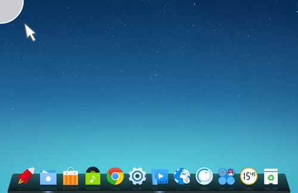

* 在桌面，点击任务栏上的 ，打开启动器界面。

##### 从启动器界面返回到桌面
在启动器界面，您可以有以下几种方法返回到桌面：

* 在启动器界面的任何位置，点击鼠标返回到桌面。
* 在启动器界面，将鼠标置于屏幕左上角返回到桌面。
* 在启动器界面，点击任务栏上的 ，返回到桌面。

### 从桌面打开控制中心
您可以执行以下任一操作来调出控制中心面板：

* 在桌面，将鼠标置于屏幕右下角热区区域，调出控制中心面板。
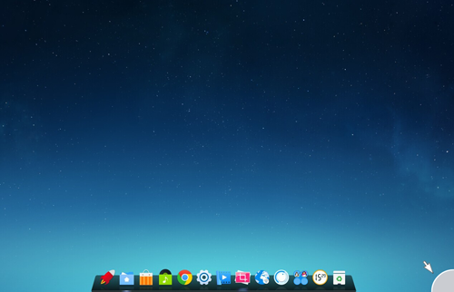

* 在桌面，点击任务栏上的 ，打开控制中心面板。

## 登录/锁屏界面
您会在以下情况进入到登录/锁屏界面：

* 电脑开机后，在您正式执行各项操作之前，您需要先使用一个用户账户来登录该电脑。
* 工作中，有时候需要临时离开座位一会儿，此时如果您不希望自己电脑中的数据被修改或看到，您可以在离开之前将电脑屏幕锁定。

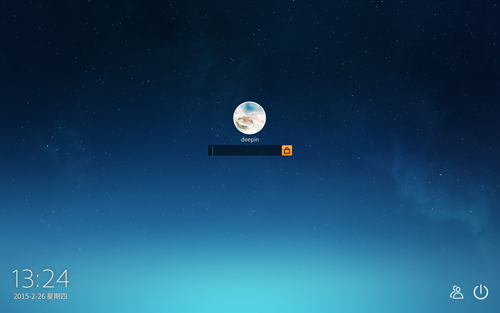

### 登录
开始前，请先登录电脑。登录后，您可以添加或更改账户，具体操作请参考[账户]()。
1. 在登录界面，如果用户账户设置了密码，请在账户登录提示框中，键入帐户的密码，按 Enter 键登录。
2. 如果用户账户没有设置密码，请直接点击 **登录**。
3. 如果这台电脑已经设置了多个用户账户，在登录界面的右下角，点击  可以切换到其他用户账户来登录。
4. 如果要执行关机/重启/待机操作，请点击登录界面右下角的  来选择，如果要取消该操作，请在空白处点击鼠标返回到登录界面。

### 锁屏
锁屏操作具体请参考[锁定电脑屏幕]()。

## 桌面

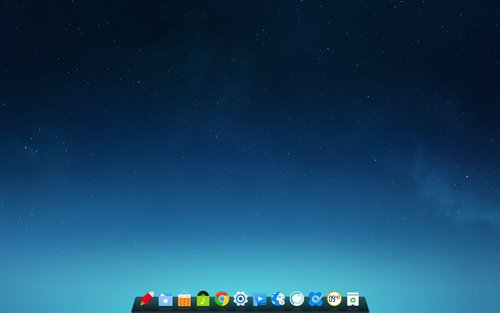

### 个性化
您可以在桌面调出个性化设置界面，来更改桌面壁纸、光标、窗口等元素，具体操作请参考[个性化设置]()。

### 设置热区
将桌面的四个顶角设置成热区，然后将鼠标移到热区区域便可以快速打开对应的界面。

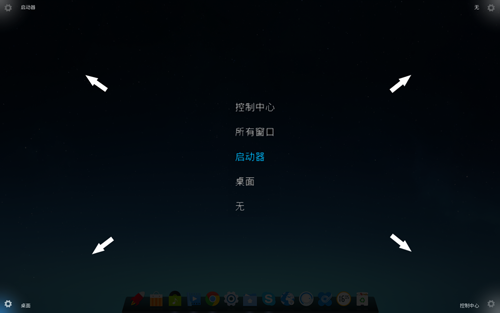

1. 在桌面的空白区域，点击右键。
2. 点击 **热区设置**。
3. 在热区设置界面，将鼠标置于桌面的四个顶角，调出热区功能菜单进行设置。

### 操作桌面上的应用图标
##### 给桌面上的应用图标排序
您可以选择按一定的规则来排列桌面上的应用图标，让电脑屏幕看起来更整洁。

1. 在桌面的空白区域，点击右键。
2. 点击 **排序方式**，您可以：
* 点击 **名称**，桌面上的应用图标将按名称顺序来排列。
* 点击 **最近修改时间**，桌面上的应用图标将按最近一次的修改时间先后顺序来排列。

##### 从桌面打开应用
如果您已经将应用固定到桌面，您可以点击桌面上的快捷图标来快速打开该应用，而不用进入到启动器界面去查找、运行。
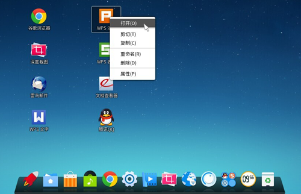

1. 在桌面，将鼠标指针置于要打开的应用图标上，点击右键。
2. 点击 **打开**。

##### 将应用图标从桌面删除
清理桌面上不常使用的应用图标，减少占用桌面的空间。

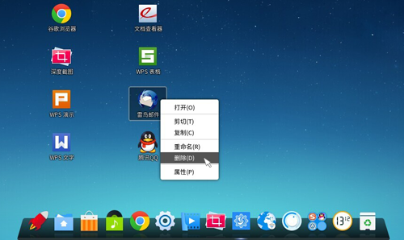

1. 在桌面，将鼠标指针置于应用图标上，点击右键。
2. 点击 **删除**。

##### 给桌面上的应用重命名
您可以给桌面上的应用重新起一个自己熟悉的名字。

1. 在桌面，将鼠标指针置于应用图标上，点击右键。
2. 点击 **重命名**。
3. 输入应用名称。

##### 在桌面查看应用的属性
您可以通过查看应用的属性来了解该应用的基本信息。

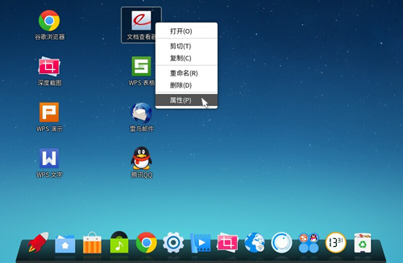

1. 在桌面，将鼠标指针置于应用图标上，点击右键。
2. 点击 **属性**。
3. 在该应用的属性界面，您可以查看该应用的基本信息和权限。

 在该应用的属性界面，您可以更改部分备注信息，如名称、描述和注释等。

### 操作桌面上的应用程序组
对于数量众多的桌面快捷图标，如果全部散布在桌面将会显得杂乱无章。您可以通过创建群组来分门别类的管理这些应用。
##### 创建程序组
将相同属性的应用归类到一个程序组，一个程序组可以包括多个应用。
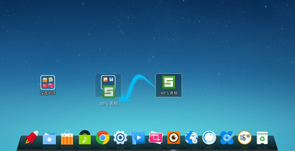

1. 在桌面，将鼠标指针置于一个应用图标上。
2. 按住鼠标左键不放，将该应用图标拖拽到另一个应用图标上。
3. 释放鼠标左键，完成程序组的创建。
4. 如果要将其他应用图标添加到该程序组，请重复步骤2和步骤3。

##### 重命名程序组
新建了一个程序组，赶快来给程序组起个名字吧！
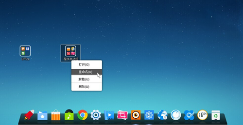

1. 在桌面，将鼠标指针置于一个程序组上，点击右键。
2. 点击 **重命名**。
3. 输入组名称。

##### 触发程序组
您可以打开程序组，运行程序组中的应用。

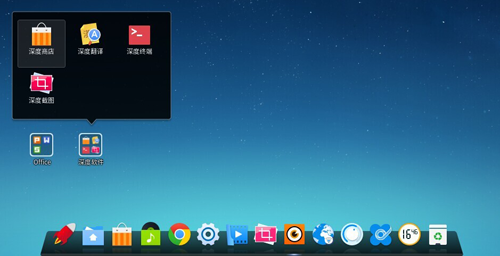

1. 在桌面，将鼠标指针置于程序组上。
2. 点击程序组或右键单击程序组。
3. 点击 **打开**。
4. 选择要运行的应用，点击该应用图标。

##### 解散程序组
如果您确定不再需要以程序组来管理应用，您可以将程序组解散。程序组解散之后，该程序组中的所有应用将会散布在桌面。
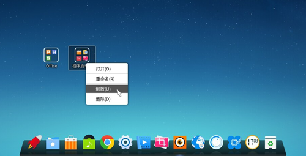

1. 在桌面，将鼠标指针置于程序组上。
2. 右键单击该程序组。
3. 点击 **解散**。

##### 删除程序组
如果您不再需要桌面上的程序组，您可以将该程序组删除。程序组删除之后，该程序组中所有固定到桌面的应用图标将一并删除，其应用程序仍然会保留在系统中。
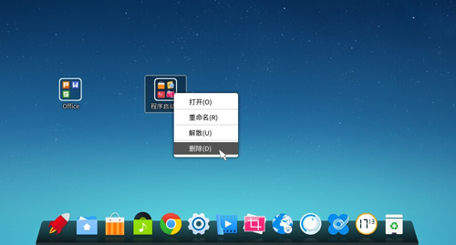

1. 在桌面，将鼠标指针置于程序组上。
2. 右键单击该程序组。
3. 点击 **删除**。

### 操作桌面上的文件或文件夹
您可以在桌面新建、拷贝和粘贴文档，进行文件压缩和解压等工作。
##### 新建文档或文件夹
在桌面，您可以新建文件夹和各种属性的文档。

1. 在桌面的空白区域，点击右键。
2. 点击 **新建**。
3. 选择新建一个文件夹或文档。
4. 输入该文件夹或文档的名称。

##### 将文档或文件夹拷贝到别处
桌面上的文档或文件夹您可以复制到别处去保存。

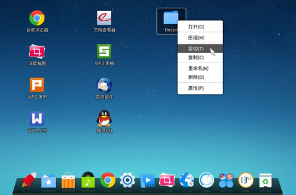

1. 在桌面，将鼠标指针置于文档或文件夹上，点击右键。
2. 点击 **复制** 或 **剪切**。
3. 选择目标存放路径，然后点击鼠标右键。
4. 点击 **粘贴**。

##### 从别处将文档或文件夹粘贴到桌面
您也可以将电脑其他地方存放的文档或文件夹拷贝到桌面。
1. 将鼠标指针置于目标文档或文件夹上，点击右键。
2. 点击 **复制** 或 **剪切**。
3. 在桌面，点击鼠标右键。
4. 点击 **粘贴**。

##### 对文档或文件夹进行压缩
一个较大容量的文档或文件夹通过压缩可以变成一个较小容量的文件。

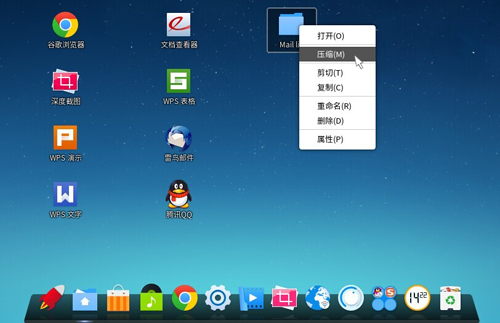

1. 在桌面，将鼠标指针置于文档或文件夹上，点击右键。
2. 点击 **压缩**。
3. 在压缩界面，输入压缩文件名，选择压缩文件类型和目标存放路径。
4. 点击 **创建**。

##### 对压缩文件进行解压
对于压缩文件通过解压可以还原成一个或多个文件。

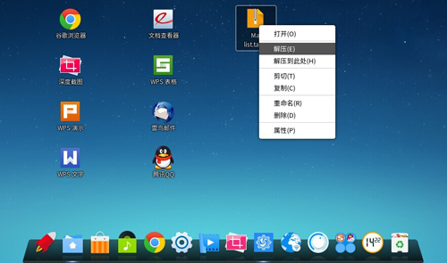

1. 在桌面，将鼠标指针置于压缩文件上，点击右键。
2. 点击 **解压** 或 **解压到此处**。
3. 在提取界面，选择目标存放路径。
4. 点击 **提取**。

### 从桌面打开终端
您可以从桌面直接打开终端来执行相关操作。
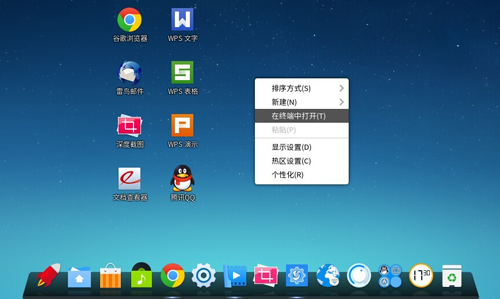

1. 在桌面的空白区域，点击右键。
2. 点击 **在终端中打开**。
3. 在深度终端界面，输入并执行各种命令。

### 在桌面设置显示器
您可以在桌面打开显示器的设置界面，来进行分辨率、亮度等选项的设置，具体操作请参考[显示]()。

## 任务栏

### 隐藏任务栏
您可以将任务栏隐藏起来，最大程度的扩展桌面的可操作区域。当任务栏隐藏后，如果需要操作任务栏，将鼠标移到桌面底部即可调出任务栏。

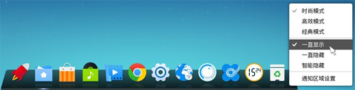

1. 在桌面，将鼠标指针置于任务栏上。
2. 点击右键，您可以：
* 选择 **智能隐藏**，当需要占用任务栏区域时任务栏自动隐藏。
* 选择 **一直显示**，任务栏将会一直显示在桌面底部。
* 选择 **一直隐藏**，任务栏只有在鼠标指针置于任务栏区域时才会显示。

### 切换显示模式
给任务栏换个风格，给您的工作带来新的惊喜！
任务栏提供三种风格的显示模式：时尚模式、高效模式和经典模式。
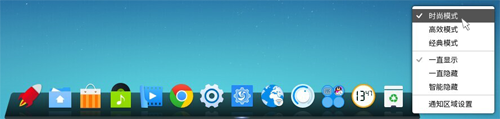

1. 在桌面，将鼠标指针置于任务栏上。
2. 点击右键，您可以：
* 选择 **时尚模式**，任务栏的显示风格类似于Mac OS，更动感、更时尚。
* 选择 **高效模式**，任务栏的显示风格类似于Windows 7，更简洁、更清晰。
* 选择 **经典模式**，任务栏的显示风格类似于Windows XP，更明了、更直接。

### 将应用固定到任务栏
将常用的应用固定到任务栏，便捷您的操作！

1. 在桌面，将鼠标指针置于屏幕左上角或点击任务栏上的 ，打开启动器界面。
2. 通过浏览找到要固定的应用。
3. 右键单击该应用图标。
4. 点击 **添加到任务栏**。

##### 将打开的应用固定到任务栏
对于已经打开的应用，您也可以将其固定到任务栏，以便在下次使用时能够从任务栏上直接运行。

1. 在桌面，右键单击任务栏上的该应用图标。
2. 点击 **驻留**。

### 从任务栏上移除应用
精简任务栏上的应用，为您的任务栏减负！对于不常用的应用，您可以将其从任务栏上移除。

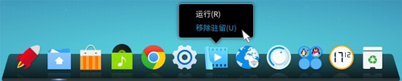

1. 在任务栏上，选择要移除的应用。
2. 右键单击该应用图标。
3. 点击 **移除驻留**。

### 从任务栏上运行应用
如果应用已经固定到任务栏，您只要鼠标轻轻一点便可打开它。
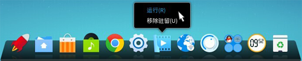

1. 在任务栏上，点击或右键单击应用图标。
2. 点击 **运行**，打开该应用程序。
3. 如果要关闭该应用程序，在任务栏上，右键单击该应用图标。
4. 点击 **关闭所有**。

### 了解任务栏的通知区域
任务栏的通知区域一般会显示输入法、时间、音量控制、网络连接以及其他正在运行的应用图标。

» 任务栏为高效模式或经典模式时，通知区域会显示在任务栏的右端。
» 任务栏为时尚模式时，通知区域中的应用图标会显示在托盘上。

如果您想隐藏通知区域的应用图标，您可以执行以下操作：

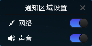

1. 在桌面，将鼠标指针置于任务栏上。
2. 点击右键，选择 **通知区域设置**。
3. 开启或关闭要在通知区域显示的应用图标。

## 启动器界面
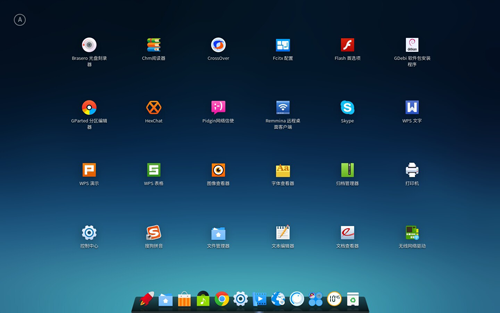

### 按类别显示所有应用
将所有的应用分类显示，方便应用程序的管理和查找。

1. 在桌面，将鼠标指针置于屏幕左上角或点击任务栏上的 ，打开启动器界面。
2. 将鼠标指针置于  上，您可以：
• 选择 **按名称**，应用将按应用名称进行排列显示。
• 选择 **按分类（图标）**，分类页签将以图标显示在界面左侧。
• 选择 **按分类（文字）**，分类页签将以文字显示在界面左侧。
• 选择 **按安装时间**，应用将按安装时间来进行排列显示。
• 选择 **按使用频率**，应用将按使用频率来进行排列显示。

### 查找应用
您可以执行以下操作来找到需要的应用。

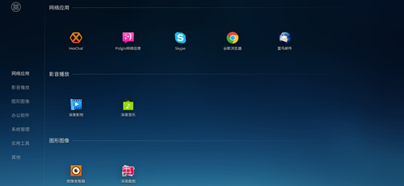

1. 在桌面，将鼠标指针置于屏幕左上角或点击任务栏上的 ，打开启动器界面。
2. 通过上下滚动鼠标滚轮来查找应用。
3. 如果应用是按分类（图标）或按分类（文字）的形式显示，您可以点击各个分类页签来查找。

##### 快速搜索应用
使用搜索功能，快速锁定目标应用。
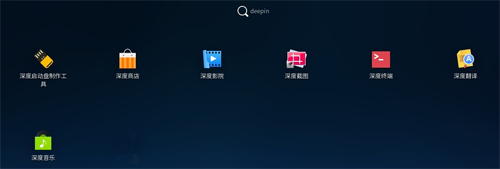

1. 在桌面，将鼠标指针置于屏幕左上角或点击任务栏上的 ，打开启动器界面。
2. 使用键盘输入单词，如“deepin”，系统会自动搜索并显示出所有包含关键字“deepin”的应用程序。

### 从启动器界面运行应用
您可以从启动器界面打开应用。

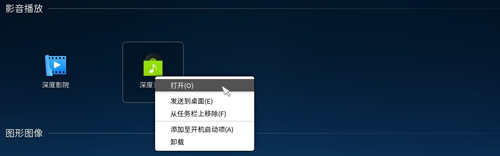

1. 在桌面，将鼠标指针置于屏幕左上角或点击任务栏上的 ，打开启动器界面。
2. 通过浏览找到要打开的应用。
3. 右键单击该应用图标。
4. 点击 **打开**。

### 创建桌面快捷图标
您可以将常用的应用图标发送到桌面，创建桌面快捷方式。

1. 在桌面，将鼠标指针置于屏幕左上角或点击任务栏上的 ，打开启动器界面。
2. 通过浏览找到要添加桌面快捷图标的应用。
3. 右键单击该应用图标。
4. 点击 **发送到桌面**。

##### 将应用添加到开机启动项
您也可以将应用添加到开机启动项，在电脑开机时自动运行该应用。

1. 在桌面，将鼠标指针置于屏幕左上角或点击任务栏上的 ，打开启动器界面。
2. 通过浏览找到要添加到开机启动项的应用。
3. 右键单击该应用图标。
4. 点击 **添加至开机启动项**。

### 移除固定的应用
您可以在启动器界面将固定到桌面、开机启动项或任务栏上的应用移除。

1. 在桌面，将鼠标指针置于屏幕左上角或点击任务栏上的 ，打开启动器界面。
2. 通过浏览找到要移除固定的应用。
3. 右键单击该应用图标，您可以：
• 选择 **从桌面上移除**，删除桌面快捷图标。
• 选择 **从任务栏上移除**，将该应用图标从任务栏上删除。
• 选择 **从开机启动项移除**，在电脑开机时将不会自动运行该应用。

### 从启动器界面卸载应用
如果您确定不再需要某个应用，您可以在启动器界面将其卸载。

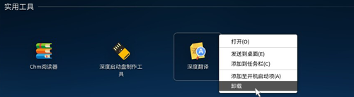

1. 在桌面，将鼠标指针置于屏幕左上角或点击任务栏上的 ，打开启动器界面。
2. 通过浏览找到要卸载的应用。
3. 右键单击该应用图标。
4. 点击 **卸载**。

## 回收站
### 清空回收站
删除垃圾文件，释放更多可用空间。

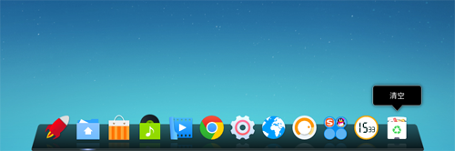

1. 在任务栏上，点击  打开回收站或右键单击 。
2. 点击 **清空**。
3. 点击 **清空回收站**。

### 还原垃圾文件

1. 在任务栏上，点击  打开回收站。
2. 在回收站界面，选择要还原的文件。
3. 点击 **恢复**。

