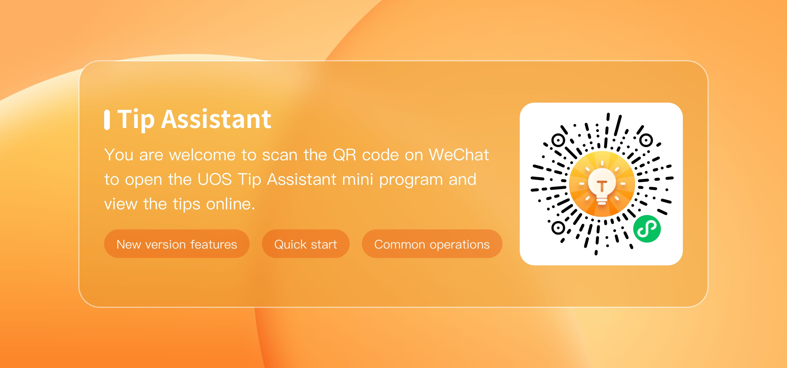

# A library of commonly used applications|common-application-libraries|

Welcome to UOS Desktop V20 Professional! The system has been adapted to **10** more than 100,000 popular applications in the market for you to download. In order to help you get started with the system faster, we have selected the following domestic alternative products for the common software of mainstream operating systems, you can refer to the following product list, go to the system **App Store** and other channels to download and use the application.

## Input

The "搜狗输入法“ and "百度拼音输入法" that commonly used by mainstream operating systems can continue to be used, or you can choose to use the following input methods.

| The type of application | The name of the software                                     | Domestic substitutions                                       | How to download |
| ----------------------- | ------------------------------------------------------------ | ------------------------------------------------------------ | --------------- |
| Input                   | 搜狗拼音输入法 万能拼音输入法 万能五笔 东方输入法 2345王牌输入法 极品五笔 QQ拼音输入法 智能云输入法 王码五笔输入法 手心输入法 火星文输入法 百度拼音输入法 | 搜狗输入法UOS版（预装） 讯飞输入法 华宇拼音输入法 小企鹅五笔拼音输入法 Sunpinyin-输入法 | App Store       |

## Office software

You can use the following alternatives to the Office suite that you commonly use on major operating systems.

| The type of application | The name of the software | Domestic substitutions                                            | How to download |
| ----------------------- | ------------------------ | ----------------------------------------------------------------- | --------------- |
| Office documents        | Microsoft Office         | WPS Office 永中Office                                           | App Store       |
| PDF                     | Adobe Acrobat            | WPS PDF Master PDF编辑器 PdfMod-PDF文档编辑                    | App Store       |
| Mind mapping            | XMind思维导图中文版             | 亿图脑图MindMaster思维导图 百度脑图网页版 MarkMind思维导图 draw.io流程图 | App Store       |

## Social Communications

Instant messaging software and email software commonly used in mainstream operating systems can continue to be used.

| The type of application | The name of the software | Domestic substitutions                                       | How to download |
| ----------------------- | ------------------------ | ------------------------------------------------------------ | --------------- |
| Mailbox                 | Microsoft Outlook        | UOS邮箱（预装） QQ邮箱 WPS邮箱 Foxmail 网易邮箱大师 | App Store       |
| Instant messaging       | QT语音                   | 微信 QQ 企业微信 腾讯会议 钉钉           | App Store       |
| VoIP                    | 阿里通网络电话           | Twinkle-网络电话                                             | App Store       |

## Browser

You can continue to use Google Chrome and Firefox, which are commonly used by major operating systems, or you can choose to use the following browsers.

| The type of application | The name of the software                   | Domestic substitutions                                       | How to download |
| ----------------------- | ------------------------------------------ | ------------------------------------------------------------ | --------------- |
| Browser                 | Google Chrome浏览器 Firefox火狐浏览器 | UOS浏览器（预装） 360安全浏览器 奇安信浏览器 QQ浏览器 | App Store       |

## Download tools

You can continue to use "IDM and uTorrent", which are commonly used by major operating systems, or you can choose to use the following browser

| The type of application | The name of the software                     | Domestic substitutions                                   | How to download |
| ----------------------- | -------------------------------------------- | -------------------------------------------------------- | --------------- |
| Downloader              | IDM(Internet Download Manager) uTorrent | UOS下载器（预装） 迅雷 Motrix Uget-下载器 | App Store       |

## Web tools

| The type of application | The type of application | The type of application                                      | The type of application |
| ----------------------- | ----------------------- | ------------------------------------------------------------ | ----------------------- |
| Remote control          | TeamViewer              | UOS远程协助（预装） 向日葵远程控制 AnyDesk远程控制 | App Store               |

## Security protection

| The type of application | The type of application                                      | The type of application                                      | The type of application |
| ----------------------- | ------------------------------------------------------------ | ------------------------------------------------------------ | ----------------------- |
| Anti-virus software     | Avira AntiVir Avast Free Antivirus 卡巴斯基反病毒软件 | UOS安全中心（预装） 360终端安全防护系统 金山毒霸 SYL OS电脑管家 火绒终端安全管理系统 瑞星ESM防病毒系统 | App Store               |

## Compress and burn

| The type of application | The name of the software             | Domestic substitutions                                       | How to download |
| ----------------------- | ------------------------------------ | ------------------------------------------------------------ | --------------- |
| Compress                | WinRAR WinZip              | UOS归档管理器（预装） 360压缩 7-Zip Bandizip-压缩 Xarchive-压缩 PeaZip-压缩 | App Store       |
| Burn                    | 虚拟光驱（DAEMON） 光盘刻录大师 | Nero-刻录 U盘ISO镜像刻录工具                            |                 |

## Dedicated software

| The type of application | The name of the software | Domestic substitutions                                                | How to download |
| ----------------------- | ------------------------ | --------------------------------------------------------------------- | --------------- |
| CAD                     | AutoCAD                  | 中望CAD 浩辰CAD CAXA电子图板 CAD看图王 CAD快速看图 迷你CAD看图王 | App Store       |

## Join the community to answer your questions

Welcome to scan the code on WeChat to join the official community of UOS and get intimate online services: **perfect use skills, fresh product information, interesting official activities**, etc. The group activity code are permanent validity.

You are welcome to scan the QR code on WeChat to open the UOS Tip Assistant mini program and view the tips online.

