# Desktop Environment|../common/dde.svg|

## Overview
deepin operating system is a homegrown, easy-to-use and reliable Linux desktop operating system with exquisite visual experiences. It is equipped with a series of original applications such as File Manager, App Store, Image Viewer, Movie and many other original apps, which not only indulge you with enriched entertainments, but also serve your daily work and life. With continuous improvement and upgrades, it is becoming one of the most popular open-source operating systems in China.

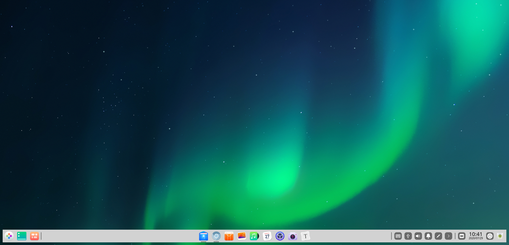

### Get Ready

When you log into the system for the first time, a welcome program will automatically start. Feel free to watch the video for new features, customize your desktop, enable the window effect and know more about deepin operating system.

Once login, you are ready to experience deepin Desktop Environment. It is comprised of Desktop, Dock, Launcher, Control Center and Window Manager, which serve as the basis for your system.

Read below and learn how to work in the deepin Desktop Environment.

## Desktop

Desktop is the main screen you will see after logging in. On the desktop, you can create a new file/folder, sort files, open in terminal, set wallpaper, screensaver, etc. You can also add shortcuts for applications on desktop by using [Send to desktop](#Set App Shortcut).

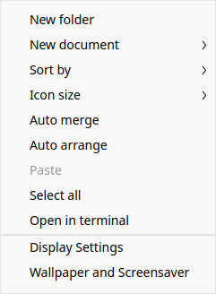

### Create New Folder/Document
You can create a new folder/document on the desktop or run some regular tasks on the files, just as how you work with the File Manager.

- Right click the desktop. Select **New folder** and enter the name for it.
- Right click the desktop. Select **New document**, select the type and enter its name.

Right click a file or folder on the desktop, and use the features of File Manager as below:

| Function         | Description                                                  |
| ---------------- | ------------------------------------------------------------ |
| Open with        | Select an app to open it with system default method or other linked applications. |
| Cut              | Move the file or folder to another location.                 |
| Copy             | Copy the file or folder to another location.                 |
| Rename           | Change the name of file or folder.                           |
| Delete           | Delete and move the file or folder to the trash.             |
| Create link      | Create a shortcut of the file or folder.                     |
| Tag information  | Add a tag to the the file or folder.                         |
| Compress/Extract | Compress the file or folder or extract the compressed file.  |
| Properties       | View the basic info, share it or change the permission.      |

### Sort Files

Sort the icons on your desktop to organize according to your needs.

1. Right click the desktop.
2. Click **Sort by**, you can:

 - Click **Name** to display files in the name sequence.
 - Click **Size** to display files in the size sequence.
 - Click **Type** to display files in type.
 - Click **Time modified** to display files in the order of last modified date.

> Tips: Check **Auto arrange**. Icons on the desktop will be listed in order automatically. If an icon is removed, another one will fill in the blank.

#### Auto Merge

Check “Auto merge” to keep your files on the desktop organized. 

When it is checked, all files and folders on the desktop will be automatically grouped into folders named by Videos, Music, Pictures, Documents, Applications, Others and Folders.

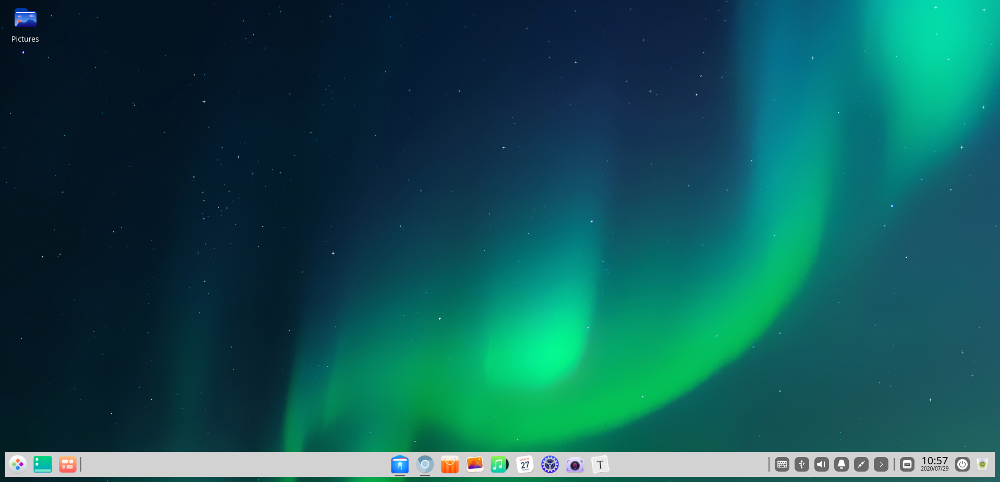

### Adjust Icon Size

1. Right click the desktop.
2. Click **Icon size** and choose a proper size.

> Tips: Press **Ctrl** +  /  / scrolling mouse wheel to adjust icon size on the desktop and in Launcher.

### Set Display
You can set display scaling, screen resolution, brightness and so forth from the desktop.

1. Right click the desktop.
2. Click **Display Settings** to open the settings in Control Center.

> Notes: For details, please refer to [Display](#Display).

### Change Wallpaper
Choose exquisite and trendy wallpapers to decorate your desktop. Make it unique!

1. Right click the desktop.
2. Click **Wallpaper and Screensaver** to preview all the wallpapers.
3. Click your favorite one and it will be applied in your desktop and screen lock.
4. You can also choose **Only desktop** or **Only lock screen**.

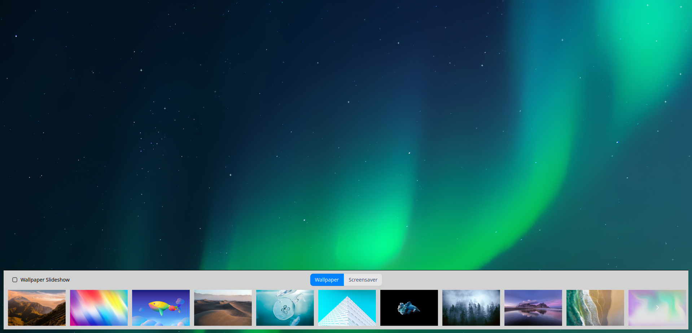

> Tips: Check **Wallpaper Slideshow** and set the time interval to allow automatic wallpaper change. Or you can set to change the wallpaper in the process of login or wakeup. 
> Tips: You can also set your favorite picture as wallpaper in an image viewer.

### Set Screensaver
The screensaver was once used to protect the monitor, however, it is now used to protect personal privacy from peering.

1. Right click the desktop.
2. Click **Wallpaper and Screensaver** and select **Screensaver** to preview all the screensavers.
3. Select one and click **Apply**. Set the **Wait** (waiting time) for the screensaver to start.
4. You can also check the box of **Require a password on wakeup** for a better privacy protection.
5. After that idle time, the screensaver will start.

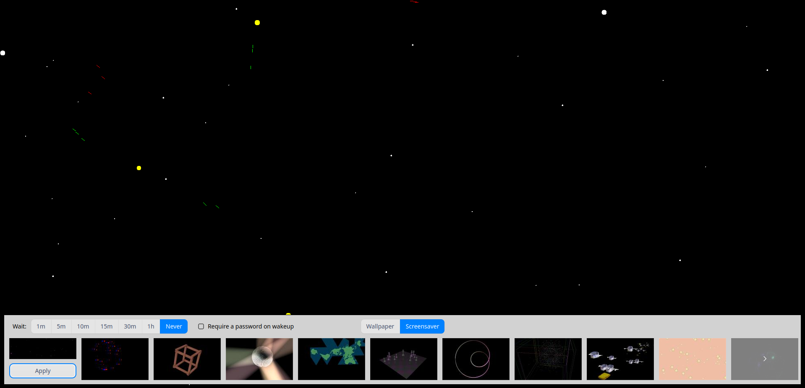

### Use Clipboard

All the texts, pictures and documents cut and copied by the current user after login are displayed in the clipboard, which can be copied quickly by double clicking the clipboard. The clipboard is cleared automatically after logout and shutdown.

1. Use the shortcut **Ctrl** + **Alt** + **V** to wake up the clipboard.

2. Double click in the clipboard to copy the current content quickly and the corresponding block will be moved to the top of the clipboard.

3.  Select the target location to paste it.

4. Clickto delete the current content and click **Clear All** to clear the clipboard.

   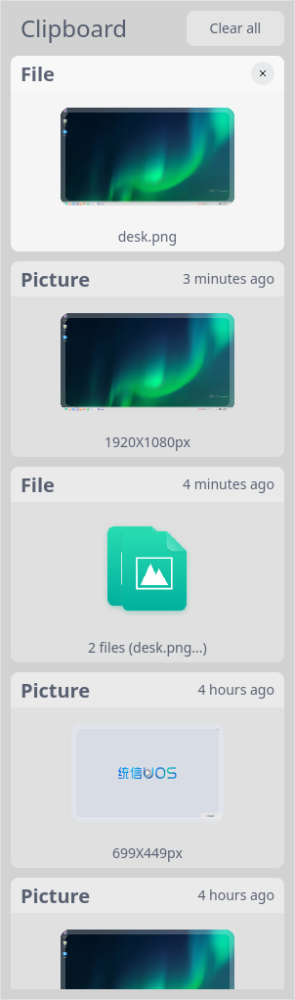

## Dock

Dock is at the bottom of the desktop by default to help you quickly open frequently-used applications, which are comprised of Launcher, applications, system tray and plugins. On Dock, you can open launcher, show the desktop, enter the workspaces, open and exit apps, set input methods, adjust the volume, connect to a wireless network, view the calendar and enter the shutdown interface among other tasks.

### Know Icons on Dock 
Icons of Launcher, applications, system tray and plugins are displayed on Dock. You can send application icons from Launcher to Dock so as to open them quickly.

| Icon | Description |
| ---- | ---- |
|  | Launcher - click to view all the installed applications. |
|  | Click to show the desktop. |
|  | Multitasking View - click to show workspaces. |
|  | File Manager - click to view files and folders on the disk. |
|  | App Store - search and install applications. |
|  | Calendar -  view dates and create new schedules. |
|  | Album - import and manage photos. |
|  |  Music - play local songs.  |
|  |   Control Center - click to check or change system settings.   |
|  | Notification Center - show all notifications from the system and applications. |
|  | Onboard virtual keyboard. |
|  | Click to enter the shutdown interface. |
|  | Trash. |

> Tips: In Efficient Mode, you can click the right side of Dock to show the desktop. Move the cursor to the running app on the Dock and you will see its preview window.

### Switch Display Mode
There are two display modes of Dock: fashion mode and efficient mode. Icon sizes and window effects are different in different modes.

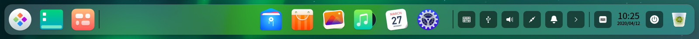

You can switch the display modes by the following:

1. Right click Dock and select **Mode**.
2. Select the display mode.

### Change Dock Location
You can place Dock on any direction of your desktop.

1. Right click Dock and select **Location**.
2. Select a location.

### Change Dock Height
Drag the top edge to increase or decrease the height.

### Show/Hide Dock

You can hide the Dock in order to maximize the expansion of the desktop operating area. 

1. Right click the Dock and select **Status**.
2. On the submenu, you can select:
- **Keep Shown** - display Dock all the time.
- **Keep Hidden** - hide Dock and display it only when hovering on the dock area.
- **Smart Hide** -  hide Dock automatically if the dock area is used.

### Show/Hide Plugins

1. Right click the Dock and select **Plugins**.
2. On the submenu, you can check or uncheck **Trash, Power, Show Desktop, Onboard, Notification Center, Multitasking View, Datetime and Desktop AI Assistant** to show or hide the corresponding icon on Dock.

### View Notifications
When there are system or application notifications, they will be shown in the middle of the screen. If there are buttons in the message, click buttons to do the actions; if there are not, click the message to close it.

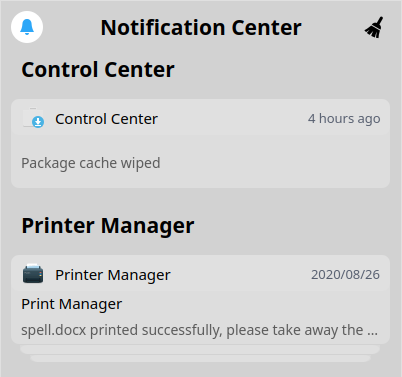

Click  on Dock to view all the notifications.

### View Date and Time

- Hover the cursor over the Time icon on Dock to view the current time, date and day of the week.
- Click the Time icon to open Calendar.

### Enter Shutdown Interface

There are two ways to enter the shutdown interface:

- Click  on Dock.
- Click  at the bottom right corner of Launcher mini mode.

| Function                                                     | Description                                                  |
| ------------------------------------------------------------ | ------------------------------------------------------------ |
| Shut down        | Shut down the computer.                                      |
| Reboot               | Restart the computer.                                        |
| Suspend            | The computer will run with low consumption.                  |
| Lock                     | Lock the computer with the password. Or press **Super** + **L** to lock it. |
| Switch user  | Log in with another user account.                            |
| Log out              | End all the processes and initialize the system.             |
| Start system monitor | View the running processes and end the one you want.         |

> Notes:  will be shown if there are multiple accounts in the system.

### Trash
You can find all deleted files in the trash, which can be restored or emptied.

#### Restore Files

You can restore deleted files in Trash or press **Ctrl** + **Z** to restore the lately deleted files.

1. Select the file in the trash.
2. Right click the file and select **Restore**.
3. The file will be restored to its original storage path.

> Attention: If the original folder of the file has been deleted, the deleted file will be restored to a newly-created folder automatically.

#### Empty Trash
Empty trash to release the occupied space on your disk.

- In the trash, click **Empty** to permanently delete all the files in the trash.

## Launcher
Launcher   helps you manage all the installed applications, where you can quickly find an application by category navigation or by a search.

> Tips: You can view newly installed applications in Launcher. The newly-installed ones are followed with a blue dot.

### Switch Launcher Modes

There are two display modes of Launcher: fullscreen mode and mini mode. Click the icon at the upper right corner to switch modes.

Both modes support searching applications and sending them to the desktop or Dock.

The mini mode also supports opening File Manager, Control Center and shutdown interface directly.

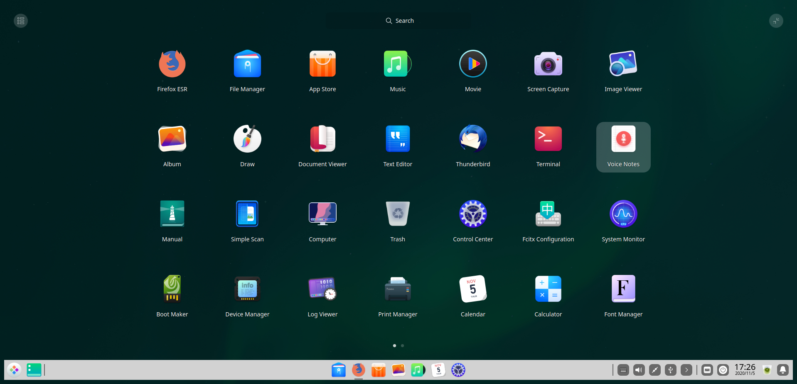
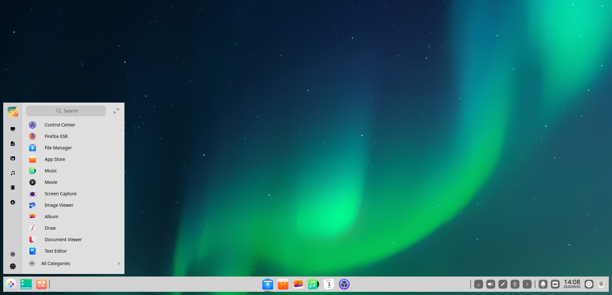

### Sort Applications

In fullscreen mode, all applications in Launcher are listed by the installation time by default. You can sort the application icons as below:

- Hover the cursor over an application icon, hold down the left key of mouse, drag and drop the application icon to arrange it freely.
- Click the category icon  on the upper left in Launcher to arrange the icons by category.

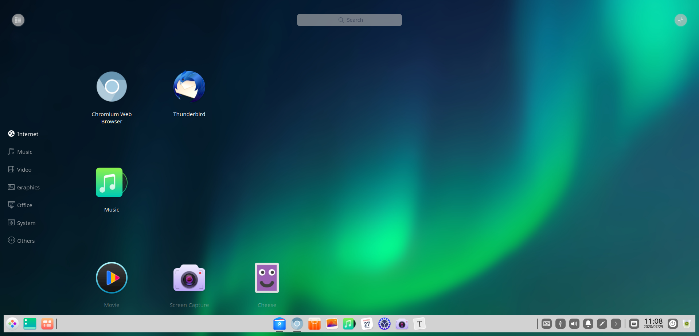

In mini mode,  applications are displayed according to usage frequency by default.

### Find Applications

In Launcher, you can scroll up and down to find an application, or locate it with the category navigation.

If you already know the name of application, just search for it in the searching box.

### Set App Shortcut
The shortcut offers a method to run applications easily and quickly.

#### Create App Shortcut
Send the application icon to the desktop or Dock to facilitate the follow-up operations.

In Launcher, right click an app icon and you can:

* Select **Send to desktop** to create a shortcut on the desktop.
* Select **Send to dock** to fix the application icon in Dock.

> Notes: You can drag the application icon from Launcher to Dock, but you cannot drag and drop the application while it is running. After this, you can right click the application icon on Dock and select **Dock** to fix it for quick start in the next time.

#### Delete Shortcut
Delete a shortcut from the desktop directly or remove it from Dock or Launcher.

**Remove the shortcut from Dock:**

- Hold down the left key of mouse, drag and drop the icon away from Dock. 
- You cannot drag and drop the application icon while it is running. After this, you can right click the application icon on Dock and select **Undock** to remove it from Dock.

**Remove the shortcut from Launcher:**

In Launcher, right click the icon and you can:
- Select **Remove from desktop** to delete the shortcut from the desktop.
- Select **Remove from dock** to remove the application icon from Dock.

> Notes: The above operations only delete the shortcut and does not uninstall the applications.

### Install Applications
Search and install more applications you like in the App Store.

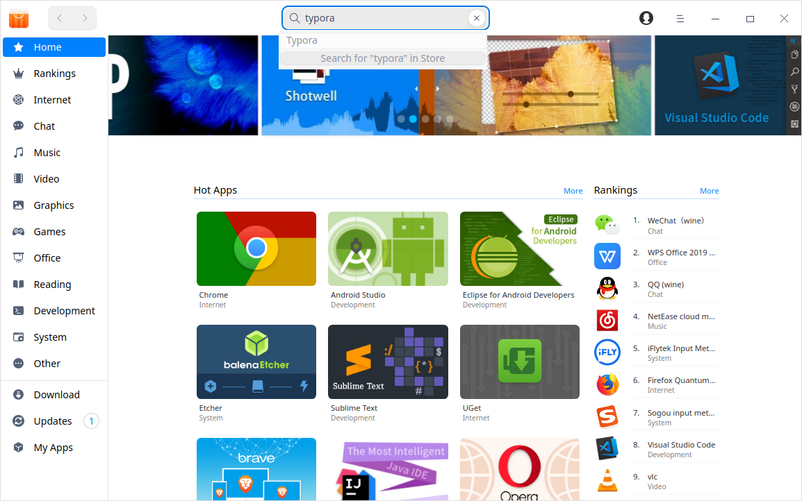

### Run Applications
For the applications whose shortcuts have been created on the desktop or Dock, you can open them in the following ways:

- Double click the desktop icon or right click it and select **Open**.
- Click the application icon on Dock or right click it and select **Open**.

To open the application only shown in Launcher, click the icon or right click it and select **Open**.

> Tips: For the frequently-used applications, right click the app icon and select **Add to startup** to run it when the computer boots.

### Uninstall Applications
Uninstall the applications you no longer use to save disk space.

1. In Launcher, right click the application icon.
2. Click **Uninstall**.

> Tips: In **Fashion mode**, drag the application icon in Launcher fullscreen mode to  on Dock to uninstall the application.

## Control Center
You can manage the system settings in Control Center, including account management, network settings, date and time, personalization, display settings, system and application update, etc. After enter the desktop environment, click  to open Control Center.

### Homepage Introduction
The homepage of Control Center provides several setting modules. You can click one to enter the detailed settings. 

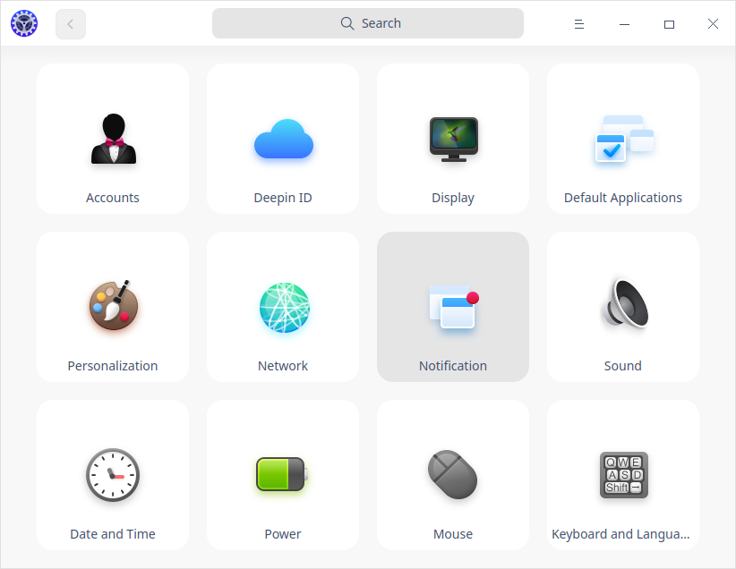

Once you open a setting module in Control Center, the navigation appears on the left. Click the left navigation to quickly switch to other settings.

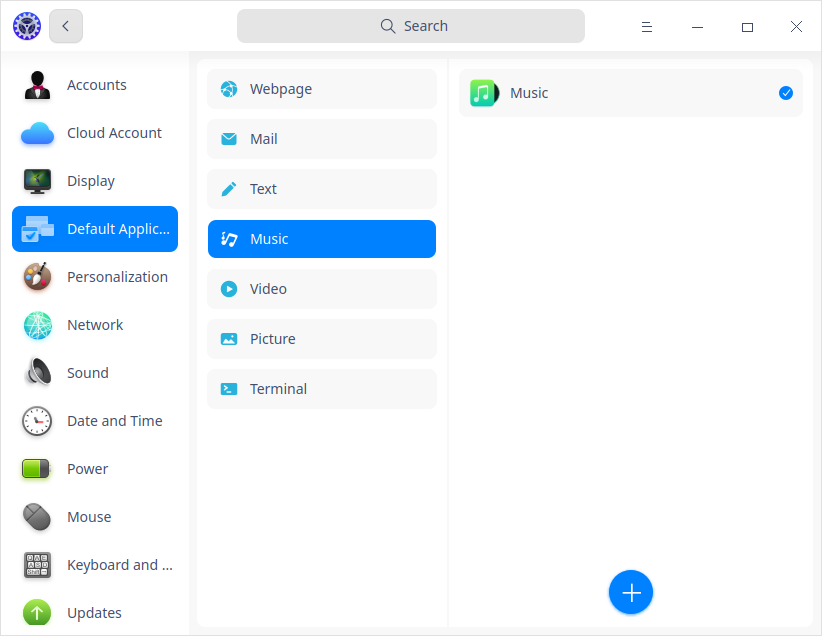

#### Title Bar

The title bar contains the back button, search box, main menu and the window buttons.

- Back button: Click  to go back to the homepage.
- Search box: Input a keyword and search the related settings.
- Main menu: Click  to enter the main menu where you can set the window theme, view the manual and exit.

### Accounts
You have already created an account when installing the system. Here you can modify account settings or create a new one.

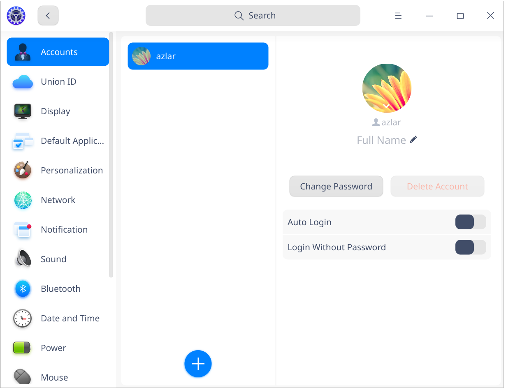

#### Create New Account

1. On the homepage of Control Center, click .
2. Click .
3. Input a username and a password twice.
4. Click **Create**.
5. Input the password of  the current user account in the authentication dialog box, and the new account will be added to the account list.

#### Change Account Avatar

1. On the homepage of Control Center, click .
2. Click an existing account in the list.
3. Click the user avatar.
4. Select an avatar or upload a local avatar.

#### Set Full Name
The account full name is shown in account list and system login interface. You can set as needed.

1. On the homepage of Control Center, click .
2. Click an existing account in the list.
3. Click  after **Full Name**, and input a name.

#### Change Password

1. On the homepage of Control Center, click .
2. Click the current account.
3. Click **Change Password**.
4. Input a new password twice and confirm.

#### Auto Login
If "Auto Login" is enabled, you can log into the system directly without inputting a password when the computer reboots or starts next time. However, you still need to enter the password after locking or logging out of the computer.

1. On the homepage of Control Center, click .
2. Click the current account.
3. Switch on **Auto Login**.

#### Login Without Password
If "Login Without Password" is enabled, you only need to click  to log into the system without inputting a password. 

1. On the homepage of Control Center, click .
2. Click the current account.
3. Switch on **Login Without Password** and you can log into the system without a password.

> Tips: If both the **Auto Login** and **Login Without Password** are enabled, once rebooted or started, your computer will enter the desktop directly without requiring a password.
>
> Tips: "Empty keyring password" is checked by default, which means you don't have to input login password again for the applications of which the passwords are remembered under "Login Without Password" mode. Otherwise, you need to input password whenever you run the application.

#### Set Fingerprint Password

Fingerprint password is used in system login, application authorization and other scenarios. Scan your fingerprint when user password is required.

1. On the homepage of Control Center, click .
2. Click the current account.
3. Click **Add Fingerprint**.
4. Put your finger on a fingerprint reader and follow the instructions repeatedly until your fingerprint is added successfully.
5. Click **Done**. 

> Notes: You can add 10 fingerprint passwords for one account; Click **Delete fingerprint** to remove all fingerprint passwords. 

#### Delete Account

1. On the homepage of Control Center, click .
2. Click the other account.
3. Click **Delete Account**.
4. In the confirmation dialog, click **Delete**.

> Attention: The logged in account cannot be deleted.

### Cloud Account

By signing in Cloud Account, you can sync the current system settings to the cloud, including network settings, sound settings, mouse settings, update settings, power settings, theme, wallpaper, launcher and Dock. To sync the settings from the cloud to another computer, just sign in with the same Cloud Account on that computer.

> Tips: When "Auto Sync" is enabled, you can uncheck the unwanted options; when it is disabled, all settings will not be synced.

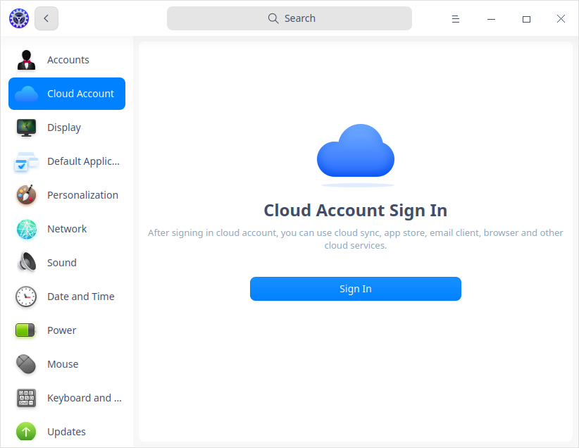

### Display
Set screen resolution, brightness, direction and display scaling properly to have the best visual effect.

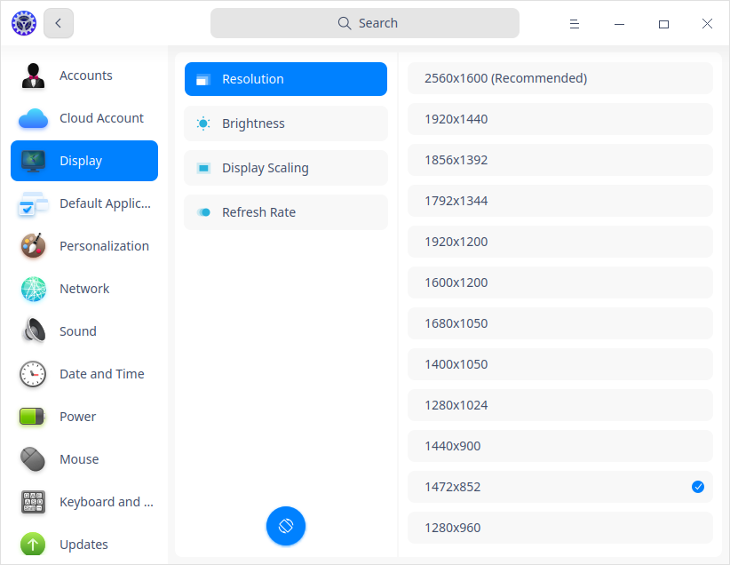

#### Single Screen Settings

##### Change Resolution

1. On the homepage of Control Center, click .
2. Click **Resolution**.
3. Select a proper resolution in the list.
4. Click **Save**.

##### Adjust Brightness

1. On the homepage of Control Center, click .
2. Click **Brightness**.
   - Drag the slider to set screen brightness.
   - Once **Night Shift** is switched on, the screen hue will be auto-adjusted according to your location.
   - Once **Auto Brightness** is switched on, the monitor brightness will be auto-adjusted according to environmental lightings (only applicable for PC(s) with a light sensor).

##### Set Display Scaling

Set a proper display scale to have a normal display.

1. On the homepage of Control Center, click .
2. Click **Display Scaling**.
3. Change the display scaling. Log out and log in again to enable the changes.

> Notes: 
>- When an HiDPI screen is detected, the display scaling will be automatically adjusted.
>-  For applications that do not support scaling, right click it in Launcher and select **Disable display scaling** to get a better display.

##### Change Refresh Rate
1. On the homepage of Control Center, click .
2. Click **Refresh Rate**.
3. Select a proper one and click **Save**.

##### Change Display Direction

1. On the homepage of Control Center, click .
2. Click .
3. For every click, the screen will rotate 90 degrees counterclockwise.
4. To restore to the original direction, click the right button to exit; to use the current direction, press **Ctrl** + **S** to save.

#### Multiple Screen Settings
Expand your desktop by multiple screens! Use VGA/HDMI/DP cable(s) to connect your computer to other display devices.

1. On the homepage of Control Center, click .
2. Click **Multiple Displays**.
3. Select a display mode:
    - **Duplicate**: display the same image on other screens.
    - **Extend**: expand the desktop across the screens.
    - **XXX only**: display the screen content only on one screen.
    - **Customize**: customize the display settings for multiple screens.

> Tips: In multiple displays, press **Super** + **P** to show its OSD. Operations are as follows:
>
> 1. Hold **Super** and press **P** or click to select the options. 
> 2. Release the keys and the selected mode will take into effect.

>Notes: When multiple displays are in the extend mode, only the main screen supports desktop icon display, right-click menu and other functions. Sub-screens do not support. 

##### Custom Settings

1. On the homepage of Control Center, click .
2. Click **Multiple Displays** > **Customize**.
3. Click **Recognize**. 
4. Choose **Merge** or **Split** the screens, specify the main screen, set the resolution and refresh rate, and rotate screen if you want.
5. Click **Save**.

> Notes: "Merge" means duplicate mode. "Split" means extend mode. 

### Default Application Settings
If you have installed several applications with similar functions, you can choose one as the default application to open that type of files.

#### Set Default Application

1. Right click the file, choose **Open with** > **Set default program**.
2. Select one application, **Set as default** is checked by default, and click **Confirm**.
3. The application will automatically be added to the default application list in Control Center.

#### Change Default Application

1. On the homepage of Control Center, click .
2. Select a file type.
3. Select another one in the list as the default application.

#### Add Default Application

1. On the homepage of Control Center, click .
2. Select a file type.
3. Click  below to add a desktop file (usually at /usr/share/applications) or a specified binary file as the default application.
4. The application will be added to the list and set as default application automatically. 

#### Delete Default Application

In the default application list, you can only delete the applications added by you. To remove other applications from the list, you can only uninstall them. Once uninstalled, they will automatically be deleted from the list.

To delete the default applications you have added, do as below:

1. On the homepage of Control Center, click .
2. Select a file type.
3. Click  after the application name to delete it.

### Personalization Settings
You can adjust the transparency of Launcher (in mini mode) and Dock, and also set theme, accent color, font and window effect, as well as change the appearance of the desktop and windows to your favorite style. 

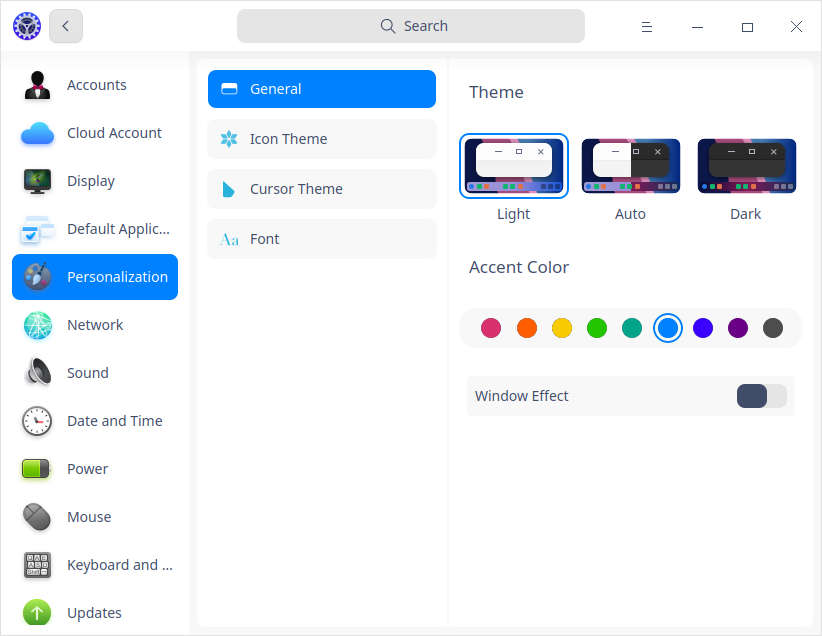

#### Set Window Theme
1. On the homepage of Control Center, click .
2. Click **General**.
3. Select one window theme and it will be used as system theme.

> Notes: "Auto" means changing window theme automatically according to the sunset and sunrise time. After sunrise, it is light theme; after sunset, it is dark theme.

#### Change Accent Color
Accent color refers to the color used when you select one option or file in the system.

1. On the homepage of Control Center, click .
2. Click **General**.
3. Pick a color under **Accent Color** and view its effects.

#### Enable Window Effect
Enable window effect to improve your desktop and window display.

1. On the homepage of Control Center, click .
2. Click **General**.
3. Switch on **Window Effect**.

#### Adjust Transparency

This function is available only when "Window Effect" is switched on. Move the slider from left to right to change the transparency of Launcher (in mini mode) from transparent to opaque.

1. On the homepage of Control Center, click .
2. Click **General**.
3. Click the bar to adjust the transparency and view the effect in real time.

#### Set Icon Theme

1. On the homepage of Control Center, click .
2. Click **Icon Theme** and select an icon style.

#### Set Cursor Theme

1. On the homepage of Control Center, click .
2. Click **Cursor Theme** and select a set of cursors.

#### Change Font

1. On the homepage of Control Center, click .
2. Click **Font**.
3. Set the type and size of system font.

### Network Settings
After login, you need to connect to a network to surf the Internet! 

> Tips: Check your network status by hovering over or clicking the network icon in Dock.

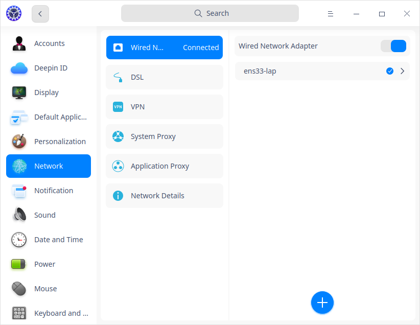

#### Wired Network

As the most common way to connect to the Internet, wired network is both secure and stable. After your router is set, connect one end of the network cable to the computer and the other end to the router, and you can connect to a wired network. 

1. Plug the cable into the network socket of a computer.
2. Plug another end of the cable into the router or network port.
3. On the homepage of Control Center, click .
4. Click **Wired Network** to enter the setting page of wired network.
5. Switch on **Wired Network Adapter** to enable wired network.
6. If it is successfully connected to the network, there will be a prompt message displaying "Wired Connection connected".

You can also edit and add a new wired network in the setting page.

#### Wireless Network

Wireless network helps you surf the Internet with multiple devices in a flexible way.

##### Connect to Wi-Fi Network

1. On the homepage of Control Center, click .
2. Click **Wireless Network** to enter the setting page of wireless network.
3. Switch on **Wireless Network Adapter** to enable the wireless network.
4. The computer will auto search the nearby wireless network available.
5. Select the correct wireless network to connect.
   - If the network is open, it will auto connect to the network.
   - If the network is encrypted, please enter the password and click **Connect**.

##### Connect to Hidden Network

To prevent others from scanning your network and cracking your password, you can hide the wireless network in the router settings. Once it's done, you need to connect to the wireless network manually.

1. On the homepage of Control Center, click .
2. Click **Wireless Network** to enter the setting page of wireless network.
3. Switch on **Wireless Network Adapter** to enable the wireless network.
4. Click **Connect to Hidden Network**.
5. Enter the name, SSID and other required info.
6. Click **Save**.

#### Hotspot

Hotspot converts the network signal of computer connection to Wi-Fi hotspot, providing wireless connection to other devices within a certain distance. To enable hotspot, your computer must be connected to a network equipped with a wireless network adapter.

1. On the homepage of Control Center, click .
2. Click **Personal Hotspot**.
3. Switch on **Hotspot** and complete the setting.
4. Click **Save**. 

#### Mobile Network
If you are in a place with no network signals, mobile network adapter is a useful tool to help you connect to the Internet as long as that place is covered by telephone signals.

1. Plug the mobile network adapter into the USB port of your computer.
2. Your computer will auto connect to the network.
3. On the homepage of Control Center, click .
4. Click **Mobile Network** to view the detailed network info.

#### DSL/PPPoE Connections

DSL is a dial-up connection via a standard telephone line and analog modem. Configure the modem, plug the telephone line into the network port of your computer, create a broadband dial-up connection, and enter the user name and password provided by the operator to dial up and connect to the Internet.

##### Create a PPPoE Connection

1. On the homepage of Control Center, click .
2. Click **DSL**.
3. Click .
4. Enter the name, your account and password provided by the operator.
5. Click **Save**. The connection will start automatically .

#### VPN

VPN is a virtual private network to establish an exclusive network on the public network for encrypted communication. Whether you are on a business trip or working at home, you can use VPN to access corporate intranet resources as long as you have access to the Internet. You can also use VPN to speed up access to websites in other countries.

1. On the homepage of Control Center, click .
2. Click **VPN**, and click  or .
3. Select the VPN protocol type, and enter the name, gateway, account, password and other information (Importing VPN will automatically fill in information).
4. Click **Save**. The system will try to connect to VPN network automatically.
5. You can export the VPN settings as a backup or to share with other users. 

> Notes: If you don't want to use VPN as your default routing, and only prefer to use it under specific network resources, switch on **Only applied in corresponding resources**.

#### System Proxy

1. On the homepage of Control Center, click .
2. Click **System Proxy**.
 - Click **None** and **Save** to disable the proxy.
 - Click **Manual** and input the address and port of proxy servers.
 - Click **Auto** and input a URL to configure the proxy info.

#### Application Proxy

1. On the homepage of Control Center, click .
2. Click **Application Proxy**.
3. Select a proxy type and fill in the IP address, port, etc.
4. Click **Save** to save the proxy settings.

> Notes: After being configured, run Launcher, right-click any application's icon and check **Use a proxy**. The application will be opened by proxy.

#### Network Info

You can view MAC, IP address, gateway and other network info in network details. 

1. On the homepage of Control Center, click .
2. Click **Network Details**.
3. View the network info of the current wired or wireless network.

### Sound Settings

Set your speaker and microphone properly to make the sound more clear and pleasant.

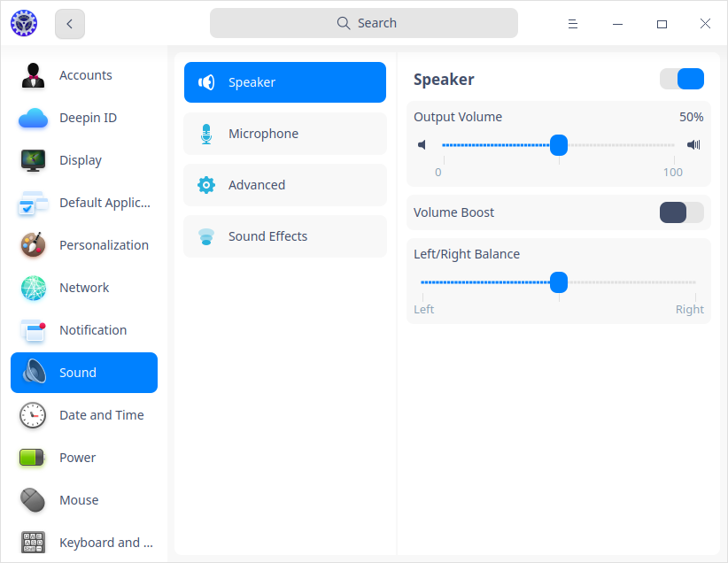

#### Speaker

1. On the homepage of Control Center, click .
2. Click **Speaker**.
3. Switch on **Speaker** and you can:
   - Drag the slider to adjust output volume and left/right balance.
   - Switch on **Volume Boost**. The volume can be adjusted from 0~150% (while the previous range is 0~100%).

> Tips: If "Speaker" is switched off, you will not hear any sound.

#### Microphone

1. On the homepage of Control Center, click .
2. Click **Microphone**.
3. Switch on **Microphone** to enable the microphone.
4. Adjust the input volume.

> Tips: Usually, you need to turn up the input volume to make sure that you can hear the sound of the source. However, the volume should not be too high as it will cause distortion of sound. Here is how to set the input volume: speak to your microphone at a normal volume and view the "Input Level". If the indicator of "Input Level " changes notably in accordance with the volume, it shows that the input volume is set at a proper level. 

#### Advanced Settings

1. On the homepage of Control Center, click .
2. Click **Advanced**.
3. Select the input and output devices.

#### System Sound Effects

1. On the homepage of Control Center, click .
2. Click **Sound Effects**. Check the options you want to switch on the sound when the corresponding event occurs.

> Tips: Click to listen to the sound effect.

### Bluetooth Settings
Without the hassle of cables or network, Bluetooth enables a wireless communication between Bluetooth devices in a short distance. The common Bluetooth devices are Bluetooth keyboard, Bluetooth mouse, Bluetooth earphones, Bluetooth speakers, etc.

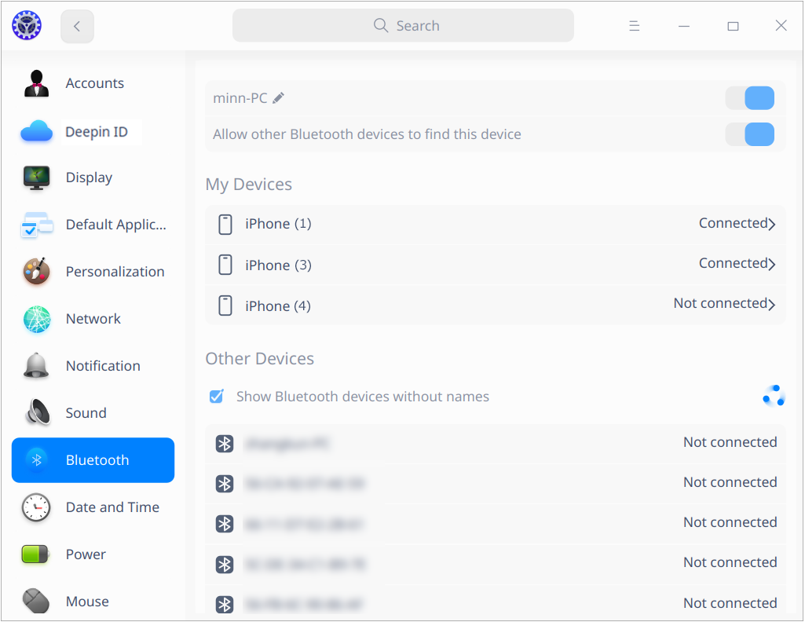

> Notes: Most laptops have Bluetooth. Just enable and use it. However, as most desktop computers do not have Bluetooth, you can purchase a Bluetooth adapter and plug it into the USB port of your computer to use this function.

#### Change Bluetooth Name

1. On the homepage of Control Center, click .
2. Click  after the Bluetooth name, and enter a new name for your computer.

> Notes: Once your Bluetooth Name is changed, it will be broadcast automatically. Other devices may need to rescan to be connected to your Bluetooth.

#### Connect to a Bluetooth Device

1. On the homepage of Control Center, click .
2. Switch on **Bluetooth**. The system will scan the nearby devices automatically and list them in **Other Devices**.
3. Click the device you want to connect and input the PIN code if required. After pairing successfully, the device will be connected automatically. 
4. Following step 3, the Bluetooth device will be added to **My Device** list.
5. In the list, click the device and you can **Disconnect** the device or change its name.

### Date and Time
Set your timezone properly to display correct date and time. You can also change manually.

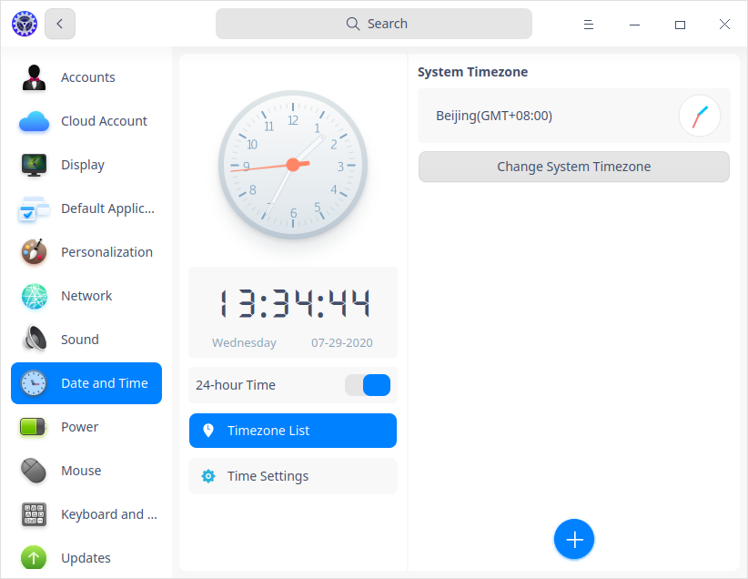

#### Change Timezone
You have selected the timezone during system installation. Please follow below steps if you want to change your timezone.

1. On the homepage of Control Center, click .
2. Click **Timezone List**.
3. Click **Change System Timezone** and select a timezone by searching or clicking on the map.
4. Click **Confirm**.

#### Add Timezone
Add another timezone to check the date and time there.

1. On the homepage of Control Center, click .
2. Click **Timezone List**.
3. Click  and select a timezone by searching or clicking on the map.
4. Click **Add**.

#### Delete Timezone

1. On the homepage of Control Center, click .
2. Click **Timezone List**.
3. Click **Edit** after "Timezone List".
4. Click  to remove the timezone.

#### Change Date and Time
Note that the auto-sync function will be disabled after changing date and time manually.

1. On the homepage of Control Center, click .
2. Click **Time Settings**.
   - Switch on/off **Auto Sync**.
   - Enter the correct date and time.
3. Click **Confirm**.

### Power Management

Power management turns the system to a low-power state during inactive status, thus ensuring laptop battery endurance while maintaining system security.

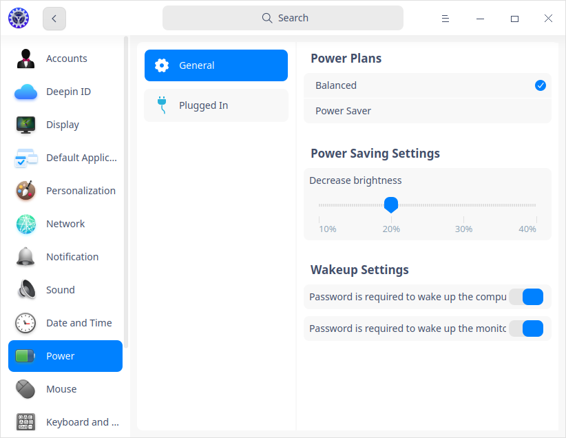

> Notes: If you are using a desktop computer, you will not see Power Saving Mode and On Battery options. 

#### Power Saving Mode
To reduce the power consumption of your laptop, turn on power saving mode to reduce screen brightness.

1. On the homepage of Control Center, click .
2. Click **General**.
3. Switch on **Power Saving Mode** to enter power saving mode.
4. Switch on **Auto Mode Switch**. Your laptop will enter power saving mode automatically when unplugged, and exit to normal mode when plugged in.

> Notes: Power saving mode is only applicable for laptops.

#### Password Required on Wakeup

1. On the homepage of Control Center, click .
2. Click **General**.
3. Switch on **Password is required to wake up the monitor** and **Password is required to wake up the computer** to improve security.

####  Time to Turn Off Monitor

1. On the homepage of Control Center, click .
2. Click **Plugged In** or **On Battery**.
3. Set the time to turn off the monitor.

> Notes: Time to turn off monitor and suspend or lock screen can be different between the "Plugged In" and "On Battery" settings.

#### Time to Suspend

1. On the homepage of Control Center, click .
2. Click **Plugged In** and **On Battery**.
3. Set the time to suspend.

> Tips: If you use a laptop, you can also switch on the **Suspend on lid close** option. 

#### Time to Lock Screen
1. On the homepage of Control Center, click .
2. Click **Plugged In** and **On Battery**.
3. Set the time to lock screen.

#### Power button settings

1. On the homepage of Control Center, click .
2. Click **Plugged In** and **On Battery**.
3. You can select **Shut down, Suspend, Hibernate, Turn off the monitor, Do nothing** from the drop-down list after **When pressing the power button**.

Any changes to the settings take effect immediately. At the same time, you will be notified by the system that the power setting is changed. 

### Mouse and Touchpad
Mouse and Touchpad are common input devices for computers. You can process tasks more easily with a mouse. If you use a laptop but don't have a mouse, you can also use the touchpad instead.

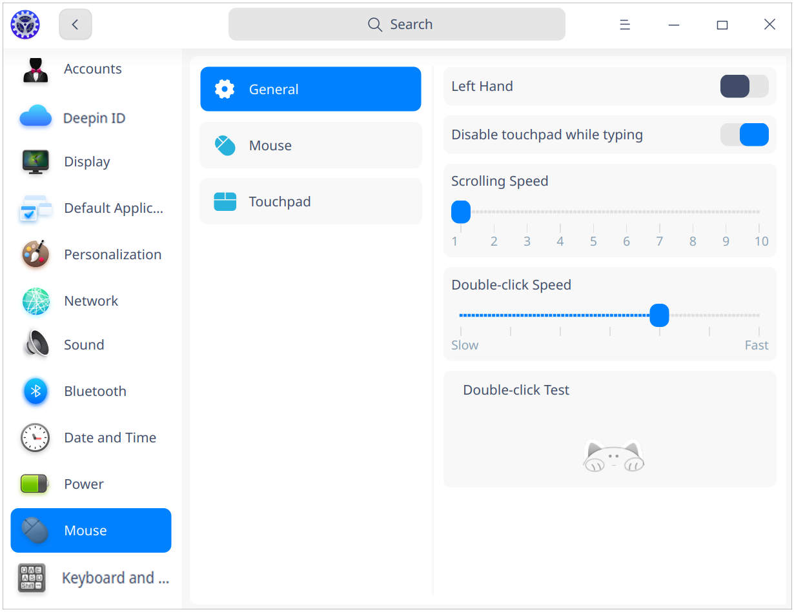

#### General Settings

1. On the homepage of Control Center, click .
2. Click **General**.
3. Switch on **Left Hand**, and adjust **Scrolling Speed**, **Double-click Speed** for both mouse and touchpad.

> Notes: If "Left Hand" is enabled, left-click and right-click of the mouse and touchpad will swap.

#### Mouse
After inserting or connecting the mouse, you can set up your preferred options in the Control Center according to your needs. 

> Notes: If there is no touchpad, “Disable touchpad when a mouse is connected” will not be displayed.

1. On the homepage of Control Center, click .
2. Click **Mouse**.
3. Adjust **Pointer Speed** and switch on **Natural Scrolling**/**Mouse Acceleration** if needed.

> Notes: Turn on the mouse acceleration to improve the accuracy of the pointer. The moving distance of the mouse pointer on the screen will increase according to the acceleration of the moving speed. It can be turned on or off according to your use.

> Notes: If Natural Scrolling is enabled, when you scroll down, the page will scroll down; and when you scroll up, the page will scroll up. 

#### Touchpad

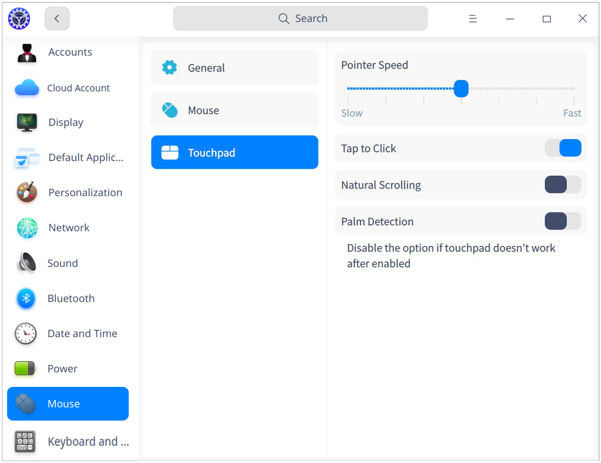

If you use a laptop, to avoid mis-operation on the touchpad, switch on **Disable touchpad while typing**, **Disable touchpad when a mouse is connected**, and turn on **Palm Detection** to set **Minimum Contact Surface** and **Minimum Pressure Value**. 

You can also change **Pointer Speed** and switch on **Natural Scrolling** for the touchpad.

#### TrackPoint
TrackPoint, also called as pointing stick, is a small joystick used as a pointing device, typically mounted centrally in a laptop keyboard and used to control pointer movements on the screen.

1. On the homepage of Control Center, click .
2. Click **TrackPoint**.
3. Adjust **Pointer Speed** to a proper level.

### Drawing Tablet
Drawing tablet, also called as graphics tablet and pen tablet, is a computer input device which enables you to hand draw images, animations and graphics with a special pen-like stylus. 

After connecting to the computer, you can set the pressure sensitivity of the drawing tablet, that is, the pressure sensing value of the pen tip and eraser.

> Notes: This part will be displayed only if a drawing tablet is connected.

1. On the homepage of Control Center, click .
2. Choose **Pen** mode.
3. Adjust **Pressure Sensitivity** for the pen.

### Keyboard and Language
Set keyboard properties and select your keyboard layout to fit your needs. You can also adjust the keyboard layout according to different countries and languages, change system language and customize shortcuts.

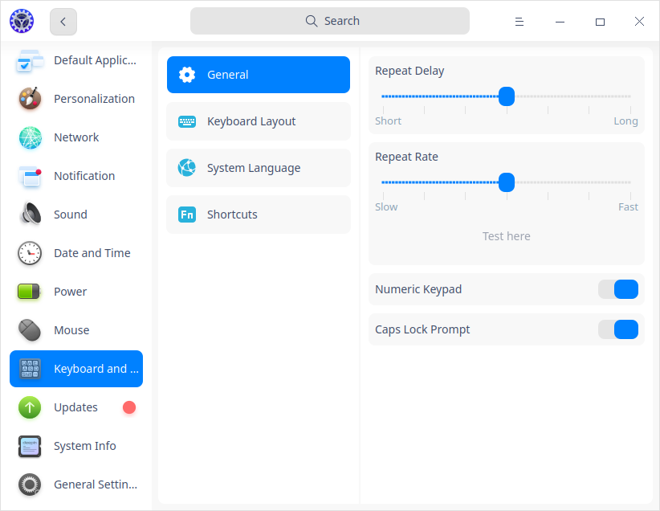

#### Keyboard Properties

1. On the homepage of Control Center, click .
2. Click **General**.
3. Adjust **Repeat Delay**/**Repeat Rate**.
4. Click "Test here" and hold down a key to test the repeat rate.
5. Switch on **Numeric Keypad** and **Caps Lock Prompt** if you want.

#### Keyboard Layout
Set the keyboard layout to customize the keyboard for your current language. When you press a key on the keyboard, the keyboard layout controls which characters are displayed on the screen. After changing the keyboard layout, the characters on the screen may not match the characters on the keyboard keys.

You have set a keyboard layout during system installation. You can also add more for other purposes. 

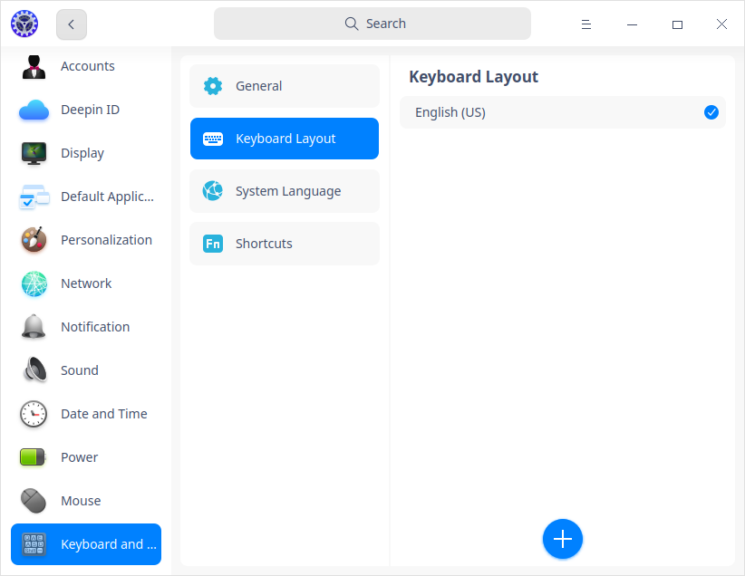

##### Add Keyboard Layout

1. On the homepage of Control Center, click .
2. Click **Keyboard Layout**.
3. Click . Click a keyboard layout to add it.

##### Delete Keyboard Layout

1. On the homepage of Control Center, click .
2. Click **Keyboard Layout**.
3. Click **Edit**.
4. Click  to delete keyboard layout.

##### Switch Keyboard Layout

1. On the homepage of Control Center, click .
2. Click **Keyboard Layout**.
3. Click the layout you want to switch to.
4. After successful switching, the layout will be marked with a check.

> Tips: You can also select one or more shortcuts to switch the keyboard layouts in order. Select **Applies to** to ensure the adjusted keyboard layout is applied to your system or current application.

#### System Language

The system language is the language selected when you installed the system by default. It can be changed at any time.

##### Add System Language
Add multiple languages into the list to change language conveniently.

1. On the homepage of Control Center, click .
2. Click **System Language**.
3. Click  to enter the language list.
4. Select the language you want and it will be added into the system language list automatically.

##### Change System Language

1. On the homepage of Control Center, click .
2. Click **System Language**.
3. Select the language you want to switch to and the language package will be installed automatically.
4. After successfully installation, please log out and log in again to view the changes.

> Attention: The keyboard layout may also be changed in the process of switching the system language. Please make sure that you select a correct keyboard layout to enter the login password.

#### Shortcuts
The shortcut list includes all shortcuts in the system. View, modify and customize the shortcuts here as you need.

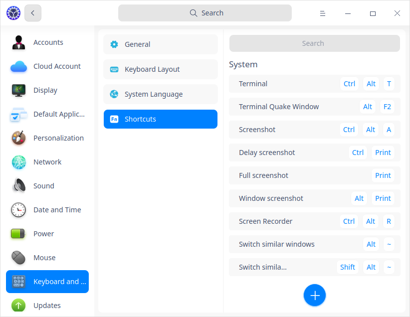

##### View Shortcuts

1. On the homepage of Control Center, click .
2. Click **Shortcuts**.
3. You can search or view the default shortcuts for system, window and workspace.

   

##### Modify Shortcuts

1. On the homepage of Control Center, click .
2. Click **Shortcuts**.
3. Click the shortcut you want to modify.
4. Press new shortcut to change it.

> Tips: To disable a shortcut, please press  on the keyboard. To cancel modification, press **Esc** or click "Restore Defaults" at the bottom.

##### Customize Shortcuts

1. On the homepage of Control Center, click .
2. Click **Shortcuts**.
3. Click .
4. Enter name, command and shortcut.
5. Click **Add**.
6. After successful addition, click **Edit**.
7. Click  to delete the customized shortcut.

> Tips: To change the shortcut, click it and press a new shortcut to change directly. To edit the name and command of the customized shortcut, click **Edit ** >  near the shortcut name to enter the shortcut setting.

### Update Settings

When there is a system update, you will be notified on the home page of Control Center. Click  to enter the "check for updates" page. After checking, you can download and install updates for your system and applications. You can also set to download the updates automatically. 

> Tips: If you do not want to get the prompt message of updates, switch off "Updates Notification" in Update Settings.

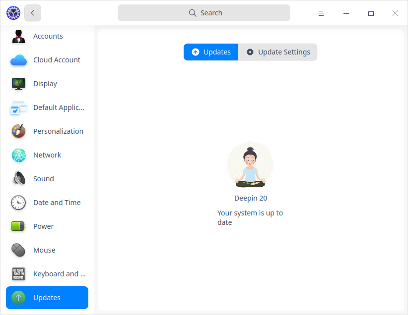

#### Update and Upgrade

1. On the homepage of Control Center, click .
2. Click **Update** to check if there is an update.
 - If there is no update, you will see "Your system is up to date".
 - If there is an update, you will see **Download and install updates** button, change log info and other messages.
3. Click the button to download and install updates.
4. After updating finishes, a hint appears saying the system is updated successfully. 

> Notes: You can click the button to pause and resume the downloading process. After updating, a dialogue box pops up and you will be reminded to **Reboot** or **Shut down** computer to complete the update.

#### Auto Download Updates

1. On the homepage of Control Center, click .
2. Click **Update Settings**.
3. Switch on **Auto Download Updates**.
4. System updates will be automatically downloaded.

> Tips: Switch on **Auto Clear Package Cache** to remove the downloaded package caches regularly. 

### System Info
You can view system version, authorization info, hardware info and the agreements here.

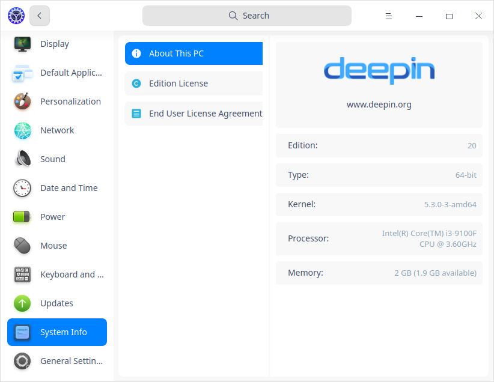

#### About This PC

1. On the homepage of Control Center, click .
2. Under **About This PC**, you can view system version, authorization and hardware information.
3. If the system has not been activated, click **Activate** to activate the system.

#### Edition License

1. On the homepage of Control Center, click .
2. View the system edition license under **Edition License**.

#### End User License Agreement

1. On the homepage of Control Center, click .
2. View the End User License Agreement under **End User License Agreement**.

### General Settings

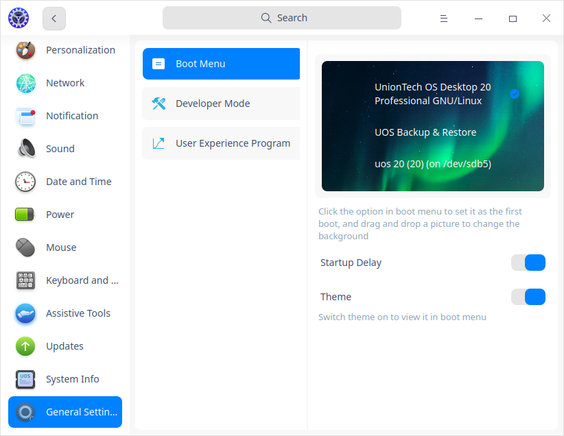

#### Boot Menu

Boot menu is the grub menu for users to select an operating system to start. After selecting and confirming the boot option, your computer will load the system.

##### Startup Delay

When there are multiple systems in the computer, Startup Delay will be switched on by default, and the grub menu will stay 5 seconds for users to select.

When there is only one system in the computer, Startup Delay will be switched off by default and the grub menu will keep only 1 second.

##### Default Boot Entry

1. On the homepage of Control Center, click .
2. Click **Boot Menu**.
3. Click the option in the preview window to set it as default.

##### Boot Menu Theme

1. On the homepage of Control Center, click .
2. Click **Boot Menu**.
3. Switch on **Theme** to use as the theme of boot menu.

> Tips: You can drag and drop an image to the preview window to change the background of boot menu.

## Window Manager

Window manager controls the alignment and appearance of windows. It allows you to switch between your virtual desktops and manage the windows in various workspaces.

### Open Workspace
Manage your desktop windows in different workspaces to enlarge your Workspaces.

On the desktop, press **Super** + **S** or click  to open the workspace interface.

### Add Workspace
On the workspace interface, you can add workspace in the following ways:

- Click  above.
- Press  on the keyboard.

> Notes: When the workspace number has reached its limit, you cannot add more workspaces. 

### Switch Workspace
On the workspace interface and desktop, you can switch workspace in the following ways:

- On the desktop, press **Super** +  /  to switch to Previous/Next workspace.
- On the desktop, press **Super** + Numeric keys (1-7)  to switch to a specified workspace.
- On the workspace interface, scroll up or down to switch to Previous/Next workspace.
- On the workspace interface, press  /  to switch to Previous/Next workspace directly.
- On the workspace interface, click the preview window or press the numeric keys (1-7) to switch to a specified workspace.

### Delete Workspace
After deleting a workspace, all windows in the workspace will be moved to a nearby workspace. You cannot delete the workspace when there is only one.

- On the workspace interface, click the **X** icon on the upper right corner to delete a workspace.

### Quit Workspace
After completing operations on the workspace interface, you can quit in the following ways:

- Press **Esc**.
- Click the blank area on the workspace interface.
- Press **Super** + **S** again.

### View All Windows
View all the windows in the workspaces in the following ways:

- On the desktop, press **Super** + **A** on the keyboard to view the windows in all workspaces.
- On the desktop, press **Super** + **W** to view the windows in the current workspace.

#### Move Windows among Workspaces
Move the windows to other workspaces in the following ways:

- On the workspace interface, drag and drop the window to another workspace.
- On the desktop, press **Super** + **Shift** +  /  to move the current window to the previous/next workspace.
- On the desktop, press  **Super** + **Shift** + Numeric Keys to move the current window to the specified workspace.
- On the desktop, press  **AIt** + **Space** or right click the window title bar to open the window menu, and select **Always on Visible Workspace** or **Move to Workspace Left/Right** to move the current window to the specified workspace.

> Tips: In the window menu, you can also minimize, maximize, move, resize, stick or close the window.

### Switch Desktop Windows
Switch desktop windows in the current workspace as below.

#### Fast Switch between Nearby Windows

- On the desktop, press  **AIt** + **Tab** at the same time and release, to fast switch between the current window and the nearby window;
- On the desktop, press **AIt** + **Shift** + **Tab** at the same time and release, to fast switch between current window and the nearby window reversely.

#### Fast Switch between Windows of the Same Type

- On the desktop, press **Alt** +  at the same time and release, to switch between the current window and other windows of the same type quickly;
- On the desktop, press **AIt** + **Shift** +  at the same time and release, to fast switch between current window and other windows in same type reversely.

#### Switch among All Windows

- On the desktop, press and hold **Alt** and press **Tab** continually. Right windows will show one by one; 
- On the desktop, press and hold **Alt** + **Shift** and press **Tab** continually. Left windows will show one by one.

#### Switch among Windows of the Same Type
- On the desktop, press and hold **Alt** and press  continually. The same type of windows will show one by one.
- On the desktop, press and hold **Alt** + **Shift** and press  continually. The same type of windows will show one by one reversely.

### Split Screen
A split-screen allows the simultaneous presentation of related graphical and textual information on a computer display, reduces switching windows and improves your productivity.

1. Drag the window to the left or right part of the screen until the cursor touches the screen edge and the white transparent background appears. Drop the window and it will be adsorbed on the left or right half of the screen.
2. In the screen of which the other half is unoccupied, a preview of all other windows will appear. Click one of them to display on the other half of the screen to realize split screen browsing.
3. When browsing in split screens, move the cursor to the junction of the two windows in the middle of the screen and drag left and right to modify the width of the two windows simultaneously. You can also drag other windows to both sides to overlay the split screen window.

> Tips: To cancel split screen, just drag a window away from the screen edge.

## Keyboard Interaction

You can use the keyboard to switch between various interface areas, select objects and perform operations. 

| Key                                                          | Function                                                     |
| :----------------------------------------------------------- | :----------------------------------------------------------- |
| **Tab**                                                      | Switch between different areas or dialog buttons.            |
|            | Select different objects in the same area. Press  to enter the lower menu and   to return to the upper menu. Pressand  to switch between up and down. |
| **Enter**                                                    | Execute the selected operation.                              |
| **Space**                                                    | Preview the selected object in File Manager; start and pause the playback in Music and Movie; expand the drop-down options in the drop-down list (The enter key is also available). |
| **Ctrl** + **M**                                             | Open the right-click menu.                                   |

## Touchpad Gestures

On the touchpad, you can use the following gestures as a substitute for mouse operations.

> Attention: Your touchpad may not support some of the following gestures. Please confirm whether the touchpad supports multi-touch. 

### Move the Cursor

Move your finger to move the cursor.

### Click

Click with a single finger to finish the mouse click operation.

### Double-click

Double click with a single finger to mimic double-click operation on a mouse.

### Scroll Screen

Move upward with two fingers to scroll the screen down. If the "Natural Scrolling" option is enabled, the screen will scroll upward.

Move downward with two fingers to scroll the screen upward. If the "Natural Scrolling" option is enabled, the screen will scroll downward.

### Backward/Forward

Move to the left with two fingers to move backward. Move to the right with two fingers to move forward.

### Display/Hide the Control Center

Display the Control Center by sliding with two fingers from the right edge of the touchpad to the left.

Hide the Control Center by sliding with two fingers from the left edge of the touchpad to the right.

### Zoom and Rotate

Increase the distance between the two fingers to zoom in, which corresponds to the operation of **Ctrl** + ;

Decrease the distance between the two fingers to zoom out, which corresponds to the operation of **Ctrl** + ;

Rotate with two fingers to rotate the content, which mainly supports the rotation operation in Image Viewer and Screen Capture;

Double click with two fingers to zoom in and restore at the ratio of 200% .

### Open Right-click Menu

Click with two fingers to display the right-click menu.

### Maximize/Restore the Window

Move upward with three fingers to maximize the window, which corresponds to the operation of **Super** + ;

Move downward with three fingers to maximize the window, which corresponds to the operation of  **Super** + .

### Split to Left/Right

Slide with three fingers from the right edge of the touchpad to the left to split the current window left.

Slide with three fingers from the left edge of the touchpad to the right to split the current window right.

### Display All Windows

Increase or decrease the distance between the three fingers to display all the windows, which corresponds to the operation of **Super** + **W**.

### Move Window

1. Click with three fingers to activate the moving status of the current window, which corresponds to the operation of **AIt** + **F7** .
2. Move quickly the window in moving status with one finger and click anywhere to exit the moving status.

### Hide/Display Workspace

Move upward or downward with four/five fingers to display/hide the workspace, which corresponds to the operation of  **Super** + **S**.

### Switch Workspaces

Move with four/five fingers to the left to switch to the previous workspace, which corresponds to the operation of **Super** + .

Move with four/five fingers to the right to switch to the next workspace, which corresponds to the operation of **Super** + .

### Display/Hide Desktop

Increase the distance between the four/five fingers to display/hide the desktop, which corresponds to the operation of **Super** + **D**.

### Display/Hide Launcher

Decrease the distance between the four/five fingers to display/hide Launcher, which corresponds to the operation of **Super**.

## Touchscreen Gestures

On touchscreen computers, you can use the following gestures as a substitute for mouse operations.

### Click

Click with a single finger to mimic the operation on your mouse.

### Double-click

Double click with a single finger to mimic the same operation with your mouse on your touchscreen.

> Tips: Double click to select the texts and drag your finger on the screen to select more texts.

### Move and Drag 

Select the content and move your finger on the touchscreen to mimic the operation on your mouse.

### Open the Right-click Menu

Open the right-click menu of the current object by long-press and release on the touchscreen.

###  Open Workspace

Slide in from the left side of the screen to open Workspace.

###  Open Control Center

Slide in from the right side of the screen to open Control Center.

### Call out Dock

When the Dock is set as "Always Hidden", if the Dock is at the bottom, slide in upward from the bottom edge of the screen to call it out; and if the Dock is on the top, slide in downward from the upper edge of the screen to call it out.

### Backward/Forward

In Browser, slide to the left to enter the next page and slide to the right to return to the previous page.

### Scroll Screen

The scrolling direction of the screen is the same as where your finger goes.

### Zoom in/out

Pinch two fingers to zoom out on the web page or picture. Open two fingers to zoom in on the web page or picture.

