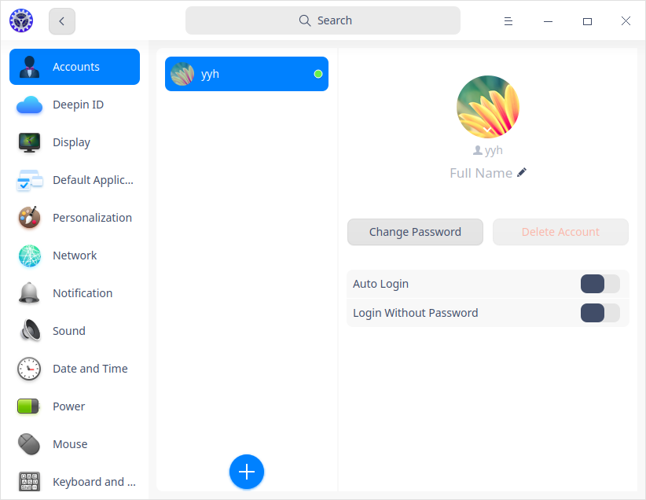
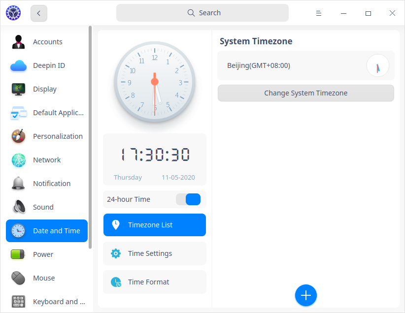
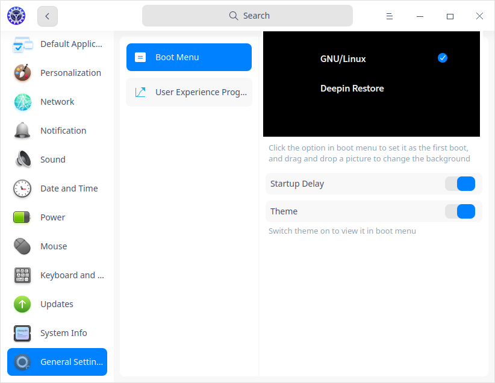

# Centro de control: haga clic para comprobar o cambiar la configuración del sistema.Desktop Environment|../common/dde.svg|

## Vistazo
Deepin es un sistema operativo de escritorio Linux de elaboración propia, fácil de usar y fiable, con agradables experiencias visuales. Está equipado con una serie de aplicaciones originales, como el gestor de archivos, la tienda de aplicaciones, el visor de imágenes, las películas y muchas otras aplicaciones originales, que no sólo le permiten disfrutar de entretenimiento enriquecido, sino que también le sirven para su trabajo y su vida diaria. Con continuas mejoras y actualizaciones, se está convirtiendo en uno de los sistemas operativos de código abierto más populares de China.

### Preparándose

Cuando se conecte al sistema por primera vez, se iniciará automáticamente un programa de bienvenida. No dude en visualizar el vídeo para conocer las nuevas funciones, personalizar el escritorio, activar el efecto ventana y saber más sobre el sistema operativo Deepin.

Una vez iniciada la sesión, estará listo para experimentar el entorno de escritorio de Deepin. Está compuesto por el Escritorio, el Muelle (Dock), el Lanzador, el Centro de Control y el Gestor de Ventanas, que sirven de base para su sistema.

Lea a continuación y aprenda a utilizar en el entorno de escritorio de deepin.

## Escritorio

El escritorio es la pantalla principal que verá después de iniciada la sesión. En el escritorio, puede crear un nuevo archivo/carpeta, ordenar archivos, abrir en la terminal, establecer el fondo de pantalla, el salvapantallas, etc. También puede añadir accesos directos a las aplicaciones en el escritorio utilizando [Enviar al escritorio](#Set App Shortcut).

> Nota: En el panel táctil que admite la pulsación en múltiples puntos, puede utilizar el gesto para operar en lugar del ratón: mover con cuatro/cinco dedos hacia abajo para mostrar el escritorio, y mover hacia arriba inmediatamente para ocultar lo que corresponde a la operación de **Super** + **D**. 

### Crear Nueva Carpeta/Documento

Puede crear una nueva carpeta/documento en el escritorio o ejecutar algunas tareas regulares en los archivos, al igual que como se trabaja con el Gestor de archivos.

- Haga clic derecho del ratón en el escritorio. Seleccione **Nueva carpeta** e introduzca el nombre de la misma.
- Haga clic derecho del ratón en el escritorio. Seleccione **Nuevo documento**, seleccione el tipo e introduzca su nombre.

Haga clic con el botón derecho en un archivo o carpeta del escritorio y utilice las funciones del Gestor de archivos como se indica a continuación:

| Función                    | Descripción                                                  |
| -------------------------- | ------------------------------------------------------------ |
| Abrir con                  | Selecciona una aplicación por defecto para abrirla, u otras asociadas para abrirla. |
| Cortar                     | Mueve el archivo o la carpeta a otra ubicación.              |
| Copiar                     | Copia el archivo o la carpeta en otra ubicación.             |
| Renombrar                  | Cambia el nombre del archivo o carpeta.                      |
| Borrar                     | Elimina y mueve el archivo o la carpeta a la papelera.       |
| Crear enlace               | Crea un acceso directo al archivo o carpeta.                 |
| Información de la etiqueta | Añade una etiqueta al archivo o carpeta.                     |
| Comprimir/Extraer          | Comprime el archivo o carpeta o extrae el archivo comprimido. |
| Propiedades                | Visualice la información básica, compártala o cambie el permiso. |

>Notas: 
>  - Si utiliza un equipo provisto de una pantalla táctil, puede utilizar los gestos de la pantalla táctil para operar en lugar del ratón: pulse prolongadamente durante 1 segundo y suelte en la pantalla táctil.
>  - En el panel táctil que admite la pulsación en múltiples puntos, puede utilizar el gesto para operar en lugar del ratón: haga clic con dos dedos para mostrar el menú del botón derecho. 
>  - Pulse **Ctrl** + **M** en el teclado para abrir el menú contextual.

### Ordenar archivos

Ordene los iconos de su escritorio para organizarlos según sus necesidades.

1. Haga clic derecho en el escritorio.
2. Clic en **Ordenar por**, puede:

 - Clic en **Nombre** para mostrar archivos en orden alfabético.
 - Clic en **Tamaño** para mostrar archivos en orden de peso.
 - Clic en **Tipo** para mostrar según su razgo.
 - Clic en **Fecha de modificación** para ver los archivos a partir de la última fecha de ser modificada.

> Consejo: Revise **Organizar automáticamente**. Los iconos del escritorio se ordenarán automáticamente. Si se elimina un icono, otro rellenará el espacio en blanco.

### Ajustar tamaño de icono

1. Haz clic derecho en el escritorio.
2. Haga clic en **Tamaño del ícono** y escoga el tamaño que prefiera.

> Consejo: Pulse **Ctrl** +  /  / deslice la rueda del ratón para ajustar el tamaño del icono en el escritorio y en el Lanzador.

### Ajustar pantalla
Desde el escritorio se puede ajustar la escala de visualización, la resolución de la pantalla, el brillo, etc.

1. Haga clic derecho en el escritorio.
2. Haga clic en **Ajustes de pantalla** para abrir los ajustes en el Centro de control.

> Notas: Para más información, por favor consulte [Pantalla](#Display).

### Cambiar el fondo de pantalla
Elija fondos de pantalla hermosos y modernos para decorar tu escritorio. ¡Hazlo único!

1. Haga clic derecho en el escritorio.
2. Haga clic en **Fondo de pantalla y salvapantallas** para visualizar todos los papeles tapices.
3. Haga clic en su favorito y se aplicará en su escritorio y pantalla de bloqueo.
4. También puede elegir **Sólo escritorio** o **Sólo pantalla de bloqueo**.

> Consejos: 
>    - Marque **Cambiar fondos automáticamente** y establezca el intervalo de tiempo para permitir el cambio automático del fondo de pantalla. O puede configurar para cambiar el fondo de pantalla en el proceso de inicio de sesión o despertar. 
>    - También puede establecer su foto favorita como fondo de pantalla en un visor de imágenes.

### Establecer Salvapantallas
El salvapantallas se utilizaba antes para proteger el monitor, pero ahora se utiliza para proteger la privacidad ante los curiosos.

1. Haga clic derecho en el escritorio.
2. Haga clic en **Fondos de pantalla y salvapantallas** y seleccione **Salvapantallas** para obtener una vista previa de todos los salvapantallas.
2. Seleccione uno y haga clic en **Aplicar**. Establezca el **Esperar** (tiempo de espera) para que se inicie el salvapantallas.
3. También puede marcar la casilla de **Requerir una contraseña para desbloquear** para una mejor protección de la privacidad.
4. Después de ese tiempo de espera, el salvapantallas se iniciará.

### Usar portapapeles

Todos los textos, imágenes y documentos cortados y copiados por el usuario actual tras el inicio de sesión se muestran en el portapapeles, que puede copiarse rápidamente haciendo doble clic en el portapapeles. El portapapeles se borra automáticamente tras el cierre de sesión y el apagado.

1. Utilice el atajo de teclado **Ctrl** + **Alt** + **V** para activar el portapapeles.

2. Haga doble clic en el portapapeles para copiar el contenido actual rápidamente y el bloque correspondiente se moverá a la parte superior del portapapeles.

3. Seleccione el lugar de destino para pegarlo.

4. Haga clic enpara borrar el contenido actual y pulse en **Limpiar todo** para vaciar el portapapeles.

   

> Nota: Si utiliza un ordenador equipado con una pantalla táctil, puede utilizar los gestos de la pantalla táctil para operar en lugar del ratón: deslice desde el borde izquierdo de la pantalla superando la altura del muelle para llamar a Portapapeles.

## Muelle

El muelle está en la parte inferior del escritorio por defecto para ayudarte a abrir rápidamente las aplicaciones de uso frecuente, que se componen del lanzador, aplicaciones, bandeja del sistema y complementos. En el muelle, puede abrir el lanzador, mostrar el escritorio, entrar en los espacios de trabajo, abrir y salir de las aplicaciones, establecer métodos de entrada, ajustar el volumen, conectarse a una red inalámbrica, ver el calendario y entrar en la interfaz de apagado, entre otras tareas.

### Conocer los iconos del muelle
Los iconos del lanzador, de las aplicaciones, de la bandeja del sistema y de los complementos se muestran en el muelle. Puedes enviar los iconos de las aplicaciones desde el lanzador al muelle para abrirlos rápidamente.

| Icon | Description |
| ---- | ---- |
|  | Lanzador - haga clic para ver todas las aplicaciones instaladas. |
|  | Haga clic para mostrar el escritorio.                        |
|  | Vista multitarea: haga clic para mostrar los espacios de trabajo. |
|  | Gestor de archivos: haga clic para ver los archivos y carpetas del disco. |
|  | App Store - busca e instala aplicaciones. |
|  | Calendar -  view dates and create new schedules. |
|  | Álbum - Importa y gestiona fotos.                            |
|  | Música: reproduce canciones locales.                         |
|  | Centro de control: haga clic para comprobar o cambiar la configuración del sistema. |
|  | Centro de notificaciones: muestra todas las notificaciones de sistema y las aplicaciones. |
|  | Teclado virtual OnBoard.                                     |
|  | Haga clic para entrar en la interfaz de apagado.             |
|  | Papelera. |

> Tips: In Efficient Mode, you can click the right side of Dock to show the desktop. Move the cursor to the running app on the Dock and you will see its preview window.

### Cambiar el modo de visualización
Hay dos modos de visualización del muelle: el modo de moda y el modo eficiente. Los tamaños de los iconos y los efectos de las ventanas son diferentes en los distintos modos.

Puede cambiar los modos de visualización de la siguiente manera:

1. Haga clic derecho al muelle y seleccione **Modo**.
2. Seleccione el modo a mostrar.

### Cambiar ubicación del muelle
Puede colocar el muelle en cualquier dirección de su escritorio.

1. Haga clic derecho al muelle y seleccione **Ubicación**.
2. Seleccione su ubicación.

### Cambiar grosor del muelle
Arrastre el borde superior para aumentar o disminuir la altura.

### Mostrar/Ocultar muelle

Puedes ocultar el Dock para maximizar la expansión del área operativa del escritorio. 

1. Haga clic derecho al muelle y seleccione **Estado**.
2. En el submenú, puede seleccionar:
- **Mantener visible** - muestra el muelle todo el tiempo.
- **Mantener oculto** - oculta el muelle y lo muestra sólo cuando pasa el ratón por el área del muelle.
- **Ocultado inteligente** - oculta el muelle automáticamente si se utiliza el área del muelle.

> Nota: Si utiliza un equipo provisto de pantalla táctil, puede utilizar los gestos de la pantalla táctil para operar en lugar del ratón: cuando el Dock está configurado como "Siempre oculto" u "Ocultado inteligente", si el Dock está en la parte inferior, deslice hacia arriba desde el borde inferior de la pantalla para llamarlo; y si el Dock está en la parte superior, deslice hacia abajo desde el borde superior de la pantalla para llamarlo.

### Mostrar/ocultar complementos

1. Haga clic con el botón derecho del ratón en el muelle y seleccione **Complementos**.
2. En el submenú, puedes marcar o desmarcar **Papelera, Apagar, Mostrar Escritorio, Centro de notificaciones, Vista multitarea** y **Fecha y hora** para mostrar u ocultar el icono correspondiente en el Dock.

### Ver notificaciones
Cuando haya notificaciones del sistema o de la aplicación, se mostrarán en el centro de la pantalla. Si hay botones en el mensaje, pulse los botones para realizar las acciones; si no los hay, pulse el mensaje para cerrarlo.

Haga clic en  del muelle para ver todas notificaciones.

> Nota: Si utiliza un equipo provisto de pantalla táctil, puede utilizar los gestos de la pantalla táctil para operar en lugar del ratón: deslice desde el borde derecho de la pantalla superando la altura del muelle para llamar al Centro de notificaciones.

### Ver fecha y hora

- Pase el cursor sobre el icono de la Hora en el Dock para ver la hora, la fecha y el día de la semana actuales.
- Haga clic en el icono de la hora para abrir el calendario.

### Entrar interfaz de apagado

Hay dos maneras de entrar en la interfaz de apagado:

- Haga clic en  del muelle
- Haga clic en  en la esquina inferior derecha del modo reducido del lanzador.

| Function                                                     | Description                                                  |
| ------------------------------------------------------------ | ------------------------------------------------------------ |
| Apagar           | Apaga el equipo.                                             |
| Reiniciar            | Reinicia el equipo.                                          |
| Suspender          | The computer will run with low consumption.                  |
| Hibernar                 | "Hibernar" se monta en sistemas con partición swap. Esta opción no aparece en los sistemas sin partición de intercambio. |
| Bloquear                 | Bloquea el ordenador con la contraseña. O pulse **Super** + **L** para bloquearlo. |
| Cambiar usuario  | Inicia sesión con otra cuenta de usuario.                    |
| Log out              | Finaliza todos los procesos e inicializa el sistema.         |
| Start system monitor | Vea los procesos en ejecución y finalice el que desee.       |

> Notas: el icono se mostrará si hay varias cuentas en el sistema.

### Papelera
Puedes encontrar todos los archivos borrados en la papelera, que puede ser restaurada o vaciada.

#### Restaurar archivos

Puedes restaurar los archivos eliminados en la Papelera o pulsar **Ctrl** + **Z** para restaurar los archivos eliminados últimamente.

1. Seleccione el archivo en la papelera.
2. Haga clic derecho en el archivo y seleccione **Restaurar**.
3. El archivo se restaurará en su ruta de almacenamiento original.

> Atención: Si la carpeta original del archivo ha sido eliminada, el archivo eliminado se restaurará en una carpeta recién creada automáticamente.

#### Vaciar papalera
En la papelera, haga clic en **Vaciar** para eliminar definitivamente todos los archivos de la papelera.

## Lanzador
El lanzador   le ayuda a gestionar todas las aplicaciones instaladas, donde puede encontrar rápidamente una aplicación por navegación de categorías o por una búsqueda.

Puedes ver las aplicaciones recién instaladas en el lanzador. Las recién instaladas van seguidas de un punto azul.

> Nota: En el panel táctil que admite el toque de varios puntos, puede utilizar el gesto para operar en lugar del ratón: haga clic con cuatro/cinco dedos para mostrar/ocultar el Lanzador, lo que corresponde a la operación de **Super**.

### Cambiar modos del lanzador

Hay dos modos de visualización del lanzador: el modo de pantalla completa y el modo mini. Haga clic en el icono de la esquina superior derecha para cambiar de modo.

Ambos modos permiten buscar aplicaciones y enviarlas al escritorio o al muelle.

El modo mini también permite abrir directamente el Gestor de archivos, el Centro de control y la interfaz de apagado.

### Ordenar aplicaciones

En el modo de pantalla completa, todas las aplicaciones en el lanzador se listan por el tiempo de instalación por defecto. Puede ordenar los iconos de las aplicaciones como se indica a continuación:

- Sitúe el cursor sobre el icono de una aplicación, mantenga pulsada el botón izquierdo del ratón, arrastre y suelte el icono de la aplicación para organizarlo libremente.
- Haga clic en el icono de la categoría  en la parte superior izquierda del lanzador para organizar los iconos por categorías.

En el modo mini, las aplicaciones se muestran por defecto según la frecuencia de uso.

### Buscar aplicaciones

En el lanzador, puedes desplazarte hacia arriba y hacia abajo para encontrar una aplicación, o localizarla con la navegación por categorías.

Si ya conoce el nombre de la aplicación, sólo tiene que buscarlo en el cuadro de búsqueda.

### Establecer acceso directo a la aplicación
El acceso directo ofrece un método para ejecutar aplicaciones de forma rápida y sencilla.

#### Crear un acceso directo a la aplicación
Envíe el icono de la aplicación al escritorio o al Dock para facilitar las operaciones de seguimiento.

En el lanzador, haga clic con el botón derecho en el icono de una aplicación y podrás:

* Seleccione **Enviar al escritorio** para crear un acceso directo en el escritorio.
* Seleccione **Enviar al muelle** para fijar el icono de la aplicación en el Dock.

> Nota: Puede arrastrar el icono de la aplicación desde el Launcher al Dock, pero no podrá arrastrar y soltar la aplicación mientras se está ejecutando. Después de esto, puede hacer clic derecho en el icono de la aplicación en el muelle y seleccionar **Anclar** para fijarlo para el inicio rápido en la próxima vez.

#### Quitar acceso directo
Eliminar un acceso directo del escritorio directamente o eliminarlo del Muelle o del Lanzador.

**Quitar acceso directo del muelle:**

- Mantenga pulsada el botón izquierdo del ratón, arrastre y suelte el icono fuera del Dock. 
- No se podrá arrastrar y soltar el icono de la aplicación mientras se esté ejecutando. Después de esto, podrá hacer clic con el botón derecho del ratón en el icono de la aplicación en el Dock y seleccionar **Descargar** para eliminarla del Dock.

**Quitar acceso directo del lanzador:**

En el lanzador, haz clic con el botón derecho del ratón en el icono y podrás:
- Seleccione **Quitar del escritorio** para eliminar el acceso directo del escritorio.
- Seleccione **Quitar del muelle** para eliminar el icono de la aplicación del muelle.

> Nota: Las operaciones anteriores sólo eliminan el acceso directo y no desinstalan las aplicaciones.

### Instalar aplicaciones
Busque e instale más aplicaciones que le gusten en la App Store.

### Ejecutar aplicaciones
Para las aplicaciones cuyos accesos directos se han creado en el escritorio o en el muelle, puede abrirlas de las siguientes maneras:

- Haga doble clic en el icono del escritorio o haga clic derecho y seleccione **Abrir**.
- Haga clic en el icono de la aplicación en el muelle o haga clic derecho y seleccione **Abrir**.

Para abrir la aplicación que sólo se muestra en el lanzador, haga clic en el icono o haga clic derecho y seleccione **Abrir**.

> Consejo: Para las aplicaciones de uso frecuente, haga clic con el botón derecho del ratón en el icono de la aplicación y seleccione **Añadir al arranque** para que se ejecute al arrancar el ordenador.

### Desinstalar aplicaciones
Desinstale las aplicaciones que ya no utiliza para ahorrar espacio en el disco.

1. En el lanzador, haga clic con el botón derecho en el icono de la aplicación.
2. Clic en **Desinstalar**.

> Consejo: En el **modo elegante**, arrastre el icono de la aplicación en el lanzador pantalla completa hacia el icono  del muelle para desinstalar la aplicación.

## Centro de control
En el Centro de control podrá gestionar la configuración del sistema, incluyendo la gestión de cuentas, la configuración de la red, la fecha y la hora, la personalización, la configuración de la pantalla, la actualización del sistema y de las aplicaciones, etc. Después de entrar en el entorno de escritorio, haga clic en  para abrir el Centro de control.

> Nota: En el panel táctil que admite la pulsación en múltiples puntos, puede utilizar el gesto para operar en lugar del ratón: muestre el Centro de control deslizando con dos dedos desde el borde derecho del panel táctil hacia la izquierda; oculte el Centro de control deslizando con dos dedos desde el borde izquierdo del panel táctil hacia la derecha.

### Introducción a la pantalla de inicio

La página de inicio del Centro de control ofrece varios módulos de configuración. Puede hacer clic en uno de ellos para acceder a los ajustes detallados. 

Una vez que abra un módulo de configuración en el Centro de control, la navegación aparece a la izquierda. Haga clic en la navegación de la izquierda para cambiar rápidamente a otros ajustes.

#### Barra de título

La barra de título contiene el botón de retroceso, el cuadro de búsqueda, el menú principal y los botones de la ventana.

- Botón de retroceso: Clic en  para retroceder a la página de inicio.
- Botón de búsqueda: Introduzca una palabra clave y busque los ajustes relacionados.
- Menú principal: Clic en  para entrar en el menú principal en el que se puede configurar el tema de la ventana, ver el manual y salir.

### Cuentas
Cuando ya ha creado una cuenta al instalar el sistema, aquí puede modificar la configuración de la cuenta o crear una nueva.

#### Crear nueva cuenta

1. En la página de inicio del centro de control, haga clic en.
2. Clic en .
3. Introduzca un nombre de usuario y contraseña dos veces.
4. Clic en **Crear**.
5. Introduzca la contraseña de la cuenta de usuario actual en el cuadro de diálogo de autenticación, y la nueva cuenta se añadirá a la lista de cuentas.

#### Cambiar avatar de usuario

1. En la página de inicio del centro de control, haga clic en.
2. Haga clic en una cuenta existe de la lista.
3. Haga clic en el avatar del usuario.
4. Seleccione un avatar o cargue un avatar local.

#### Definir nombre completo
El nombre completo de la cuenta se muestra en la lista de cuentas y en la interfaz de inicio de sesión del sistema. Puede configurarlo según sus necesidades.

1. En la página de inicio del centro de control, haga clic en.
2. Haga clic en una cuenta existe de la lista.
3. Clic en  y después en **Nombre completo**, e introduzca el nombre.

#### Cambiar contraseña

1. En la página de inicio del centro de control, haga clic en.
2. Haga clic en the la cuenta actual.
3. Haga clic en **Cambiar contraseña**.
4. Introduzca una nueva contraseña dos veces y confirme.

#### Inicio de sesión automático
Si la opción "Inicio de sesión automático" está activada, podrá iniciar la sesión en el sistema directamente sin necesidad de introducir una contraseña cuando el ordenador se reinicie o se inicie la próxima vez. Sin embargo, sigue siendo necesario introducir la contraseña después de bloquear o cerrar la sesión del ordenador.

1. En la página de inicio del centro de control, haga clic en.
2. Haga clic en la cuenta actual.
3. Active el **Inicio de sesión automático**.

#### Iniciar sesión sin contraseña
Si "Iniciar sesión sin contraseña" está activada, solo necesita hacer clic en  para iniciar dentro del sistema sin introducir la contraseña. 

1. En la página de inicio del centro de control, haga clic en.
2. Haga clic en la cuenta actual.
3. Active **Inicio de sesión sin contraseña** y podrá iniciar sesión en el sistema sin contraseña.

> Consejo: Si tanto el **Inicio de sesión automático** como el **Inicio sin contraseña** están activados, una vez que se reinicie o inicie, su ordenador entrará directamente en el escritorio sin escribir una contraseña.
>
> Consejo: La opción "Contraseña del llavero vacía" está marcada por defecto, lo que significa que no tiene que volver a introducir la contraseña de inicio de sesión para las aplicaciones cuyas contraseñas se recuerdan en el modo "Inicio de sesión sin contraseña". De lo contrario, tendrá que introducir la contraseña cada vez que ejecute la aplicación.

#### Establecer la protección por huella dactilar

La protección por huella dactilar se aplica al inicio de sesión del sistema, la autorización de aplicaciones y otros escenarios. Escanee su huella dactilar cuando se requiera la contraseña del usuario.

1. En la página de inicio del centro de control, haga clic en.
2. Haga clic en la cuenta actual.
3. Clic en **Añadir huella digital**.
4. Coloque su dedo en el lector de huellas dactilares y repita estos pasos hasta que su huella dactilar se añada con éxito.
5. Haga clic en **Hecho**. 

> Nota: Puede añadir varias contraseñas de huellas digitales para una cuenta; Haga clic en **Borrar huella digital** para eliminar todas las contraseñas de huellas digitales. 

#### Borrar cuenta

1. En la página de inicio del centro de control, haga clic en.
2. Haga clic en la otra cuenta.
3. Haga clic en **Borrar cuenta**.
4. En el cuadro de confirmación, clic en **Borrar**.

> Atención: La cuenta activa no puede ser eliminada.

### Deepin ID

Al iniciar sesión en Deepin ID, podrá utilizar la sincronización en la nube, el App Store y otros servicios en la nube relacionados.

Al iniciar la sesión por primera vez, aparecerá la ventana de **Política de privacidad**. Si los usuarios necesitan abrir los servicios en la nube y otras funciones, puede marcar **He leído y acepto la política de privacidad**, y hacer clic en **Confirmar**.

La sincronización en la nube puede sincronizar automáticamente varias configuraciones del sistema a la nube, como la red, el sonido, el ratón, la actualización, el dock, el lanzador, el fondo de pantalla, el tema, la fuente de alimentación, etc. Para sincronizar las configuraciones desde la nube a otro ordenador, sólo tienes que iniciar sesión con el mismo Deepin ID en ese ordenador.

> Consejo: Cuando la "Sincronización automática" está activada, puedes desmarcar las opciones no deseadas; cuando está desactivada, todos los ajustes no se sincronizarán.

### Pantalla
Ajusta correctamente la resolución de la pantalla, el brillo, la dirección y la escala de visualización para obtener el mejor efecto visual.

#### Ajustes para una pantalla

##### Change Resolution

1. En la página de inicio del centro de control, haga clic en.
2. Clic en **Resolución**.
3. Seleccione una resolución adecuada en la lista.
4. Clic en **Guardar**.

##### Adjust Brightness

1. En la página de inicio del centro de control, haga clic en.
2. Clic en **Brillo**.
   - Ajuste el **Brillo**: Arrastre el control deslizante para ajustar el brillo de la pantalla.
   - Ajuste el **Color de temperatura**:
      - Active el **Modo nocturno**, el tono de la pantalla se ajustará automáticamente según tu ubicación.
      - Active la opción **Cambiar color de temperatura**, al marcarlo podrá ajustar el brillo del monitor a su modo. 
   
> Nota: Cuando se activa el **Modo nocturno**, **Cambiar color de temperatura** no está disponible automáticamente, y viceversa.

##### Ajustar escalado de pantalla

Establezca una escala de visualización adecuada para tener una visualización normal.

1. En la página de inicio del centro de control, haga clic en.
2. Clic en **Escalado de pantalla**.
3. Cambie el escalado de la pantalla. Cierre la sesión y vuelva a iniciarla para activar los cambios.

> Notas: 
>- Cuando se detecta una pantalla HiDPI, la escala de la pantalla se ajusta automáticamente.
>-  Para las aplicaciones que no soportan el escalado, haz clic con el botón derecho en el lanzador y selecciona **Desactivar el escalado de la pantalla** para obtener una mejor visualización.

##### Cambiar tasa de refresco
1. En la página de inicio del centro de control, haga clic en.
2. Clic en **Tasa de refresco**.
3. Seleccione uno y haga clic en **Guardar**.

##### Cambiar dirección de pantalla

1. En la página de inicio del centro de control, haga clic en.
2. Clic en .
3. Por cada clic, la pantalla rotará 90 grados contrareloj.
4. Para volver a la dirección original, haga clic derecho para salir; para utilizar la dirección actual, pulse **Ctrl** + **S** para guardar.

#### Ajustes de múltiples pantallas
¡Amplíe su escritorio con varias pantallas! Utilice los cables VGA/HDMI/DP para conectar su ordenador a otros dispositivos de visualización.

1. En la página de inicio del centro de control, haga clic en.
2. Clic en **Pantallas múltiples**.
3. Seleccione un modo de visualización
    - **Duplicar**: muestra la misma imagen en otras pantallas.
    - **Extender**: expande el escritorio a través de las pantallas para ampliarlo.
    - **Personalizar**: personaliza los ajustes de visualización de varias pantallas.

 En las pantallas múltiples, pulse **Super** + **P** para mostrar su OSD. 

Las operaciones son las siguientes:

1. Mantenga pulsado **Super** y pulse **P** o haga clic para seleccionar las opciones. 
2. Suelte las teclas, el modo seleccionado entrará en vigor.

>Notas: Cuando hay varias pantallas en el modo de extensión, sólo la pantalla principal admite la visualización de los iconos del escritorio, el menú del botón derecho y otras funciones. Las subpantallas no son compatibles. 

##### Custom Settings

1. En la página de inicio del centro de control, haga clic en.
2. Clic en **Pantallas múltiples** > **Personalizar**.
3. Clic en **Reconocer**. 
4. Escoga **Fusionar** o **Separar** las pantallas, sobretodo la pantalla principal, establezca la resolución y la tasa de refresco, y rote la pantalla si lo necesita.
5. Clic en **Guardar**.

> Notas: "Fusionar" equivale al modo duplicado. Mientras que "Separar" expresa el modo extendido. 

#### Pantalla táctil

If your computer has a touch screen, you can set your screen and adjust it.

1. En la página de inicio del centro de control, haga clic en.
2. Clic en **Pantalla táctil** para ajustar su pantalla.
3. Clic en **Confirmar**. 

### Ajustes de aplicaciones predeterminadas

Si ha instalado varias aplicaciones con funciones similares, puede elegir una como aplicación por defecto para abrir ese tipo de archivos.

#### Establecer la aplicación por defecto

1. Haga clic derecho en el archivo y elija **Abrir con** > **Configurar programa por defecto**.
2. Seleccione una aplicación, **Establecer por defecto** está marcada por defecto, y haga clic en **Confirmar**.
3. La aplicación se añadirá automáticamente a la lista de aplicaciones por defecto en el Centro de control.

#### Cambiar la aplicación por defecto

1. En la página de inicio del centro de control, haga clic en.
2. Seleccione un tipo de archivo.
3. Select another one in the list as the default application.

#### Añadir aplicación por defecto

1. En la página de inicio del centro de control, haga clic en.
2. Seleccione un tipo de archivo.
3. Clic en  debajo para añadir un acceso directo (usualmente está en /usr/share/applications) o un archivo binario específico como aplicación por defecto.
4. La aplicación se añadirá a la lista y se establecerá como aplicación por defecto automáticamente.

#### Borrar aplicación por defecto

En la lista de aplicaciones por defecto, sólo puede eliminar las aplicaciones añadidas por su cuenta. Para eliminar otras aplicaciones de la lista, sólo puede desinstalarlas. Una vez desinstaladas, se eliminarán automáticamente de la lista.

Para eliminar las aplicaciones por defecto que ha añadido, haga lo siguiente:

1. En la página de inicio del centro de control, haga clic en.
2. Seleccione un tipo de archivo.
3. Clic en  después del nombre de la aplicación para eliminarla.

### Ajustes de personalización
Puede ajustar la transparencia del lanzador (en modo mini) y del muelle, y también establecer el tema, el color de acento, la fuente y el efecto de las ventanas, así como cambiar la apariencia del escritorio y de las ventanas a tu estilo favorito. 

#### Establecer el tema de ventana
1. En la página de inicio del centro de control, haga clic en.
2. Clic en **General**.
3. Seleccione un tema de ventana y se utilizará como tema del sistema.

> Notas: "Auto" significa que el tema de la ventana cambia automáticamente según la hora de la puesta y la salida del sol. Después de la salida del sol, es el tema claro; después de la puesta del sol, es el tema oscuro.

#### Cambiar el color del acento
El color de acento se refiere al color utilizado cuando se selecciona una opción o un archivo en el sistema.

1. En la página de inicio del centro de control, haga clic en.
2. Clic en **General**.
3. Elija un color en **Color de fondo** y vea sus efectos.

#### Ajustar transparencia

Esta función sólo está disponible cuando el "Efecto ventana" está activado. Mueva el deslizador de izquierda a derecha para cambiar la transparencia del lanzador (en modo mini) de transparente a opaco.

1. En la página de inicio del centro de control, haga clic en.
2. Clic en **General**.
3. Haga clic en la barra para ajustar la transparencia y ver el efecto en tiempo real.

#### Activar el efecto ventana
Active el efecto ventana para mejorar la visualización del escritorio y de las ventanas.

1. En la página de inicio del centro de control, haga clic en.
2. Clic en **General**.
3. Active el parámetro **Window Effect**.
>Notas: Cuando se activa el **Efecto de ventana**, se puede establecer a **Escala** o **Lámpara mágica** cuando se minimiza la ventana, y también se puede ajustar el tamaño de la esquina redondeada.

#### Ajustar tema de iconos

1. En la página de inicio del centro de control, haga clic en.
2. Haga clic en **Tema de iconos** y seleccione un estilo de icono.

#### Set Cursor Theme

1. En la página de inicio del centro de control, haga clic en.
2. Clic en **Cursor Theme** and select a set of cursors.

#### Change Font

1. En la página de inicio del centro de control, haga clic en.
2. Clic en **Font**.
3. Establezca el tipo y el tamaño de la fuente del sistema.

### Ajustes de red
Una vez iniciada la sesión, necesitará conectarse a una red para navegar por Internet. 

> Tips: Compruebe el estado de du red pasando el ratón por encima o haciendo clic en el icono de red del muelle.

#### Red cableada

Al ser la forma más habitual de conectarse a Internet, la red por cable es segura y estable. Una vez configurado el router, conecta un extremo del cable de red al ordenador y el otro al router, y podrás conectarte a una red por cable. 

1. Conecte el cable a la toma de red de un ordenador.
2. Conecte el otro extremo del cable al router o al puerto de red.
3. En la página de inicio del centro de control, haga clic en.
4. Haga clic en **Red cableada** para entrar en la página de configuración de la red cableada.
5. Active el parámetro **Tarjeta de red cableada** para utilizar la conexión por cable.
6. Si se conecta con éxito a la red, aparecerá un mensaje que indica "Conexión cableada conectada".

También puedes editar y añadir una nueva red cableada en la página de configuración.

#### Conexión inalámbrica

La red inalámbrica le ayuda a navegar por Internet con varios dispositivos de forma flexible.

##### Conectarse a la red Wi-Fi

1. En la página de inicio del centro de control, haga clic en.
2. Haga clic en **Red inalámbrica** para entrar en la página de configuración de la red inalámbrica.
2. Active el parámetro **Adaptador de red inalámbrica** para activar la red inalámbrica.
3. El equipo buscará automáticamente la red inalámbrica cercana disponible.
4. Seleccione la red inalámbrica correcta para conectarse.
   - Si la red está abierta, se conectará automáticamente a la red.
   - Si la red está cifrada, introduzca la contraseña y haga clic en **Conectar**.

##### Conectarse a la red oculta

Para evitar que otros exploren su red y descifren su contraseña, puede ocultar la red inalámbrica en la configuración del router. Una vez hecho esto, tiene que conectarse a la red inalámbrica manualmente.

1. En la página de inicio del centro de control, haga clic en.
2. Haga clic en **Red inalámbrica** para entrar en la página de configuración de la red inalámbrica.
2. Active el parámetro **Adaptador de red inalámbrica** para conectar la red sin cables.
3. Haga clic en **Conectar con la red oculta**.
4. Introduzca el nombre, el SSID y otros datos necesarios.
5. Pulse en **Guardar**.

#### Conexión compartida

La red compartida (hotspot) convierte la señal de red de la conexión del equipo en una zona activa Wi-Fi, proporcionando conexión inalámbrica a otros dispositivos dentro de una determinada distancia. Para activar la zona activa, el ordenador debe estar conectado a una red equipada con un adaptador de red inalámbrica.

1. En la página de inicio del centro de control, haga clic en.
2. Clic en **Compartir conexión personal**.
3. Active el parámetro **Conexión compartida** y complete los ajustes.
4. Clic en **Guardar**. 

#### Conexión en red móvil
Si se encuentra en un lugar sin señal de red, el adaptador de red de telefonía móvil es una herramienta útil para ayudarle a conectarse a Internet siempre que ese lugar esté cubierto por señales telefónicas.

1. Conecte el adaptador de red móvil al puerto USB de su ordenador.
2. Su equipo se conectará automáticamente a la red.
3. En la página de inicio del centro de control, haga clic en.
4. Haga clic en **Red móvil** para ver la información detallada de la red.

#### Conexión DSL/PPPoE

La DSL es una conexión telefónica operada por una línea telefónica estándar y un módem analógico. Configure el módem, conecte la línea telefónica al puerto de red de su ordenador, cree una conexión telefónica de banda ancha e introduzca el nombre de usuario y la contraseña proporcionados por la operadora para marcar y conectarse a Internet.

##### Crear una conexión PPPoE

1. En la página de inicio del centro de control, haga clic en.
2. Clic en **DSL**.
3. Clic en .
4. Introduzca el nombre, la cuenta y la contraseña que le ha proporcionado el operador.
5. Clic en **Guardar**. La conexión se iniciará automáticamente.

#### VPN

La VPN es una red privada virtual para establecer una red exclusiva en la red pública para la comunicación cifrada. Tanto si está de viaje de negocios como si trabaja en casa, puede utilizar la VPN para acceder a los recursos de la intranet corporativa siempre que tenga acceso a Internet. También puede utilizar la VPN para acelerar el acceso a sitios web de otros países.

1. En la página de inicio del centro de control, haga clic en.
2. Haga clic en **VPN**, y luego clic en  o .
3. Seleccione el tipo de protocolo VPN e introduzca el nombre, la pasarela, la cuenta, la contraseña y otros datos (la importación de VPN rellenará automáticamente la información).
4. Clic en **Guardar**. El sistema intentará conectarse a la red VPN automáticamente.
5. Puede exportar la configuración de la VPN como copia de seguridad o para compartirla con otros usuarios. 

> Nota: Si no desea utilizar la VPN como enrutamiento por defecto, y sólo prefiere utilizarla en recursos de red específicos, active el parámetro **Solo aplicable a los recursos correspondientes**.

#### Proxy del sistema

1. En la página de inicio del centro de control, haga clic en.
2. Haga clic en **Proxy del sistema**.
 - Clic en **Nadie** y **Guardar** para desactivar el proxy.
 - Clic en **Manual** e introduzca la dirección y el puerto de los servidores proxy.
 - Clic en **Auto** e introduzca una URL para configurar la información del proxy.

#### Proxy de aplicación

1. En la página de inicio del centro de control, haga clic en.
2. Clic en **Proxy de aplicación**.
3. Seleccione un tipo de proxy y rellene la dirección IP, el puerto, etc.
4. Clic en **Guardar** para guardar los ajustes de proxy.

> Nota: Una vez configurado, ejecute el lanzador, haga clic con el botón derecho en el icono de cualquier aplicación y marque **Utilizar un proxy**. La aplicación se abrirá por medio de un proxy.

#### Información de la red

Puede ver la MAC, la dirección IP, la puerta de enlace y otra información de la red en los detalles de la red.

1. En la página de inicio del centro de control, haga clic en.
2. Clic en **Detalles de red**.
3. View the network info of the current wired or wireless network.

### Ajustes de notificación

Puede configurar "No molestar" a las notificaciones del sistema, y también activar o desactivar las sugerencias de notificación de algunas aplicaciones.

#### Ajustes de notificaciones del sistema

You can set "Do Not Disturb" to system notifications and whether to show icon on Dock here.

1. En la página de inicio del centro de control, haga clic en.

2. Clic en **System Notification**.

   - Switch on/off **Do Not Disturb**.
     After switching on this button, you can set the starting and ending time; also, you can check **When the screen is locked**. Under this mode, all notification are muted, but you can view all notifications in Notification Center. 
   - Switch on/off **Show icon on Dock**.

#### App Notification Settings

You can custom notification hints for all applications.

1. En la página de inicio del centro de control, haga clic en.
2. Under **App Notifications**, select an application, and in the window on the right, you can choose to check:
   - Play a sound
   - Show messages on lockscreen
   - Show in notification center
   - Show message preview

### Sound Settings

Set your output and input devices (such as speaker and microphone) properly to make the sound more clear and pleasant.

#### Output

1. En la página de inicio del centro de control, haga clic en.
2. Clic en **Output** to:
   - Select output device type from the drop-down list after **Output Device**.
   - Drag the slider to adjust output volume and left/right balance.
   - Active el parámetro **Volume Boost**, the volume could be adjustable from 0~150% (the former range is 0~100%).

#### Input

1. En la página de inicio del centro de control, haga clic en.
2. Clic en **Input** to:
   - Select input device type from the drop-down list after **Input Device**.
   - Adjust input volume by dragging the slider.
   - You can enable **Automatic Noise Suppression** by clicking the button after "Automatic Noise Suppression". 

> Tips: Usually, you need to turn up the input volume to make sure that you can hear the sound of the source. However, the volume should not be too high as it will cause distortion of sound. Here is how to set the input volume: speak to your microphone at a normal volume and view the "Input Level". If the indicator of "Input Level " changes notably in accordance with the volume, it shows that the input volume is set at a proper level. 

#### System Sound Effects

1. En la página de inicio del centro de control, haga clic en.
2. Clic en **Sound Effects**. Check the options you want to switch on the sound when the corresponding event occurs.

> Tips: Click to listen to the sound effect.

### Bluetooth Settings
Without the hassle of cables or network, Bluetooth enables a wireless communication between Bluetooth devices in a short distance. The common Bluetooth devices are Bluetooth keyboard, Bluetooth mouse, Bluetooth earphones, Bluetooth speakers, etc.

> Notas: Most laptops have Bluetooth. Just enable and use it. However, as most desktop computers do not have Bluetooth, you can purchase a Bluetooth adapter and plug it into the USB port of your computer to use this function.

#### Change Bluetooth Name

1. En la página de inicio del centro de control, haga clic en.
2. Clic en  after the Bluetooth name, and enter a new name for your computer.

> Notas: Once your Bluetooth Name is changed, it will be broadcast automatically. Other devices may need to rescan to be connected to your Bluetooth.

#### Connect to a Bluetooth Device

1. En la página de inicio del centro de control, haga clic en.
2. Active el parámetro **Bluetooth**. The system will scan the nearby devices automatically and list them in **Other Devices**.
3. Click the device you want to connect and input the PIN code if required. After pairing successfully, the device will be connected automatically. 
4. Following step 3, the Bluetooth device will be added to **My Device** list.
5. In the list, click the device and you can **Disconnect** the device or change its name.

#### Transfer/Receive files via Bluetooth

Files could be transferred / received between deepin PC and non deepin PC or between deepin PC and mobile device (mobile phone / tablet).

Prerequisite: the Bluetooth device of the sender (deepin PC) and the Bluetooth device of the receiver (non deepin PC / mobile phone / tablet) have been paired and connected successfully.

1. En la página de inicio del centro de control, haga clic en.

2. Switch on Bluetooth. The system will scan Bluetooth devices nearby automatically.

3. Select a paired and connected Bluetooth device in "My Devices". Clic en **Send Files** (this button will only appear on pc / mobile phone / tablet Bluetooth devices), the interface for you to select files pops up.

4. Select the files to be sent and Clic en **Open**, a request for file transfer is sent. 

   - If the receiver agrees with the request, then the sender starts to transfer the file and "Bluetooth File Transfer" window is displayed; after the file transfer is completed, a prompt message will pop up at the the receiver, and the user can view the file content.
   - If the receiver is in the following situation, part of the file transfer fails, which will be displayed in the transmission failure list.
     - The file transfer request is refused by the receiver, then the transfer terminates, and "File Transfer Failed" window pops up.
     - The receiver times out or the transferring distance is beyond transmission range, and "File Transfer Failed" window pops up(Bluetooth device connection failed).
     - The receiver does not operate for 1 minute, then the transfer terminates by default,  and "File Transfer Failed" window pops up. 

### Date and Time

Set your timezone properly to display correct date and time. You can also change manually.

#### Change Timezone
You have selected the timezone during system installation. Please follow below steps if you want to change your timezone.

1. En la página de inicio del centro de control, haga clic en.
2. Clic en **Timezone List**.
3. Clic en **Change System Timezone** and select a timezone by searching or clicking on the map.
4. Clic en **Confirm**.

#### Add Timezone
Add another timezone to check the date and time there.

1. En la página de inicio del centro de control, haga clic en.
2. Clic en **Timezone List**.
3. Clic en  and select a timezone by searching or clicking on the map.
4. Clic en **Add**.

#### Delete Timezone

1. En la página de inicio del centro de control, haga clic en.
2. Clic en **Timezone List**.
3. Clic en **Edit** after "Timezone List".
4. Clic en  to remove the timezone.

#### Change Date and Time
Note that the auto-sync function will be disabled after changing date and time manually.

1. En la página de inicio del centro de control, haga clic en.
2. Clic en **Time Settings**.
   - Switch on/off **Auto Sync**.
   - Enter the correct date and time.
3. Clic en **Confirm**.

#### Set Time Format

Setting the format of time and date is supported.

1. En la página de inicio del centro de control, haga clic en.
2. Clic en **Time Format** to set the first day of week, long date, short date, long time, and short time.

### Power Management

Power management turns the system to a low-power state during inactive status, thus ensuring laptop battery endurance while maintaining system security.

> Notas: If you are using a desktop computer, you will not see Power Saving Mode and On Battery options. 

#### Power Saving Mode
To reduce the power consumption of your laptop, turn on power saving mode to reduce screen brightness.

1. En la página de inicio del centro de control, haga clic en.

2. Clic en **General**.

3. Active el parámetro **Power Saving Mode** to enter power saving mode.

4. Under **Power Saving Mode**, you can:
      - Active el parámetro **Auto power saving on low battery**(only applicable for laptops).
      - Active el parámetro **Auto power saving on battery** (only applicable for laptops).
      - Drag the slider of **Decrease brightness** to adjust brightness.

   

> Notas: 
>    - If you switch off **Auto power saving on battery**, the computer goes into **Balanced** mode. 
>    - Only when the device supports **High Performance**, the option would be displayed.

#### Password Required on Wakeup

1. En la página de inicio del centro de control, haga clic en.
2. Clic en **General**.
3. Active el parámetro **Password is required to wake up the monitor** and **Password is required to wake up the computer** to improve security.

#### Display capacity 
1. En la página de inicio del centro de control, haga clic en.
2. Clic en **General**.
      - Active el parámetro **Display capacity and remaining charging time** to display remaining capacity and charging time.
      - Switch off **Display capacity and remaining charging time** to display remaining capacity only.

>Notas: This function is only available on laptops.

####  Time to Turn Off Monitor

1. En la página de inicio del centro de control, haga clic en.
2. Clic en **Plugged In** or **On Battery**.
3. Set the time to turn off the monitor.

> Notas: Time to turn off monitor and suspend or lock screen can be different between the "Plugged In" and "On Battery" settings.

#### Time to Suspend

1. En la página de inicio del centro de control, haga clic en.
2. Clic en **Plugged In** and **On Battery**.
3. Set the time to suspend.

> Tips: If you use a laptop, you can also switch on the **Suspend on lid close** option. 

#### Time to Lock Screen
1. En la página de inicio del centro de control, haga clic en.
2. Clic en **Plugged In** and **On Battery**.
3. Set the time to lock screen.

#### Set "When the lid is closed"

1. En la página de inicio del centro de control, haga clic en.
2. Clic en **Plugged In** and **On Battery**.
3. You can select **Suspend**, **Hibernate**, **Turn off the monitor** and **Do nothing** from the drop-down list after **When the lid is closed**.  

>Notas: This function is only available for laptops.

#### Power button settings

1. En la página de inicio del centro de control, haga clic en.
2. Clic en **Plugged In** and **On Battery**.
3. You can select **Shut down, Suspend, Hibernate, Turn off the monitor, Do nothing** from the drop-down list after **When pressing the power button**.

Any operation done here will take effect immediately. At the same time, the system will notify the user that the power button setting is changed. 

#### Set "Low Battery Notification"

1. En la página de inicio del centro de control, haga clic en.
2. Clic en **Plugged In**.
3. Active el parámetro **Low Battery Notification**. The system issues a low battery notification when the remaining battery power is below a set threshold (for example, 20%).

You can adjust the threshold of low battery level by dragging the slider below "Low battery level".  You can adjust the threshold of auto suspend battery level by dragging the slider below "Auto suspend battery level".

>Notas: This function is only available for laptops.

### Mouse and Touchpad
Mouse and Touchpad are common input devices for computers. You can process tasks more easily with a mouse. If you use a laptop but don't have a mouse, you can also use the touchpad instead.

#### General Settings

1. En la página de inicio del centro de control, haga clic en.
2. Clic en **General**.
3. Active el parámetro **Left Hand**, and adjust **Scrolling Speed**, **Double-click Speed** for both mouse and touchpad.

> Notas: If "Left Hand" is enabled, left-click and right-click of the mouse and touchpad will swap.

#### Mouse
After inserting or connecting the mouse, you can set up your preferred options in the Control Center according to your needs. 

> Notas: If there is no touchpad, “Disable touchpad when a mouse is connected” will not be displayed.

1. En la página de inicio del centro de control, haga clic en.
2. Clic en **Mouse**.
3. Adjust **Pointer Speed**.
4. Active el parámetro **Natural Scrolling**/**Mouse Acceleration** if needed.

> Notas: 
>
>    - Turn on the mouse acceleration to improve the accuracy of the pointer. The moving distance of the mouse pointer on the screen will increase according to the acceleration of the moving speed. It can be turned on or off according to your use.

>    - If Natural Scrolling is enabled, when you scroll down, the page will scroll down; and when you scroll up, the page will scroll up. 

#### Touchpad

If you are using a laptop,  in order to avoid mis-operation on the touchpad, you can Active el parámetro **Disable touchpad while typing** in **Mouse > General** interface, and Active el parámetro **Disable touchpad when a mouse is connected** in **Mouse > Mouse** interface.  

You can also change **Pointer Speed** and Active el parámetro **Natural Scrolling** for the touchpad.

#### TrackPoint
TrackPoint, also called as pointing stick, is a small joystick used as a pointing device, typically mounted centrally in a laptop keyboard and used to control pointer movements on the screen.

1. En la página de inicio del centro de control, haga clic en.
2. Clic en **TrackPoint**.
3. Adjust **Pointer Speed** to a proper level.

### Drawing Tablet
Drawing tablet, also called as graphics tablet and pen tablet, is a computer input device which enables you to hand draw images, animations and graphics with a special pen-like stylus. 

After connecting to the computer, you can set the pressure sensitivity of the drawing tablet, that is, the pressure sensing value of the pen tip and eraser.

> Notas: This part will be displayed only if a drawing tablet is connected.

1. En la página de inicio del centro de control, haga clic en.
2. Choose **Pen** mode.
3. Adjust **Pressure Sensitivity** for the pen.

### Keyboard and Language
Set keyboard properties and select your keyboard layout to fit your needs. You can also adjust the keyboard layout according to different countries and languages, change system language and customize shortcuts.

#### Keyboard Properties

1. En la página de inicio del centro de control, haga clic en.
2. Clic en **General**.
3. Adjust **Repeat Delay**/**Repeat Rate**.
4. Click "Test here" and hold down a key to test the repeat rate.
5. Active el parámetro **Numeric Keypad** and **Caps Lock Prompt** if you want.

#### Keyboard Layout
Set the keyboard layout to customize the keyboard for your current language. When you press a key on the keyboard, the keyboard layout controls which characters are displayed on the screen. After changing the keyboard layout, the characters on the screen may not match the characters on the keyboard keys.

You have set a keyboard layout during system installation. You can also add more for other purposes. 

##### Add Keyboard Layout

1. En la página de inicio del centro de control, haga clic en.
2. Clic en **Keyboard Layout**.
3. Clic en . Click a keyboard layout to add it.

##### Delete Keyboard Layout

1. En la página de inicio del centro de control, haga clic en.
2. Clic en **Keyboard Layout**.
3. Clic en **Edit**.
4. Clic en  to delete keyboard layout.

##### Switch Keyboard Layout

1. En la página de inicio del centro de control, haga clic en.
2. Clic en **Keyboard Layout**.
3. Click the layout you want to switch to.
4. After successful switching, the layout will be marked with a check.

> Tips: You can also select one or more shortcuts to switch the keyboard layouts in order. Select **Applies to** to ensure the adjusted keyboard layout is applied to your system or current application.

#### System Language

The system language is the language selected when you installed the system by default. It can be changed at any time.

##### Add System Language
Add multiple languages into the list to change language conveniently.

1. En la página de inicio del centro de control, haga clic en.
2. Clic en **System Language**.
3. Clic en  to enter the language list.
4. Select the language you want and it will be added into the system language list automatically.

##### Change System Language

1. En la página de inicio del centro de control, haga clic en.
2. Clic en **System Language**.
3. Select the language you want to switch to and the language package will be installed automatically.
4. After successfully installation, please log out and log in again to view the changes.

> Attention: The keyboard layout may also be changed in the process of switching the system language. Please make sure that you select a correct keyboard layout to enter the login password.

#### Shortcuts
The shortcut list includes all shortcuts in the system. View, modify and customize the shortcuts here as you need.

##### View Shortcuts

1. En la página de inicio del centro de control, haga clic en.
2. Clic en **Shortcuts**.
3. You can search or view the default shortcuts for system, window and workspace.

   

##### Modify Shortcuts

1. En la página de inicio del centro de control, haga clic en.
2. Clic en **Shortcuts**.
3. Click the shortcut you want to modify.
4. Press new shortcut to change it.

> Tips: To disable a shortcut, please press  on the keyboard. To cancel modification, press **Esc** or click "Restore Defaults" at the bottom.

##### Customize Shortcuts

1. En la página de inicio del centro de control, haga clic en.
2. Clic en **Shortcuts**.
3. Clic en .
4. Enter name, command and shortcut.
5. Clic en **Add**.
6. After successful addition, Clic en **Edit**.
7. Clic en  to delete the customized shortcut.

> Tips: To change the shortcut, click it and press a new shortcut to change directly. To edit the name and command of the customized shortcut, Clic en **Edit ** >  near the shortcut name to enter the shortcut setting.

### Update Settings

When there is a system update, you will be notified on the home page of Control Center. Clic en  to enter the "check for updates" page. After checking, you can download and install updates for your system and applications. You can also set to download the updates automatically. 

> Tips: If you do not want to get the prompt message of updates, switch off "Updates Notification" in Update Settings.

#### Update and Upgrade

1. En la página de inicio del centro de control, haga clic en.
2. Clic en **Update** to check if there is an update.
   - If there is no update, you will see "Your system is up to date".
   - If there is an update, you will see **Download and install updates** button, change log info and other messages.
3. Click the button to download and install updates.
4. After updating finishes, a hint appears saying the system is updated successfully. 

> Notas: You can click the button to pause and resume the downloading process. After updating, a dialogue box pops up and you will be reminded to **Reboot** or **Shut down** computer to complete the update.

#### Auto Download Updates

1. En la página de inicio del centro de control, haga clic en.
2. Clic en **Update Settings**.
3. Active el parámetro **Auto Download Updates**.
4. System updates will be automatically downloaded.

> Tips: Active el parámetro **Auto Clear Package Cache** to remove the downloaded package caches regularly. 

### System Info
You can view system version, authorization info, hardware info and the agreements here.

#### About This PC

1. En la página de inicio del centro de control, haga clic en.
2. Under **About This PC**, you can view system version, authorization and hardware information.

#### Edition License

1. En la página de inicio del centro de control, haga clic en.
2. View the system edition license under **Edition License**.

#### End User License Agreement

1. En la página de inicio del centro de control, haga clic en.
2. View the End User License Agreement under **End User License Agreement**.

### Backup and Restore

In order to avoid data loss or damage caused by software defects, hardware damage, improper human operation, hacker attacks, computer viruses, natural disasters and other factors, the application data or system data can be backed up and restored to ensure the normal operation of the system.

#### Backup

Deepin operating system provides backup by initialization and backup through Control Center.

##### Backup by initialization

When the system is installed, it will automatically create a recovery partition, then backup the boot partition and root partition, and save the recovery partition information and disk partition configuration.

##### Backup through control center

You can either manually backup / restore data or restore data by one click.

1. En la página de inicio del centro de control, haga clic en.

2. Select **Backup and Restore** > **Backup** to set the backup type and save the path of files backed up.
   Backup Type: Full Backup and System Backup

   - Full Backup: to back up system files and user files of the whole disk

   - System Backup: When the user data is not reserved, the files of the root partition and the boot partition are backed up; when the user data is reserved, the files of the root partition, boot partition, opt partition and home partition are backed up.

   > Attention:  **Full Backup** cannot backed up files on its own disk, but can only back up files in other storage media. **System Backup** has set the default storage location of files. When the storage space is insufficient, you can manually change the storage path of backup files.

3. Clic en **Back Up**, the password input box pops up, please input the password to authorize the backup file until the file backup is completed.

> Notas: In the process of file backup, please do not unplug the power supply or forcibly shut down to prevent data loss or damage.

#### Restore

Deepin operating system provides "restore from grub" and "restore from control center".

##### Restore from Grub

During system startup, in the system selection interface, Clic en **Deepin Restore**, you can choose "Reset to factory settings" to read and restore factory settings backup, or choose "restore Deepin 20 historical backup" to open the file directory and select the backup to be restored.

##### Restore from Control Center

You can either restore all settings or manually restore the previous backup data.

1. En la página de inicio del centro de control, haga clic en.
2. Clic en **Backup and Restore** > **Restore** to select:

   - Restore All Settings
     1. You can choose to check **Keep personal files and apps** and Clic en **Restore Now**. Clic en **Confirm** in the dialogue box pops up. 
     2. Please input the password to authorize the data restoring.
   - Manual Restore
     1. After selecting restoring directory, Clic en  to select the files you want to restore.
     2. Clic en **Restore Now** to start system restoring.

### General Settings

#### Boot Menu

Boot menu is the grub menu for users to select an operating system to start. After selecting and confirming the boot option, your computer will load the system.

##### Startup Delay

When there are multiple systems in the computer, Startup Delay will be switched on by default, and the grub menu will stay 5 seconds for users to select.

When there is only one system in the computer, Startup Delay will be switched off by default and the grub menu will keep only 1 second.

##### Default Boot Entry

1. En la página de inicio del centro de control, haga clic en.
2. Clic en **Boot Menu**.
3. Click the option in the preview window to set it as default.

##### Boot Menu Theme

1. En la página de inicio del centro de control, haga clic en.
2. Clic en **Boot Menu**.
3. Active el parámetro **Theme** to use as the theme of boot menu.

> Tips: You can drag and drop an image to the preview window to change the background of boot menu.

#### User Experience Program
User Experience Program collects your hardware, application and system information and help us better understand the user needs and thus improve user experiences. To have a better operating system, you are recommended to join the User Experience Program. And you are free to join and exit the program anytime.

1. En la página de inicio del centro de control, haga clic en.
2. Active el parámetro **User Experience Program**, and read the privacy policy.
3. If you agree, check **Agree and Join User Experience Program**, and **Confirm**.

## Window Manager

Window manager controls the alignment and appearance of windows. It allows you to switch between your virtual desktops and manage the windows in various workspaces.

> Notas: this function is available only when **Window Effect** is turned on in **Personalization** in **Control Center**. 

> Notas: On the panel táctil que admite la pulsación en múltiples puntos, you can use the gesture to operate instead of the mouse: move with four/five fingers upwards to display multi-task view, and move downwards immediately to hide multi-task view, which corresponds to the operation of **Super** + **S**. 

### Open Workspace

Manage your desktop windows in different workspaces to enlarge your Workspaces.

On the desktop, press **Super** + **S** or Clic en  to open the workspace interface.

> Notas: If you are using a computer equipped with a touchscreen, you can use touchscreen gestures to operate instead of the mouse: slide in from the bottom of the screen exceeding the dock's height to open Workspace.

### Add Workspace

On the workspace interface, you can add workspace in the following ways:

- Clic en  above.
- Press  on the keyboard.

> Notas: When the workspace number has reached its limit, you cannot add more workspaces. 

### Switch Workspace
On the workspace interface and desktop, you can switch workspace in the following ways:

- On the desktop, press **Super** +  /  to switch to Previous/Next workspace.
- On the desktop, press **Super** + Numeric keys (1-4)  to switch to a specified workspace.
- On the workspace interface, scroll up or down to switch to Previous/Next workspace.
- On the workspace interface, press  /  to switch to Previous/Next workspace directly.
- On the workspace interface, click the preview window or press the numeric keys (1-4) to switch to a specified workspace.

> Notas: On the panel táctil que admite la pulsación en múltiples puntos, you can use the gesture to operate instead of the mouse: move with four/five fingers to the left/right to switch to the previous or next workspace, which corresponds to the operation of **Super** + **Left** or **Super** + **Right**. 

### Delete Workspace

After deleting a workspace, all windows in the workspace will be moved to a nearby workspace. You cannot delete the workspace when there is only one.

- On the workspace interface, click the **X** icon on the upper right corner to delete a workspace.
- On the workspace interface, press **Alt** + **-** to delete a workspace.
- Drag a workspace upward outside the screen to delete it.

### Exit Workspace
After completing operations on the workspace interface, you can quit in the following ways:

- Press **Esc**.
- Click the blank area outside the workspace interface.
- Press **Super** + **S** again.

### View All Windows
View all the windows in the workspaces in the following ways:

- On the desktop, press **Super** + **A** on the keyboard to view the windows in all workspaces.
- On the desktop, press **Super** + **W** to view the windows in the current workspace.

#### Move Windows among Workspaces
Move the windows to other workspaces in the following ways:

- On the workspace interface, drag and drop the window to another workspace.
- On the desktop, press **Super** + **Shift** +  /  to move the current window to the previous/next workspace.
- On the desktop, press  **Super** + **Shift** + Numeric Keys to move the current window to the specified workspace.
- On the desktop, press  **AIt** + **Space** or right click the window title bar to open the window menu, and select **Always on Visible Workspace** or **Move to Workspace Left/Right** to move the current window to the specified workspace.

> Tips: In the window menu, you can also minimize, maximize, move, resize, stick or close the window.

### Switch Desktop Windows
Switch desktop windows in the current workspace as below.

#### Fast Switch between Nearby Windows

- On the desktop, press  **AIt** + **Tab** at the same time and release, to fast switch between the current window and the nearby window;
- On the desktop, press **AIt** + **Shift** + **Tab** at the same time and release, to fast switch between current window and the nearby window reversely.

#### Fast Switch between Windows of the Same Type

- On the desktop, press **Alt** +  at the same time and release, to switch between the current window and other windows of the same type quickly;
- On the desktop, press **AIt** + **Shift** +  at the same time and release, to fast switch between current window and other windows in same type reversely.

#### Switch among All Windows

- On the desktop, press and hold **Alt** and press **Tab** continually. Right windows will show one by one; 
- On the desktop, press and hold **Alt** + **Shift** and press **Tab** continually. Left windows will show one by one.

#### Switch among Windows of the Same Type
- On the desktop, press and hold **Alt** and press  continually. The same type of windows will show one by one.
- On the desktop, press and hold **Alt** + **Shift** and press  continually. The same type of windows will show one by one reversely.

### Split Screen
A split-screen allows the simultaneous presentation of related graphical and textual information on a computer display, reduces switching windows and improves your productivity.

1. Drag the window to the left or right part of the screen until the cursor touches the screen edge and the white transparent background appears. Drop the window and it will be adsorbed on the left or right half of the screen.

> Tips: To cancel split screen, just drag a window away from the screen edge.

