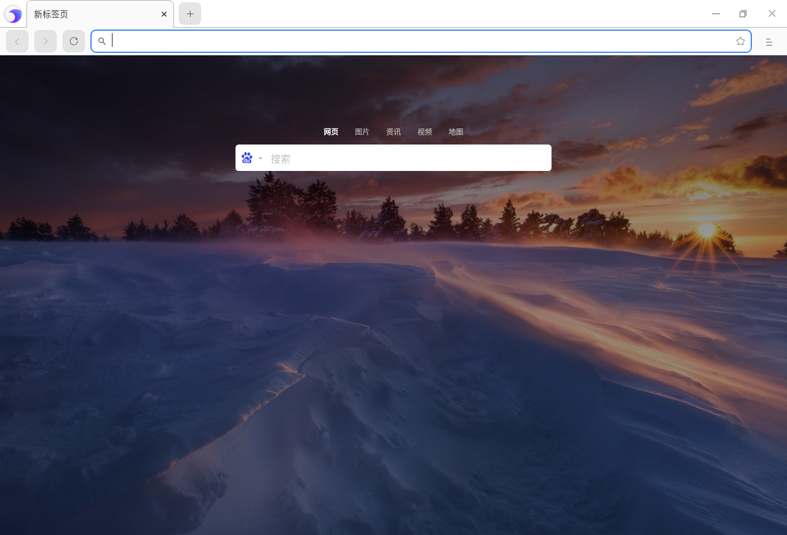

# 浏览器|../common/deepin-browser.svg|

## 概述

浏览器是一种用于检索并展示万维网信息资源的应用程序，可以用来显示万维网或局域网等的文字、图像及其他信息，方便用户快速地查找各种资源。

## 使用入门

通过以下方式运行或关闭浏览器，或者创建浏览器的快捷方式。

### 运行浏览器

1. 单击任务栏上的启动器 ，进入启动器界面。
2. 上下滚动鼠标滚轮浏览或通过搜索，找到浏览器 ，单击运行。
3. 右键单击  ，您可以：
 - 单击 **发送到桌面**，在桌面创建快捷方式。
 - 单击 **发送到任务栏**，将应用程序固定到任务栏。
 - 单击 **开机自动启动**，将应用程序添加到开机启动项，在电脑开机时自动运行该应用。

> 说明 ：浏览器默认固定在任务栏上。您也可以单击任务栏上的  打开浏览器。

### 关闭浏览器

   - 在浏览器窗口，单击 ，退出浏览器。
   - 在任务栏右键单击  ，选择 **关闭所有** 来退出浏览器。

## 使用浏览器

### 设置默认浏览器

1. 当打开浏览器时，如果弹出“浏览器不是您的默认浏览器”提示框。
2. 单击 **设为默认浏览器**。

> 窍门：在控制中心中将浏览器设置为默认的网页程序，具体操作请参阅 [默认程序设置](dman:///dde#默认程序设置)。

### 设置主页和启动页

您可以对浏览器进行自定义，使其在打开主页或启动页时显示任意网页。这两个网页并不相同，除非您将二者设置为相同的网页。 

- 启动页是启动浏览器后看到的第一个网页。
- 主页是单击“主页”图标  后进入的网页。

#### 设置主页

1. 在浏览器窗口，单击    > **设置 ** > **显示**。
2. 在右侧“显示”区域，开启显示主页按钮，“主页”按钮 便会显示在地址栏的左侧。您还可以：
   - **打开的新标签页**：每次单击主页按钮，会跳转的新的标签页。
   - **输入任意的网址**：每次单击主页按钮，会跳转到指定的网页。

#### 设置启动页

1. 在浏览器窗口，单击    > **设置 ** > **启动时**。
2. 在右侧“启动时”区域，您可以：
   - **打开新标签页**：启动浏览器后，会打开一个新的标签页。
   - **继续浏览上次打开的网页**：启动浏览器后，重新打开退出浏览器时正在浏览的网页。
    系统会保存Cookie 和网站数据，因此您当时登录的任何网站（例如 baidu）都会再次打开。如果不想自动登录到这些网页，请执行以下操作：
       1. 打开浏览器，单击    > **设置** > **隐私和安全**。
       2. 在“隐私和安全”区域，单击网站设置旁边的更多图标 >，进入内容网站设置页面。
       3. 单击"Cookie 和网站数据"旁边的更多图标 >，开启“退出浏览器时清除Cookie 和网站数据”功能。

   - **打开特定网页或一组网页**：启动浏览器后，打开任意指定的网页。您可以在下方文本框中添加新网页，后续也可以进行修改或删除。

>  说明：

- 如果您发现主页或启动页并不是您自己设置的网页，则表明您的系统上可能存在恶意软件。

- 如果您使用的是单位或学校的浏览器，网络管理员可能会为您选择启动页，那么您无法进行更改。如需获取更多帮助，请咨询您的管理员。

### 标签页管理

在浏览器窗口，不仅可以打开、查看多个标签页，还可以在它们之间进行切换。

#### 添加新标签页

开启浏览器后，您可以通过下列方法之一添加新标签页：

- 在浏览器窗口顶部，单击右侧最后一个标签页旁边的  或右键单击选择 **打开新的标签页**。
- 在浏览器窗口，单击  > **打开新的标签页**。
- 按下键盘上的组合键 **Ctrl** + **T**。
> 说明：默认情况下，新标签页上会显示浏览器的徽标、搜索栏，以及您最常访问的网站的缩略图。

#### 打开新窗口

开启浏览器后，打开新的窗口，会同时打开新标签页。您可以通过下列方法之一打开新窗口：

- 单击标签页并将其拖拽出浏览器窗口，创建一个新的窗口。

- 在浏览器窗口，单击  > **打开新的窗口**。

- 按下键盘上的组合键 **Ctrl** + **N**，打开新的窗口。

> 说明：您还可以选择打开隐私窗口，进行私密浏览，单击  > **打开新的隐私窗口**。

#### 在标签页中打开本地文件

开启浏览器后，您可以通过下列方法之一在标签页中打开本地文件。

- 从计算机桌面上或文件夹中，将相应文件拖拽到浏览器标签页中。
- 使用快捷键 **Ctrl** + **O**，弹出文件管理器，并选择想要打开的文件。

#### 在标签页中打开链接

选择需要打开的链接，按住 **Ctrl** 键的同时单击链接，即可打开链接内容。

#### 排列标签页

要更改标签页的排列顺序，请沿浏览器窗口顶部拖拽标签页。

- 要将标签页固定在左侧，请右键单击相应标签页，然后选择 **固定这个标签页**。已固定标签页的尺寸较小，并且只显示网站的图标。
- 要取消固定标签页，请右键单击相应标签页，然后选择 **取消固定这个标签页**。

#### 关闭标签页

选中对应的标签页，您可以通过下列方法之一关闭标签页。

- 单击右上角关闭标签页；
- 右键单击相应的标签页，然后选择 **关闭这个标签页**；

#### 恢复标签页或窗口

如果您无意中关闭了某个标签页或窗口，右键单击标签栏，选择 **重新打开关闭的标签页** 。

#### 强行关闭页面或应用

如果标签页、窗口或扩展程序无法正常运行，您可以在任务栏中右键单击  ，选择 **强制退出** 将其强行关闭。

### 搜索引擎

在浏览器中，您可以管理搜索引擎，还可以修改地址栏中使用的搜索引擎。

1. 开启浏览器后，您可以通过下列方法之一进入管理搜索引擎页面。

   - 将光标放在地址栏，单击右键，选择 **修改搜索引擎**。

   - 单击    > **设置，**在左侧导航栏选择 **搜索引擎**，并单击 **管理搜索引擎**。
2. 进入搜索引擎管理页面，您可以添加新的搜索引擎，或修改当前的搜索引擎。

> 说明：如果您的默认搜索引擎突然发生变化，则表明您的系统可能已遭到恶意软件的攻击。

### 搜索网络信息

您可以使用浏览器在互联网上、书签列表和浏览记录中快速找到所需信息。

1. 在浏览器顶部地址栏中，输入需要搜索的信息，并在键盘上按下 **Enter** 键。
2. 您可以选择 **网页**、**图片**、**新闻**、**视频** 或 **地图** 进行查找。

#### 查找内容

您可以在网页中查找特定字词或短语。

1. 在浏览器中打开一个网页，在键盘上按下 **Ctrl** +**F**，或单击    > **查找**。
2. 在窗口的右上角出现的搜索框中输入关键字，按 **Enter** 键进行搜索。
3. 系统会以黄色突出显示匹配内容，您可以使用滚动条上的黄色标记查看所有匹配内容在网页中的位置。

#### 搜索内容

1. 在浏览器中打开一个网页，鼠标左键选中某个字词、短语。
3. 单击右键并选择搜索选项，即可使用您的默认搜索引擎开始搜索相关网页。

### 下载管理

可以将浏览器中的文件/图片下载保存到计算机或存储设备上。

#### 下载文件

1. 启动浏览器，打开下载文件所在的网页。
2. 保存相应文件：

   - 大多数文件：单击下载链接。或者，右键单击相应文件并选择 **另存为**。
   - 图片：右键单击相应图片并选择 **图片另存为**。
3. 根据页面提示，选择下载文件的存放路径，然后单击 **保存**。
   
4. 下载完毕后，该文件会显示在浏览器底部，单击文件名即可打开这个文件。
   如果想查看该文件所在的路径，请单击文件名旁边的向上箭头，并选择 **在文件夹中显示**。同时您下载的文件也会列在“下载内容”页面中。

您还可以设置自动下载项：

1. 启动浏览器，单击    > **设置 **。
2. 在“隐私和安全”区域，单击"网站设置"旁边的更多图标 >，进入网站设置页面。
3. 在“权限”区域，单击”自动下载项“旁边的更多图标 >，可以开启自动下载询问功能。

#### 暂停或取消下载

在浏览器底部，找到要暂停或取消下载的文件，单击文件名旁单击向上箭头，选择 **暂停**/**继续** 或 **取消 **按钮。

#### 设置默认存放路径

您可以指定下载内容的默认保存位置，也可以在每次下载时选择特定的目标位置。

1. 启动浏览器，单击    > **设置**。
2. 选择 **高级** > **下载内容**，可以设置下载文件的默认存放路径。

> 窍门：如果您要在每次下载时选择具体的位置，请开启“询问保存位置”功能。

#### 查看下载记录

在浏览器中单击    > **下载内容**，可以查看过往的下载记录、查询下载文件。

- 要打开文件，请单击相应的文件名。系统会根据文件类型使用默认的应用打开该文件。
- 要从历史记录中移除某项下载内容，请单击文件右侧的“移除”图标 。系统会将该下载记录从“下载内容”页面中移除，但不会删除下载的文件。

### 历史记录管理

#### 查看历史记录

历史记录包含了浏览器使用期间内所访问的网站地址与具体时间。

启动浏览器，单击    > **历史记录**，进入历史记录页面。历史记录包含了浏览器使用期间内所访问的网站地址与具体时间。

#### 删除历史记录

在历史记录页面，您可以通过下列方法之一删除历史记录。

- 勾选需要删除的历史记录，单击页面右上角的 **删除** 按钮。
- 单击某条历史记录旁边的操作按钮，并选择 **从历史记录中移除**。

#### 清除浏览数据

1. 启动浏览器，单击    > **历史记录**，或单击    > **设置** > **隐私和安全**。
2. 单击 **清除浏览数据**，弹出清除历史记录窗口，您可以：
  - 清除某段时间的数据，如：
    - 过去一小时
    - 过去24小时
    - 过去7天
    - 近4周
    - 时间不限
  - 清除浏览记录
  - 清除下载记录
  - 删除Cookie和其他网站数据
  - 清除缓存的图片和文件
  - 清除密码和其他登录数据
  - 清除已保存的自动填充表单数据

4. 勾选需要删除的内容后，单击 **清除数据**。

### 书签管理

#### 添加书签

在浏览器中可以将常用的网页添加到书签，便于快速打开浏览。

1. 打开需要收藏的网页，您可以通过下列方法之一添加书签。

   - 单击地址栏右侧的添加书签图标 ；
   - 单击    > **书签**  > **将此页添加为书签**。
   - 单击    > **书签**  > **将所有页面添加为书签**。

2. 弹出添加书签窗口，设置书签名称或新建文件夹并将书签放入文件夹，单击 **保存**。

#### 查找书签

1. 在浏览器窗口，单击    > **书签**  > **书签管理器**。
2. 在书签管理器顶部的搜索框中，查找书签。

#### 修改书签

1. 在浏览器窗口，单击    > **书签**  > **书签管理器**。
2. 在书签管理器页面，选择一个书签，单击书签旁边的操作按钮或右键选择 **修改**，即可修改书签。

#### 删除书签

1. 在浏览器窗口，单击    > **书签**  > **书签管理器**。

2. 在书签管理器页面，选择一个书签，您可以通过下列方法之一删除书签。

   - 单击书签旁边的操作按钮，并选择 **删除** 按钮。
   - 单击右键并选择 **删除 **按钮。
   
>  说明：您还可以单击地址栏右侧的星形图标，并在弹出的窗口中单击 **删除** 按钮。

#### 排列书签

1. 在浏览器窗口，单击    > **书签**  > **书签管理器** 。
2. 在书签管理器页面，您可以向上或向下拖动书签，或将书签拖到左侧的文件夹中。您也可复制并粘贴书签，使其按照您预期的顺序排列。

#### 导入书签

1. 在浏览器窗口，单击    > **书签**  > **导入书签和设置** 。
2. 在书签导入页面，选择“以前导出的书签（HTML文件）”，单击 **选择文件**。
3. 弹出文件管理器页面，选择书签html文件即可，导入的书签会显示在书签栏。

### 在浏览器中打印

1. 在浏览器窗口，选择需要打印的内容（网页、图片或文件）。
2. 单击右键选择 **打印**，或单击    > **打印**。
3. 弹出打印预览页面，选择目标打印机、设置打印参数等。
4. 准备就绪后，单击 **打印**。

### 查看源代码

在浏览器窗口，单击右键弹出快捷菜单，选择 **查看网页源代码**。

### 开发者工具

当需要设计UI或调试网站时，可以打开开发者工具。

- 单击    > **更多** > **开发者工具**。
- 右键单击弹出快捷菜单，选择 **检查**。
- 按下键盘上的F12。

> 注意：请勿用于非法途径。

## 隐私和安全设置

### Cookie管理

通过浏览器可以对Cookie进行设置，删除现有 Cookie、允许/阻止所有 Cookie，以及对某些网站进行偏好设置。

Cookie 是访问的网站所创建的文件。Cookie 通过保存浏览信息来让您获得更轻松的在线体验。借助 Cookie，网站可使您保持登录状态、记住您的网站偏好设置，并为您提供本地的相关内容。

Cookie 分为：

- 由您访问的网站创建，相应网站会显示在地址栏中。
- 由其他网站创建。这些网站拥有您访问的网页上显示的某些内容（如广告或图片）。

#### 删除 Cookie

如果删除 Cookie，即会退出相应网站，已保存的偏好设置可能也会随之删除。

1. 在浏览器窗口，单击    > **设置 **。
2. 在“隐私和安全”区域，单击"网站设置"旁边的更多图标 >，进入网站设置页面。
3. 单击"Cookie 和网站数据"旁边的更多图标 >，进入页面后，单击 **查看所有Cookie和网站数据**。
   - 删除特定Cookie和网站数据：搜索Cookie和网站数据的名称，在该网站的网址右侧单击删除按钮。
   - 删除所有的Cookie和网站数据·：单击 **全部删除**。

您还可以删除某个时间段内的 Cookie和网站数据，详细操作请参阅 [清除浏览数据](#清除浏览数据)。

#### Cookie设置

1. 在浏览器窗口，单击    > **设置 **。
2. 在“隐私和安全”区域，单击"网站设置"旁边的更多图标 >，进入网站设置页面。
3. 单击"Cookie 和网站数据"旁边的更多图标 >，进入页面后，您可以选择以下某项设置：
   - **允许网站保存和读取Cookie数据（推荐）**：默认设置。
   - **退出浏览器时清除Cookie 和网站数据**：在退出浏览器后自动删除相应 Cookie。
   - **阻止第三方Cookie**：网站无法使用Cookie来跟踪您在网上的活动，某些网站上的功能可能无法正常运作。
4. 如果需要例外设置，可选择在**禁止**、**退出时清除**、**允许**选项下输入对应网站地址，以此设置为准。

### 密码管理

如果您在某个网站上输入新密码，浏览器会询问您是否要保存此密码。如需保存，请单击 **保存**。

####  使用已保存的密码登录

如果您在之前访问某个网站时保存了该网站的密码，再次登录时就不需要输入用户名和密码。

- **如果您为该网站保存了一组用户名和密码**：浏览器会自动填写登录表单。
- **如果您保存了多组用户名和密码**：请选择用户名字段，然后选择您要使用的登录信息。

#### 删除已保存的密码

1. 在浏览器窗口，单击    > **设置 **。
2. 在“自动填充”区域，单击"密码"旁边的更多图标 >，进入密码详情页面。
3. 可查看已保存密码的网站或删除密码。

要清除所有已保存的密码，请参阅 [清除浏览数据](#清除浏览数据)，然后勾选“密码和其他登录数据”。

#### 启用或停用保存密码的功能

默认情况下，浏览器会询问您是否要保存密码。您可以随时启用或停用此功能。

1. 在浏览器窗口，单击    > **设置 **。
2. 在“自动填充”区域，单击"密码"旁边的更多图标 >，进入密码详情页面。
3. 开启或关闭“提示保存密码”功能。

### 分享位置信息

如果允许网站知道您所在的位置，您将可以从这些网站获取更实用的信息。例如，通过分享您的位置信息，您可以更快速地找到附近的餐厅。

#### 允许网站知道您所在的位置

默认情况下，浏览器会在网站尝试获取您的位置信息时询问您。要允许相应网站知道您所在的位置，请选择 **允许**。在分享您的位置信息之前，请先查看相应网站的隐私权政策。

如果使用 baidu 作为默认搜索引擎，那么在默认情况下，它会根据您的位置信息搜索您在 baidu 中输入的内容。

#### 更改默认的位置信息

1. 在浏览器窗口，单击    > **设置 **。
2. 在“自动填充”区域，单击“地址和其他信息”旁边的更多图标 >，开启”保存并填写地址“功能。
3. 单击 **添加** 按钮，即可添加新地址。

####  浏览器如何分享您的位置信息

如果您允许浏览器将您的位置信息分享给某个网站，浏览器会向 baidu 位置信息服务发送信息，以便了解您的大致位置。随后，浏览器会将您的位置信息分享给该网站。

### 使用摄像头和麦克风

您可以在浏览器中针对某些网站使用摄像头和麦克风。

1. 打开浏览器，转到要使用麦克风和摄像头的网站。
2. 看到系统提示时，选择 **允许 **或 **屏蔽**。

- **允许的网站**：当您浏览网站时，网站就可以开始录制。
- **已屏蔽的网站**：某些网站在遭到屏蔽后将无法正常运行。例如，您将无法参加视频会议。

#### 更改网站的摄像头和麦克风权限

1. 在浏览器窗口，单击    > **设置 **。
2. 在“隐私和安全”区域，单击“网站设置”旁边的更多图标 >，进入网站设置页面。
3. 单击 **摄像头**/**麦克风** 选项，您可以：
   - 开启或关闭“使用前先询问（推荐）”功能
   - 禁止：添加禁止使用摄像头/麦克风的网址
- 允许：添加允许使用摄像头/麦克风的网址
  

#### 解决麦克风的问题

如果麦克风不能正常工作，请尝试以下步骤：

1. 检查麦克风是否处于静音
   如果您使用了耳机，请确保耳机线上的静音开关处于关闭状态。另外，请确保您在网站（如baidu）上没有处于静音状态。

2. 检查系统设置是否正常
   请确保您的麦克风是默认录音设备，而且录音电平正确无误：

3. 联系制造商
   如果您仍然遇到问题，请联系麦克风的制造商。

### 网站权限设置

您可以在网站设置页面，查看各网站的权限及存储的数据。

1. 在浏览器窗口，单击    > **设置 **。
2. 在“隐私和安全”区域，单击“网站设置”旁边的更多图标  >，进入网站设置页面。
3. 在“权限”区域，您可以对根据页面内容进行设置。

  - **Cookie和网站数据**：Cookie 通过保存浏览信息来让您获得更轻松的在线体验，详情内容请参阅 [Cookie管理](#Cookie管理)。

  - **位置信息**：默认情况下，浏览器会询问您是否允许某个网站查看您的确切位置信息，详情请参阅 [分享位置信息](#分享位置信息)。

  - **摄像头**：某些网站可能会请求使用您的摄像头和麦克风，详情请参阅 [使用摄像头和麦克风](#使用摄像头和麦克风)。

  - **麦克风**：某些网站可能会请求使用您的摄像头和麦克风，详情请参阅 [使用摄像头和麦克风](#使用摄像头和麦克风)。

  - **JavaScript**：JavaScript 有助于提高网站的交互性。

  - **自动下载项**：如果要从某个网站下载多个文件，请选择是否要自动下载这些文件。

    以上简单的介绍几种网站权限，还有图片、Flash、声音、USB设备、文件修改等网站权限可以设置。
