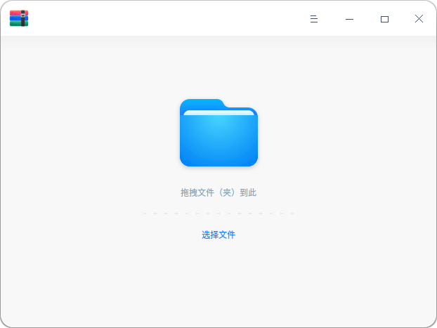
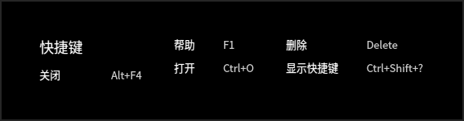
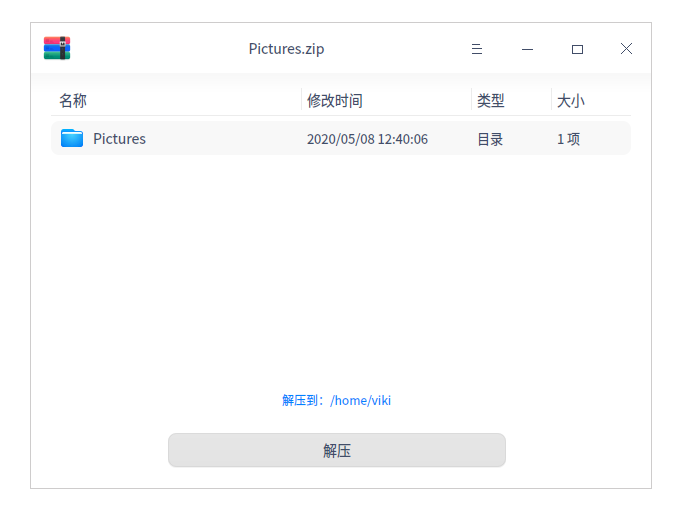

# 归档管理器|../common/deepin-compressor.svg|

## 概述

归档管理器是一款界面友好、使用方便的压缩与解压缩软件，支持7z、jar、tar、tar.bz2、tar.gz、tar.lz、tar.lzma、tar.lzo、tar.Z、zip等多种压缩包格式，还支持加密压缩等设置。

## 使用入门

通过以下方式运行或关闭归档管理器，或者创建归档管理器的快捷方式。

### 运行压缩

1. 点击桌面底部的 ，进入启动器界面。
2. 上下滚动鼠标滚轮浏览或通过搜索，找到归档管理器  点击运行。
3. 右键单击 ，您可以：
 - 点击 **发送到桌面**，在桌面创建快捷方式。
 - 点击 **发送到任务栏**，将应用程序固定到任务栏。
 - 点击 **开机自动启动**，将应用程序添加到开机启动项，在电脑开机时自动运行该应用。

> 窍门：您可以在控制中心中将归档管理器设置为默认的压缩与解压缩查看程序，具体操作请参考 [默认程序设置](dman:///dde#默认程序设置)。

### 关闭压缩

- 在归档管理器界面点击  ，退出压缩。
- 在任务栏右键单击 ，选择 **关闭所有** 来退出归档管理器。
- 在归档管理器界面点击 ，选择 **退出** 来退出归档管理器。

### 查看快捷键

在归档管理器界面上，按下键盘上的 **Ctrl + Shift + ?** 组合键来查看快捷键，熟练地使用快捷键，将大大提升您的操作效率。

## 操作介绍

### 压缩

对单个或多个文件/文件夹以及压缩包的集合都可以进行压缩。

1. 在归档管理器界面，点击 **选择文件** ，选择需要压缩的文件，点击 **打开**。

   > 窍门：也可以选择将一个或者多个文件拖拽到界面上进行压缩操作。
   
2. 如果需要继续添加压缩文件，可点击工具栏上的 或者  > **打开文件**，添加压缩文件。

   

3. 点击 **下一步**。

4. 设置文件名、存储路径、压缩包格式等。

5. 如果开启高级选项模式，可以设置文件加密、文件列表加密或分卷压缩。

   > 说明：压缩包的默认文件格式是zip，可设置文件加密的格式有7z、zip；可设置文件列表加密的格式有7z；可设置分卷压缩的格式有7z。

   

6. 点击 **压缩**。

7. 压缩成功之后，您可以

   - 点击 **查看文件**，查看压缩文件的具体存放位置。
   - 点击 **返回**，返回主界面，选择文件进行压缩。
   
   > 窍门：您还可以右键点击 **压缩**，对文件执行压缩操作。
   
   

### 解压缩

1. 在归档管理器界面，点击 **选择文件** 。
2. 选择需要解压缩的文件，点击 **打开**。
3. 点击 **解压到：xxx（路径）**，您也可以重新设置解压缩路径。

    

4. 点击 **解压**。

   > 说明：当解压文件中有加密文件时，需要输入密码解压缩。

5. 解压缩成功之后，您可以
   - 点击 **查看文件**，可以查看解压缩文件的具体存放位置。
   - 点击 **返回**，返回主界面，选择文件进行压缩。

   > 窍门：您还可以右键点击 **解压缩**，对文件执行解压缩操作。

  

### 提取文件

在归档管理器界面，选中一个待解压缩文件或该文件夹中的子文件，右键单击 **提取**或 **提取到当前文件夹**，将文件提取到相应的路径下。

> 说明：当提取的文件为加密文件时，需要输入密码才可以打开和提取文件。

## 主菜单

在主菜单中，您可以打开压缩界面、切换窗口主题、查看帮助手册，了解归档管理器的更多信息。

### 打开
1. 在归档管理器界面，点击  。
2. 选择 **打开文件**，从文件夹中添加压缩文件或解压文件。

### 设置
1. 在归档管理器界面，单击   。
2. 选择 **设置**，可进行如下操作：
   - 解压设置
     + 设置默认解压位置。
     + 勾选或取消 **自动创建文件夹**。
     + 勾选或取消 **当解压完成后自动打开对应的文件夹**。
   - 文件管理设置
     + 设置是否 **解压后删除压缩文件**，可选择“从不”、“询问确认”或“总是”。
     + 勾选或取消 **压缩后删除原来的文件**。
   - 关联文件设置
     + 勾选或取消关联文件类型。
3. 点击 **恢复默认** 按钮，将所有设置恢复到初始状态。

### 主题

窗口主题包含浅色主题、深色主题和跟随系统主题。

1. 在归档管理器界面，点击。
2. 点击 **主题**，选择一个主题颜色。

### 帮助

查看帮助手册，通过帮助进一步让您了解和使用归档管理器。

1. 在归档管理器界面，点击  。
2. 点击 **帮助**。
3. 查看关于压缩的帮助手册。

### 关于

1. 在归档管理器界面，点击  。
2. 点击 **关于**。
3. 查看关于解压缩的版本和介绍。

### 退出

1. 在归档管理器界面，点击 。
2. 点击 **退出**。

文档更新时间: 2020-11-18 版本: 5.9
