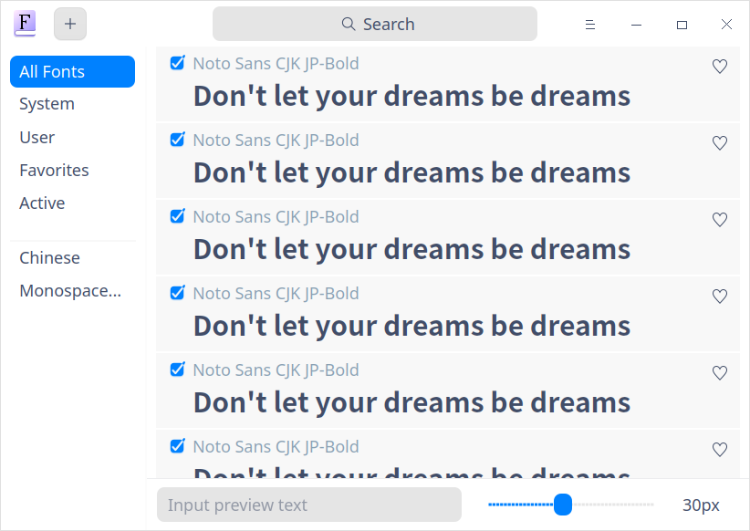
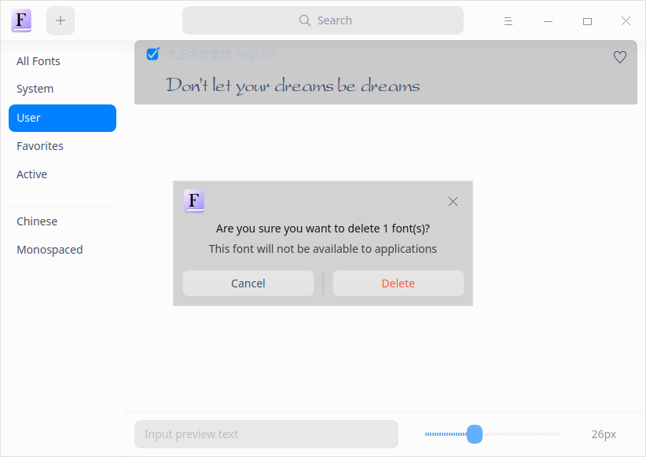

# Font Manager|../common/deepin-font-manager.svg|

## Overview

Font manager is a powerful font management tool. With Font Manager, you are not only able to search, install, enable, disable, delete fonts, etc. but also able to preview fonts by inputting texts and setting the text size.  

It supports fonts in ttf, ttc and otf format.

## Guide

You can run, exit or create a shortcut for Font Manager by the following ways.

### Run Font Manager

1.   Click  on dock to enter the Launcher interface.
2.   Locate  by by scrolling the mouse wheel or searching font manager in the Launcher interface and click it to run.
3.   Right-click  and you can:

   - Click **Send to desktop** to create a desktop shortcut
   - Click **Send to dock** to fix it on Dock.
   - Click **Add to startup** to add it to startup and it will auto run when the system boots.

### Exit Font Manager

- Click   on the Font Manager interface to exit Font Manager.
-  Right-click  on dock and select **Close All** to exit.
- Click  on the Font Manager interface and select  **Exit** to exit.

## Operation

### Interface Description

| Name       | Description                                                  |
| ---------- | ------------------------------------------------------------ |
| All fonts  | Collection of system fonts and user fonts, with all fonts displayed by default. |
| System     | Font lists that come with the system. The font in this font set cannot be deleted. |
| User       | Font lists installed by the user.                            |
| Favorites  | The user's favorite font lists, i.e. the collection of the fonts selected in other font sets. |
| Active     | All font collections under the startup status                |
| Chinese    | Chinese characters in all font sets, displayed with the Chinese name |
| Monospaced | All fonts with same character width                          |

### Install Fonts

With Font Manager, you can not only install a single font but also install multiple fonts in a batch.

#### Single Font Installation

1.  On the Font Manager interface, click  or select   > **Add font**.
2. Select the file, select the font to be installed and click **Open** or double-click the font file to open Font Manager for installation.
3.  Please enter the authorization password in the pop-up authorization window (if any).
4.  Right-click the font file after being installed successfully and select **Display in file manager** to view the specific installation location.

> Tips: You can also right-click the font file, select **Open with** > **Font Manager** to enter the Font Manager interface and install the font.

> Notes: Font Manager will detect your fonts automatically. If the font has been installed locally, a prompt message will pop up to show that font of the same version has been installed. You can select **Exit** or **Continue** to exit or continue the installation.

#### Batch Installation

You can add multiple fonts in a batch at one time by dragging or selecting files in Font Manager. Please refer to [Single Font Installation](#Single Font Installation) for the installation steps. Please pay attention to the following points during batch installation:

- Addition is available after successful batch installation.
- Reinstallation is performed for fonts existing locally during batch installation.

> Notes: If you want to use the installed font as system font, open **Control Center**, click **Font** in **Personalization**, and set the font as **Standard Font**.

### Search Fonts

1.   In the search box on top of the Font Manager interface, you can clickto enter keywords.

2.   Press the Enter key on the keyboard to conduct searching.
   - When there is matched information, the search result lists will be displayed on the interface. 
   - When there is no matched information, "No search results" will be displayed on the interface.
3.   When there are matched fonts, you can view the preview effect of the contents meeting the search criteria by entering texts in the bottom text preview box and dragging the control bar horizontally to adjust the font size.
4.   Clickor delete the entered information in the search box to clear the currently-entered search criteria or cancel the search.

### Export Fonts

1. On the Font Manager interface, right-click the font and select **Export**.
2. A prompt message "The font exported to your desktop" pops up and disappears several seconds later.

The exported fonts is stored in the desk folder by default, with Font as its default folder name.

> Notes: Single font and batch export is supported.  Only the latest version of the same font is exported and there is no copy. The system font cannot be exported.

### View the Basic Font Information

You can view the basic font information via Font Manager.

1. Right-click to select **Details** in the font sets list on the Font Manager interface.

   You can view the font icon, name, style, type, version and description information.
   

### View Font Installation Location

When the font is installed successfully, you can view its installation location via File Manager.

1.  Right-click to select **Display in file manager** in the font sets list on the Font Manager interface to view the specific installation location.

### Preview Fonts

Each text block of the font in font sets presents its font style and you can view the display effect by previewing fonts.

The default preview copy is "Don't let your dreams be dreams", displayed in English.

1.   Enter texts in the bottom font preview input box on the Font Manager interface.

2.   Set the font size by dragging the control bar horizontally.

   View the display effect in the font set list.

   > Notes: Slide the control bar to the left to reduce the font size and slide it to the right to enlarge the font size. The font size ranges from 6px to 60px.

### Favorite/Unfavorite Fonts

You can favorite or unfavorite a font via Font Manager.
1.   Click **All Fonts** on the Font Manager interface.

2.   Click theicon to the right of a row in the list.

3.  View the font in **My Favorite** Lists, with its status being "Favorited".

4.   Click the icon in **All Fonts** lists.

   The unfavorited fonts will not be displayed in the **Favorites** list and the status displayed in other font set lists is "Unfavorited" .

5.   In All Fonts lists,  you can also right-click **Favorite** or **Unfavorite**.

> Notes: It supports favoriting not only a single font but also batch fonts.

### Enable /Disable Fonts

You can enable or disable a font via Font Manager.

1.   Select the font with its status being "Disabled" in **All Fonts** lists on the Font Manager interface.

2.   Check the font. The font will be enabled and displayed in the **Active** list. 

3.   Click the checked font in the **Active** list to disable the font.

   The disabled font will not be displayed in the **Active** list and is grayed out  in the other font set list with the status being "Disabled" .

4.   You can also right-click **Enable** or **Disable** in All Fonts lists to finish the corresponding operation. 

> Notes: It supports enabling/disabling not only a single font but also batch fonts. 

### Delete Fonts

You can delete a font through Font Manager.

> Notes: It supports deleting not only a single font but also batch fonts. System fonts cannot be deleted.

1. Select a font in **User** on the Font Manager interface and right-click **Delete**.
2.  Click **Confirm** in the pop-up prompt dialogue box.
3.  Please enter the authorization password in the pop-up authorization dialogue (if any) to finish deleting the font.

## Main Menu

On the main menu, you can switch window themes, view help manual and get more information about Font Manager.

### Theme

The window theme includes Light Theme, Dark Theme and System Theme (default).

1.   On the Font Manager interface, click.
2.   Click **Theme** to select a theme.

### Help

View Help to get more information about Font Manager.

1.   On the Font Manager interface, click.
2.   Click **Help**.
3.   View the manual.

### About

1.   On the Font Manager interface, click.
2.   Click **About**.
3.   View the version description.

### Exit

1.   On the Font Manager interface, click.
2.   Click **Exit** to exit.

