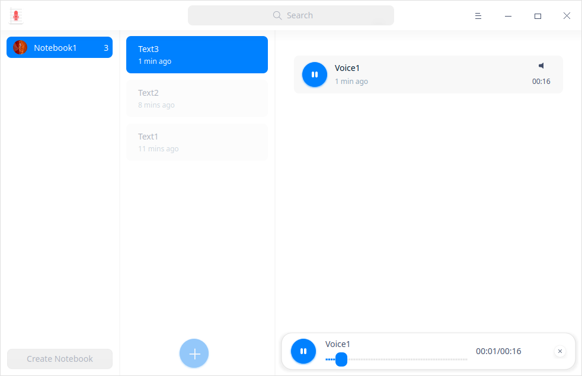
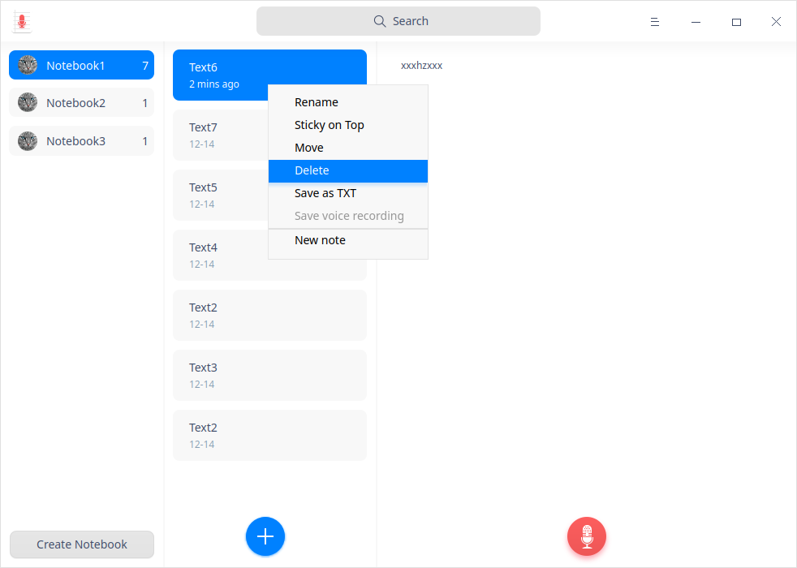
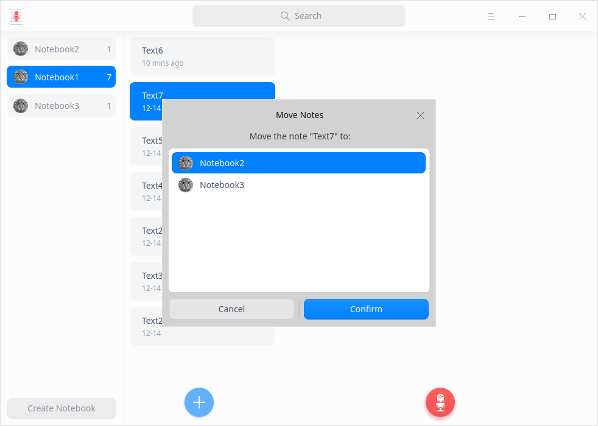
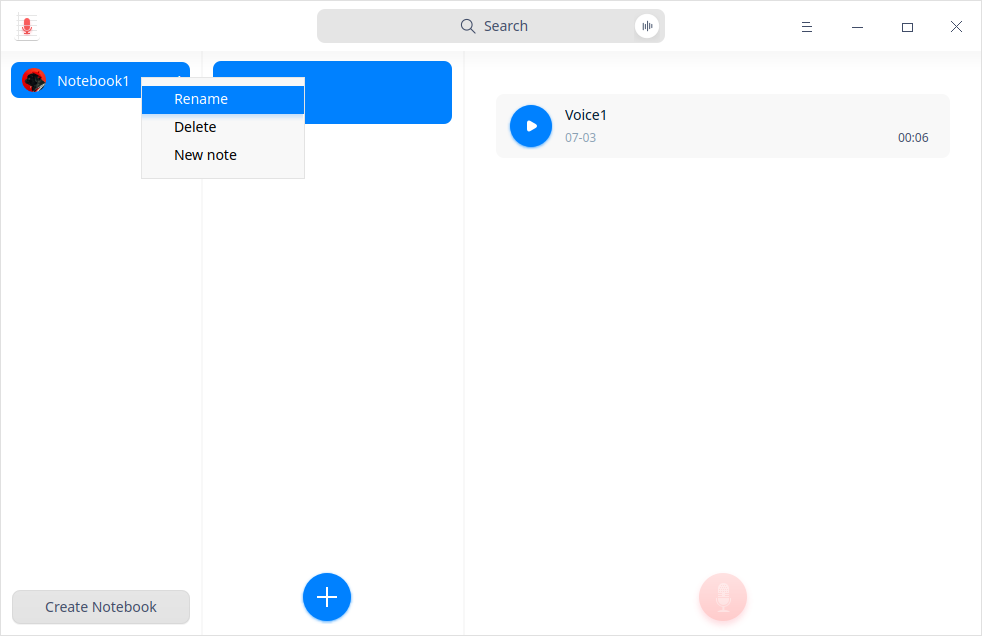
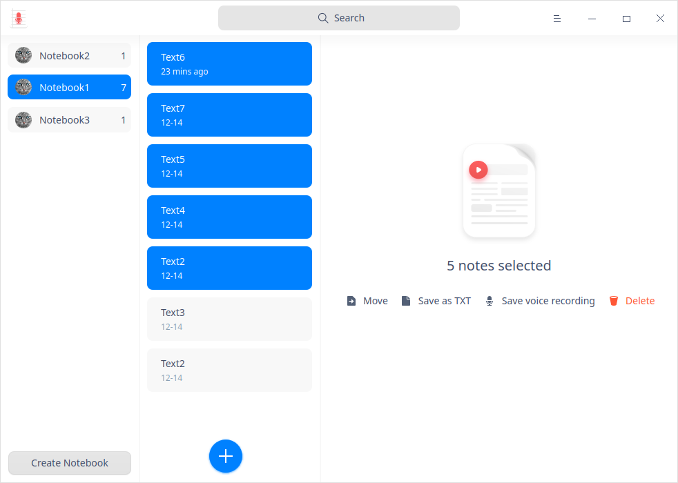

# Voice Notes|../common/deepin-voice-note.svg|

## Overview

Voice Notes is a simple memo software with texts and voice recordings. 

## Guide

You can run, exit or create a shortcut for Voice Notes by the following ways.

### Run Voice Notes

1.  Click  in the dock to enter the Launcher interface.
2.  Locate  by scrolling the mouse wheel or searching "voice notes" in the Launcher interface and click it to run.
3.  Right-click  and you can:

   - Click **Send to desktop** to create a desktop shortcut.
   - Click **Send to dock** to fix it in the Dock.
   - Click **Add to startup** to add the application to startup and it will automatically run when the system starts up.

> Notes: If Voice Notes has been fixed in the dock by default, you can click  in the dock to run it.

### Exit Voice Notes

- Click  on the Voice Notes interface to exit Voice Notes.
- Right-click  in the dock and select **Close All** to exit.
- Click  on the Voice Notes interface and select **Exit** to exit.

### View Shortcuts

On the Voice Notes interface, press **Ctrl** + **Shift** + **?** on the keyboard to view shortcuts. Proficiency in shortcuts will greatly improve your efficiency.

 

## Operations

### Create Notebook

- Click **Create Notebook** to create a new notebook when there is none in Voice Notes.

&nbsp;&nbsp;&nbsp;&nbsp;&nbsp;&nbsp;&nbsp;&nbsp;&nbsp;&nbsp;&nbsp;&nbsp;&nbsp;

- When a notebook is created in Voice Note, a text is also created by default. Click the  icon on the Voice Notes interface to create more new texts.

  You can start recording voices or making texts after creating a text.
  
   In the notebook list, you can drag a notebook to set the display sequence and view the number of texts contained in each notebook.
  

### Record/Playback Voice Notes

You can record audios simply in two steps:

1. Click the icon on the Voice Notes interface to start recording.
2.  Click the  icon to finish recording.

> Tips: Click the  icon to pause recording during the recording process and click  again to resume recording.

> Notes: The maximum recording time is 60 minutes. 

3. Click the  icon to listen to the playback after recording is finished.

### Search Voice Notes

1. In the search box located in the top center area of the Voice Notes interface, you can:

   - Click  to enter keywords.

2. Press the **Enter** key on the keyboard to fast locate.

   - When there is matched information, the search result list will be displayed on the right.

   - When there is no matched information, **No search results** will be displayed on the right.

3. Click  in the search box  to clear the current keywords or cancel the search. 

### Save Voice Recording

1.   Select a voice file on the Voice Notes interface.
2.   Right-click and select **Save voice recording**.
3.   Save it to the storage device.

>Tips: You can also right-click the voice file and select **Save as MP3** to save it.

### Add Text Notes
1. Select a notebook, right-click and select **New note** or click the icon on the Voice Notes interface to add a new text note.
2.  Move the cursor to the right column and click to input the text needed. 

> Tips: 
>
> - You can record audios in notebooks. Please refer to [Record/Playback Voice Notes](#Record/Playback Voice Notes) for details.
> - Select a text note in the notebook list and right-click to select **Sticky on Top** to place the text note on top.

### Save as TXT

1.  Select a text note on the Voice Notes interface.
2.  Right-click and select **Save as TXT**.
3.  Save the text note to the storage device in TXT format.
    

### Move Text Notes

1. Select a text note on the Voice Notes interface.
2. Right-click to select **Move** and select a notebook in the pop-up prompt box.
3. Click **Confirm** and move the text note to the selected notebook.

### Rename Notebooks

The notebook created will be automatically saved as **Note(n)**. You can rename it in the following steps. 

1. On the Voice Notes interface, right-click a notebook.

2. Select **Rename**.

3. Enter the file name.

4. Click in the blank area on the interface or press the **Enter** key on the keyboard to rename it.

   > Tips: You can also rename each text note under a notebook. 

### Delete Voice Notes

1.  Select a voice file on the Voice Notes interface.
2.  Right-click and select **Delete**.

3.  Click **Confirm** in the pop-up prompt box.

### Delete Text Notes

1.   Select a text note on the Voice Notes interface.
2.  Right-click and select **Delete**.

3.  Click **Confirm** in the pop-up prompt box.

### Delete Notebooks

1. Select a notebook on the Voice Notes interface.
2. Right-click and select **Delete**.
3. Click **Confirm** in the pop-up prompt box.

### Batch Operation

You can select multiple text notes at one time assisted by the keyboard to perform batch operations.

1. Press **Ctrl/Shift** to select multiple text notes in the text notes list.
2. Right-click to select or click **Move**/ **Save as Text**/ **Save voice recording**/**Delete** to perform batch operations.

## Main Menu

On the main menu, you can set audio source, check privacy policy, switch window themes, view help manual, and get more information about Voice Notes.

### Settings

You can set up audio source from **Internal** and **Microphone** options.

1. On the Voice Notes interface, click .
2. Set up the audio source:
   - Select **Internal** source and only system built-in sound will be recorded. 
   - Select **Microphone** source and only microphone sound will be recorded. 

### Theme

The window theme provides three theme types, namely Light Theme, Dark Theme and System Theme.

1. On the Voice Notes interface, click .
2. Click **Theme** to select one theme.

### Help

View Help to get more information about Voice Notes.

1.  On the Voice Notes interface, click .
2.  Click **Help** to view the manual of Voice Notes.

### About

1.  On the Voice Notes interface, click . 
2.  Click **About** to view the version and introduction of Voice Notes.

### Exit

1. On the Voice Notes interface, click .
2.  Click **Exit** to exit Voice Notes.
