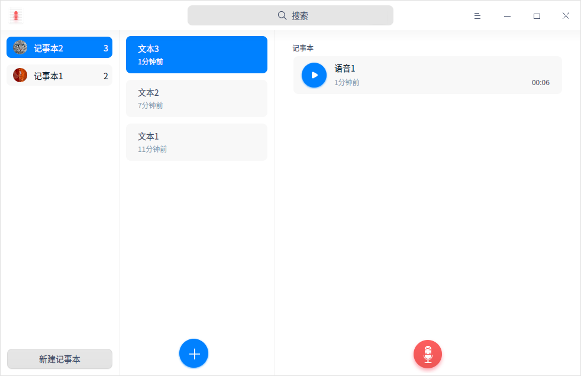
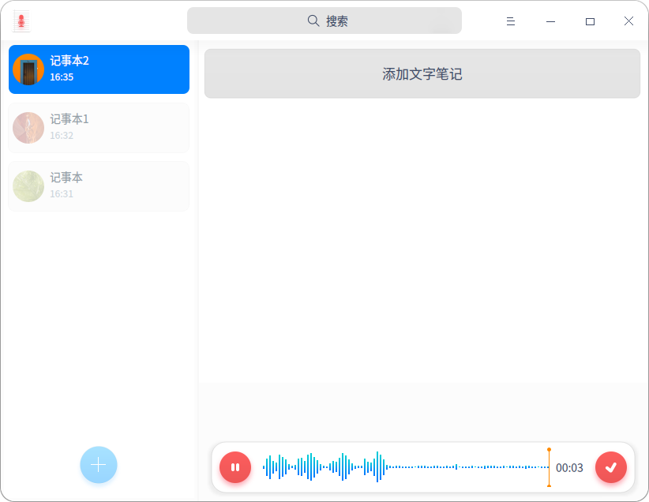
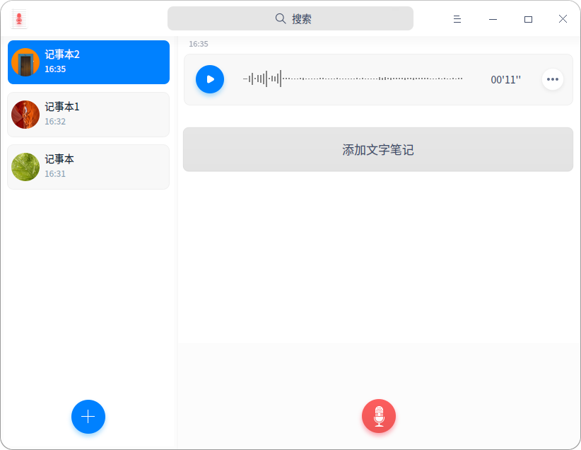
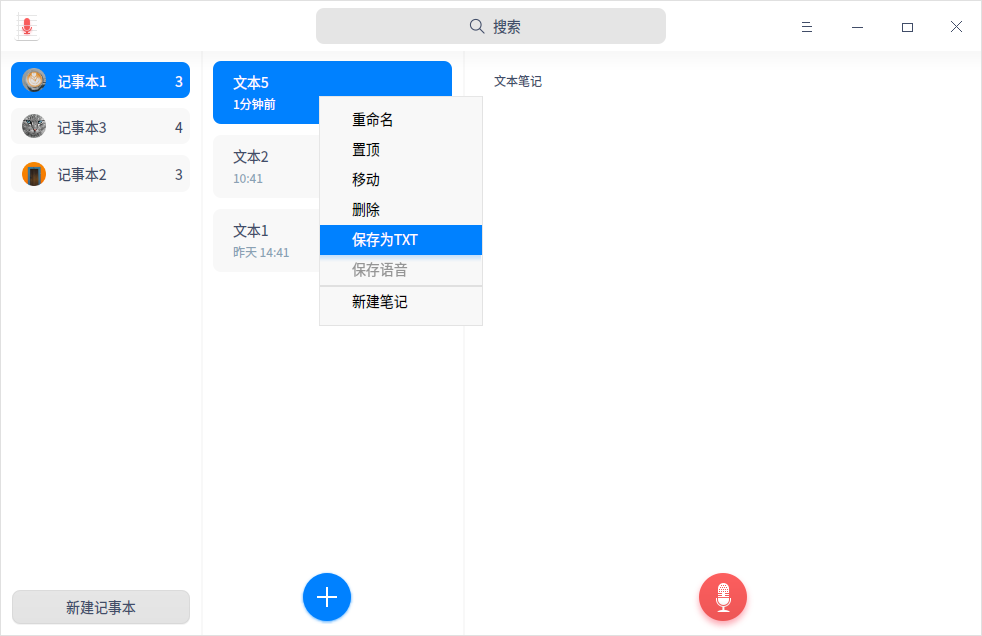
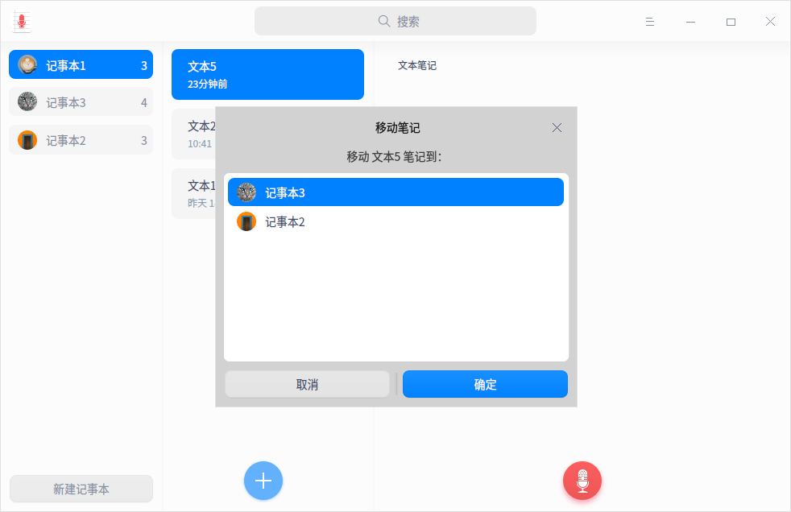
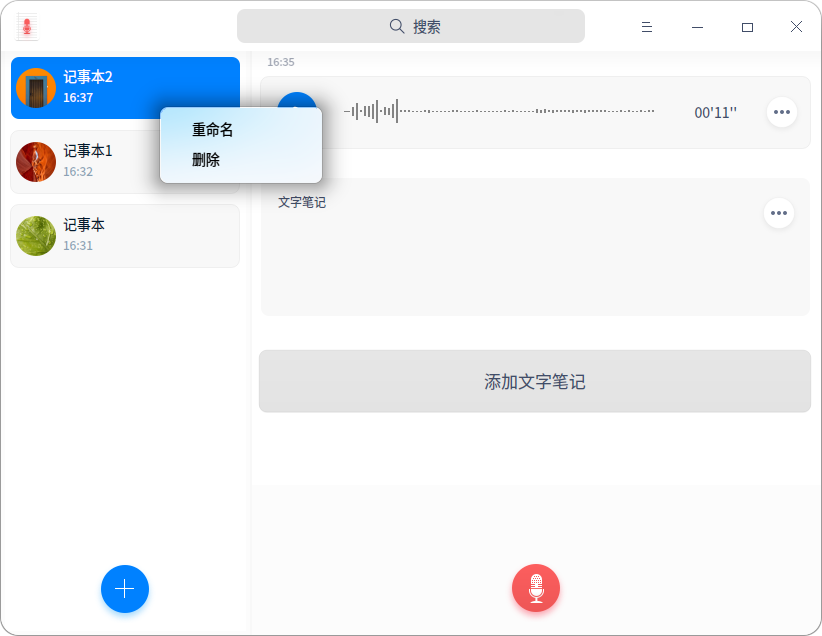
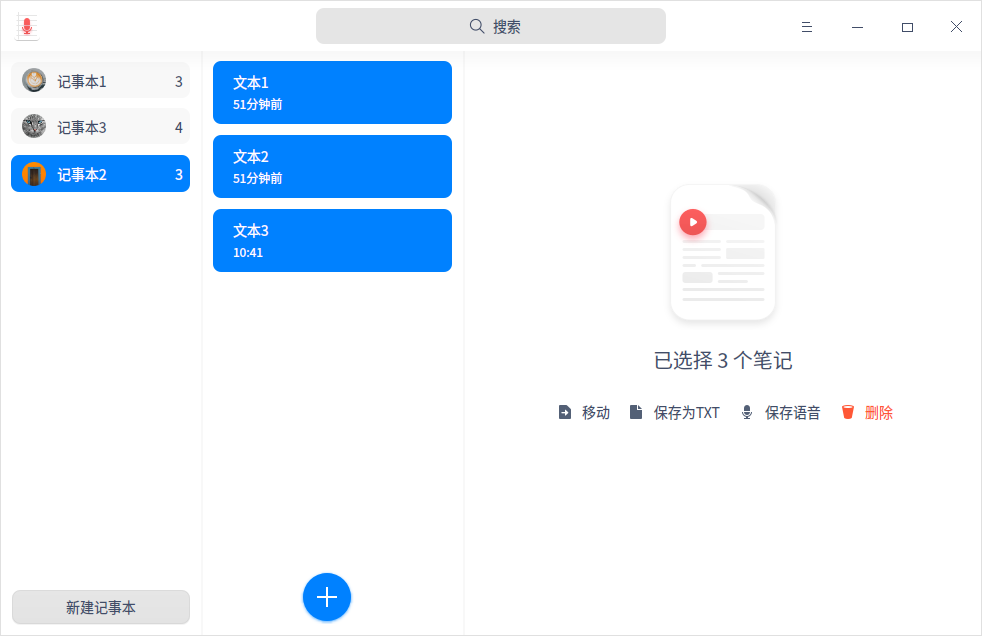

# 语音记事本|../common/deepin-voice-note.svg|

## 概述

语音记事本是一款设计简洁、美观易用的集文本、录音来记事的软件。

## 使用入门

通过以下方式运行、关闭语音记事本，同时还可以创建快捷方式。

### 运行语音记事本

1. 单击桌面底部的 ，进入启动器界面。
2. 上下滚动鼠标滚轮浏览或通过搜索，找到语音记事本  单击运行。
3. 右键单击 ，您可以：

   - 单击 **发送到桌面**，在桌面创建快捷方式。
   - 单击 **发送到任务栏**，将应用程序固定到任务栏。
   - 单击 **开机自动启动**，将应用程序添加到开机启动项，在电脑开机时自动运行该应用。

> 说明：如果语音记事本已经默认固定在任务栏上，您也可以点击任务栏上的  来运行。

### 关闭语音记事本

- 在语音记事本界面单击 ，退出语音记事本。
- 在任务栏右键单击 ，选择 **关闭所有** 来退出语音记事本。
- 在语音记事本界面单击 ，选择 **退出** 来退出语音记事本。

### 查看快捷键

在语音记事本界面上，按下键盘上的 **Ctrl + Shift + ?** 组合键来查看快捷键，熟练的使用快捷键，将大大提升您的操作效率。

## 操作介绍

### 新建记事本

- 当语音记事本中尚无记事本时，单击 **新建记事本**，创建一个新的记事本。
- 当第一次新建记事本后，系统默认帮您创建一个文本，此时在文本列表内点击  按钮继续创建新文本。

  您可在记事本列表中查看每个记事本所包含的笔记数量 ，并可拖拽记事本来调整顺序。

### 录制/回放音频

1. 在语音记事本界面上单击 ，开始录音。
   
   - 录音过程中您可以单击  按钮暂停录音，再次单击  按钮继续录音。
2. 单击  按钮完成录音。
   
   > 说明：录音的限制时长为60分钟。
3. 录制完成后，单击播放按钮可以回放音频。

### 搜索

1. 在语音记事本顶部搜索框中，您可以：
   - 单击 ，输入关键字。
2. 按下键盘上的 **Enter** 键后快速定位。
   - 当搜索到匹配的信息时，在界面显示搜索结果列表。
   - 当没有搜索到匹配的信息时，在界面显示 “无搜索结果”。
3. 在搜索文本框中单击  清除当前输入的关键字或取消搜索。

### 保存语音

1. 在文本列表中，选择一个有录音文件的笔记。
2. 单击鼠标右键，选择 **保存语音**。
3. 将录音文件保存至储存设备中。
> 窍门：您也可以右键单击录音文件，选择 **保存为MP3** 将录音文件保存。

### 添加文字笔记

1. 选择一个记事本下的文本笔记。
2. 将光标移入右侧详情页内，单击鼠标左键后输入文字笔记。

> 窍门：在文本笔记列表中选择一条文本笔记，右键单击选择 **置顶** 将该笔记移到最前列。

### 保存为TXT文件

1. 在语音记事本界面上，选择一个文字笔记。
2. 单击鼠标右键选择 **保存为TXT**。
3. 将文字笔记保存至储存设备中。

### 移动文本笔记

1. 在语音记事本界面上，选择一个文本笔记。
2. 单击鼠标右键选择 **移动**，在弹出的对话框内选择一个记事本。
3. 单击 **确定**，将该文本笔记移到所选的记事本内。

### 重命名记事本

记事文件完成后，将自动保存为“记事本（n）”，您可以重命名记事本。

1. 在语音记事本界面上，右键单击一个记事本。
2. 选择 **重命名**。
3. 输入记事本名称。
4. 鼠标单击界面空白处或者按下键盘上的 **Enter** 键完成重命名。

> 窍门: 您也可以对记事本下的各个文本笔记进行重命名。

### 删除录音

1. 在语音记事本界面上，选择一个录音文件。
2. 单击鼠标右键选择 **删除**。
3. 在弹出的对话框中，单击 **确定**。

### 删除文字笔记

1. 在语音记事本界面上，选择一个文字笔记。
2. 单击鼠标右键选择 **删除**。
3. 在弹出的对话框中，单击 **确定**。

### 删除记事本

1. 在语音记事本界面上，选择一个记事本。
2. 单击鼠标右键选择 **删除**。
3. 在弹出的对话框中，单击 **确定**。

### 批量操作

您可以通过键盘辅助同时选中多个文本笔记进行批量操作。

1. 在文本笔记列表中，按住 **Ctrl/Shift** 键同时点选多个文本笔记。
2. 单击右侧详情页内的 **移动/保存为TXT/保存语音/删除** 按钮进行批量操作。

## 主菜单

在主菜单中，您可以设置声音来源、查看隐私政策、切换窗口主题、查看帮助手册、了解语音记事本的更多信息。

### 设置

您可对声音来源进行设置，包含系统声音和麦克风声音。

1. 在语音记事本界面，单击 。
2. 设置声音来源：
   - 选择 **系统声音**，录音时只录制系统内置声音。
   - 选择 **麦克风声音**，录音时只录制麦克风声音。

### 主题

窗口主题包含浅色主题、深色主题和跟随系统主题。

1. 在语音记事本界面，单击 。
2. 选择 **主题**，选择一个主题颜色。

### 帮助

查看帮助手册，通过帮助进一步让您了解和使用语音记事本。

1. 在语音记事本界面，单击 。
2. 选择 **帮助**。
3. 查看关于语音记事本的帮助手册。

### 关于

1. 在语音记事本界面，单击 。
2. 选择 **关于**。
3. 查看关于语音记事本的版本和介绍。

### 退出

1. 在语音记事本界面，单击  。
2. 选择 **退出**。

