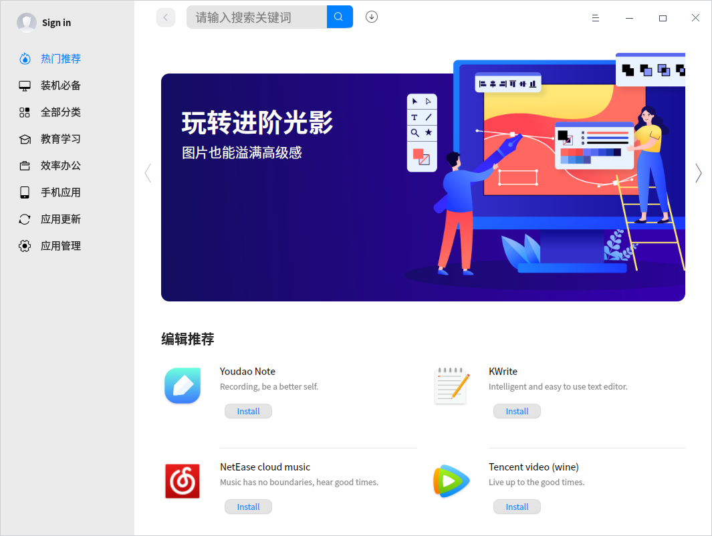
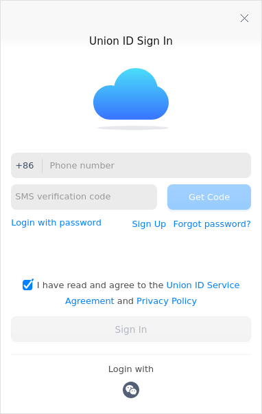
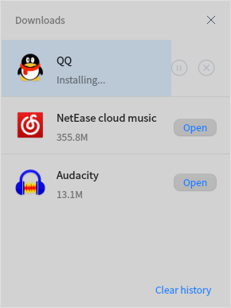
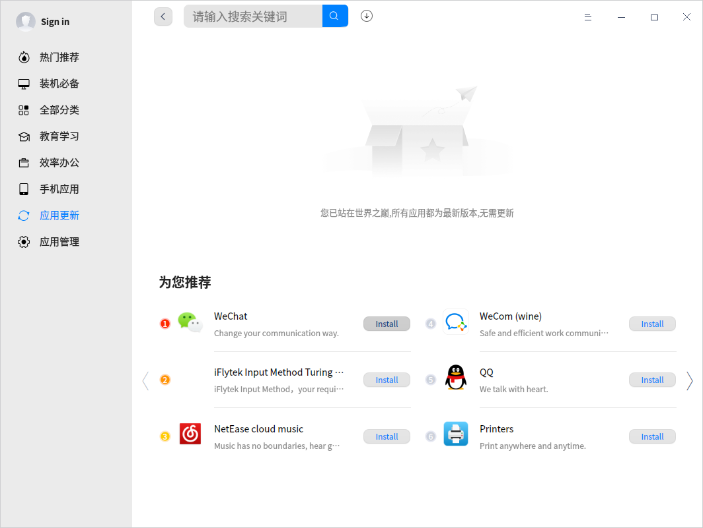
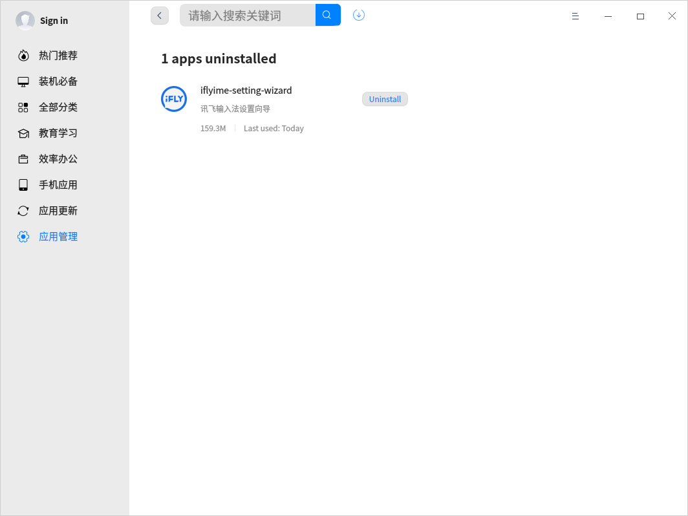
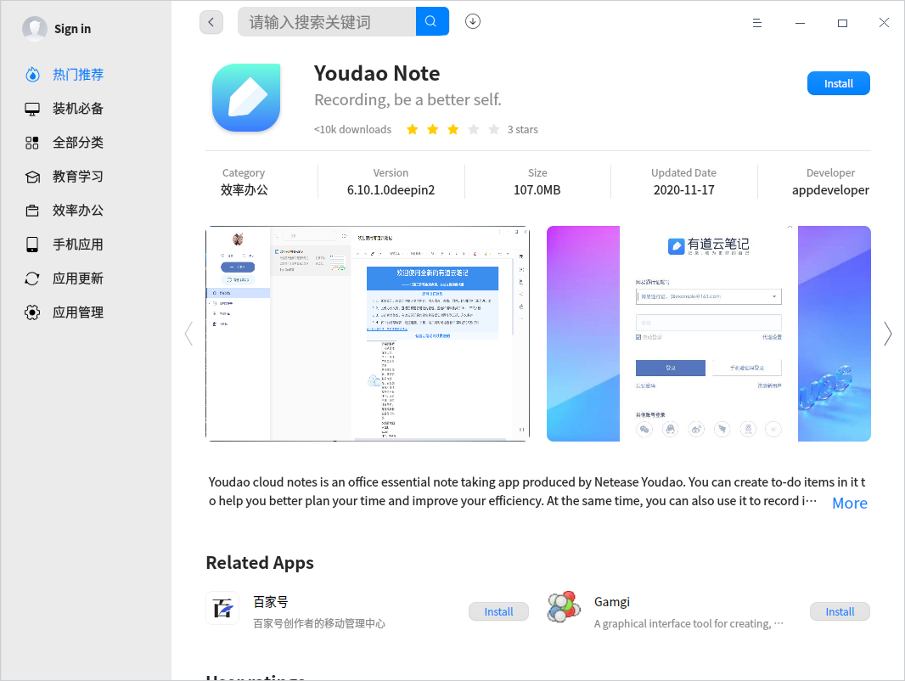
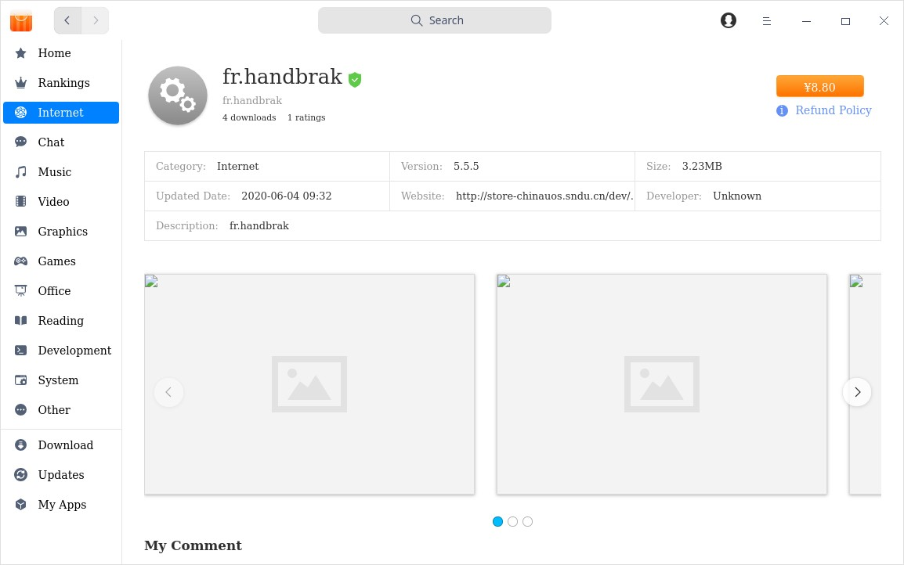

# App Store|../common/deepin-appstore.svg|

## Overview
App Store is a piece of application that integrates functions such as application display, downloading, installation, uninstallation, commenting, rating, and recommendation. App Store collects different types of applications for you, each one has been installed and verified manually. You can search the popular applications with one-click download and automatic installation.           

## Guide

You can run, close or create a shortcut of App Store as follows.

### Run App Store

1. Click    in the lower left corner of the dock to enter launcher interface.
2. Locate  by scrolling the mouse wheel or searching "App Store" in the Launcher interface and click it to run. 
3. Right-click    to:
 - Select **Send to desktop** to create a shortcut on the desktop.
 - Select **Send to dock** to fix it onto the dock.
 - Select **Add to startup** to add it to startup. When the computer starts up, App Store runs automatically.

>  Notes: App Store has been fixed on the dock by default. Click   on the dock to run it.

### Exit App Store

- On App Store interface, click  to exit.
- Right-click   on Dock and select  **Close All** to exit.
- On App Store interface, click   and select  **Exit**.

## Main Interface
Main interface consists of left panel, application management, search box, login entrance and main menu.

<table class="block1">
    <caption>Main Interface</caption>
    <tbody>
        <tr>
            <td width="20px">1</td>
            <td width="100px">Left panel</td>
            <td>It mainly displays the home page, rankings and application categories.</td>
        </tr>
        <tr>
            <td>2</td>
            <td>App management</td>
            <td>Consisting of "Download", "Updates" and "My Apps".
                 Download: current downloads, downloading and installing progress are displayed here; you can also pause and delete downloads.
                 Updates: view all applications to be updated and choose to update or not here.
                 My Apps: view all applications installed and uninstall those you don't need anymore here.<td>
        </tr>
         <tr>
            <td>3</td>
             <td>Search box</td>
            <td>You can quickly search applications in App Store by search box.</td>
        </tr>
        <tr>
            <td>4</td>
            <td>Login entrance</td>
            <td>Log in/out App Store and view comments here.</td>
        </tr>
         <tr>
            <td>5</td>
            <td>Main menu</td>
            <td>Clear cache, switch themes, view contents of Help and About, and exit App Store.</td>
        </tr>
        <tr>
   </tbody>
   </table>
## Sign In

There are three ways to sign in Union ID, including login by password, quick login, and login by WeChat.

**Login by password**

1. When you click the avatar icon in the top right corner of App Store, the interface **Union ID Sign In** pops up automatically.
2. Input your ID and password. Click **Sign In**.

**Quick login**

1. Click **Quick login** in the interface **Union ID Sign In** to enter the quick login interface.
2. Input your phone number and click **Get Code**. Input the code into the "SMS verification code" box and click **Sign In**. 

**Login by WeChat**

1. Click WeChat icon in the interface **Union ID Sign In** to enter a window with a QR code inside.
2. Scan it with WeChat on your phone to sign in.

>  Notes: If you don't have a Union ID yet, click hyper link **Sign Up**.

## Search Applications
1. Search function is built in App Store, you can click to input keywords;

2. When you input a keyword, all applications containing that keyword will be displayed automatically below, then you can view all applications containing that keyword.

## Application Management

You can search, download and install different categories of applications, and also, you can explore more splendid applications through slide show, new updates, essential applications, popular applications, recommendations, hot topics, rankings, user comments and other ways. 

### Download/Install Applications

App Store offers one-click downloading and installation of applications. During the downloading and installing process, you can pause and delete, as well as view the current progress.

App Store supports application synchronization. After signing in, you can synchronize the applications installed on other devices with the same account, and install the Cloud apps at one click.

1.  On App Store interface, hover the cursor over the cover or name of an application directly, click . 
2.  During installation, you can view the downloading and installing progress in **Download**, and also pause and delete downloads.

>Notes: If you haven't signed in, installed applications will be displayed in local applications only.

#### Local Applications

1. On App Store interface, click **My Apps** to enter **Local Apps** by default.
2. On **Local Apps** interface, you can view all installed applications. Click **App filter** to screen applications based on categories.

#### Remote applications

1. Sign in your Union ID, select  **My Apps**, click **Remote Apps** to view all cloud applications installed by the account.
2. Select the remote applications you want to install and click  .
3. After installation, the applications will be displayed both in **Local Apps** and **Remote Apps** synchronically.
4. If you want to install applications in batches, you can choose  **Install All **. Check all remote applications you want to install, click  **Start Installation**.

### Update Applications

Select **Updates** on the main interface to view applications to be updated here and you can choose whether to update them or not. You can also view the recently updated applications and their information.

> Tips: You can also update/upgrade pre-installed applications in Control Center. Refer to [Update Settings](dman:///dde#Update Settings) for particular operations.

### Uninstall Applications

On **My Apps** interface, click **Local Apps** to find the applications you want to uninstall, and click .

Besides uninstalling applications from App Store, you can also make it done from Launcher. Refer to [Uninstall Applications](dman:///dde#Uninstall Applications) for specific operations.

## Application Page

### Application Details
You can open the information page of any application to view relevant information such as its ratings, download times, category, version, package size, updated date and comments.

### Buy

1. Open App Store, sign in your Union ID.
2. Select an application you want, hover the cursor over its cover or name. If you see a price, it means you have to buy it. Click the price and then click **Buy**. 

3. The paying interface pops up. You can select a payment method. Currently Alipay and Wechat Pay are supported.
4. Click **Pay Now**. After the payment is successful, the application can be installed with one click.

>Notes: Only some applications need to be paid to install.

### Refund

1. Open App Store, sign in your Union ID.

>Notes: You can request a refund within two hours after payment. Please refer to Refund Policy for details.

2. In **My Apps** interface, click **Remote Apps**. Find the application you want to refund, click **Refund**.
3. **Refund Request** interface pops up. You have to check one from "Detailed Reasons" and also enter your "Suggestions" to make submission successful. 
4. Click **Submit**. The refund money you request for will be returned to your paying account in 2-3 working days. 

### Comment and Rate

- After sign in your Union ID, you can comment on and rate the applications. Click **Report a bug** to feedback software bugs. You can also like other users' comments. 

- Click the avatar on the title bar and select  **My Comments**  to view and edit all your ratings and comments. If you have not signed in, you can only view comments and ratings.

## Main Menu

### Clear cache
1. Click  on the main interface.
2. Click **Clear cache** to clear up package caches.

### Theme

The window theme includes Light Theme, Dark Theme and System Theme.

1. Click  on the main interface.
2. Click **Theme** to choose one theme.

### Help

Click Help to get the manual, which will help you further know and use App Store.

1. Click  on the main interface.
2. Click **Help** to view the manual of App Store.

### About
1. Click  on the main interface.
2. Click **About** to view version information about App Store and **UnionTech Software Privacy Policy**.

### Exit
1. Click  on the main interface.
2. Click **Exit**.

Update Date: 2021-06-08 Version: 6.2
