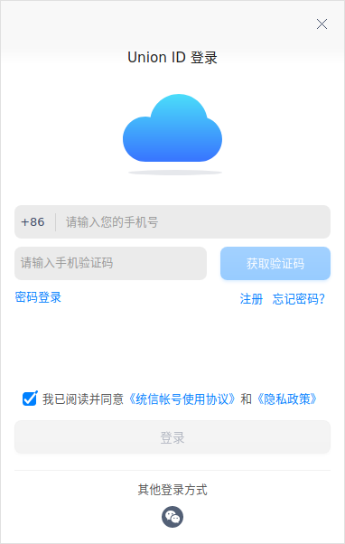
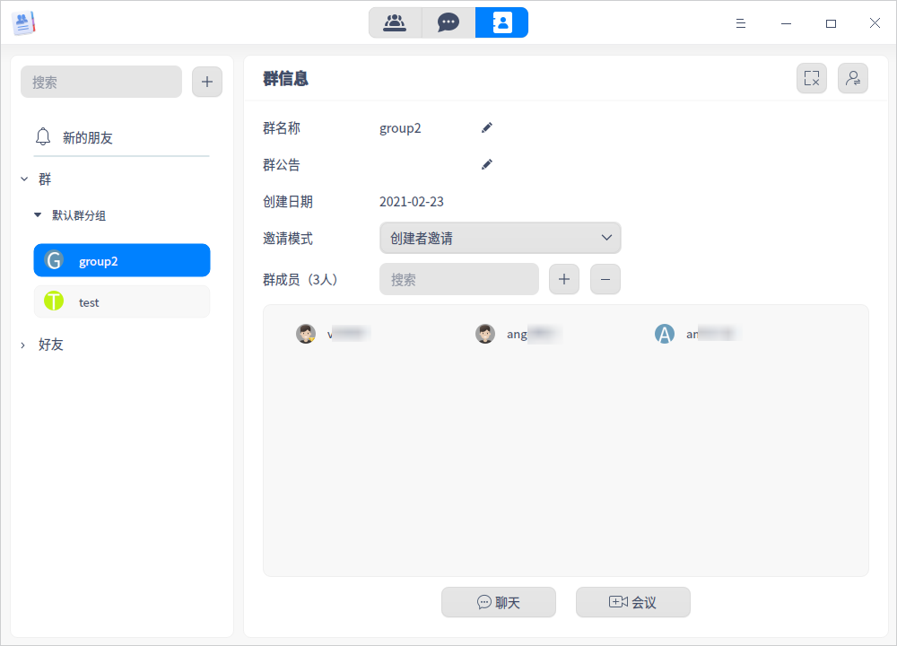

# 联系人|../common/deepin-contacts.svg|

## 概述

联系人是基于网络帐号的联系人通讯管理软件，支持多人视频会议、屏幕共享等功能，可以极大的方便用户讨论沟通，提高效率。

## 使用入门

您可以通过以下方式运行或关闭联系人应用，或者创建快捷方式。

### 运行联系人

1. 单击任务栏上的启动器图标 ， 进入启动器界面。
2. 上下滚动鼠标滚轮浏览或通过搜索，找到联系人图标 ， 单击运行。
3. 右键单击 ，您可以：
   - 单击 **发送到桌面**，在桌面创建快捷方式。
   - 单击 **发送到任务栏**，将应用程序固定到任务栏。
   - 单击 **开机自动启动**，将应用程序添加到开机启动项，在电脑开机时自动运行该应用程序。

### 关闭联系人

- 在联系人界面单击 ，选择 **退出**，退出联系人应用。
- 右键单击系统托盘中的联系人图标，选择 **退出程序**，退出联系人应用。

## Union ID登录
Union ID有三种登录方式：帐号密码登录、手机快捷登录、微信扫码登录。

**帐号密码登录**

1. 运行 **联系人** 应用后，系统默认弹出帐号密码登录窗口。
2. 输入用户名/邮箱/手机号和密码后，单击 **登录**。

   

**手机快捷登录**

1. 在Union ID登录界面，单击 **手机快捷登录** 后，进入手机快捷登录界面。
2. 输入您的手机号，单击 **获取验证码**，将收到的验证码输入到方框中，单击 **登录**。

   

**微信扫码登录**

1. 在Union ID登录界面，单击微信图标后，进入微信扫码界面。
2. 使用手机微信扫描二维码登录。

   

>说明：如果您尚未注册帐号，请单击 **注册** 按钮，注册帐号。

## 通讯录

在联系人主界面，单击联系人图标 ，进入通讯录界面。

### 好友

#### 添加好友

1. 添加好友有三种方式：
   - 在通讯录界面单击按钮 ，选择 **添加好友**；
   - 选择一个好友分组，单击右键选择 **添加好友**；
   - 在对应好友分组后单击按钮 ，选择 **添加好友**。

2. 输入用户名、邮箱或者手机号，单击  查找好友，查找成功后会在列表中出现，单击按钮 。

3. 弹出好友请求页面，选择好友分组，输入请求信息，单击 **发送**。
4. 好友同意请求后，在分组中可以看到该好友信息，您可以在查看好友信息界面修改备注名。

#### 新的朋友

当您被别人申请为好友时，通讯录界面“新的朋友”图标会显示红色的角标。

1. 单击 **新的朋友**，查看好友申请信息和历史添加记录。
2. 选择一个新朋友，单击 **同意** 或 **拒绝** 添加此好友。

#### 添加好友分组

系统有一个默认好友分组，您可以通过以下操作添加新的好友分组。

1. 在通讯录界面，右键单击 **好友** 或其对应的按钮  ，选择 **添加好友分组**。
2. 输入名称后按 **Enter** 键保存设置。如果需要修改名称，可以单击右键选择 **重命名分组**。

#### 查看好友信息

1. 在通讯录好友列表中，单击某个好友，查看该好友的详细信息。
2. 好友信息包括帐号、备注名、手机及邮箱信息，还可以推荐好友名片、发起聊天、创建视频会议。

#### 移动好友

1. 在通讯录好友列表中，右键单击某个好友，选择 **移动好友至**。
2. 选择新的好友分组，即可完成移动。

#### 删除好友

1. 在通讯录好友列表中，右键单击某个好友，选择 **删除好友**。
2. 弹出提示对话框，单击 **确定**，选定的好友将被删除。

#### 删除好友分组

1. 在通讯录分组列表中，右键单击某个好友分组，或对应的按钮 ，选择 **删除分组**。
2. 弹出提示对话框，单击 **确定**，选定的组会被删除，组内的好友则移至默认好友分组中。

### 群

#### 创建新群

1. 创建新群有三种方式：
   - 在通讯录界面，单击按钮 ，选择 **创建新群**；
   - 选择一个群分组，右键单击并选择 **创建新群**；
   - 在对应的群分组后单击按钮 ，选择 **创建新群**。

2. 设置群名称、选择邀请模式、从好友分组中勾选好友加入群组。
3. 单击 **确定**，创建成功。

#### 添加群分组

系统默认创建一个群分组，您可以通过以下操作添加新的群分组。

1. 在通讯录界面，右键单击 **群** 或对应的按钮  ，选择 **添加群分组** 。
2. 输入群分组名称后按下键盘 **Enter** 键保存设置。如果需要修改名称，可以右键单击分组并选择 **重命名分组**。

#### 查看群信息

1. 在通讯录群列表中，单击某个群，查看该群的详细信息。
2. 群信息主要为群名称、群公告、创建日期、邀请模式和群成员，还可解散群及转让群。

#### 移动群

1. 在通讯录群列表中，右键单击某个群，选择 **移动群至**。
2. 选择新的群分组，即可完成群移动。

#### 转让群

1. 在通讯录群列表中，选择某个群，在右侧群信息界面单击按钮 。
2. 搜索或浏览被转让的好友，勾选后单击 **确定**，界面显示只有退出群的权限，说明转让成功。

#### 解散群

1. 在通讯录群列表中，选择某个群，在右侧群信息界面单击按钮 。
2. 弹出提示对话框，单击 **确定** 解散该群，群列表中也会自动删除此群。

> 说明：只有群创建者可以解散群，群成员只能选择退出群。

#### 删除群分组

1. 在通讯录群分组列表中，右键单击某个群分组，或对应的按钮  ，选择 **删除分组**。
2. 弹出提示对话框，单击 **确定**，选定的组将被删除，组内的群则会移动至默认群分组。

### 搜索好友/群

搜索前提：已经添加了好友或创建群组。
1. 在通讯录界面，单击搜索框。
2. 输入想要搜索的好友帐号、好友昵称或好友备注、群名称，实时展示搜索结果。

   > 说明：搜索对象与网络帐号呈一定相关性，非陌生人对象。

## 消息

在联系人界面，单击消息图标 ，进入消息界面。

### 发起好友/群聊天

1. 在通讯录界面，选择一个好友或群，单击右侧图标 ，发起聊天。

   > 说明：在消息界面的搜索框中，可以根据好友/群名称搜索聊天列表中的好友/群。

2. 在聊天窗口中发送文字消息或单击窗口中的图标按钮进行相关操作。

<table border="1">
<tr>
   <td width="10px">图标</td>
   <td width="50px">说明</td>
   <td width="10px">图标</td>
   <td width="50px">说明</td>
</tr>
<tr>
   <td></td>
   <td>发送表情</td>
   <td></td>
   <td>发送文件</td>
</tr>
<tr>
   <td></td>
   <td>截图</td>
   <td></td>
   <td>分享好友名片</td>
</tr>
<tr>
   <td></td>
   <td>进入历史消息界面，可以搜索、查看或清空历史聊天记录</td>
   <td></td>
   <td>发起视频通话</td>
</tr>
</table>

### 设置好友/群消息

在消息界面聊天列表中，右键单击某个好友或群：
   - 选择 **置顶**，将该好友/群消息置顶。
   - 选择 **消息免打扰**，该好友/群发来的消息不会有提醒。
   - 选择 **删除**，将该好友/群从聊天列表中移除，同时清空聊天记录。

## 会议

在联系人主界面，单击图标 ，进入会议界面。

### 创建会议

1. 单击创建会议图标 。

2. 弹出创建会议的窗口，您可以根据实际需要进行设置。

  <table border="1">
<tr>
<th width="100px">参数</th>
<th>说明</th>
</tr>
<tr>
<td>会议名称</td>
<td>可以自定义会议名称。
</td>
</tr>
<tr>
<td>会议室号</td>
<td>每个用户只有一个固定的会议室号，不可设置。
</td>
<tr>
<td>开始时间</td>
<td>会议可以立即开始，也可以预约。如果需要立即开始会议，则开启 <b>立即开始</b> 开关；如果需要预约会议，则单击开始时间编辑框，弹出日历插件，选择预约时间。
</td>
<tr>
<td>时长</td>
<td>根据实际需要选择会议时长，建议选择时长大于实际会议时长。会议时间达到设置时间后，会议将自动退出。
 </td>
<tr>
<td>会议密码</td>
<td>可以选择设置会议密码并共享给参会人员，没有密码的人无法进入会议，保证会议的安全性。
</td>
<tr>
<td>会议模式</td>
<td>会议模式包含“允许客人拨入”、“参会者邀请”和“创建者邀请”三种，模式的权限从小到大。系统默认开启 <b>通知参会者</b>，将会议信息发送给参会人员。
<ul>
<li>允许客人拨入：将会议室号与密码共享给客人，客人单击 <b>快速参加会议</b>，输入会议室号码及密码接入会议。进入会议后，可以邀请其他人参加会议。</li>
<li>参会者邀请：参会者有邀请其他人参加会议的权限。</li>
<li>创建者邀请：参会者只能被创建者邀请才可以加入会议。</li>
<tr>
<td>参会成员</td>
<td>从左侧好友列表中选择参会人员。         </td>
</tr>
</table>

3. 单击 **确定** 创建会议。

### 快速参加会议

快速参加会议功能对应的是 **允许客人拨入** 这种会议模式。

1. 单击 **快速参加会议**，弹出对话框。
2. 输入会议室号码及密码，选择是否关闭摄像头或麦克风后，单击 **参加**，即可接入会议。

### 会议进行中

进入会议后，会议发起者可进行如下会议设置。

<table border="1">
<tr>
   <td width="60px">图标</td>
   <td>说明</td>
</tr>
<tr>
   <td></td>
   <td>麦克风：开启或关闭麦克风，默认麦克风开启。</td>
</tr>
<tr>
   <td></td>
   <td>摄像头：开启或关闭摄像头，默认摄像头开启。</td>
</tr>
<tr>
   <td></td>
   <td>屏幕共享：共享后其他参会人可以看到您的屏幕。</td>
</tr>
<tr>
   <td></td>
   <td>会议控制：控制会议秩序，不同角色的人会议控制功能不同。 <ul>
<b>会议发起人权限</b>
   <li>关闭/开启全场麦克风；</li>
   <li>关闭/开启指定参会人麦克风；</li>
   <li>允许/禁止全体参会者自行开启麦克风；</li>
   <li>设定/取消设定参会人为主持人（可设置多人）；</li>
   <li>取消参会人的举手。</li>
<b>主持人权限</b>
   <li>关闭/开启全场麦克风；</li>
   <li>关闭/开启指定参会人麦克风； </li>
   <li>允许/禁止全体参会者自行开启麦克风；</li>
   <li>取消参会人的举手。</li>
<b>参会人权限</b>
   <li>举手/取消举手。</li>   
</ul></td>
</tr>
<tr>
   <td></td>
   <td>会议邀请：会议发起人可以通过此功能邀请其他人参加会议 。</td>
</tr>
<tr>
   <td></td>
   <td>画廊视图：视频会议窗口可以分为演讲者视图和画廊视图，演讲者视图是一主数从；画廊视图是均匀分布，支持2*2分布，如果窗口超过４个，则根据语音激活排序先后进行跳动显示。 </td>
</tr>
<tr>
   <td></td>
   <td>设置：对设备、静音时是否通知、存储管理进行设置。</td>
</tr>
<tr>
   <td></td>
   <td>关闭会议：结束整个会议，仅会议发起人拥有此权限。</td>
</tr>
<tr>
   <td></td>
   <td>挂断会议：实际会议并没有结束，还可以再次进入会议。</td>
</tr>
</table>
  

### 会议室

展示会议室列表及信息，会议室列表中默认生成 **我的会议室**。
   - 会议号码：当第一次运行联系人应用时，就会生成一个会议室号码，每个用户的会议室号码都是固定的。
   - 方数限制：普通用户的会议室最多为10人，您可以购买权益，扩大参会人数，具体操作步骤请参考 [用户个人信息](#用户个人信息)。
   - 会议室授予：单击按钮 **+** ，在弹出的窗口中勾选一个好友，将自己的会议室授权给好友，该好友就可以使用被授权的会议室，并出现在对方的会议室列表中，一个会议室只能授权一个好友。

### 待参加会议

展示待参加会议列表及会议信息。
   - 会议号码：待参加会议的会议室号码。
   - 会议时间：展示会议开始和结束时间，以及日期。
   - 会议室模式：请参考 [创建会议](#创建会议) 中的“会议模式”。
   - 方数限制：当前会议允许接入的人数。
   - 会议成员：展示会议参与人的信息。
   - 分享：单击 ，可复制会议信息，发给其他参会者接入。
   - 编辑：单击 ，可修改会议信息。
   - 删除：单击 ，可删除待开始的会议。

### 历史会议

展示已经结束的会议列表及会议信息。

### 搜索会议

搜索前提：已经创建了会议或会议已经结束了。

您可以通过会议室号码或会议名称搜索会议。

- 通过会议室号码搜索：每个用户都有一个固定的会议室号码，搜索会议号就是搜索其他人邀请你开过的所有会议，显示结果可能会有多个。
- 通过会议名称搜索：会议名称命名可以重复，搜索会议名称时，显示结果可能会有多个。

## 主菜单

在主菜单中，您可以查看用户个人信息、进行基础设置、切换窗口主题、查看帮助手册等操作。

### 用户个人信息

1. 在联系人主界面，单击  。

2. 选择 **用户个人信息**，可查看用户个人信息，及购买服务套餐。

    

3. 单击 **充值**，在我的服务界面，您可以选择购买月卡、季卡或年卡，还可以查看购买记录。购买服务套餐后，您有以下权益：

    - 视频会议的与会人数扩大至100人；
    - 单个会议室时长可以达到12小时；

4. 选好需要的服务套餐后，单击 **立即购买**，付费后即可体验相应的服务。

    

5. 购买成功后，在用户个人信息界面会显示套餐剩余天数，还可以续费。

### 设置

1. 在联系人主界面，单击 。
2. 选择 **设置**。
3. 设置麦克风、扬声器、摄像头及静音时是否通知，也可在会议中进行设置。

### 主题

窗口主题包含浅色主题、深色主题和系统主题。

1. 在联系人主界面，单击。
2. 选择 **主题**，选择一个主题颜色。

### 帮助

获取联系人的帮助手册，进一步了解和使用联系人。

1. 在联系人主界面，单击 。
2. 选择 **帮助**，查看联系人的帮助手册。

### 关于

1. 在联系人主界面，单击 。
2. 选择 **关于**。
3. 查看联系人的版本和介绍。

### 退出

1. 在联系人主界面，单击 。
2. 选择 **退出**。

文档更新时间: 2021-06-08 版本: 1.0
