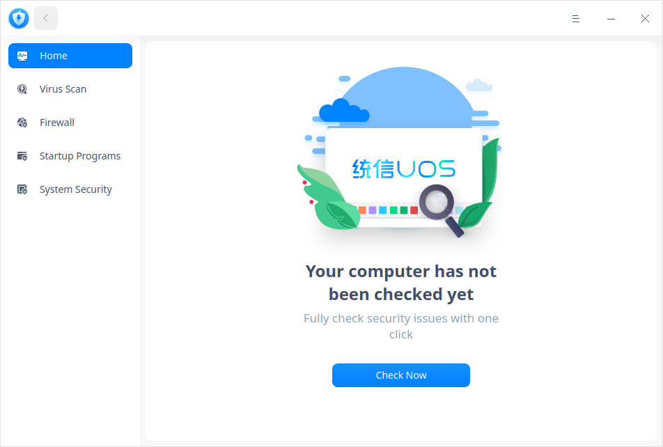
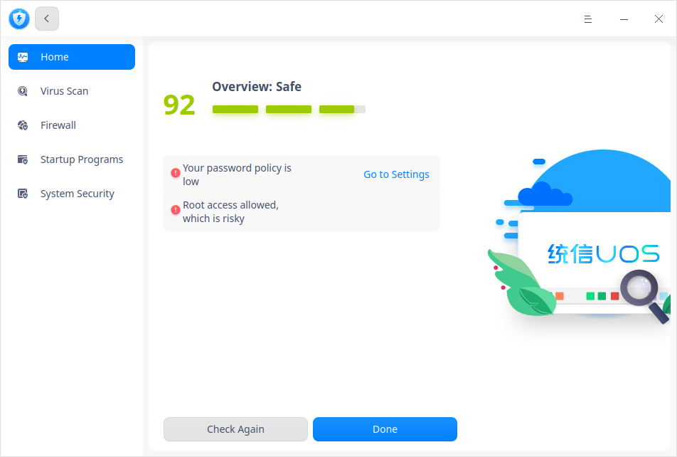
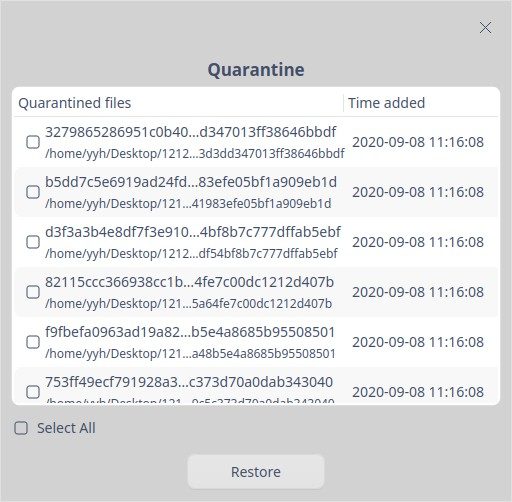
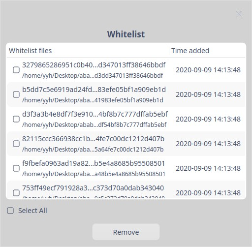
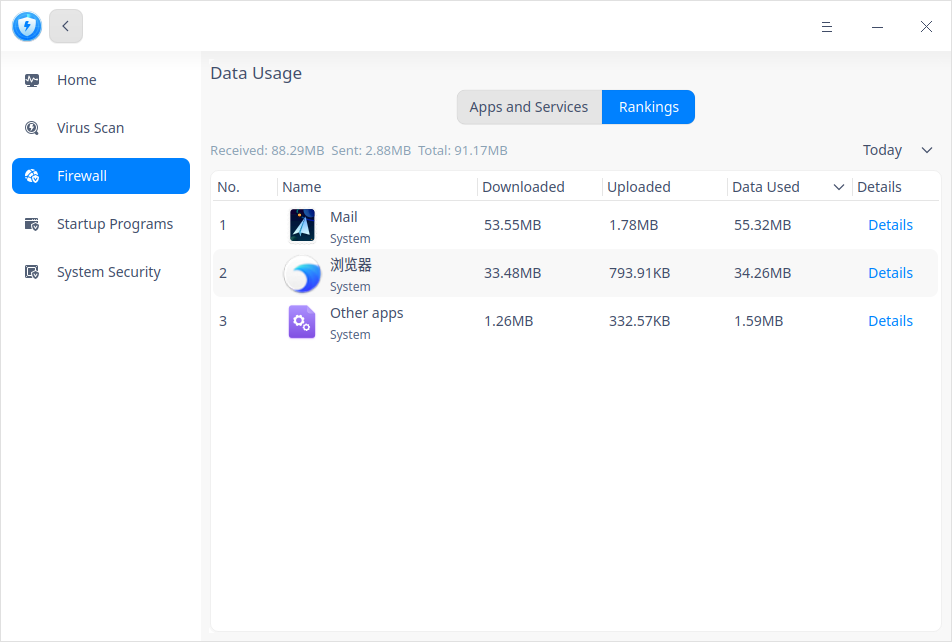
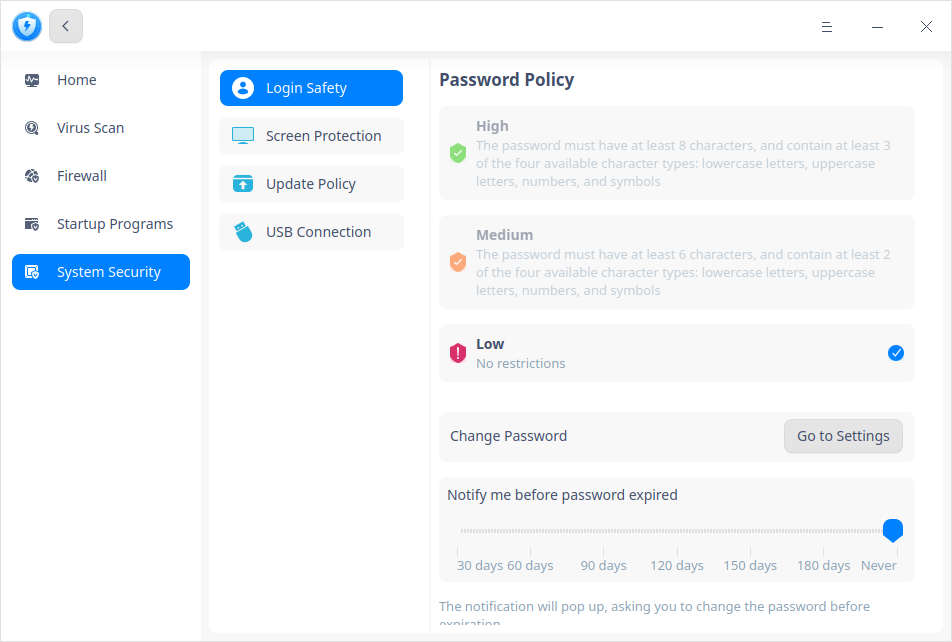
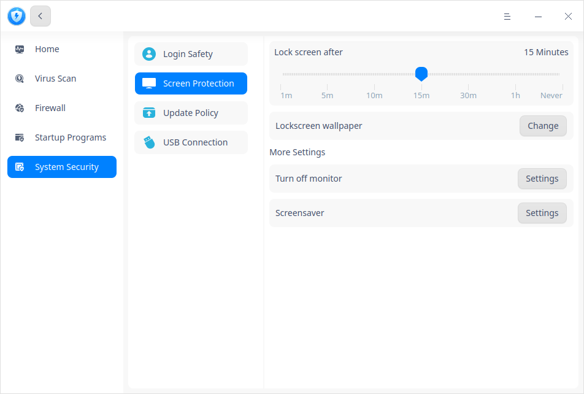

# Security Center|../common/deepin-defender.svg|

## Overview 

Security Center is a pre-installed security software featured functions such as system examination, virus scanning, firewall, startup management and system security, which helps you improve overall system security.

## Guide

You can run, close and create a shortcut for Security Center by the following ways.

### Run Security Center

1. Click  on dock to enter Launcher interface.
2. Locate  by scrolling mouse wheel or searching by "Security Center" in Launcher interface.
3. Right-click , you can

   - Click **Send to desktop** to create a desktop shortcut.
   - Click **Send to dock** to fix the application on dock.
   - Click **Add to startup** to add it to startup, it will automatically run when the system starts up.

### Exit Security Center

- On Security Center interface, click  to exit.
- Right-click  on Dock, select **Close All** to exit.
- Click  and select **Exit**.

## Operations

### Homepage

Open Security Center, click **Home** in the left panel, you can click **Check Now** to examine the system. 

When system examination is finished, you can choose whether to improve system security level according to the prompts, such as "your system is not up to date". Or, you can click **Go to Settings** to redo the settings.

### Virus scan
#### Scanning

Security Center supports full scanning, quick scanning, and custom scanning.

1. On the homepage, click **Virus Scan** in the left panel, and select a scanning method. After scanning finishes, you will see the result.

2. According to the result, you can choose corresponding operations to one or multiple results, including:

   Repair: click , this risk will be repaired, and it won't be diagnosed as a risk for the next time.

   Quarantine: click , this risk will be quarantined, other files would not be affected. It won't be diagnosed as a risk for the next time. You can click **Quarantine** icon below to view it. 

   Trust: click , this risk will be trusted. It won't be diagnosed as a risk for the next time. You can click **Whitelist** icon below to view it. 

#### Quarantine
On the interface of Virus Scan, you can click **Quarantine** icon below to view the list of quarantined files, and click **Restore** to move them out of it.

#### Whitelist
On the interface of Virus Scan, you can click **Whitelist** icon below to view the list of quarantined files, and click **Remove** to move them out of it.

#### Scan Logs
On the interface of Virus Scan, you can click **Scan Logs** icon below to view scanning time, scan type, results and action. Click  to view details and you can also delete logs.

#### Virus database update

New virus keep coming out everyday. So your virus database should be regularly updated to satisfy the security needs of your computer.

On the interface of Virus Scan, whenever there is a new virus database, you can click **The virus database is not up to date. Update first and start a scan please.** in the lower right corner. 

### Firewall

Open Security Center, click **Firewall** in the left panel, you can set Internet access, remote connection and view data usage. 

#### Global Settings

On the interface of Firewall, you can set  Internet access and remote connection for all applications and services. You can also reset the firewall, which will restore **Internet Access** and **Remote Connection** to **Ask me always**. 

**Switch on/off Firewall**

This switch controls whether to enable **Internet Access ** and **Remote Connection**; however, **Data Usage** is not affected by it. Firewall is switched off here by default.

Off: **Internet Access** and **Remote Connection** are disabled.

On: **Internet Access** and **Remote Connection** are enabled. You can go to set them further as follows.

**Internet Access **

This item controls the default Internet access settings of all applications and services. There are three options in the drop-down box.

1. Ask me always(default): when an application connects to the Internet, a prompt saying **xxx wants to connect to the Internet** pops up. And you can select **Allow Once**, **Allow always** or **Disable**. 
   
   - Allow once: connection to the Internet is allowed this time without modifying its Internet access setting.
   - Allow always: the application's Internet access setting is modified into **Allow**, and its connection to the Internet is allowed this time. No prompt will pop up when it connects to the Internet after this time. 
   - Disable: the application's connection to the Internet is disabled this time. No modification is done to the application's Internet access setting. 
   
2. Disable always: when an application connects to the Internet, a prompt saying **The firewall has blocked xxx from connecting to the Internet**, you can select **Go to Settings** or **OK**.

3. Allow always: the application is always allowed to connect to the Internet, and no prompt will pop up. 

   

**Remote Connection **

This item specifies whether remote access to your system through applications and services is permitted or not. There are three options in the drop-down box.

1. Ask me always(default): when an application starts up port listening, a prompt saying **xxx wants to start remote connection** pops up. And you can select **Allow Once**, **Allow always** or **Disable**. 

   - Allow once: remote access to your system is allowed this time without modifying its remote connection setting.
   - Allow always: the application's remote connection setting is modified into **Allow**, and remote access to your system is allowed this time. No prompt will pop up when the application starts up remote connection after this time. 
   - Disable: remote access to your system is disabled this time. No modification is done to the application's remote connection setting. 
2. Disable always: when an application starts up port listening, a prompt saying **The firewall has blocked xxx from remote connection** pops up. And you can select **Go to Settings** or **OK**. 
3. Allow always: when an application starts up remote connection every time, it is allowed by default. No prompt will pop up. 

**Restore Defaults **

Click  **Restore Defaults**, all settings of Internet access and remote connection will restore to **Ask me always**.

#### Internet Control

On the homepage of Firewall, click **Internet Control** at the bottom.  Its function is to set the Internet connection status  of all applications in the Launcher. There are 4 options in the drop-down box of each application. 

- Ask:  If you choose this option, when an application connects to the Internet, a prompt pops up to ask for your permission always.  

- Allow: If you choose this option, the application's connection to the Internet is always allowed, no prompt pops up.

- Disable:  If you choose this option, the application's connection to the Internet is disabled always, and a prompt pops up.  

- Default(xxx): it means the application's default Internet access setting. 

   > Tips: You can sort "Name" and "Status" by one click, from low to high: allow, ask, disable, default(xx); from high to low: disable, ask, allow and default(xx).  

#### Data Usage

On the homepage of Firewall, click **Data Usage** at the bottom. You can see details of **Apps and Services** and **Rankings**. 

- In **Apps and Services** page, you can see all running applications with their downloading/uploading speed and settings. Click the setting icon  on each line to jump to "Internet Access" page. 

- In **Rankings** page, you can see all running applications are ranked by "Downloaded", "Uploaded", and "Data Used".  There are four options in the upper right corner: today, yesterday, this month, and last month. 

   > Tips: You can click "Name", "Downloaded", "Uploaded" and "Data Used" to sort. 

 

 

### Startup Programs

In the Security Center interface, click **Startup Programs** in the left panel. Only applications in the Launcher are displayed and detailed by "Name", "Auto Startup" and "Action". You can choose "Allow" or "Remove" for each application. 
 

### System Security
In the Security Center interface, click **System Security** in the left panel. You can do settings for password security levels, screen protection and update policy. 

#### Login Safety
On System Security interface, click **Login Safety**. You can set password security levels and notifying period before password expired and change password regularly. 
- **High** or **Medium**: If you have chosen either one of them, when you modify password in Control Center or setup password when creating new ID, the password you set will not be saved successfully if it doesn't comply with the requirement of the corresponding level. You can go to Control Center to reset your password or modify security level in Security Center. 
- **Low**:  If you have chosen this option, when you modify password in Control Center or setup password when creating new ID, the new password will be saved directly. 

#### Screen Protection

On System Security interface, click **Screen Protection**. You can do settings such as auto screen locking period, lockscreen wallpaper, power settings and screensaver. 

Click **Settings** after "Turn off monitor", you will jump to "Plugged In" page of Control Center. 

#### Update Policy

On System Security interface, click **Update Policy** to view if the system is up to date, you can choose whether to update the system, and you can also switch on "Updates Notification" and "Auto Download Updates". 

#### USB Connection

On System Security interface, click **USB Connection**. You can switch on **Save connection record of USB devices** to view all history about USB devices with storage function connecting to your computer.

You can also add the USB device used very often into whitelist, and select **Only Whitelist** in **Connection limitation** to avoid data breach.

## Main Menu

You can switch themes, view manual and version information in Main Menu.

### Theme

The window theme includes Light Theme, Dark Theme and System Theme.

1. Click on the interface.
2. Click  **Theme** to select one.

### Help

View the manual to help you further know and use Security Center.

1. Click on the interface.
2. Click **Help** to view the manual.

### About

1. Click on the interface.
2. Click **About** to view version information and introduction about Security Center.

### Exit

1. Click on the interface.
2. Click **Exit**.

