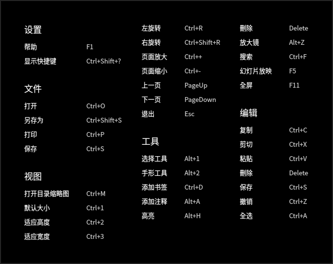
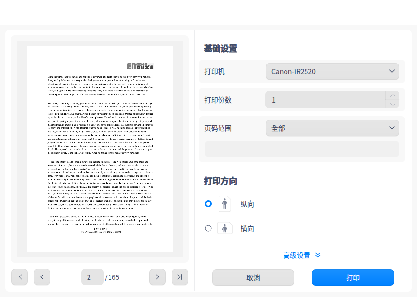

# 文档查看器|../common/deepin-reader.svg|

## 概述

文档查看器是系统自带的文档查看软件，不仅可以打开、查看文件，还可以对文档进行添加书签、添加注释以及对选择的文本进行高亮显示等操作。

## 使用入门

通过以下方式运行或关闭文档查看器，或者创建文档查看器的快捷方式。

### 运行文档查看器

1. 单击任务栏上的启动器图标 ，进入启动器界面。
2. 上下滚动鼠标滚轮浏览或通过搜索，找到文档查看器图标 ，单击运行。
3. 右键单击 ，您可以：

 - 单击 **发送到桌面**，在桌面创建快捷方式。
 - 单击 **发送到任务栏**，将应用程序固定到任务栏。
 - 单击 **开机自动启动**，将应用程序添加到开机启动项，在电脑开机时自动运行该应用。

### 关闭文档查看器

- 在文档查看器界面单击 ，退出文档查看器。
- 在任务栏右键单击 ，选择 **关闭所有**，退出文档查看器。
- 在文档查看器界面单击 ，选择 **退出**，退出文档查看器。

### 查看快捷键

在文档查看器界面，使用快捷键 **Ctrl + Shift + ?** 打开快捷键预览界面。熟练地使用快捷键，将大大提升您的操作效率。

## 基本功能

文档查看器具备基本的文件管理功能，可以执行打开、保存、打印文件、管理标签页、书签、注释等操作。

### 打开文件

文档查看器支持查看PDF和DJVU格式的文件，您可以采用以下方式打开文件。

- 直接将文件拖拽到界面或其图标上。
- 右键单击文件，选择 **打开方式 > 文档查看器**。将文档查看器设为默认打开程序后，可以直接双击打开。
- 在文档查看器初始界面，单击 **选择文件**。
- 在文档查看器界面，使用快捷键 **Ctrl + O**，选择文件打开。

### 保存文件

对当前正在编辑、修改的文档进行保存。

- 单击  > **保存** 或使用快捷键 **Ctrl + S** 保存文件。
- 单击  > **另存为** 或使用快捷键 **Ctrl + Shift + S** 另存文件。

### 打印文件

在文档查看器中使用打印，需要提前连接并配置好打印机。

1. 在文档查看器中打开一个文档，在文档界面单击鼠标右键选择 **打印**，也可以使用快捷键 **Ctrl + P** 打开打印预览。
2. 在打印预览界面，您可以预览文件，选择打印机并设置打印页面。
3. 在打印预览界面，单击 **高级设置**，可配置纸张大小、打印方式等相关参数。
4. 单击 **打印** 即可将文件发送到打印机打印。

### 管理标签页

新增标签页

- 单击  > **新标签页**，新增一个标签页。
- 当标签页达两个或两个以上时，会显示按钮 **+** ，单击该按钮添加新标签页。

切换/调整标签页

- 同一窗口内拖拽标签页调整排序。
- 当标签页过多时会显示按钮  或  ，单击可以左右移动。
- 滚动鼠标切换标签页。 

窗口间的操作

- 拖拽标签页移出当前窗口，创建一个新的窗口。
- 拖拽标签页从一个窗口到另一个窗口中。

### 管理书签

在文档查看器界面，打开一个文档。

- 添加书签
   - 右键单击文档查看器中的文件页，选择 **添加书签**，为当前正在浏览的页面添加书签。
   - 将鼠标移至浏览页面右上角书签区域显示 ，单击书签图标为当前页添加书签，书签图标变为蓝色填充色。
- 删除书签：
   - 在已添加书签的页面，右键单击书签，选择 **删除书签** 来删除书签。
   - 鼠标移到书签位置，单击有填充颜色的书签，可以取消(删除)该书签。

   > 说明：鼠标移到书签位置附近才会显示书签图标。鼠标移出书签区域，书签图标消失。当添加书签后，该图标一直显示。

### 管理注释

在文档查看器界面，打开一个文档。

- 添加注释
   - 使用选择工具选择文本内容，单击鼠标右键选择 **添加注释**，完成注释后被选中的文本内容被高亮显示。
   - 在文档空白处或者需要添加注释的地方，单击鼠标右键选择 **添加注释**，完成注释后该处会显示一个高亮的注释图标。

   > 说明：如果注释窗口不输入内容，直接单击其他区域，则添加注释不成功或该条注释自动删除。输入文本内容后，单击其他区域，注释内容自动保存。
   
- 复制注释
   -  在页面上，右键单击已完成注释的文本内容，在右键菜单中选择 **复制**，复制该条注释的全部内容。
   -  在页面上，右键单击注释图标，选择 **复制**，复制该条注释的全部内容。
   -  单击 ，在左侧选择注释目录 ，选定一个注释，右键单击选择 **复制**，复制这条注释的全部内容。

- 显示注释  
   1.  将鼠标悬停至注释图标上，在出现的浮框中显示部分注释内容。
   2.  单击注释图标，弹出注释窗口，可以查看、重新编辑注释内容。

- 删除注释
   - 右键单击已完成注释的高亮文本内容，选择 **取消高亮**，删除该条注释内容。
   - 右键单击注释图标，选择 **删除注释**，删除该条注释内容。
   - 在左侧选择注释目录 ，选定一个注释，右键单击选择 **删除注释**，删除这条注释，对应页面上的这条注释内容也删除。

   > 说明：
   > + 支持在当前页移动注释图标。
   > + DJVU格式的文件不支持添加注释。

## 常用操作

文档查看器具备很多特色功能，这些功能都是为了让文件管理更加简单、高效。

### 搜索

1. 在文档查看器界面，打开一个文档。
2. 在文档页面单击鼠标右键，选择 **搜索** 或使用快捷键 **Ctrl + F** 打开搜索窗口。
3. 在搜索框中，单击 ，输入关键字。
4. 按下键盘上的 **Enter** 键进行搜索。
   - 当搜索到匹配的信息时，侧边栏会显示全部搜索结果，文档中会高亮显示匹配项。
   - 当没有搜索到匹配的信息时，侧边栏会显示“无搜索结果”。
5.  当搜索到匹配信息后，单击按钮  或  可逐个查找上一个或下一个匹配项。
6. 单击某条搜索结果，跳转到对应页面，该页面的搜索结果高亮显示。   
   
   > 注意：不可搜索文档中由文本转换成图片的内容。
7.  清除搜索框中的信息，即可清除搜索结果。   
   
   > 说明：DJVU格式的文件不支持搜索功能。

### 快速翻页

使用下列方法之一快速翻页：

- 在右键菜单中选择  **前一页** 或 **后一页** 。
- 如果想直接浏览文档的开头或结尾，可在右键菜单中选择 **第一页** 或 **最后一页**。
- 按下键盘上的  或  键。
- 在侧边栏缩略图目录下，输入页码数后按下 **Enter** 键。

### 切换目录

通过缩略图可以进行文档缩略图目录 、文档目录  、书签目录 、注释目录  的切换。手动拖拽目录边框，缩略图跟随可拖拽宽度大小的变化而变化。

### 全屏

1. 在文档查看器界面，单击鼠标右键选择 **全屏** 或使用快捷键 **F11**，文档将以全屏形式展示。
2. 将鼠标移到窗口顶部或者左侧区域，呼出顶部工具栏或侧边工具栏；将鼠标移出区域外，工具栏自动隐藏。
3. 在全屏状态下，呼出顶部工具栏后单击缩略图 ，侧边工具栏会一直显示。
4. 按下键盘上的 **Esc** 键或使用快捷键 **F11** 退出全屏。

### 幻灯片放映 

1. 在文档查看器界面，单击鼠标右键选择 **幻灯片放映**，文档页面将以幻灯片形式进行播放。
2. 单击  或  切换文档页面，也可以单击  停止播放。
3. 单击 **×** 或按下键盘上的 **Esc** 键退出播放。

### 放大和缩小

使用下列方法之一放大或缩小页面：

- 按下键盘上的 **Ctrl + “+”** 或 **Ctrl + “-”** 。
- 按下键盘上的 **Ctrl** 键的同时按住鼠标中键向上或向下滑动。
- 在菜单栏，单击 “**+** ”放大或 “**-**” 缩小 。
- 在菜单栏，手动输入缩略比例，或在下拉框选择：10%、25%、50%、75%、100%、125%、150%、175%、200%、300%、400%、500%，文档跟着比例依次放大缩小。

   > 说明：当使用触控屏或触控板电脑时，二指张开，放大文档；二指捏合，缩小文档。

### 调整页面视图

在菜单栏缩放比例下拉框中，您可以：

- 单击 **双页显示**，进入双页显示模式。
- 单击 **默认大小**，页面以100%比例显示。
- 单击 **适合页面**，当前窗口显示整页。
- 单击 **适应高度**，页面高度在视窗内全部显示。
- 单击 **适应宽度**，页面宽度在视窗内全部显示。 

### 高亮文本

1. 在文档查看器界面选中文本，单击鼠标右键选择 **高亮**，此时有不同的高亮颜色可供选择。 
2. 选定一种颜色，被选中的文本内容将以该颜色为底纹高亮显示。
3. 选中已经高亮显示的文本，单击 **取消高亮**，可以删除文字高亮显示效果。
   > 说明：
   > - 当再次高亮文本时，可右键直接选择 **高亮**，默认使用您上次选择的高亮颜色。
   > - DJVU格式的文件不支持高亮设置。

### 旋转

1. 在文档查看器界面，打开一个文件。
2. 单击鼠标右键选择 **左旋转** 或 **右旋转**，页面全部同时向左或向右旋转90°。
> 说明：当使用触控屏或触控板电脑时，二指放在文档区域并保持距离，同时旋转手指来旋转文档。

### 查看文档信息

1. 在文档查看器界面，打开一个文件。
2. 单击鼠标右键选择 **文档信息**，展示文档的基本信息。

## 主菜单

在主菜单中，您可以新建窗口、新建标签页、[保存文件](#保存文件)、[搜索文件](#搜索)、切换窗口主题、查看帮助手册，了解文档查看器的更多信息。

### 在文件管理器中显示

1. 在文档查看器界面，单击 。
2. 选择 **在文件管理器中显示**，定位该文件的存储位置。

### 放大镜

1. 在文档查看器界面，单击  。
2. 选择 **放大镜**，将鼠标移动到页面需要查看的区域，则该区域内容放大。
4. 按下键盘上的 **Esc** 键或单击右键，取消放大镜功能。

### 切换工具

1. 在文档查看器界面，单击  。
2. 选择 **工具**，支持两种工具切换。
   - **选择工具** 支持选择文本内容。
   - **手形工具** 支持在文档中移动。

### 主题

窗口主题包含浅色主题、深色主题和系统主题。

1. 在文档查看器界面，单击 。
2. 选择 **主题**，选择一个主题颜色。

### 帮助

查看帮助手册，进一步了解和使用文档查看器。

1. 在文档查看器界面，单击。
2. 选择 **帮助**。
3. 查看文档查看器的帮助手册。

### 关于

1. 在文档查看器界面，单击 。
2. 选择 **关于**。
3. 查看文档查看器的版本和介绍。

### 退出

1. 在文档查看器界面，单击 。
2. 选择 **退出**。

文档更新时间: 2021-04-09 版本: 5.8
