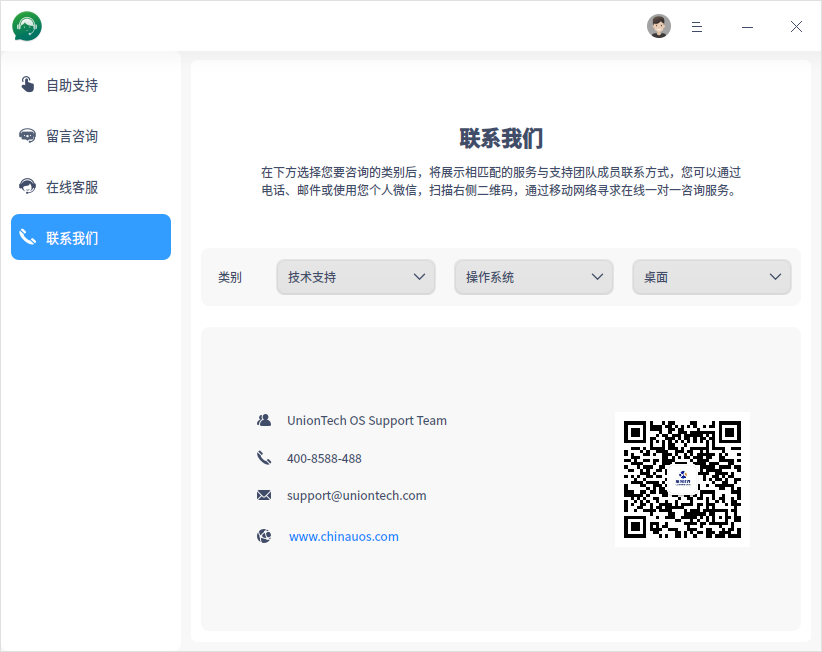

# 服务与支持|../common/support.svg|

## 概述

服务与支持是由统信软件研发的一款用户与官方技术服务团队进行交互的应用程序，它涵盖远程服务、现场服务、培训服务和顾问咨询服务等，旨在为用户提供多种渠道的服务与技术支持，更便于用户快速寻求帮助并反馈问题。

## 使用入门

### 运行服务与支持

1. 单击任务栏上的启动器 ，进入启动器界面。
2. 上下滚动鼠标滚轮浏览或通过搜索，找到服务与支持， 单击运行。
3. 右键单击 ，您可以：

 - 单击 **发送到桌面**，在桌面创建快捷方式。
 - 单击 **发送到任务栏**，将应用程序固定到任务栏。
 - 单击 **开机自动启动**，将应用程序添加到开机启动项，在电脑开机时自动运行该应用。

### 关闭服务与支持

- 在服务与支持界面单击  ，退出服务与支持。
- 在任务栏右键单击 ，选择 **关闭所有** 退出服务与支持。
- 在服务与支持界面单击  ，选择 **退出** 来退出服务与支持。

## Union ID登录

1. 留言咨询及在线客服功能都需要登录Union ID。
2. 在服务与支持界面，单击标题栏上的头像。
3. 弹出Union ID登录界面，输入用户名/邮箱/手机号和密码后，单击 **登录**。

> 注意：如果您未注册帐号，单击对话框中的 **立即注册** 按钮，跳转到对应的网页进行注册。

## 自助支持

在左侧导航栏单击 **自助支持** 页签，进入自助支持界面。通过搜索、查阅帮助手册、文档中心及FAQ，来排除疑问、解决问题。

- 单击 **文档中心** 图标，跳转到统信UOS产品文档中心，查看相应的文档。
- 单击 **FAQ** 图标，跳转至统信UOS产品文档中心，查看相应的文档。
- 单击 **帮助手册** 图标，则跳转到系统的帮助手册界面。
- 单击 **更多服务与支持内容** 图标，跳转到统信UOS生态社区，了解更全面的服务。

## 留言咨询

可以留下联系方式和咨询内容，以方便客服及时与您取得联系，快速解决问题。

留言咨询请先登录Union ID。

1. 在左侧导航栏单击 **留言咨询** 页签。

   - 当系统处于联网状态时，进入留言咨询界面，执行步骤 2。
   - 当系统处于断网状态时，会自动跳转到 **联系我们** 界面，具体操作请参考 [联系我们](#联系我们)。

2. 根据界面提示，填写相关内容。

   - **类别**：必选项，如技术支持、操作系统、桌面等。

   - **标题**：必选项，咨询或建议的详细标题。

   - **内容**：必选项，描述需要咨询的问题，可通过鼠标拖拽截图、视频和GIF文件到内容框。

   - **添加附件**：可选项，最多仅允许上传4个附件，且每个附件大小不超过10MB。

   - **上传日志**：可选项，默认关闭。您可以选择开启，上传日志的过程中将保护您的个人隐私信息。

   - **邮箱**：必选项，用来收取问题的处理进度和结果。

     

3. 单击 **提交**，将填写的信息反馈给 UOS服务与支持团队。

   > 说明：单击 **重置**，会清空已填写和上传的内容和附件，恢复为初始的默认状态，请谨慎操作。

4. 提交成功后，您需要关注预留的邮箱，查看咨询进度和结果。

## 在线客服

只需轻轻一点，就可以与客服人员及时交流、沟通服务与技术问题。

使用前提是登录Union ID，系统处于试用期或激活成功状态，且需要连接网络。

1. 在左侧导航栏单击 **在线客服** 页签。

   - 当系统处于联网状态时，进入在线客服界面，执行步骤 2。
   - 当系统处于断网状态时，会自动跳转到 **联系我们** 界面，具体操作请参考 [联系我们](#联系我们)。

2.  进行在线IM聊天、发送附件、查看历史消息。

   - 在输入框中输入想要咨询沟通的内容，即可开启在线聊天。
   - 单击上传附件图标，上传附件。
   - 单击对话框顶部 **查看更多历史消息**，查看历史消息。

## 联系我们

您可以通过电话、邮件或使用个人微信扫描二维码添加好友，联系我们，寻求一对一的咨询服务。

1. 在左侧导航栏单击 **联系我们** 页签，进入联系我们界面。
2.  选择需要咨询的类别，将展示对应的服务与支持团队成员的联系方式。

## 主菜单 

在主菜单中，您可以切换窗口主题、查看帮助手册，了解服务与支持的更多信息。

### 主题

窗口主题包含深色主题、浅色主题和系统主题。

1.  在服务与支持界面，单击。
2.  单击 **主题**，选择一个主题颜色。

### 帮助

1.  在服务与支持界面，单击 。
2.  单击 **帮助**，查看帮助手册，进一步了解与使用服务与支持。

### 关于

1.  在服务与支持界面，单击 。
2.  单击 **关于**，查看服务与支持的版本和介绍。

### 退出

1. 在服务与支持界面，单击 。
2. 单击 **退出**。

文档更新时间: 2021-04-09 版本: 2.3
