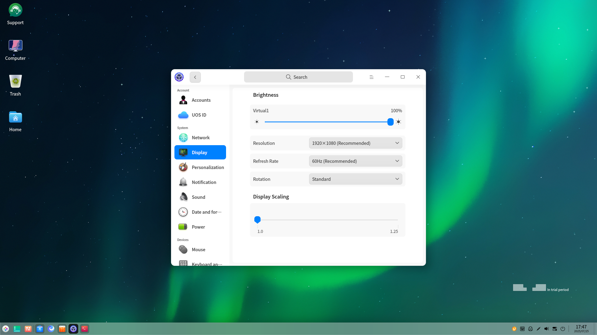

# How to get started with UOS|learn-basic-operations|

## I. Getting Started Quickly

UOS Desktop offers the same home screen layout mode as Windows - Efficient Mode. If you want to have a better visual effect, you can choose the stylish mode.

**Schematic diagram of desktop layout:**

### 1.  Launcher（Start）

Users familiar with Windows know that using any function will start from the Start, such as finding/opening applications. In UOS, there is a start menu (Launcher) just like Windows, you can do the same operation as Windows Start in the Launcher. For more information about the use of the Launcher, please refer to **Manual-Desktop Environment-Launcher** or hit "F1" to open the Manual.

### 2. Dock

Like the Taskbar under Windows,UOS Dock also contains several partitions such as Quick Launch, Tray, Plugin and so on. The Quick Launch bar can fix your frequently-used applications for easy one-click opening.

The icon Tray area allows you to set Bluetooth, network and other shortcut settings directly,You can also manage the tray by dragging the tray area icon and storing it in the tray window.

The Plugin Area displays frequently used actions and can also be customized through Control Center - Personalization - Dock. Frequently used plug-ins such as screenshot recording, system monitor, global search, etc. can be resided,Some plugins can also be dragged to the shortcut panel for management, which is both beautiful and convenient.

### 3.Computer (This PC)

**Computer under UOS**

The same as Windows Explorer,UOS File Manager can manage files as well as the Desktop, and the Desktop defaults to display "Computer" , which is equivalent to Windows' "This PC".

**Set up quick access to frequently used folders**

You can adjust the sidebar and drag and drop to adjust the sorting of frequently used folders. Or you can fix the folders you need to see at any time to the sidebar navigation by "Pin to quick access" in the right-click menu. You can make the file manager more suitable for your personal use.

**Convenient right-click menu**

Frequently used functions such as printing files, compressing files, and sending files quickly can be found in the right-click menu of the file.

More use of the file manager can be seen in **Manual - File Manager**, or [click on the link](https://www.bilibili.com/video/BV1dT411574j/?share_source=copy_web&vd_source= 76cf82177880a7aa76195eee437b80a6) to watch the video.

### 4.  App Store

UOS cannot install windows application format (exe) downloaded directly from the internet, but provides a channel for safe and rich application downloads - **App Store** 。

You can download and install different versions of WPS, WeChat, Nail, Sogou Input Method and other apps that you need for your office environment, and it is recommended that you directly choose the apps with the "Recommended" logo to install.

## II. Common office functions

### 1. Window management

**Application split screen**

When you need to view the contents of two app windows at the same time, you can trigger the app split-screen operation by dragging and dropping the app to the left and right edges of the screen, which will help improve your processing efficiency.

**Switching windows**

By using the "Alt+Tab" shortcut, you can quickly switch between multiple app windows and find open apps just like in Windows.

**View all windows**

If you have more windows open, you can use the taskbar to open the "Multitasking View" by clicking  to open "Multitasking View", or the shortcut key "Super (Win icon key) + S The shortcut key "Super (Win icon key) + S", together with the mouse, will allow you to select any application window for switching.

### 2. Extracting text content from screenshots

When you have a favorite text in a picture, or some webpage content can not be copied, you can use the system comes with the screenshot recording screen to take a screenshot of it, and then in the toolbar click on the icon in the toolbar, you can extract the text from the screenshot and copy it to other places or download it locally, and then you can save it or share it with others.

### 3. Learn more about shortcut key operations

**System shortcuts**

|              Copy              |           Cut           |          Paste           |
| :----------------------------: | :---------------------: | :----------------------: |
|             Ctrl+C             |         Ctrl+X          |          Ctrl+V          |
|            **Undo**            |        **Print**        |     **Close Window**     |
|             Ctrl+Z             |         Ctrl+P          |          Alt+W           |
|       **Switch windows**       |    **Global search**    |     **Lock screen**      |
|            Alt+Tab             |       Shift+空格        |       Super(win)+L       |
| **Switch Screen Display Mode** | **Graphic Recognition** | **Scrolling Screenshot** |
|          Super(win)+P          |       Ctrl+Alt+C        |        Ctrl+Alt+I        |
|         **Screenshot**         |      **Recording**      |   **Shutdown Screen**    |
|           Ctrl+Alt+A           |       Ctrl+Alt+R        |     Ctrl+Alt+Delete      |

Note: UOS is compatible with the Windows keys, but calls them "Super Keys".

**Application shortcuts**

| Browser                       |                               |
| ----------------------------- | ----------------------------: |
| Reopen closed tabs            |                  Ctrl+Shift+T |
| switch to next tab            |     Ctrl+Tab or Ctrl+PageDown |
| switch to previous tab        | Ctrl+Shift+Tab or Ctrl+PageUp |
| close current tab             |             Ctrl+W or Ctrl+F4 |
| **Input Methods**             |                               |
| Rotate to switch input method |                    Ctrl+Shift |
| Enable/disable input method   |                    Ctrl+Space |
| Chinese and English Switching |                         Shift |

Use the shortcut key "Ctrl + Shift + /" inside the application window to see more application shortcuts introduced.

## III. Setting up your personalized desktop

With the gradual familiarization with the  UOS, do you want to create your own desktop, then start from the wallpaper settings.

### 1. Wallpaper screensaver settings

**Set wallpaper:** Click "Wallpaper and Screensaver" in the desktop context menu to select your favorite wallpaper at the bottom of the desktop, or customize your photo as wallpaper. For more personalized wallpapers, go to the App Store and search for wallpapers to download.

**Screensaver Settings:** The same entry point as the wallpaper settings, just click on the "Screensaver" settings can be, you can also click on the "Custom Screensaver" will be set to rotate a group of pictures as a screensaver, in the setup pop-up window can be set to rotate the rotation interval and random rotation.

The Control Center also offers more setting features, which can be explored in Control Center - Personalization.

### 2. External screen setup

When using the extended mode, if you need to adjust the screen splicing, you can go to "Control Center - Display" to set. Use the mouse** to drag** the screen thumbnail to adjust the relative position of the screen, which corresponds to the position of the two screens in reality, so as to achieve a better using experience.

## IV. Frequently Asked Questions

For more questions and answers, please visit [FAQ]( https://faq.uniontech.com/)

### 1. How to clean up your system

The Cleanup" function of Security Center can clean up invalid files and data to free up disk space. Open Security Center, check the type of data you want to clean up, click "Scan Now" to scan for junk files, then select what you want to clean up and click "Clean Up", which is easy to operate.

### 2. How do I monitor the status of my system

During system operation, an application may take up too many resources and cause the system to lag. In this case, you can turn on System Monitor to end the process of the application that takes up too much resources and is not in use, so as to ensure the smoothness of the system.

### 3. How to connect a printer

In the Print Manager interface, click the Add button to enter the Add Printer interface. The application will automatically recognize and list the shared printers currently scanned on the network. After selecting a printer, the application will automatically recommend the best driver and click Install to complete the installation. Of course, you can search for printers on your local network manually or through URI search.

For other ways to add printers, check out **Manual - Print Manager**.

### 4. How do I connect to the network

If you can't open a web page in your browser, you need to check if you are connected to a wired or wireless network. You can click on the WiFi icon in the taskbar-tray area , select the name of the WiFi you want to connect to and enter the password, or plug in a cable and enable a wired connection.

In general, enterprise network access has its own security authentication scheme. If you need to configure network security authentication, you can go to Control Center-Network and configure wired network or wireless network as needed. To learn more, you can [click the link](https://www.bilibili.com/video/BV1ZT41157dp/?share_source=copy_web&vd_source=76cf82177880a7aa76195eee437b80a6) Watch the video.

### 5. How to adjust the input method

In Control Center - Keyboard and Language - Input Method Settings, click Edit button to select the input method you need to remove or drag to adjust the order of input methods. If accidentally removed by mistake, just click Add button, select the input method and confirm the addition, then you can get back the input method you deleted by mistake before.

## V. More tips

You are welcome to scan the QR code on WeChat to open the UOS Tip Assistant mini program and view the tips online.

