# 如何快速上手UOS|Get started with UOS|

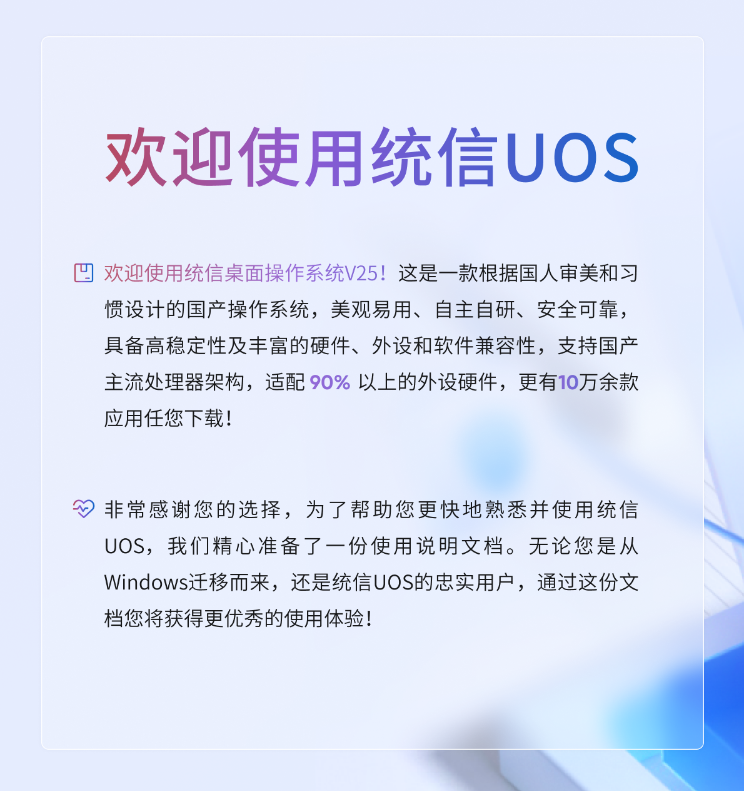

## 一、快速上手

统信UOS桌面提供与 Windows 相同的主屏布局模式-高效模式。如果希望有更好的视觉效果，可选择时尚模式。

**桌面布局示意图：**

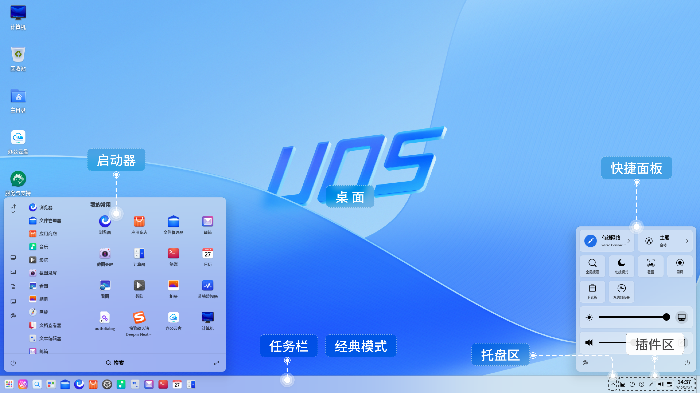

### 1. 启动器（开始菜单）

熟悉Windows的用户都知道，使用任何功能都会从开始菜单开始，例如查找/打开应用。在统信UOS中，也有和Windows一样的开始菜单（启动器），您可以在启动器里完成和Windows开始菜单一样的操作。更多启动器的使用可查看**帮助手册-桌面环境-启动器**，敲击“F1”按键打开帮助手册。

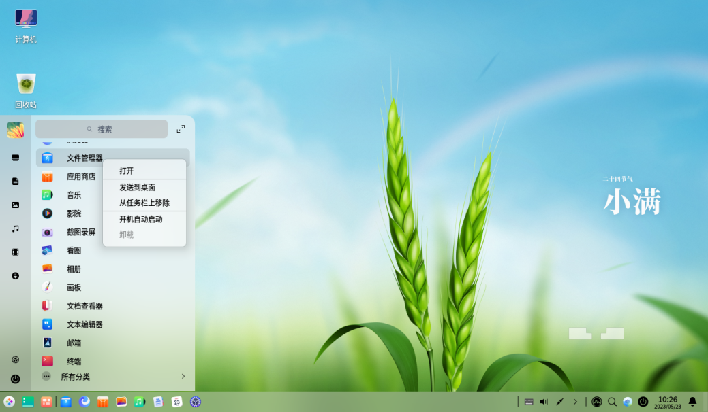

### 2. 任务栏

和Windows下的任务栏一样，统信UOS任务栏也包含了快捷启动、托盘、插件等多个分区。快捷启动栏可以固定您常用应用，方便一键打开。

图标托盘区可以直接设置蓝牙、网络等快捷设置。

插件区会显示常用操作，还可以通过控制中心-个性化-任务栏中进行自定义设置。可驻留截图录屏、系统监视器、全局搜索等常用插件。

### 3. 文件管理器（我的电脑）

**统信UOS下的“我的电脑”**

同Windows的资源管理器，统信UOS文件管理器和桌面一样可对文件进行管理，桌面默认显示“计算机”，等同于 Windows 的“此电脑”。

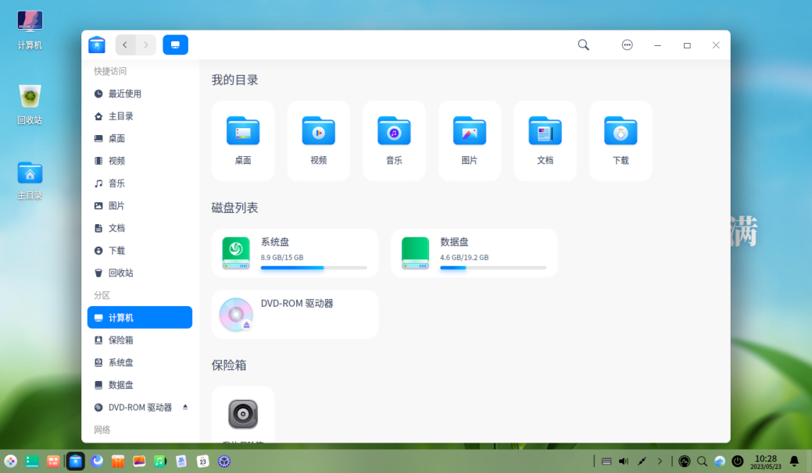

**为常用文件夹设置快速入口**

您可通过调整侧边栏，拖拽调整常用的文件夹排序方式。或将需要随时查看的文件夹，通过右键菜单中的“添加到快捷访问”，固定到侧边栏导航中。可让文件管理器更合适您个人的使用习惯。

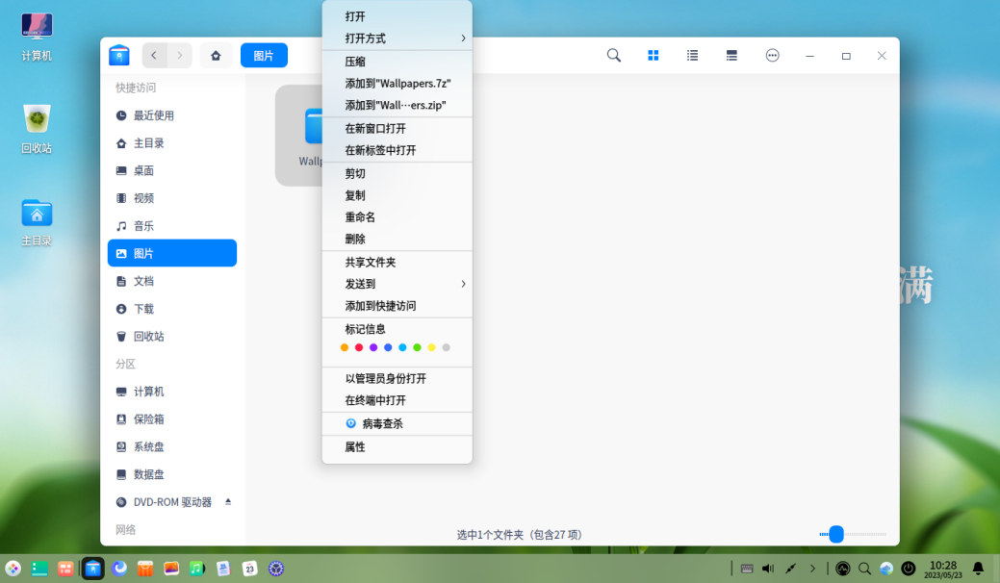

**便捷的右键菜单**

打印文件、压缩文件、快捷发送文件等常用功能，都可以在文件的右键菜单中找到。

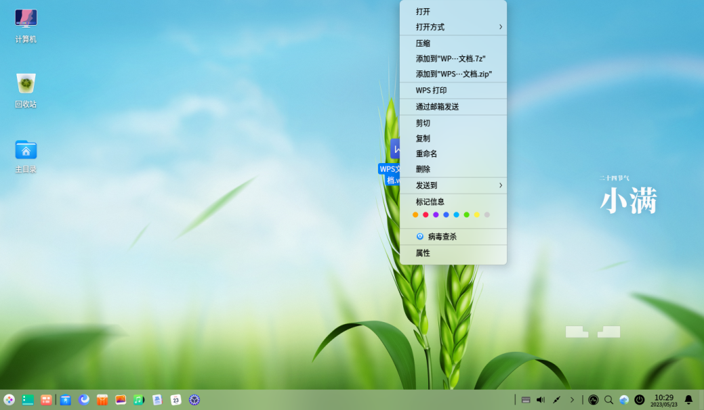

更多文件管理器的使用可查看**帮助手册-文件管理器**，或[点击链接](https://www.bilibili.com/video/BV1dT411574j/?share_source=copy_web&vd_source=76cf82177880a7aa76195eee437b80a6)观看视频。

### 4. 应用商店

统信UOS无法安装直接从网络上下载的windows应用程序格式（exe），但提供安全、丰富的应用程序下载的渠道——**应用商店**。

可下载安装办公环境需要的 WPS、企业微信、钉钉、搜狗输入法等应用的不同版本，建议直接选择带“推荐”标识的应用安装。

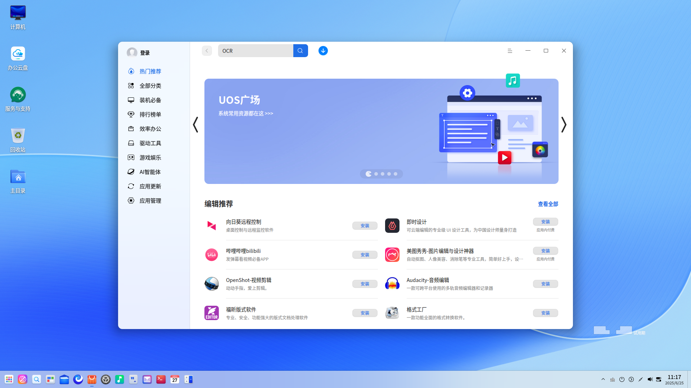

## 二、办公常用功能

### 1. 窗口管理

**应用分屏**

当您需要同时查看两个应用窗口内容时，可以通过拖拽应用到屏幕左右边缘触发应用分屏操作，将有助于提高您的处理效率。

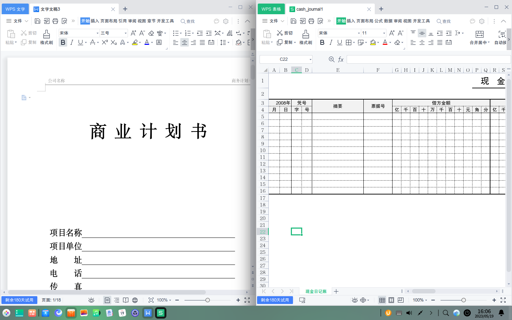

**切换窗口**

通过使用“Alt+Tab”快捷键，您可以和在Windows下一样，在多个应用窗口之间快速切换，快速找到已打开应用。

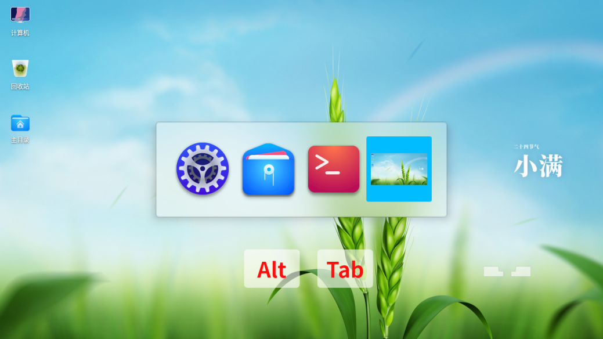

**查看所有窗口**

而您开启的窗口数量较多时，可以使用任务栏单击  打开“多任务视图”，或快捷键“Super（Win 图标按键)+ S”，配合鼠标就能选中任意应用窗口进行切换。

### 2. 从截图中提取文字内容

当您遇到图片中有喜欢的文字，或某些网页内容无法复制时，您可以使用系统自带的截图录屏对其截图，随后在工具栏中点击图标，就可以从截图中提取文字复制到其他地方或下载到本地，进而可以保存或分享给其他人。

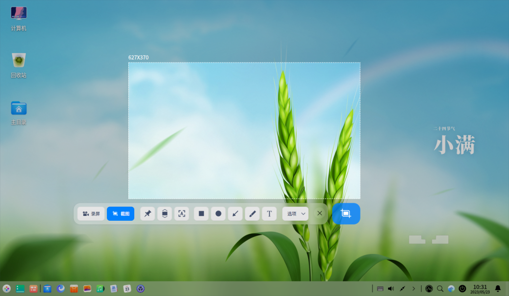

### 3. 了解更多快捷键操作

**系统快捷键**

|         复制         |     剪切     |      粘贴       |
| :------------------: | :----------: | :-------------: |
|        Ctrl+C        |    Ctrl+X    |     Ctrl+V      |
|       **撤销**       |   **打印**   |  **关闭窗口**   |
|        Ctrl+Z        |    Ctrl+P    |      Alt+W      |
|     **切换窗口**     | **全局搜索** |    **锁屏**     |
|       Alt+Tab        |  Shift+空格  |  Super(win)+L   |
| **切换屏幕显示模式** | **图文识别** |  **滚动截图**   |
|     Super(win)+P     |  Ctrl+Alt+C  |   Ctrl+Alt+I    |
|       **截图**       |   **录屏**   |  **关机界面**   |
|      Ctrl+Alt+A      |  Ctrl+Alt+R  | Ctrl+Alt+Delete |

注：统信UOS能够兼容Windows键，但是将其称作“超级键”（Super键）。

**应用快捷键**

| 浏览器               |                             |
| -------------------- | --------------------------: |
| 重新打开关闭的标签页 |                Ctrl+Shift+T |
| 切换到下一个标签     |     Ctrl+Tab或Ctrl+PageDown |
| 切换到上一个标签     | Ctrl+Shift+Tab或Ctrl+PageUp |
| 关闭当前标签         |             Ctrl+W或Ctrl+F4 |
| **输入法**           |                             |
| 轮序切换输入法       |                  Ctrl+Shift |
| 开启/关闭输入法      |                   Ctrl+空格 |
| 中英文切换           |                       Shift |

在应用窗口内使用快捷键“Ctrl + Shift + / ”查看更多应用快捷键介绍。

## 三、设置您的个性化桌面

随着对统信UOS的逐渐熟悉，您是否想打造属于自己的桌面，那就从壁纸设置开始吧。

### 1. 壁纸屏保设置

**设置壁纸：**在桌面右键菜单中点击“壁纸与屏保”，进入控制中心选择您喜欢的壁纸，您可以切换选择图片壁纸或纯色壁纸，也可以自定义照片或颜色。如果想获取更多个性化壁纸，还可以前往应用商店搜索壁纸进行下载。

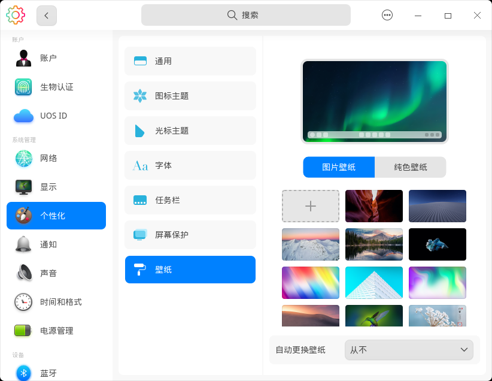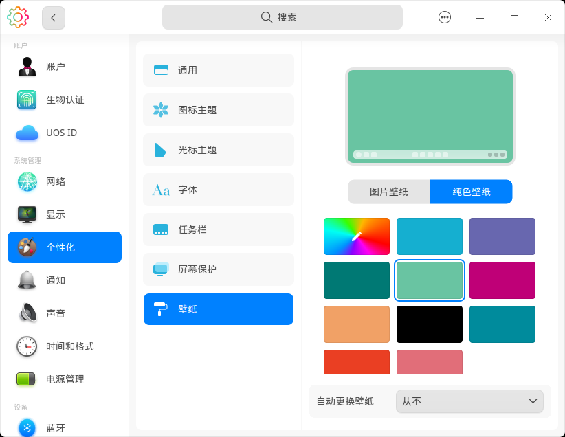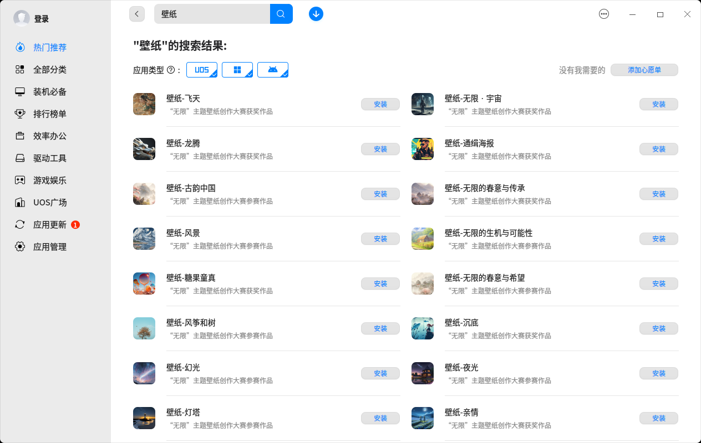

**屏保设置：**在控制中心-个性化-屏幕保护中，可以选择您喜欢的屏保。选择图片轮播屏保后，单击“屏保设置”可以将一组图片设置为轮播屏保，在设置弹窗中还可以设置轮播间隔和随机轮播。

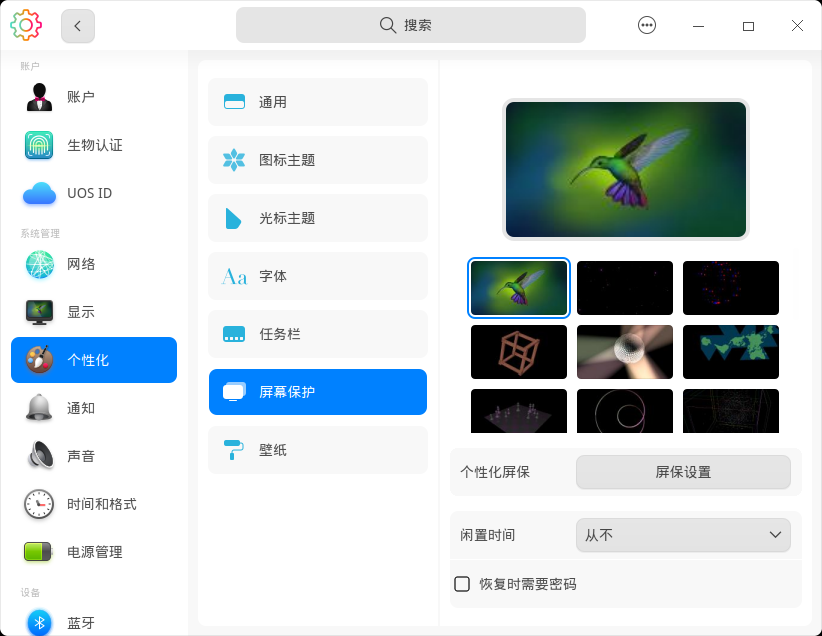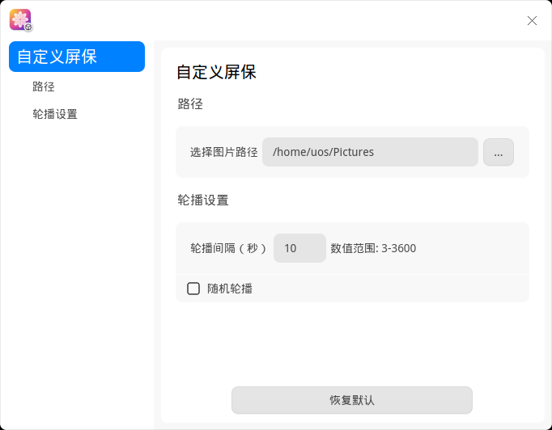

### 2. 外接屏幕设置

使用扩展模式时，如果您需要调整屏幕的拼接方式，可以前往“控制中心-显示”进行设置。使用鼠标**拖动**屏幕缩略图调整屏幕相对位置，与现实中两个屏幕的位置相对应，可以达到更好的使用体验。

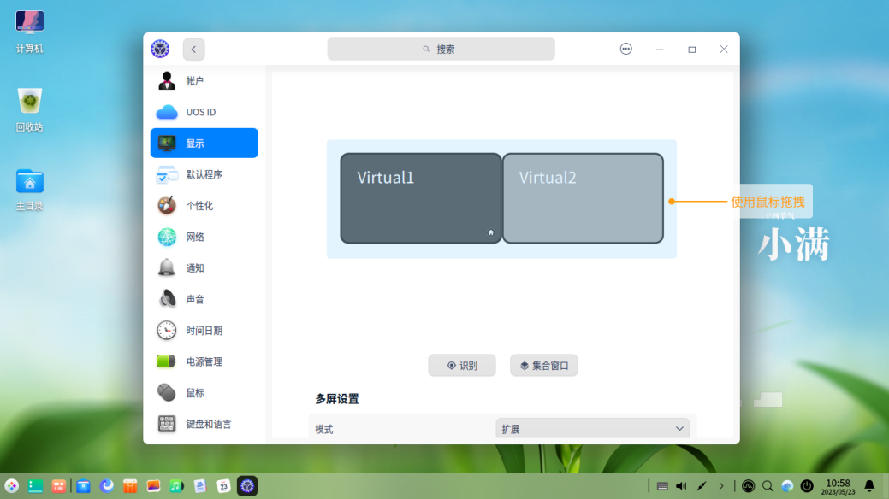

## 四、常见问题解答

更多问题解答，请访问 [FAQ]( https://faq.uniontech.com/)

### 1. 如何清理系统垃圾

安全中心的“垃圾清理”功能，可以清理无效的文件及数据，以释放磁盘空间。打开安全中心，勾选要清理的数据类型，点击“扫描”后会进行垃圾文件扫描，然后选择要清理的内容，并点击“立即清理”，操作便捷。

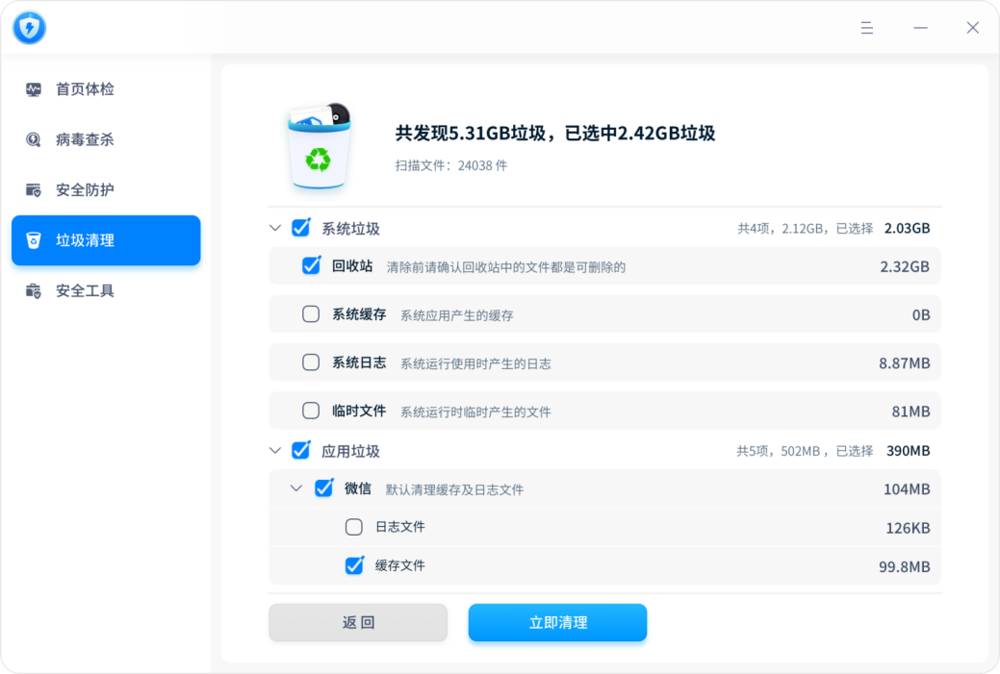

### 2. 如何监控系统状态？

在系统运行过程中，可能某个应用占用太多资源导致系统卡顿。此时您可以打开系统监视器，结束占用过高且未在使用的应用软件进程，从而保障系统流畅。

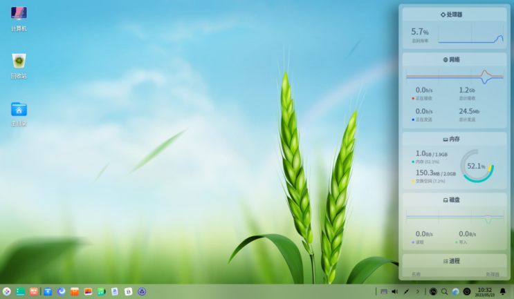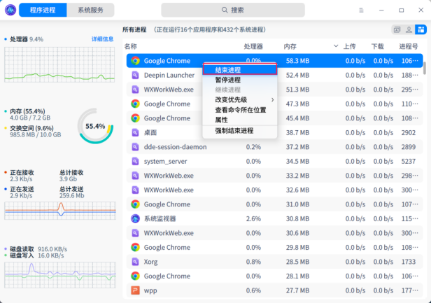

### 3. 如何连接打印机

在打印管理器界面，点击添加按钮，进入添加打印机界面。应用将自动识别，并列出当前网络扫描到的共享打印机。选择打印后，应用会自动推荐最优驱动，点击安装完成后即可进行文档打印。当然您可以通过手动查找、URI查找精准查找局域网内的打印机。

如果需要了解其它添加打印机的方式，可查阅**帮助手册-打印管理器**。

此处缺少一张图片

### 4. 如何连接网络？

如果您在浏览器中无法打开网页，需检查是否已经连接有线网络或无线网络。您可在任务栏-托盘区域点击WiFi图标，选择需要连接的WiFi名称并输入密码，或者插入网线并启用有线连接。

一般情况，企业网络访问有自己的安全认证方案，如需配置网络安全认证，可前往控制中心-网络，按需配置有线网络或无线网络即可。如需了解更多，可[点击链接](https://www.bilibili.com/video/BV1ZT41157dp/?share_source=copy_web&vd_source=76cf82177880a7aa76195eee437b80a6)观看视频。

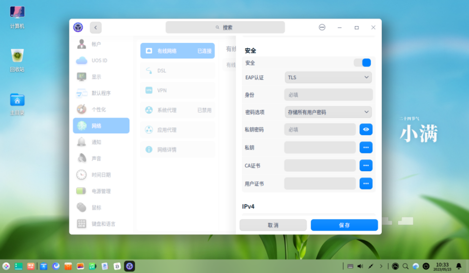

### 5. 如何调整输入法

在控制中心-键盘和语言-输入法设置中，点击编辑按钮，选择需要移除的输入法，或拖动调整输入法的顺序。如果不小心错误移除，只需点击添加按钮，选择输入法并确认添加，就能找回之前误删的输入法。

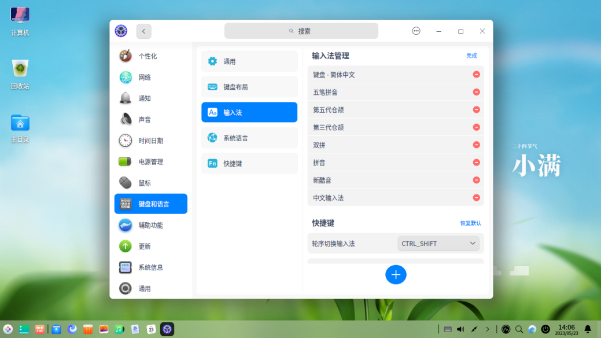

## 五、更多玩机技巧

欢迎您微信扫码打开统信玩机助手小程序，在线查看玩机指南。

