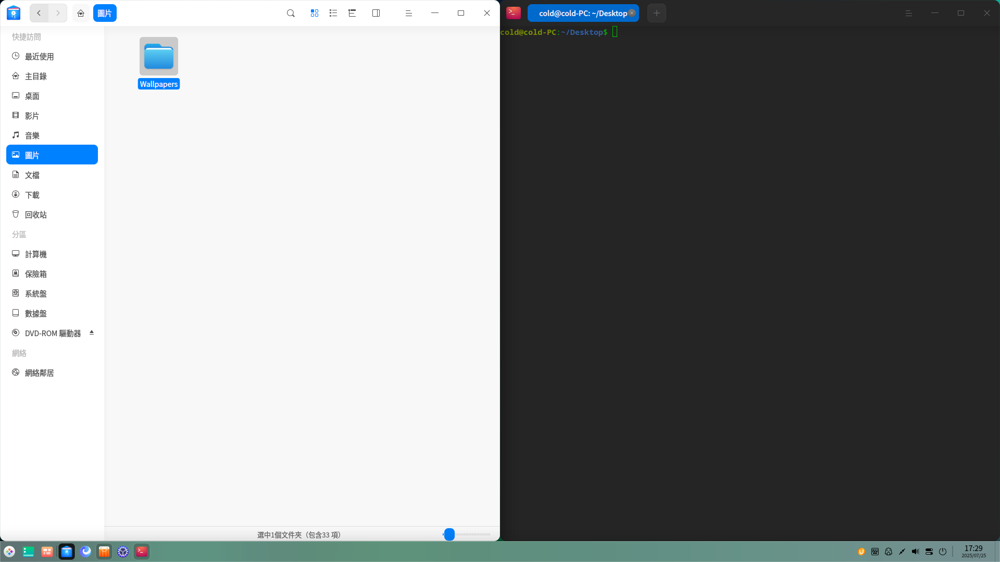

# 如何快速上手UOS|learn-basic-operations|

## 一、快速上手

統信UOS桌面提供與 Windows 相同的主屏佈局模式-高效模式。如果希望有更好的視覺效果，可選擇時尚模式。

**桌面佈局示意圖：**

### 1. 啟動器（開始菜單）

熟悉Windows的用戶都知道，使用任何功能都會從開始菜單開始，例如查找/打開應用。在統信UOS中，也有和Windows一樣的開始菜單（啟動器），您可以在啟動器裏完成和Windows開始菜單一樣的操作。更多啟動器的使用可查看**幫助手冊-桌面環境-啟動器**，敲擊“F1”按鍵打開幫助手冊。

### 2. 任務欄

和Windows下的任務欄一樣，統信UOS任務欄也包含了快捷啟動、托盤、插件等多個分區。快捷啟動欄可以固定您常用應用，方便一鍵打開。

圖標托盤區可以直接設置藍牙、網絡等快捷設置，您也可以通過拖拽托盤區圖標，將托盤收納進托盤窗口進行管理。

插件區會顯示常用操作，還可以通過控制中心-個性化-任務欄中進行自定義設置。可駐留截圖錄屏、系統監視器、全局搜索等常用插件，也可將部分插件拖拽至快捷面板進行管理，既美觀又方便。

### 3. 文件管理器（我的电脑）

**統信UOS下的“我的電腦”**

同Windows的資源管理器，統信UOS文件管理器和桌面一樣可對文件進行管理，桌面默認顯示“計算機”，等同于 Windows 的“此电脑”。

**為常用文件夾設定快速入口**

您可通過調整側邊欄，拖拽調整常用的文件夾排序方式。或將需要隨時查看的文件夾，通過右鍵菜單中的“添加到快捷訪問”，固定到側邊欄導航中。可讓文件管理器更合適您個人的使用習慣。

**便捷的右鍵菜單**

打印文件、壓縮文件、快捷發送文件等常用功能，都可以在文件的右鍵菜單中找到。

更多文件管理器的使用可查看**幫助手冊-文件管理器**，或[點擊鏈接](https://www.bilibili.com/video/BV1dT411574j/?share_source=copy_web&vd_source=76cf82177880a7aa76195eee437b80a6)觀看影片。

### 4.  應用商店

統信UOS無法安裝直接從網絡上下載的windows應用程式格式（exe），但提供安全、豐富的應用程式下載的渠道——**應用商店**。

可下載安裝辦公環境需要的 WPS、企業微信、釘釘、搜狗輸入法等應用的不同版本，建議直接選擇帶“推薦”標識的應用安裝。

## 二、辦公常用功能

### 1. 窗口管理

**應用分屏**

當您需要同時查看兩個應用窗口內容時，可以通過拖拽應用到螢幕左右邊緣觸發應用分屏操作，將有助於提高您的處理效率。

**切換窗口**

通過使用“Alt+Tab”快捷鍵，您可以和在Windows下一樣，在多個應用窗口之間快速切換，快速找到已打開應用。

**查看所有窗口**

而您開啟的窗口數量較多時，可以使用任務欄單擊  打開“多任務視圖”，或快捷鍵“Super（Win 圖標按鍵)+ S”，配合鼠標就能選中任意應用窗口進行切換。

### 2. 從截圖中提取文字內容

當您遇到圖片中有喜歡的文字，或某些網頁內容無法複製時，您可以使用系統自帶的截圖錄屏對其截圖，隨後在工具欄中點擊圖標，就可以從截圖中提取文字複製到其他地方或下載到本地，進而可以保存或分享給其他人。

### 3. 了解更多快捷鍵操作

**系統快捷鍵**

|         複製         |     剪切     |      黏貼       |
| :------------------: | :----------: | :-------------: |
|        Ctrl+C        |    Ctrl+X    |     Ctrl+V      |
|       **撤銷**       |   **打印**   |  **關閉窗口**   |
|        Ctrl+Z        |    Ctrl+P    |      Alt+W      |
|     **切換窗口**     | **全局搜索** |  **鎖定螢幕**   |
|       Alt+Tab        |  Shift+空格  |  Super(win)+L   |
| **切換螢幕顯示模式** | **圖文識別** |  **滾動截圖**   |
|     Super(win)+P     |  Ctrl+Alt+C  |   Ctrl+Alt+I    |
|       **截圖**       |   **錄屏**   |  **關機界面**   |
|      Ctrl+Alt+A      |  Ctrl+Alt+R  | Ctrl+Alt+Delete |

註：統信UOS能夠兼容Windows鍵，但是將其稱作“超級鍵”（Super鍵）。

**應用快捷鍵**

| 瀏覽器               |                             |
| -------------------- | --------------------------: |
| 重新打開關閉的標籤頁 |                Ctrl+Shift+T |
| 切換到下一個標籤     |     Ctrl+Tab或Ctrl+PageDown |
| 切換到上一個標籤     | Ctrl+Shift+Tab或Ctrl+PageUp |
| 關閉當前標籤         |             Ctrl+W或Ctrl+F4 |
| **輸入法**           |                             |
| 輪序切換輸入法       |                  Ctrl+Shift |
| 開啟/關閉輸入法      |                   Ctrl+空格 |
| 中英文切換           |                       Shift |

在應用窗口內使用快捷鍵“Ctrl + Shift + / ”查看更多應用快捷鍵介紹。

## 三、設置您的個性化桌面

隨着對統信UOS的逐漸熟悉，您是否想打造屬於自己的桌面，那就從壁紙設置開始吧。

### 1. 壁紙螢幕保護程式設置

**設置壁紙：**在桌面右鍵菜單中點擊“壁紙與螢幕保護程式”，便可在桌面底部選擇您喜歡的壁紙，或自定義您的照片為壁紙。如果想獲取更多個性化壁紙，還可以前往應用商店搜索壁紙進行下載。

**螢幕保護程式設置：**與壁紙設置入口相同，只需點擊“螢幕保護程式”設置即可，也可以單擊“自定義螢幕保護程式”將一組圖片設置為輪播螢幕保護程式，在設置彈窗中還可以設置輪播間隔和隨機輪播。

控制中心也提供了更多設定功能，可探索控制中心-個性化。

### 2. 外接螢幕設定

使用擴展模式時，如果您需要調整螢幕的拼接方式，可以前往“控制中心-顯示”進行設置。使用鼠標**拖動**螢幕縮略圖調整螢幕相對位置，與現實中兩個螢幕的位置相對應，可以達到更好的使用體驗。

## 四、常見問題解答

更多問題解答，請訪問 [FAQ]( https://faq.uniontech.com/)

### 1. 如何清理系統垃圾

安全中心的“垃圾清理”功能，可以清理無效的文件及數據，以釋放磁盤空間。打開安全中心，勾選要清理的數據類型，點擊“掃描”後會進行垃圾文件掃描，然後選擇要清理的內容，並點擊“立即清理”，操作便捷。

### 2. 如何監控系統狀態

在系統運行過程中，可能某個應用佔用太多資源導致系統卡頓。此時您可以打開系統監視器，結束佔用過高且未在使用的應用軟件進程，從而保障系統流暢。

### 3.  如何連接打印機

在打印管理器界面，點擊添加按鈕，進入添加打印機界面。應用將自動識別，並列出當前網絡掃描到的共享打印機。選擇打印後，應用會自動推薦最優驅動，點擊安裝完成後即可進行文檔打印。當然您可以通過手動查找、URI查找精準查找局域網內的打印機。

如果需要了解其他添加打印機的方式，可查閱**幫助手冊-打印管理器**。

### 4. 如何連接網絡

如果您在瀏覽器中無法打開網頁，需檢查是否已經連接有線網絡或無線網絡。您可在任務欄-托盤區域點擊WiFi圖標，選擇需要連接的WiFi名稱並輸入密碼，或者插入網線並啟用有線連接。

一般情況，企業網絡訪問有自己的安全認證方案，如需配置網絡安全認證，可前往控制中心-網絡，按需配置有線網絡或無線網絡即可。如需了解更多，可[點擊鏈接](https://www.bilibili.com/video/BV1ZT41157dp/?share_source=copy_web&vd_source=76cf82177880a7aa76195eee437b80a6)觀看影片。

### 5. 如何調整輸入法

在控制中心-鍵盤和語言-輸入法設定中，點擊編輯按鈕，選擇需要移除的輸入法，或拖動調整輸入法的順序。如果不小心錯誤移除，只需點擊添加按鈕，選擇輸入法並確認添加，就能找回之前誤刪的輸入法。

## 五、更多玩機技巧

歡迎您微信掃碼打開統信玩機助手小程序，在線查看玩機指南。

