# 如何快速上手UOS|learn-basic-operations|

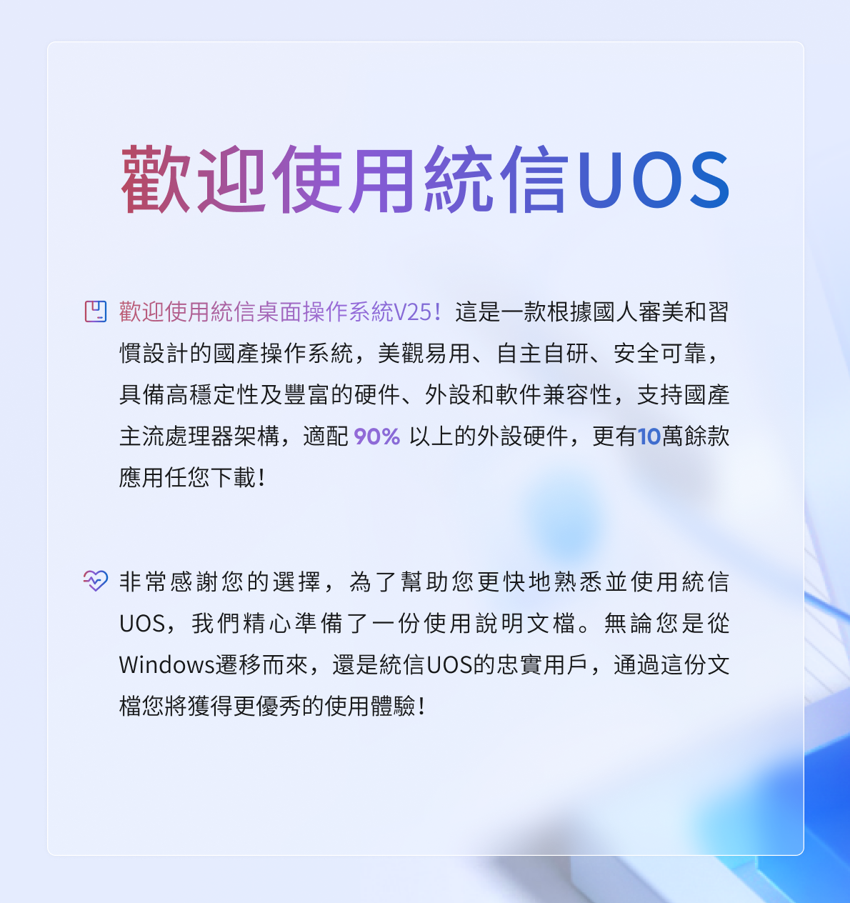

## 一、快速上手

統信UOS桌面提供與 Windows 相同的主屏布局模式-高效模式。如果希望有更好的視覺效果，可選擇時尚模式。

**桌面布局示意圖：**

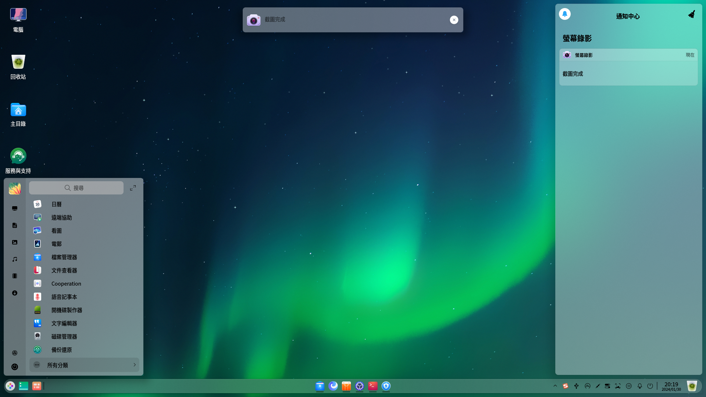

### 1.啟動器（開始選單）

熟悉Windows的使用者都知道，使用任何功能都會從開始選單開始，例如尋找/打開應用。在統信UOS中，也有和Windows一樣的開始選單（啟動器），您可以在啟動器裡完成和Windows開始選單一樣的操作。更多啟動器的使用可查看**幫助手冊-桌面環境-啟動器**，敲擊“F1”按鍵打開幫助手冊。

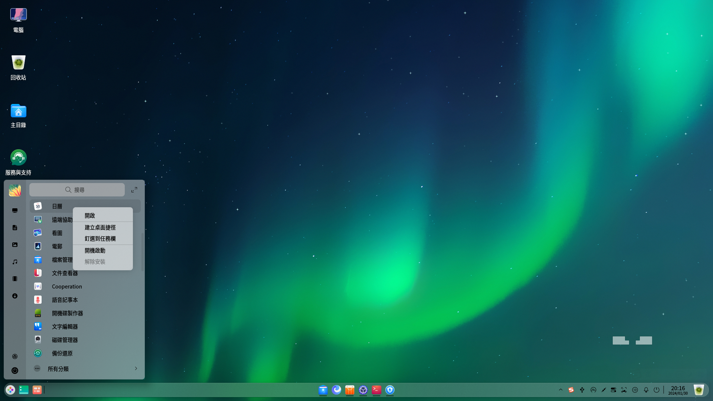

### 2. 任務欄

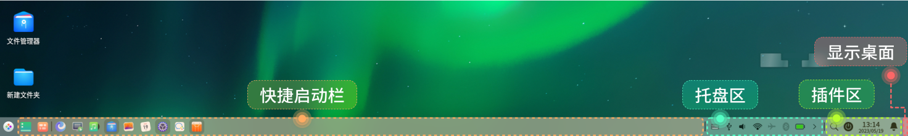

和Windows下的任務欄一樣，統信UOS任務欄也包含了快捷啟動、工具列、外掛程式等多個分區。快捷啟動欄可以固定您常用應用，方便一鍵打開。

圖示工具列區可以直接設定藍牙、網路等快捷設定，您也可以透過拖曳工具列區圖示，將工具列收納進工具列視窗進行管理。

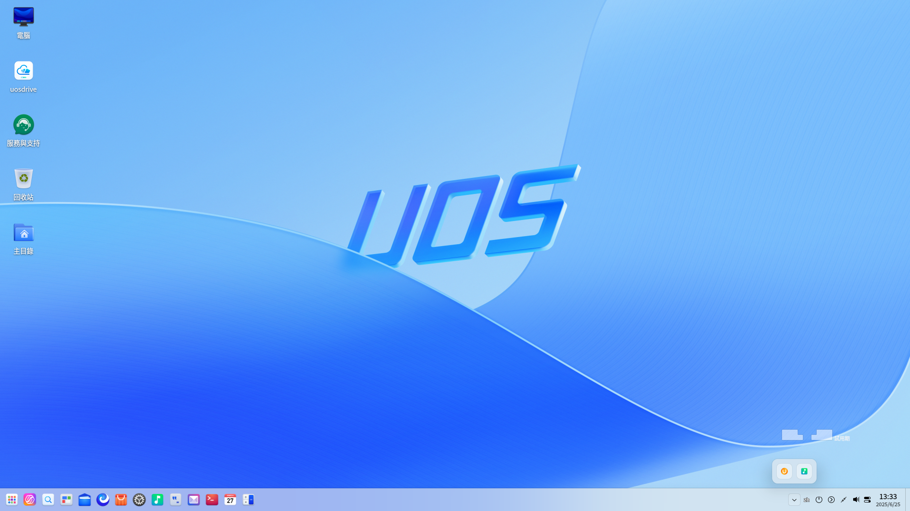

外掛程式區會顯示常用操作，還可以透過控制中心-個性化-任務欄中進行自訂設定。可駐留截圖錄屏、系統監視器、全域搜尋等常用外掛程式，也可將部分外掛程式拖曳至快捷面板進行管理，既美觀又方便。

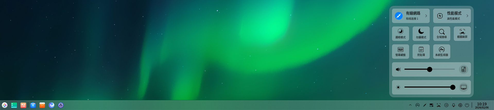

### 3. 文件管理器（我的电脑）

**統信UOS下的“我的電腦”**

同Windows的資源管理器，統信UOS檔案管理器和桌面一樣可對文件進行管理，桌面預設顯示“電腦”，等同於 Windows 的“此電腦”。

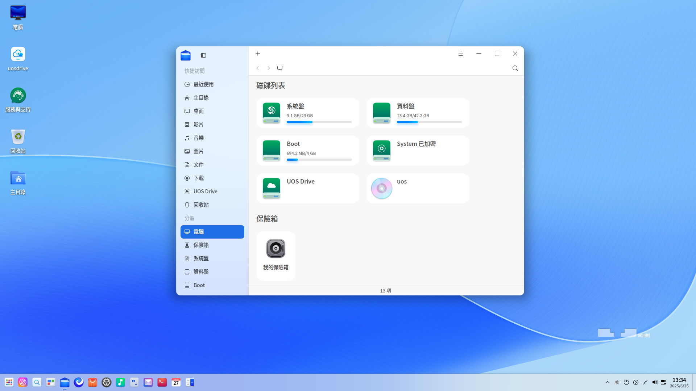

**為常用文件夾設定快速入口**

您可透過調整側邊欄，拖曳調整常用的資料夾排序方式。或將需要隨時查看的資料夾，透過右鍵選單中的“添加到快捷訪問”，固定到側邊欄導航中。可讓檔案管理器更合適您個人的使用習慣。

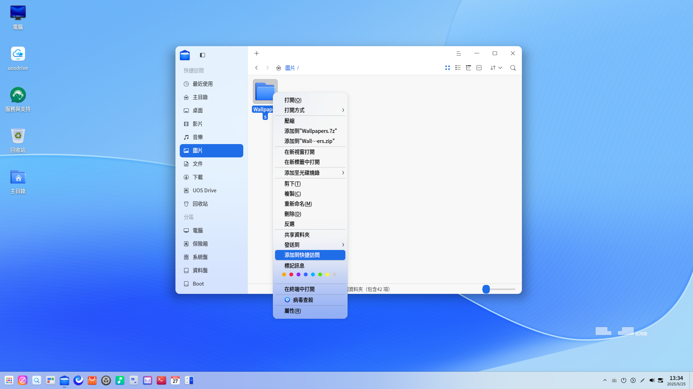

**便捷的右鍵選單**

列印文件、壓縮文件、快捷發送文件等常用功能，都可以在文件的右鍵選單中找到。

更多檔案管理器的使用可查看**幫助手冊-檔案管理器**，或[點擊連結](https://www.bilibili.com/video/BV1dT411574j/?share_source=copy_web&vd_source=76cf82177880a7aa76195eee437b80a6)觀看影片。

### 4. 應用商店

統信UOS無法安裝直接從網路上下載的windows應用程式格式（exe），但提供安全、豐富的應用程式下載的渠道——**應用商店**。

可下載安裝辦公環境需要的 WPS、企業微信、釘釘、搜狗輸入法等應用的不同版本，建議直接選擇帶“推薦”標識的應用安裝。

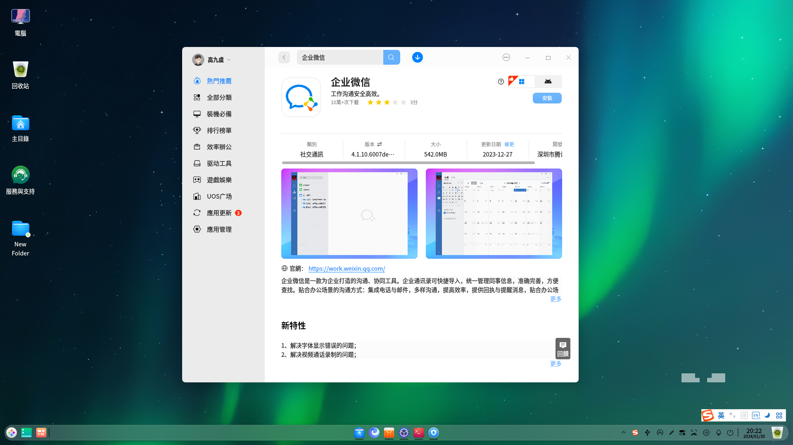

## 二、辦公常用功能

### 1. 視窗管理

**應用分屏**

當您需要同時查看兩個應用視窗內容時，可以透過拖曳應用到螢幕左右邊緣觸發應用分屏操作，將有助於提高您的處理效率。

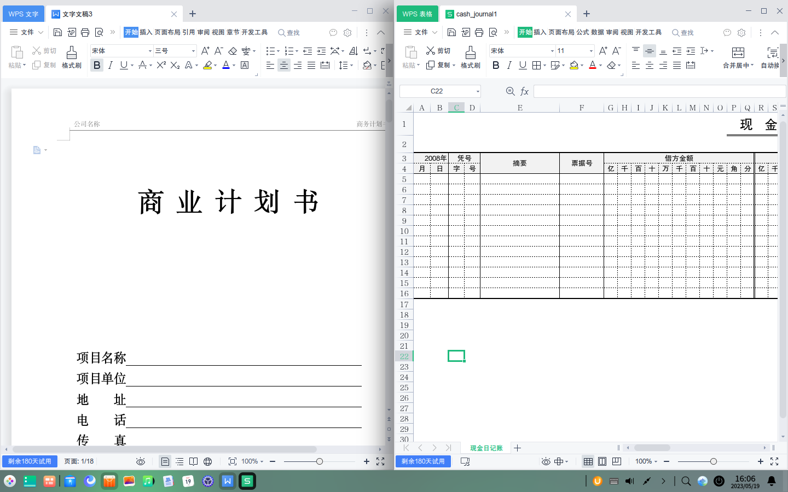

**切換視窗**

透過使用“Alt+Tab”快捷鍵，您可以和在Windows下一樣，在多個應用視窗之間快速切換，快速找到已打開應用。

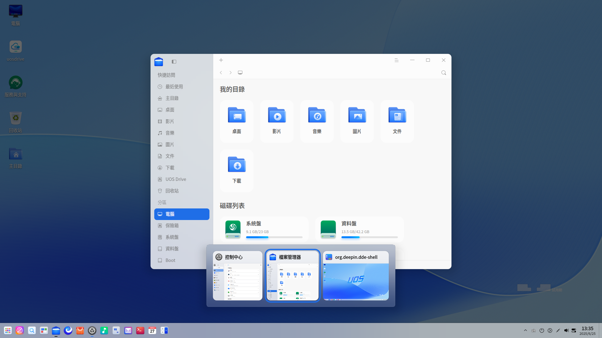

**查看所有視窗**

而您開啟的視窗數量較多時，可以使用任務欄單擊  打開“多任務檢視”，或快捷鍵“Super（Win 圖示按鍵)+ S”，配合滑鼠就能選中任意應用視窗進行切換。

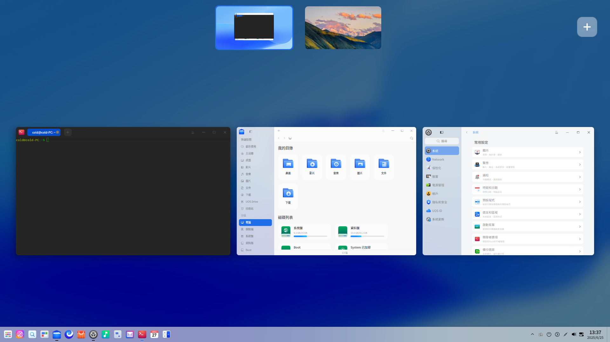

### 2. 從截圖中提取文字內容

當您遇到圖片中有喜歡的文字，或某些網頁內容無法複製時，您可以使用系統內建的截圖錄屏對其截圖，隨後在工具列中點擊圖示，就可以從截圖中提取文字複製到其他地方或下載到本機，進而可以儲存或分享給其他人。

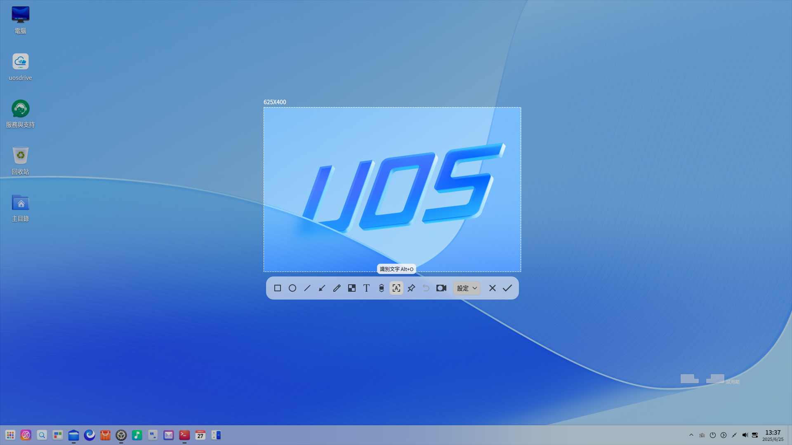

### 3. 了解更多快捷鍵操作

**系統快捷鍵**

|         複製         |     剪下     |      貼上       |
| :------------------: | :----------: | :-------------: |
|        Ctrl+C        |    Ctrl+X    |     Ctrl+V      |
|       **復原**       |   **列印**   |  **關閉視窗**   |
|        Ctrl+Z        |    Ctrl+P    |      Alt+W      |
|     **切換視窗**     | **全域搜尋** |    **锁屏**     |
|       Alt+Tab        |  Shift+空格  |  Super(win)+L   |
| **切換螢幕顯示模式** | **圖文識別** |  **滾動截圖**   |
|     Super(win)+P     |  Ctrl+Alt+C  |   Ctrl+Alt+I    |
|       **截圖**       |   **錄屏**   |  **關機介面**   |
|      Ctrl+Alt+A      |  Ctrl+Alt+R  | Ctrl+Alt+Delete |

註：統信UOS能夠相容Windows鍵，但是將其稱作“超級鍵”（Super鍵）。

**應用快捷鍵**

| 瀏覽器             |                             |
| ------------------ | --------------------------: |
| 重新打開關閉的分頁 |                Ctrl+Shift+T |
| 切換到下一個標籤   |     Ctrl+Tab或Ctrl+PageDown |
| 切換到上一個標籤   | Ctrl+Shift+Tab或Ctrl+PageUp |
| 關閉目前標籤       |             Ctrl+W或Ctrl+F4 |
| **輸入法**         |                             |
| 輪序切換輸入法     |                  Ctrl+Shift |
| 開啟/關閉輸入法    |                   Ctrl+空格 |
| 中英文切換         |                       Shift |

在應用視窗內使用快捷鍵“Ctrl + Shift + / ”查看更多應用快捷鍵介紹。

## 三、設定您的個性化桌面

隨著對統信UOS的逐漸熟悉，您是否想打造屬於自己的桌面，那就從桌布設定開始吧。

### 1. 桌布螢幕保護程式設定

**設定桌布：**在桌面右鍵選單中點擊“桌布與螢幕保護程式”，便可在桌面底部選擇您喜歡的桌布，或自訂您的照片為桌布。如果想獲取更多個性化桌布，還可以前往應用商店搜尋桌布進行下載。

此处缺少图片

**螢幕保護程式設定：**與桌布設定入口相同，只需點擊“螢幕保護程式”設定即可，也可以單擊“自訂螢幕保護程式”將一組圖片設定為輪播螢幕保護程式，在設定跳出視窗中還可以設定輪播間隔和隨機輪播。

此处缺少图片

控制中心也提供了更多設定功能，可探索控制中心-個性化。

### 2. 外接螢幕設定

使用擴展模式時，如果您需要調整螢幕的拼接方式，可以前往“控制中心-顯示”進行設定。使用滑鼠**拖動**螢幕縮圖調整螢幕相對位置，與現實中兩個螢幕的位置相對應，可以達到更好的使用體驗。

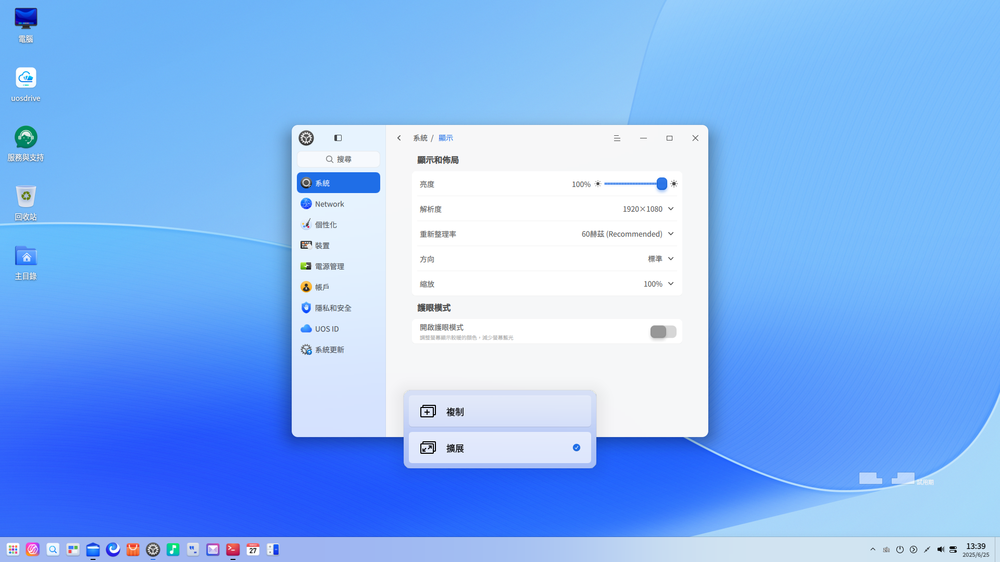

## 四、常見問題解答

更多問題解答，請訪問 [FAQ]( https://faq.uniontech.com/)

### 1. 如何清理系統垃圾

安全中心的“垃圾清理”功能，可以清理無效的文件及資料，以釋放磁碟空間。打開安全中心，勾選要清理的資料類型，點擊“掃描”後會進行垃圾文件掃描，然後選擇要清理的內容，並點擊“立即清理”，操作便捷。

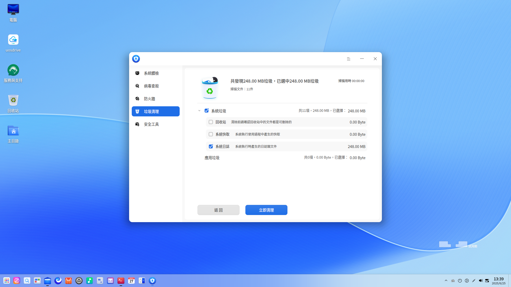

### 2. 如何監控系統狀態？

在系統執行過程中，可能某個應用占用太多資源導致系統卡頓。此時您可以打開系統監視器，結束占用過高且未在使用的應用軟體行程，從而保障系統流暢。

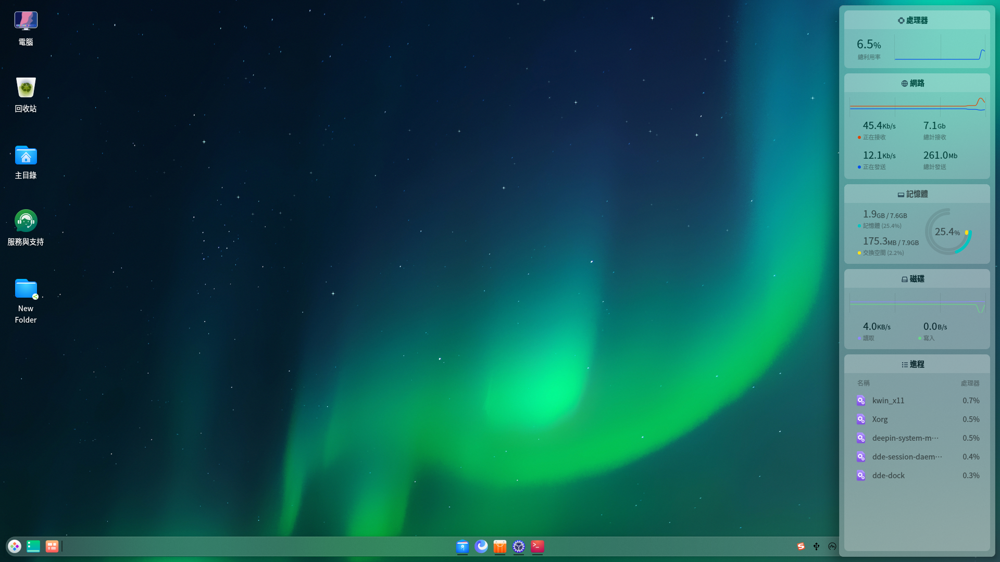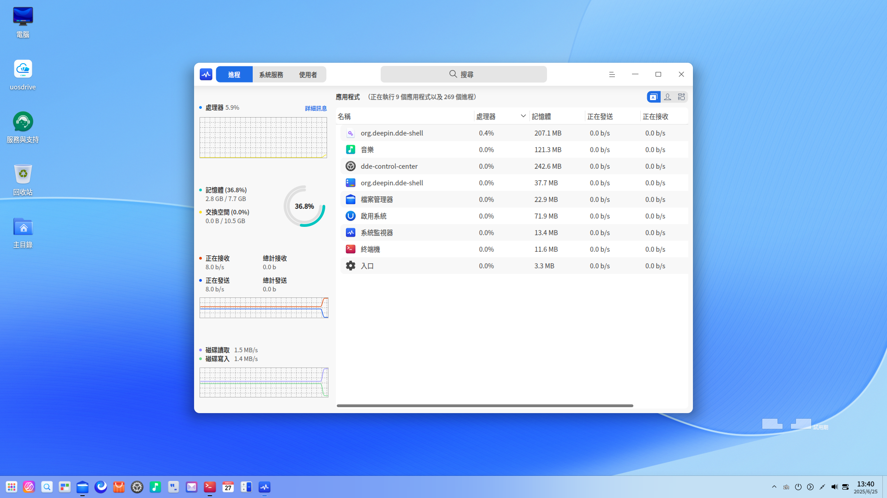

### 3. 如何連接印表機

在列印管理器介面，點擊添加按鈕，進入添加印表機介面。應用將自動識別，並列出目前網路掃描到的共享印表機。選擇列印後，應用會自動推薦最優驅動，點擊安裝完成後即可進行文件列印。當然您可以透過手動尋找、URI尋找精準尋找區域網路內的印表機。

如果需要了解其它添加印表機的方式，可查閱**幫助手冊-列印管理器**。

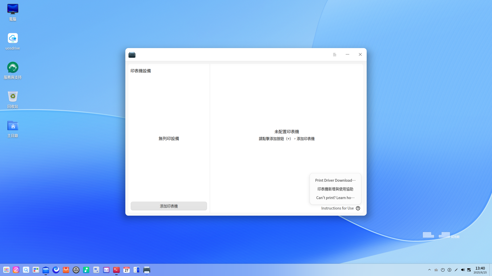

### 4. 如何連接網路？

如果您在瀏覽器中無法打開網頁，需檢查是否已經連接有線網路或無線網路。您可在任務欄-工具列區域點擊WiFi圖示，選擇需要連接的WiFi名稱並輸入密碼，或者插入網路線並啟用有線連接。

一般情況，企業網路訪問有自己的安全認證方案，如需配置網路安全認證，可前往控制中心-網路，按需配置有線網路或無線網路即可。如需了解更多，可[點擊連結](https://www.bilibili.com/video/BV1ZT41157dp/?share_source=copy_web&vd_source=76cf82177880a7aa76195eee437b80a6)觀看影片。

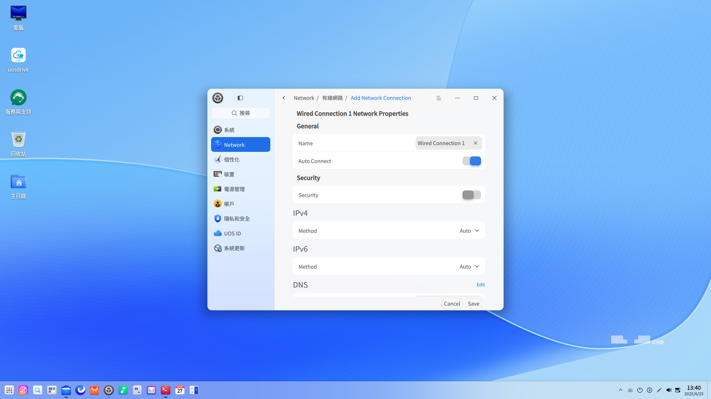

### 5. 如何調整輸入法

在控制中心-鍵盤和語言-輸入法設定中，點擊編輯按鈕，選擇需要移除的輸入法，或拖動調整輸入法的順序。如果不小心錯誤移除，只需點擊添加按鈕，選擇輸入法並確認添加，就能找回之前誤刪的輸入法。

## 五、加入社群為您答疑解惑

歡迎微信掃碼加入統信官方社群，獲取貼心的線上服務：**完善的使用技巧、新鮮的產品資訊、有趣的官方活動**，應有盡有，群活動碼，永久有效。

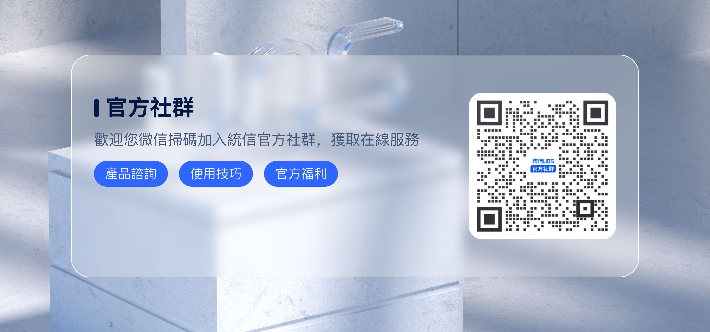

歡迎您微信掃碼打開統信玩機助手小程式，線上查看玩機指南。

