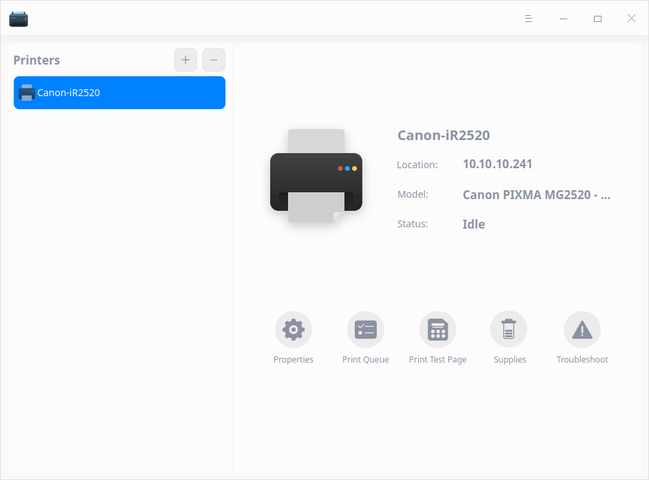
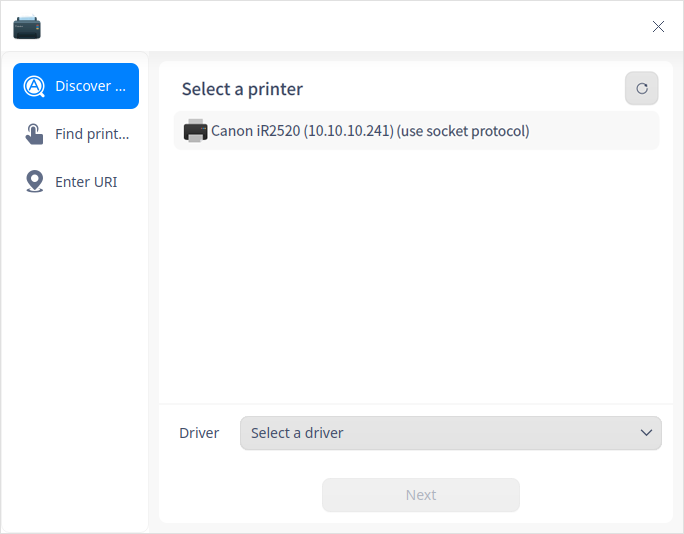
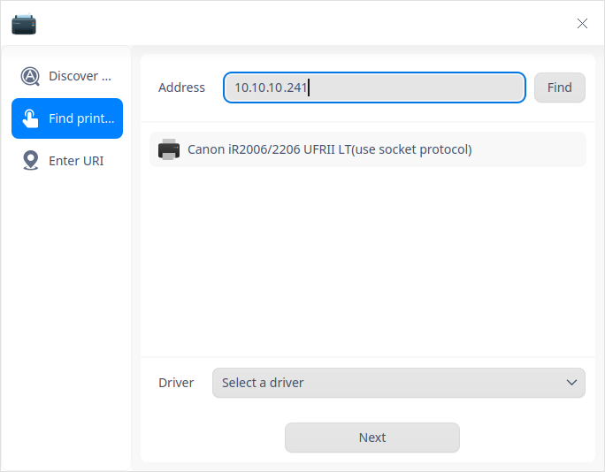
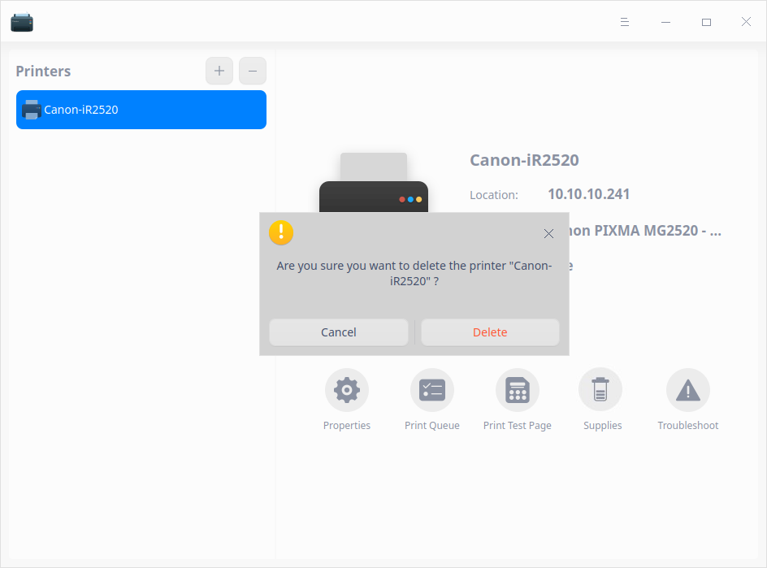

# Print Manager|../common/dde-printer.svg|

## Overview

Print Manager is an easy-to-use CUPS-based tool that manages several printers at a time with a simple interface providing users with great convenience to add printers and install drivers quickly.

## Guide

You can run, close or create a shortcut for Print Manager as follows.

### Run Print Manager

1. Click  on the Dock to enter the interface of launcher.
2. Locate  by scrolling the mouse wheel or searching "Print Manager" in the Launcher interface and click it to run. 
3. Right-click to:
   - Select **Send to desktop** to create a shortcut on the desktop.
   - Select  **Send to dock** to fix it onto the dock.
   - Select **Add to startup** to run it automatically when the computer is turned on.

### Exit Print Manager

- On the main interface, click   to exit.
- Right-click  on the Dock, select **Close all** to exit.
- On the main interface, click   and select **Exit** to exit.

## Operations

### Add Printer

On the main interface, click and you will have three options including **Discover Printer**, **Find Printer**, and **Enter URI**. 

#### Discover Printer

1. Click **Discover Printer** to load printer list automatically. Select the printer you want to add.

2. You can see a drop-down list of drivers for the printer selected. The recommended driver is selected by default. If you select "Select a driver" from the drop-down list, you will skip into an interface to select a driver you want.

   

3. Click  **Install Driver** to enter installing interface.

#### Find Printer

1. Click **Find Printer** , input user name or IP address to search printers through different protocols. 

   

2. After you select a printer, its driver list is loaded below, and the recommended driver is selected by default. If no list is loaded, you can choose "Select a driver" from the drop down list to enter an interface to choose a driver.

3. Click **Install Driver** to enter installing interface. 

#### Enter URI

1. If no printers are found by  **Discover Printer** and  **Find Printer** , you can find and install printer driver by entering URI.  

2. Click **Enter URI** and input printer's URI.

   

3. "Select a driver" is set by default. Click **Next** to enter driver installing interface.  

4. Choose the correct driver and click **Install Driver** to enter installing interface. 

### Select drivers

1. Default driver: The system will choose recommended driver by default if there is a correct driver for the printer you select. 

2. Select a driver: you can choose "select a driver". Sources of drivers include: 

   * Local driver: select vendor and model from drop-down box to query local drivers.

     

   * Local PPD files: drag and drop local PPD files here or click **Select a PPD file** to find one in local folder, for example, you can select a PPD file under the directory of /usr/share/ppd.  

   > Notes: Prerequisite of this operation is that user has installed driver locally. If not, you will get a hint "Driver install failed".

   

   * Search for a driver: input particular vendor and model, and the system will search in background driver library. Results will be listed in the drop-down box. 

   

### Install Printer

After you add a printer and select the correct driver, click **Install Driver** to enter installing interface.  

- Successfully Installed 
  A window pops up saying the printer is successfully installed, in which you can click **Print Test Page** to verify if printing works normally, or, you can click **View Printer** to enter the interface of Print Manager. 

  

- Install Failed
  
  You can choose to reinstall if you get a hint saying "Install Failed". 

  

### Print Manager Interface

Once a printer is added successfully, when you click the printer in the interface of Print Manager, you can see buttons on the right, which are "Properties", "Print Queue", "Print Test Page", "Supplies" and "Troubleshoot". 

#### Properties 

1. Click **Properties** to view all settings of the printer.

2. You can view the info about the printer's driver, URI, location, description, color mode and resolution instead of setting them.

3. Settable items include: paper source, paper type, paper size, duplex, margins, orientation, page order and binding. It can be set according to your actual needs. For example, the paper size can be A4, A5, B5 or A3, and the printing direction can be vertical, horizontal or anti horizontal.

> Notes: **Properties** are related to the printer model and its driver. Different printer models and drivers have different properties. You can set according to your practical situation. 

#### Print Queue

1. Click **Print Queue**, you will enter an interface, you can select options such as "All", "Print queue","Completed" and "Refresh". **Print Queue** is displayed by default. 

2. The list contains: "Job", "User", "Document", "Printer", "Size", "Time Submitted", "Status" and "Action". 

3. Select a job, right-click and you can select **Cancel**, **Delete**, **Pause**, **Resume**, **Print first**,  and **Reprint**. 

#### Print Test Page

Click **Print Test Page** to test if printing is completed successfully. 

   - Print successfully: if printing is completed successfully, you can continue with other tasks.

   - Print failed: if printing fails, you can reinstall a printer or start troubleshooting. 

#### Supplies

In the main interface of Print Manager, click **Supplies** to view the ink/toner status. If it's insufficient, it needs to be replaced.

#### Troubleshoot

If printing fails, you can click **Troubleshoot**, the checklist includes following items: 

   - Check if CUPS server is valid.

   - Check if driver is valid.

   - Check if printer settings are ok, i.e. if printer is started up, and, if tasks are accepted.

   - Check if printer connection is valid.

     
#### Right-click options 

Select the printer and right-click, you will have four options such as "Shared", "Enabled", "Accept jobs", and "Set as default". 

### Delete Printer

On the main interface, click to delete selected printer. 

## Main Menu

In the main menu, you can set basic servers, switch themes, view help manual, and so on.

### Settings

1. Click on the interface.

2. Click **Settings**.

3. Basic server settings include: 

   - Publish shared printers connected to this system: Allow printing from the Internet
   - Allow remote administration
   - Save debugging information for troubleshooting 

   

### Theme

The window theme includes Light Theme, Dark Theme and System Theme.

1. Click on the interface.
2. Click  **Theme** to select one.

### Help

Click Help to get the manual, which will help you further know and use Print Manager.

1. Click on the interface.
2. Click **Help** to view the manual.

### About

1. Click on the interface.
2. Click **About** to view version information and introduction about Print Manager.

### Exit

1. Click on the interface.
2. Click  **Exit**.

Update Date: 2021-06-23 Version: 0.7
