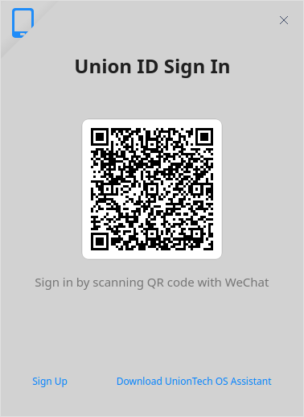
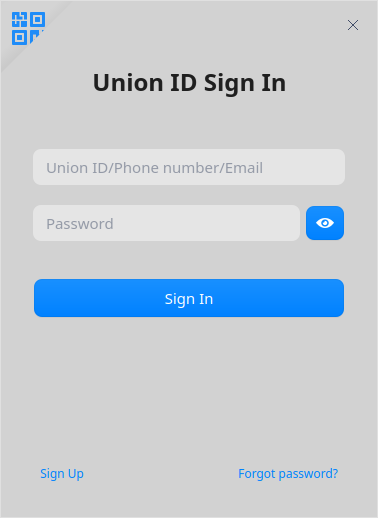

# App Store|../common/deepin-appstore.svg|

## Overview
App Store is a piece of application that integrates functions such as application recommendation, downloading, installation, and uninstallation. App Store collects different types of applications for you, each one has been installed and verified manually. You can search the popular applications with one-click download and automatic installation.           

## Guide

You can run, close or create a shortcut of App Store as follows.

### Run App Store

1. Click    in the lower left corner of the dock to enter launcher interface.
2. Locate  by scrolling the mouse wheel or searching "App Store" in the Launcher interface and click it to run. 
3. Right-click    to:
 - Select **Send to desktop** to create a shortcut on the desktop.
 - Select **Send to dock** to fix it onto the dock.
 - Select **Add to startup** to add it to startup. When the computer starts up, App Store runs automatically.

>  Notes: App Store has been fixed on the dock by default. Click   on the dock to run it.

### Exit App Store

   - On App Store interface, click  to exit.
   - Right-click   on Dock and select  **Close All** to exit.
   - On App Store interface, click   and select  **Exit**.

## Operations
### Log in

On App Store interface, click the login button in the upper left corner to enter login interface. You can log in by scanning via WeChat or via Union ID.

**Scan via WeChat**
Open WeChat on your phone and scan the QR code.

**Login via Union ID**
Enter your Union ID/mobile phone number/email and password to log in.

>Attention: If you don't have an ID yet, you can click **Register here** in the pop-up box and go to the website to register. 

### Search Applications
You can search applications by keywords.

### Application Details
You can open the information page of any application to view relevant information such as its category, version, updated date, introduction and so on.

### Download/Install Applications

App Store offers one-click downloading and installation of applications. 

1.  On App Store interface, click **Install** button next to the application. 
2.  Click  to enter download interface, you can view the installing progress, and empty the downloading history.

### Update Applications

Select **Updates** on the main interface to view applications to be updated here and you can choose whether to update them or not. You can also view the recently updated applications and their information.

> Tips: You can also update/upgrade pre-installed applications in Control Center. Refer to [Update Settings](dman:///dde#Update Settings) for particular operations.

### Uninstall Applications

On **My Apps** interface, find the applications you want to uninstall, and click **Uninstall**.

Besides uninstalling applications from App Store, you can also make it done from Launcher. Refer to [Uninstall Applications](dman:///dde#Uninstall Applications) for specific operations.

## Main Menu

### Settings
1. Click  > **Settings** on the main interface.
2. Check **Create desktop icons once installed** and **Auto download apps with newer versions if the network is idle**.

### Help

Click Help to get the manual, which will help you further know and use App Store.

1. Click  on the main interface.
2. Click **Help** to view the manual of App Store.

### About
1. Click  on the main interface.
2. Click **About** to view version information about App Store.

### Check for updates
1. Click  on the main interface.
2. Click **Check for updates** to update App Store.

Update Date: 2021-04-29 Version: 6.2
