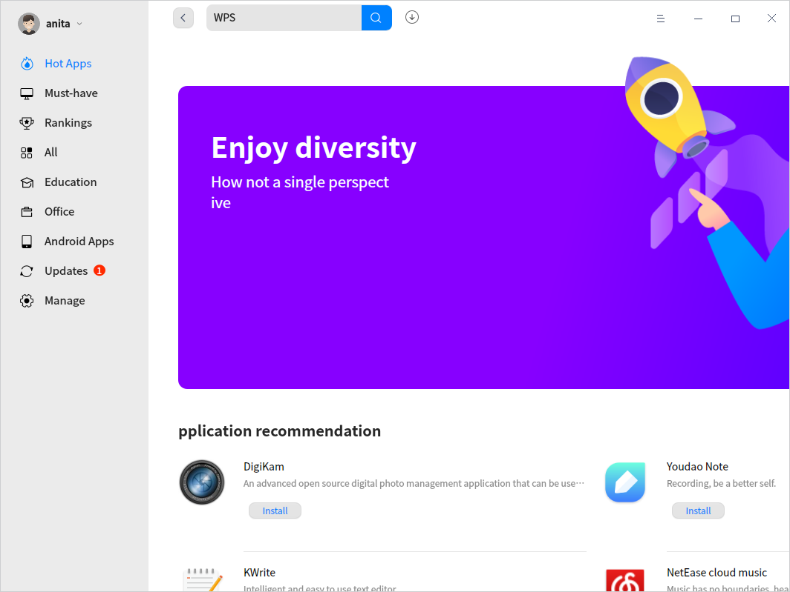
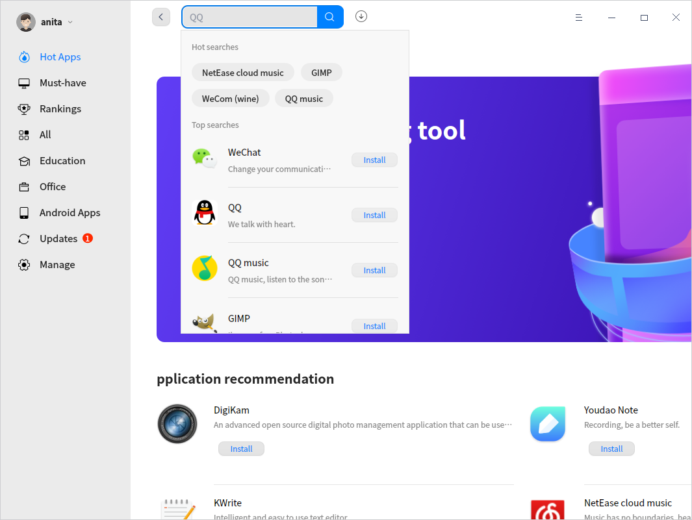
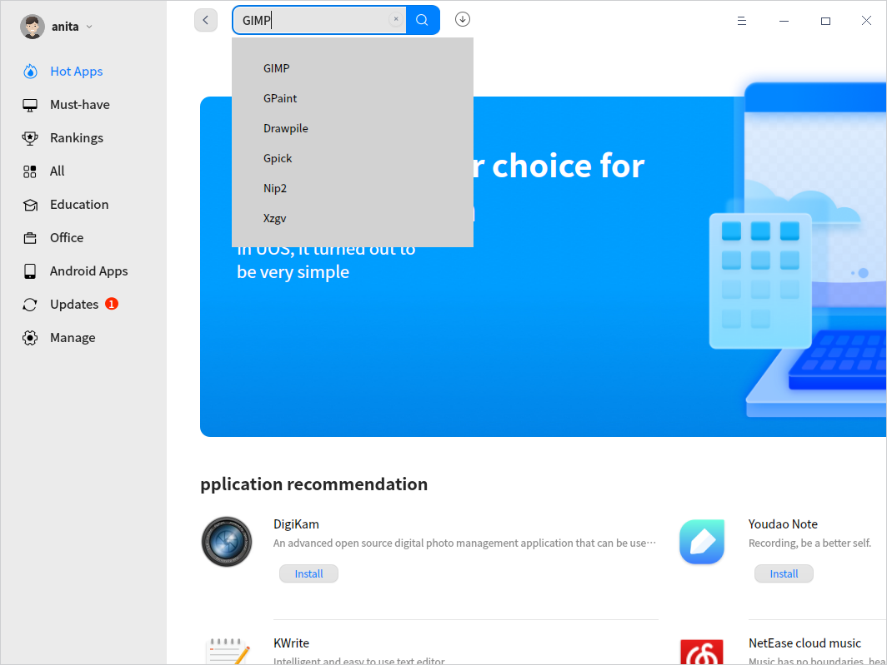
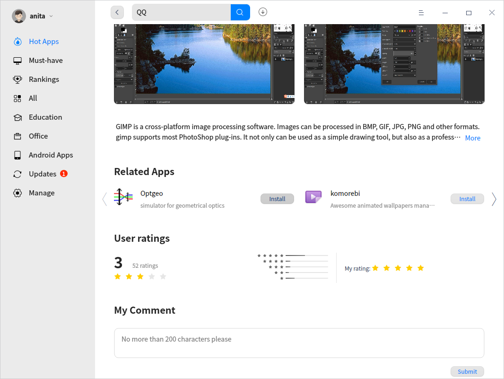
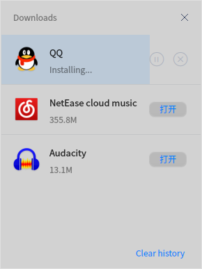
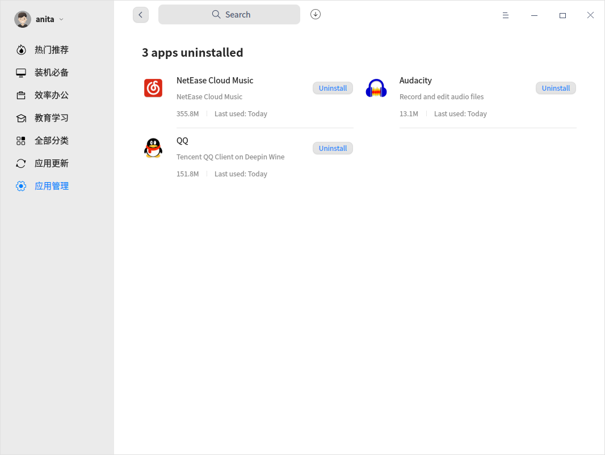

# Education Center|../common/deepin-app-store.svg|

## Overview
Education Center is a piece of application that integrates functions such as application recommendation, downloading, installation, and uninstallation. Education Center collects different types of applications for you, each one has been installed and verified manually. You can search the hot applications with one-click download and automatic installation.           

## Guide

You can run, close or create a shortcut of Education Center as follows.

### Run Education Center

1. Click    in the lower left corner of the Dock to enter launcher interface.
2. Locate  by scrolling the mouse wheel or searching "Education Center" in the Launcher interface and click it to run. 
3. Right-click    to:
 - Select **Send to desktop** to create a shortcut on the desktop.
 - Select **Send to dock** to fix it in the Dock.
 - Select **Add to startup** to add it to startup. When the computer starts up, Education Center runs automatically.

>  Notes: Education Center has been fixed in the Dock by default. Click   in the Dock to run it.

### Exit Education Center

   - On Education Center interface, click  to exit.
   - Right-click   in the Dock and select  **Close All** to exit.

## Operations
### Log In

There are three ways to sign in Union ID, including login by password, quick login, and login by WeChat.

**Login by password**

1. When you click **Sign In**, the interface **Union ID Sign In** pops up automatically.
2. Input your ID and password. Click **Sign In**.

**Quick login**

1. Click **Quick login** in the interface **Union ID Sign In** to enter the quick login interface.
2. Input your phone number and click **Get Code**. Input the code into the "SMS verification code" box and click **Sign In**. 

**Login with WeChat**

1. Click WeChat icon in the interface **Union ID Sign In** to enter a window with a QR code inside.
2. Scan it with WeChat on your phone to sign in.

>Notes: If you don't have an ID yet, you can click **Sign Up** and go to the website to register. 

### Application Categories
Application categories are displayed in the left column, including Hot Apps, Must-have, Rankings and so on. The common categories are described below.

>  Notes: With the continuous updating of the applications, the categories may also change. Please refer to the actual interface.

<table class="block1">
    <caption></caption>
    <tbody>
        <tr>
            <td width="100px">Hot Apps</td>
            <td>The slide show, Hot Apps, Rankings and so on are didsplayed here. Click the slideshow to show applications of that category.</td>
        </tr>
        <tr>
            <td>Must-have</td>
            <td> Essential applications in many usage scenarios are displayed here, such as office essentials, audio and video essentials, and so on. 
         Select the applications to be installed, click "Install All" to install in batches. 
       </td>
        </tr>
        <tr>
            <td>All</td>
            <td> All categories are displayed here. Click one to show applications of that category. 
                 Click "Downloads", "Updated Time" and "Ratings" to sort the applications. 
        </td>
        </tr>
         <tr>
            <td>Android Apps</td>
            <td>Android applications are displayed here, which could be installed on computers.</td>
        </tr>
        <tr>
   </tbody>
   </table>

### Search Applications

Convenient searching is supported.

-  Hot words slideshow in the search box is supported, so you can choose one to search.
-  Click the search box, the hot words window pops up. so you can choose one to search.

- Input keywords to search precisely.

### Application Details
1. You can open the information page of any application to view relevant information such as its category, version, updated date, introduction and so on. And you can view the recommended applications.
2. After you download an app, you will have to log in your Union ID to comment and rate it.

3. Click the drop-down icon after the Union ID in the top left corner, select **My Comments/Ratings** to view all comments and ratings under the Union ID and delete the comments.

### Download/Install Applications

Education Center offers one-click downloading and installation of applications. 

1.  On Education Center interface, click **Install** button next to the application. 
2.  Click  to enter download interface, you can view the installing progress, and empty the downloading history.

### Update Applications

Select **Updates** on the main interface to view applications to be updated here and you can choose whether to update them or not. You can also view the recently updated applications and their information.

> Tips: You can also update/upgrade pre-installed applications in Control Center. Refer to [Update Settings](dman:///dde#Update Settings) for particular operations.

### Uninstall Applications

On **Manage** interface, find the applications you want to uninstall, and click **Uninstall**.

Besides uninstalling applications from Education Center, you can also make it done from Launcher. Refer to [Uninstall Applications](dman:///dde#Uninstall Applications) for specific operations.

## Main Menu

### Settings
Click  > **Settings** on the main interface, you can select to check:

- **Create desktop icons once installed** 
- **Auto download apps with newer versions if the network is idle**.

### Help

Click Help to get the manual, which will help you further know and use Education Center.

1. Click  on the main interface.
2. Click **Help** to view the manual of Education Center.

### About
1. Click  on the main interface.
2. Click **About** to view version information about Education Center, and *UnionTech Software Privacy Policy*.

### Check for updates
1. Click  on the main interface.
2. Click **Check for updates** to update Education Center.

Update Date: 2021-07-23 Version: 6.2
