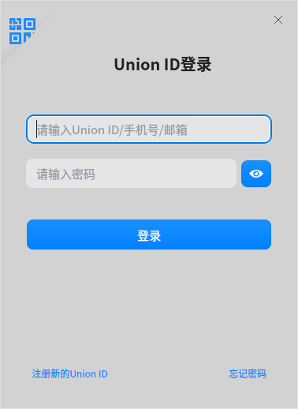
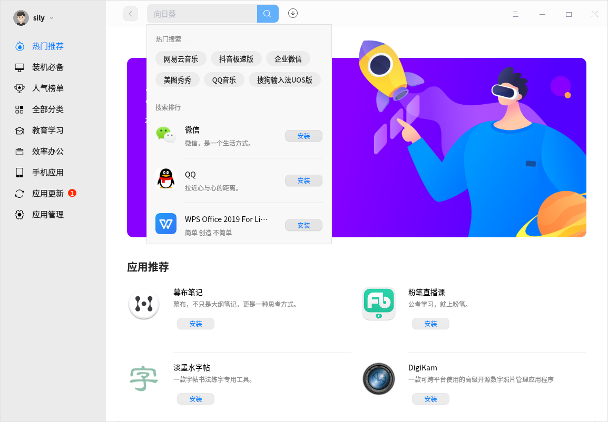
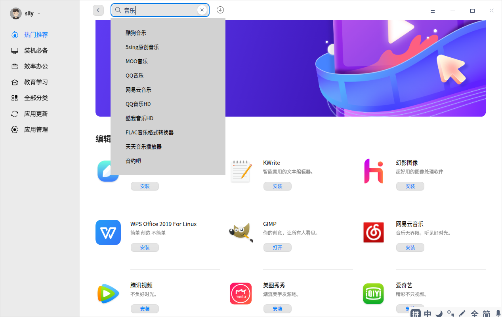
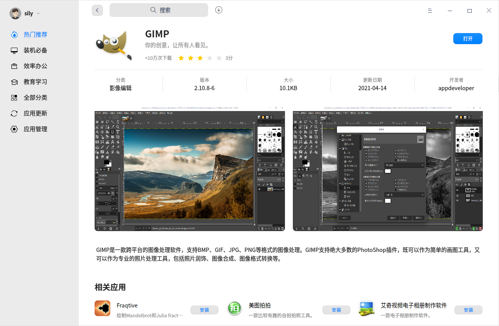
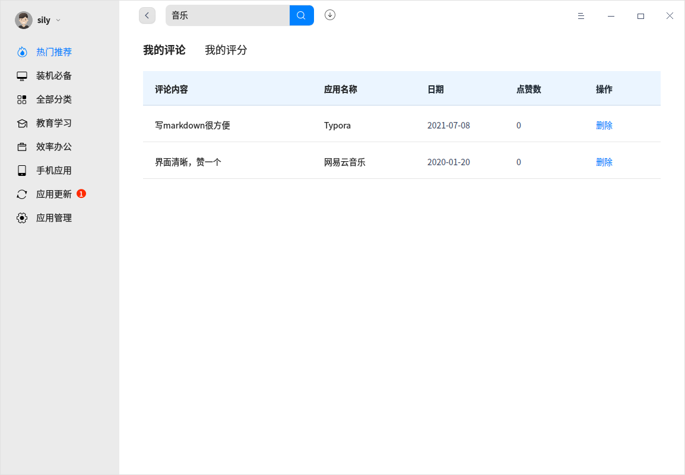
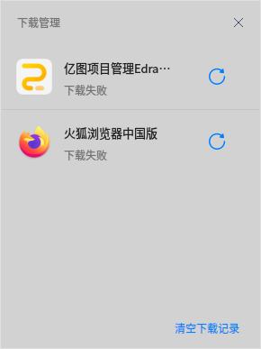
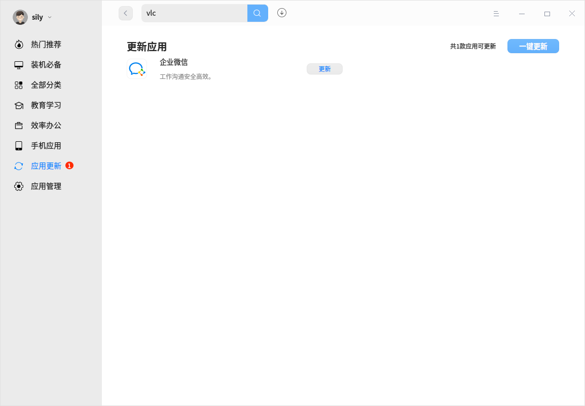
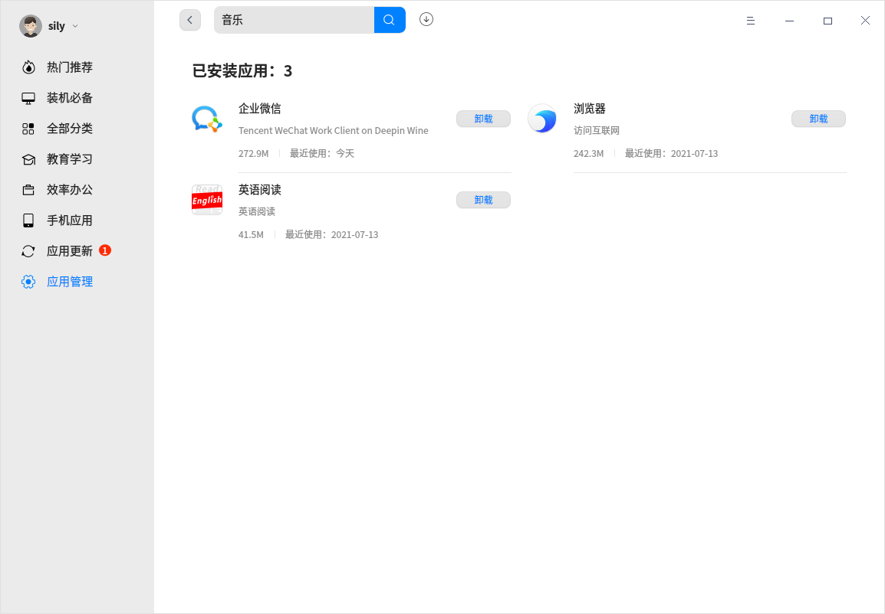

# 教育中心|../common/deepin-app-store.svg|

## 概述
教育中心是一款集应用推荐、下载、安装、卸载于一体的应用程序。教育中心精心筛选和收录了不同类别的应用，每款应用都经过人工安装并验证。您可以进入商店搜索热门应用，一键下载并自动安装。

## 使用入门

通过以下方式运行或关闭教育中心，或者创建教育中心的快捷方式。

### 运行教育中心

1. 单击任务栏上的启动器图标 ，进入启动器界面。
2. 上下滚动鼠标滚轮浏览或通过搜索，找到教育中心图标 ，单击运行。
3. 右键单击  ，您可以：
 - 单击 **发送到桌面**，在桌面创建快捷方式。
 - 单击 **发送到任务栏**，将应用程序固定到任务栏。
 - 单击 **开机自动启动**，将应用程序添加到开机启动项，在电脑开机时自动运行该应用。

>  说明：教育中心默认固定在任务栏上，您也可以单击任务栏上的  打开教育中心。

### 关闭教育中心

- 在教育中心界面，单击  ，退出教育中心。
- 在任务栏右键单击 ，选择 **关闭所有** 来退出教育中心。

## 操作介绍

### Union ID登录

登录Union ID有三种方式，帐号密码登录、手机快捷登录及微信扫码登录。

**帐号密码登录**

1. 在教育中心界面，单击左上角的 **登录** 按钮，进入登录界面。

2. 输入用户名/邮箱/手机号及密码，单击 **登录**。

   

**手机快捷登录**

1. 在登录界面，单击 **手机快捷登录**。

2. 输入您的手机号，单击 **获取验证码**，将收到的验证码输入到方框中，单击 **登录**。

   

**微信扫码登录**

1. 在登录界面，单击 **其他登录方式**。

2. 打开微信客户端扫描二维码登录。

   

>  说明：如果未注册帐号，单击登录界面的 **注册** 按钮进行帐号注册。

### 应用栏目

应用栏目展示教育中心的应用分类，包括热门推荐、装机必备、全部分类、手机应用等，下文简单介绍常见的应用栏目。

>  说明：随着应用的不断更新，应用栏目也可能随之变化，请以实际界面为准。

<table class="block1">
    <caption></caption>
    <tbody>
        <tr>
            <td width="100px">热门推荐</td>
            <td>展示轮播图、热门应用、下载排行榜等内容，单击轮播图可以查看相关的应用。</td>
        </tr>
        <tr>
            <td>装机必备</td>
            <td> 展示各类使用场景安装必备应用，如办公必备、影音必备等。 
         勾选需要安装的应用，单击“一键安装”则可以批量安装应用。 
       </td>
        </tr>
        <tr>
            <td>全部分类</td>
            <td> 展示所有的应用分类，单击某分类可以查看相关的应用。 
                 单击“下载量”、“更新时间”和“评分”还可以对应用进行排序。 
        </td>
        </tr>
         <tr>
            <td>手机应用</td>
            <td>展示各类安卓应用，可以安装到电脑端使用。</td>
        </tr>
        <tr>
   </tbody>
   </table>

### 搜索应用

教育中心提供方便快捷的搜索方式。

- 支持热搜词在搜索框中轮播，可以自行选择搜索。

- 单击搜索框，弹出热门搜索词窗口，可以自行选择搜索。

  

- 在搜索框中输入关键字进行精确搜索。

  

### 应用详情

1. 进入应用详情界面，了解应用的类别、版本、更新日期、评论及评分等信息，还可以查看系统推荐的相关应用。

2. 应用下载使用后，登录Union ID，可以进行评论及评分。

   

3. 单击左上角的Union ID下拉框，选择 **我的评论/评分**，查看该帐号下的所有评论及评分，还可以删除评论。

   

### 下载/安装应用

教育中心提供一键式的应用下载和安装，无需手动处理。

1. 在教育中心界面，单击应用旁边的 **安装** 按钮 ，可以下载并安装应用。
2. 单击下载按钮进入下载管理界面，查看当前应用的安装进度，还可以清空下载记录。

### 更新应用

在教育中心界面，选择 **应用更新**，查看待升级的应用，并选择是否更新应用。还可以查看最近更新的应用列表及信息。

> 窍门：通过控制中心也可以更新和升级系统预装的应用，具体操作请参阅 [更新设置](dman:///dde#系统更新)。

### 卸载应用

在 **应用管理 **界面，查看可以卸载的应用。找到要卸载的应用，单击 **卸载** 。

除了在教育中心卸载应用外，还可以通过启动器卸载应用，具体操作请参阅 [卸载应用](dman:///dde#卸载应用)。

## 主菜单

### 设置

在教育中心界面，单击 > **设置**，勾选设置选项。

- 安装后，自动生成桌面快捷图标

- 网络闲置时，自动下载有更新的应用

### 帮助

1. 在教育中心界面，单击 > **帮助**。
2. 查看教育中心的帮助手册，进一步了解和使用教育中心。

### 关于
1. 在教育中心界面，单击 >  **关于**。

2. 查看教育中心的版本、介绍及《统信软件隐私政策》。

### 检查更新

1. 在教育中心界面，单击 > **检查更新**。

2. 更新教育中心为最新版本。

文档更新时间: 2021-07-23 版本: 6.2
