# Contacts|../common/deepin-contacts.svg|

## Overview

Contacts is a communication management software based on Union ID supporting functions such as video conference, desktop sharing and so on, which provides users with great convenience in discussion and communication, and efficiency improvement as well.  

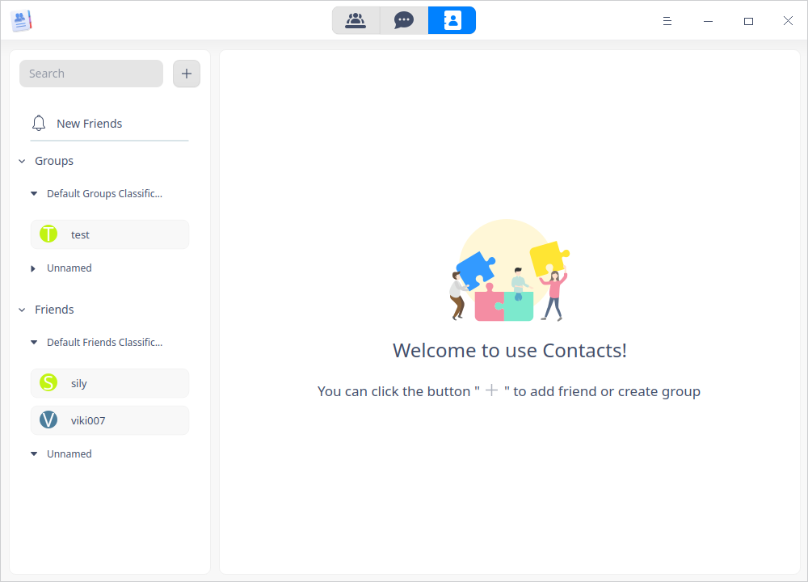

## Guide

You can run, close or create a shortcut for Contacts as follows.

### Run Contacts

1. Click  on the Dock to enter the interface of launcher.
2. Locate  by scrolling the mouse wheel or searching "Contacts" and click it to run.
3. Right-click  to: 
   - Select **Send to desktop** to create a shortcut on the desktop.
   - Select  **Send to dock** to fix it onto the dock.
   - Select **Add to startup** to run it automatically when the computer is turned on.

### Exit Contacts

- Right-click  in the system tray, select **Close all** to exit.
- On the main interface, click  and select **Exit** to exit.

## Sign In

Once **Contacts** is run, the interface **Union ID Sign In** pops up automatically. You can choose to sign in by scanning QR code with WeChat on your phone or by Union ID and password.

**Sign in by scanning QR code with WeChat**

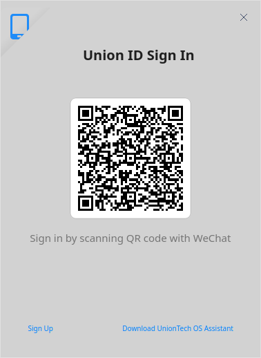

**Union ID Sign In**

Input your Union ID/phone number/email and password, click **Sign In**.

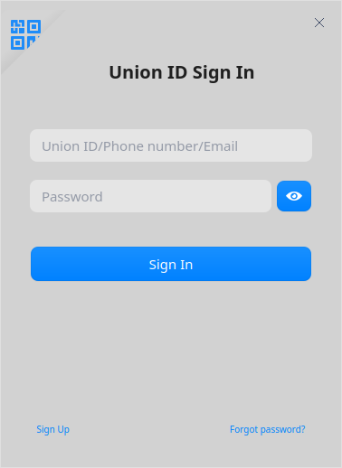

>  Notes: 
>- when you run **Contacts** again, the system will log in the ID automatically and enter the main interface of **Contacts**.
>- If you don't have a Union ID account, click hyper link **Sign Up**,  a signing-up web page is opened. Refer to [Union ID](dman:///dde#Union ID).

## Contacts

On the main interface, click   to enter the contacts interface.

### Friends

#### Add Friend

1. There are three ways to add friends, including: 

   - Click from the main interface to select **Add Friend**; 

   - Select the objective friends classification and right-click, select **Add Friend**; 

   - Click  located after the objective friends classification and select **Add Friend**.

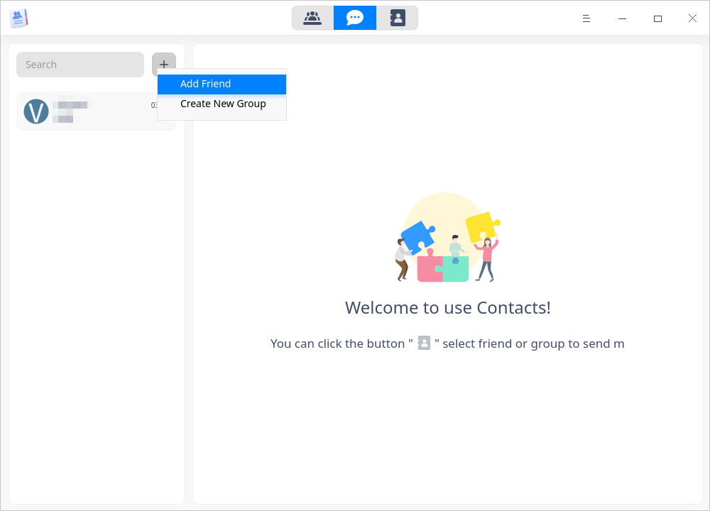

2. Input user name, email or phone number and click  to search a friend, and he/she will appear in the list if searched successfully, click .

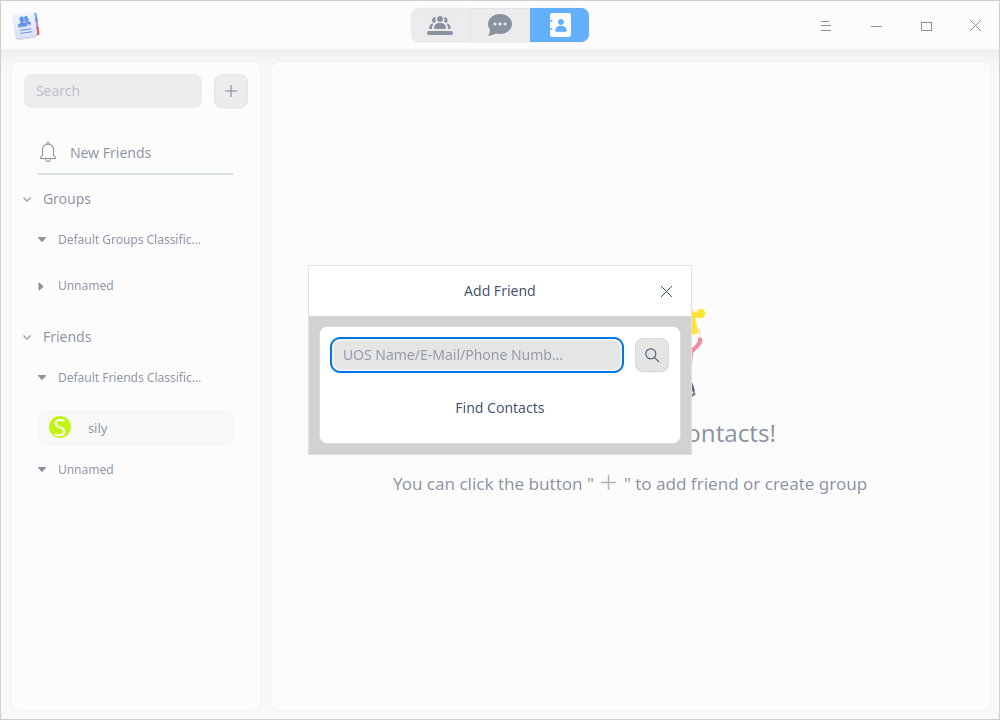

3. A dialogue box "Add Friend Request" pops up. Select classification, input a message and click  **Send**.

4. After the friend agrees to add you, you can see him/her in the list, and add a remark name for him/her.

#### New friends

When somebody requests to add you as a friend, a red dot will appear as a corner mark on the icon of "New Friends".
1. Click **New friends** to view the request and history.
2. You can select **Agree** or **Refuse** to add this new friend. 

#### Add Friends Classification

One default friends classification is displayed here, if you want to add others, do as follows.

1. Hover the cursor over **Friends** and right-click; or click , a popping-up box saying  **Add Friends Classification** appears.

2. Input a name and press **Enter** key, then, a new classification is created. If you have to change its name, you can right-click to select **Rename Classification**.

#### Friends' Information

1. Click a friend you want to view in the list, you can see detailed information about him/her.
2. The detailed information includes account, and remark name. You can recommend a namecard, chat with him/her and also create a video conference here.

#### Move Friend to

1. Select the friend you want to move, right-click and select **Move Friend To**.
2. Select the target classification in the popped-up box to complete this operation.

#### Delete Friend

1. Select the friend you want to delete, and right-click, then select **Delete Friend**.
2. A confirming box pops up, click **OK** then the selected friend will be deleted.

#### Delete Classification

1. Select the classification you want to delete and right-click; or, click to select **Delete Classification**.
2. A confirming box pops up, click **OK** then the selected classification will be deleted, and members in that classification will move to default classification.

### Groups

#### Create New Group

1. There are three ways to add friends, including:
   - Click from the main interface to select **Create New Group**; 
   - Select the objective groups classification and right-click, select **Create New Group**; 
   - Click  located after the objective groups classification and select **Create New Group**. 

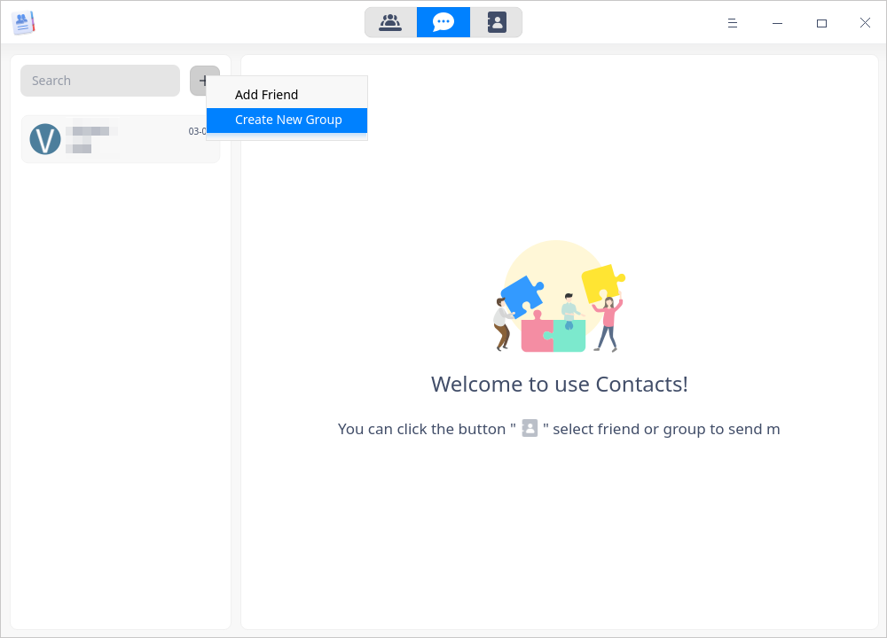

2. Customize the group's name, and select the friends you want to add in this new group from Friends.

3. Click **OK**. Then the group is created successfully.

#### Add Groups Classification

One default groups classification is displayed here, if you want to add others, do as follows.

1. Hover the cursor over **Groups** and right-click; or click , a popping-up box saying  **Add Groups Classification** appears.
2. click **Add Groups Classification** to input a name, then, a new group classification is created. If you haven't input a name for the new classification when creating it, you can right-click to select **Rename Classification**.

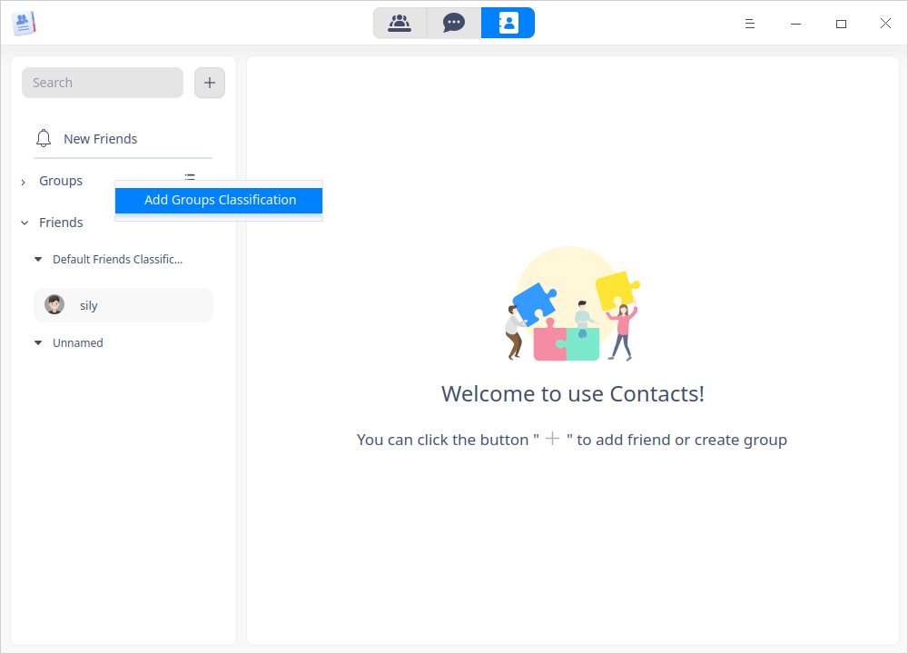

#### Group Info

1. Select the group you want to view, and the detailed information will appear on the right side.
2. You can see group name, group notice, create time, invitation mode and group members. You can also dismiss group or transfer group.

#### Move Group to

1. Select the group you want to move, right-click and select **Move Group To**.
2. Select the target groups classification in the popping-up box to complete this operation.

#### Transfer Group

1. Select the group you want to transfer, and click  .
2. Search or browse the friends to be transfered, select and click **OK**. Transferring is completed successfully when the transfer button disappears from this interface.

#### Dismiss Group

1. When you don't need a group any more, you can choose to dismiss it.
2. Select the group you want to dismiss, and click   .
3. Click  **OK**, then the group doesn't exist any more. The group will also disappear from the members' lists of groups automatically.
>  Notes: Only the creator of the group can dismiss it. Group members can only select to quit it.

#### Delete Groups Classification

1. Select the groups classification you want to delete, and right-click; or click then select **Delete Classification**.
2. A confirming box pops up, click **OK** then the selected groups classification will be deleted, members in the classification will be moved into default groups classification.

### Search Friend/Group

Prerequisite: you have already added some friends or created groups.

1. In "Contacts" interface, click the searching box.
2. To find a friend quickly, you can input his/her ID, nickname or remark name, or group name into the searching box.

  >  Notes: The object being searched should be somehow related to the Union ID, instead of a totally stranger.     

## ChatMsg

In "Contacts" interface, click   to enter "ChatMsg" interface. 

### Chat with friend/group members

1. In "Contacts" interface, select a friend or a group, click   to start chatting.

> Notes: You can search a friend/group in the search box of "ChatMsg" interface by name. 

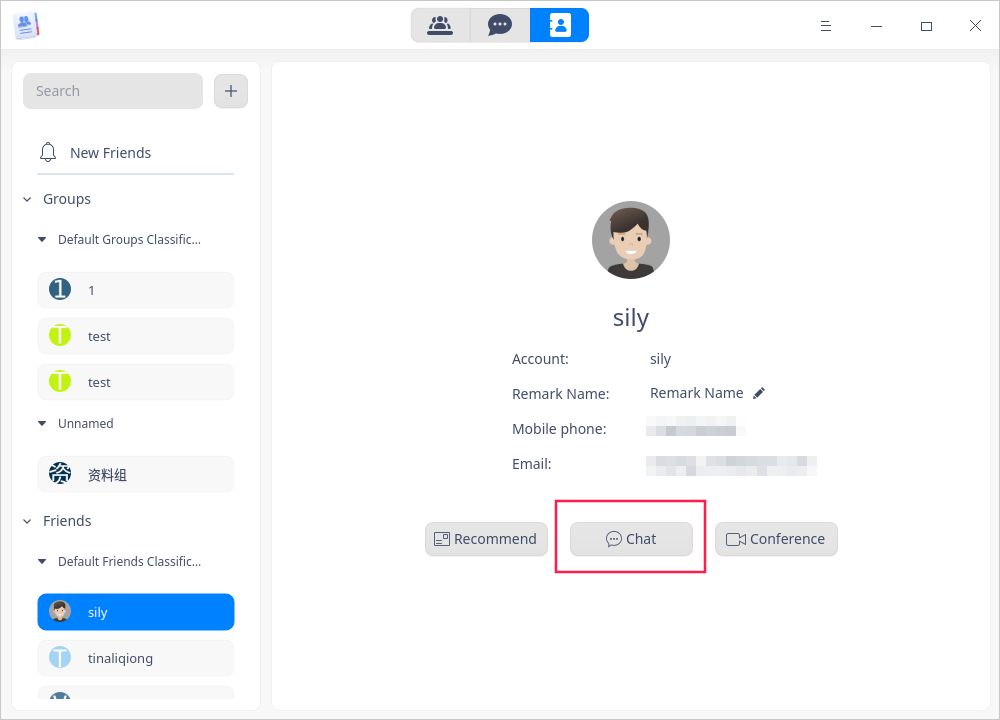

2. In the chatting window, you can send messages or click the following icons to do operations accordingly.

<table border="1">
<tr>
   <td width="10px">Icon</td>
   <td width="50px">Description</td>
   <td width="10px">Icon</td>
   <td width="50px">Description</td>
</tr>
<tr>
   <td></td>
   <td>To send emoji</td>
   <td></td>
   <td>To send file(s)</td>
</tr>
<tr>
   <td></td>
   <td>To capture screen</td>
   <td></td>
   <td>To share namecard</td>
</tr>
<tr>
   <td></td>
   <td>To enter history interface, then, to search, view or clearup chatting history.</td>
   <td></td>
   <td>To start vedio call</td>
</tr>
</table>

### Set friend/group info 

In the chatting list, right-click a friend or group to:

- select **Top**, this friend/group will be displayed on the top; 
- select **Mute**, there will be no reminders when the friend/group sends any message; 
- select **Delete**, the friend/group will be deleted from the chatting list, and chatting history will be cleared up at the same time.

## Conference

On the main interface, click  to enter the interface of conference.

### Create Conference

1. Click  to create a conference.

2. A setting interface pops up, you can set the conference according to practical needs here.

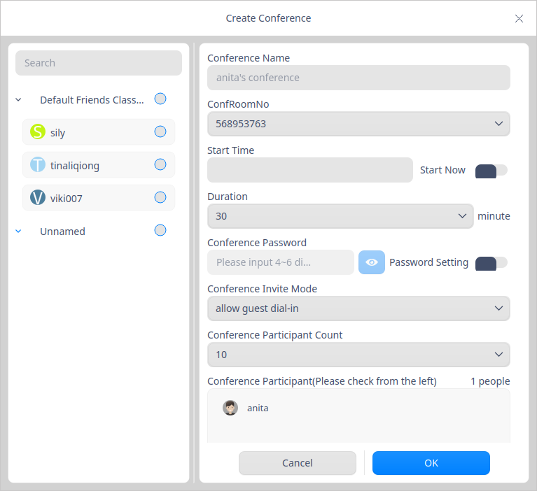

<table border="1">
<tr>
<th width="100px">Parameter</th>
<th>Description</th>
</tr>
<tr>
<td>Conference Name</td>
<td>You can customize a name or use the default name.
</td>
</tr>
<tr>
<td>Conference Room Number</td>
<td>Each user has a fixed conference room number. It can't be set.
</td>
<tr>
<td>Start Time</td>
<td>You can start a conference immediately or book a conference. To start a conference immediately, you can click <b>Start Now</b>; to book a conference, you can click the start time editing box, and Calendar plugin pops up, you can select a date and time.
</td>
<tr>
<td>Duration</td>
<td>Select a duration according to your needs. It is recommended to select a duration longer than the actual one. The conference ends automatically when the preset duration time is up.
 </td>
<tr>
<td>Conference Password</td>
<td>You can set a password and share it with all participants. People without the password could not join the conference, which can guarantee the security of the conference.
</td>
<tr>
<td>Conference Invite Mode</td>
<td>There are three options including "allow guest dial-in", "participant invite", and "owner invite", ranking by rights from high to low. <b>Notify Participants</b> is turned on by default.
<ul>
    <li>Allow guest dial-in: share the conference room number and password with guests, and the guests can click <b>Quickly Join Conference</b>, and then input the conference room number and password to join the conference. After he/she enters the conference, he/she is able to invite others to join the conference.</li>
<li>Participant invite: participants have the right to invite other people to join the conference.</li>
<li>Owner invite: participants could only be invited by conference owner to join the conference.</li>
<tr>
<td>Conference Participant</td>
<td>Select participants from the friend list on the left.  </td>
</tr>
</table>

3. Click **OK** to create a conference.

### Quickly Join Conference

This function is designed only for the option **Allow guest dial-in** .

1. Click **Quickly join conference**, a dialogue box pops up.

2. Input the conference room number and password, select whether to "turn off camera" or "turn off microphone" or not, then click **Join**. 

### During Conference

During conference the owner can do the following settings.

<table border="1">
<tr>
   <td width="60px">Icons</td>
   <td>Description</td>
</tr>
<tr>
   <td></td>
   <td>Mute: you can mute your microphone. "Unmute" is set by default.</td>
</tr>
<tr>
   <td></td>
   <td>Camera: you can turn off your camera. The camera is turned on by default.</td>
</tr>
<tr>
   <td></td>
   <td>Desktop share: Click this button, all participants could see your desktop.</td>
</tr>
<tr>
   <td></td>
   <td>Conference control: this button is to control the conference order. Different roles have different controlling rights. <ul>
<b>Owner's rights</b>
   <li>Turn off/on all microphones; </li>
   <li>Turn off/on some participant's microphone; </li>
   <li>Allow/Prohibit all participants to turn on their own microphones freely;</li>
   <li>Set/Unset a participant or several participants as conference operator(s);</li>
   <li>Hand down participants.</li>
<b>Operator's rights</b>
   <li>Turn off/on all microphones;</li>
   <li>Turn off/on some participant's microphone; </li>
   <li>Allow/Prohibit all participants to turn on their own microphones freely;</li>
   <li>Hand down participants.</li>
<b>Participants' rights</b>
   <li>Hand up/Hand down</li>   
</ul></td>
</tr>
<tr>
   <td></td>
   <td>Conference invite: owner can click this button to invite other participants.</td>
</tr>
<tr>
   <td></td>
   <td>Layout: speaker mode and gallery mode are included. In speaker mode, the speaker's view is bigger than others'. While in gallery mode, all views are in the same size arranged in 2x2 windows. If there are more than four windows, they are displayed in the order of speech activation.  </td>
</tr>
<tr>
   <td></td>
   <td>Settings: you can set options including devices, notify mute, storage management. etc.</td>
</tr>
<tr>
   <td></td>
   <td>Terminate conference: only the owner can click this button to terminate the conference.</td>
</tr>
<tr>
   <td></td>
   <td>Hang up conference: the conference will not terminate if you click this button. You can enter the conference again.</td>
</tr>
</table>

### ConfRooms

You can view the list of conference rooms and their particular info. You can see **My ConfRoom** generated by default in the list.

   - Conference Room Number: the room number is generated when you run Contacts for the first time. This number is fixed and unique for each user.  

   - Participants Limit: users with ordinary rights can only allow 10 participants to join at most. You can buy higher rights to enlarge participants number. Refer to [User Personal Info](#User Personal Info) for operations.

   - Grant Access to Conference Room: click **+**, check a friend in the pop-up window, then you can grant your conference room to him/her, so he/she is able to create conferences using your room, and, your room will appear in their lists of **ConfRooms**. One conference room could only be granted to one friend.

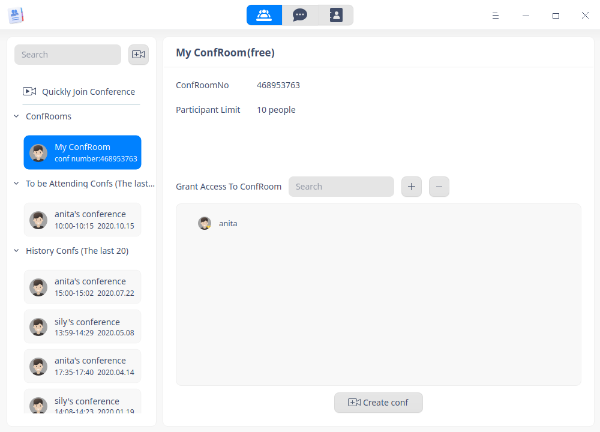

### To be Attending Conferences

List of conferences to be attending and their related information are displayed below this title.
   - Conference number: conference room numbers of conferences to be attending.
   - Conference time: starting date, starting time and ending time are displayed here. 
   - Conference Mode: refer to "Conference Invite Mode" in [Create Conference](#Create Conference).
   - Participants Limit: number of participants allowed.
   - Conference members: all participants are displayed here.
   - Share: click to copy conference info and access and send to participants.
   - Edit: click to revise conference info.
   - Delete: click to delete conferences to be attending.

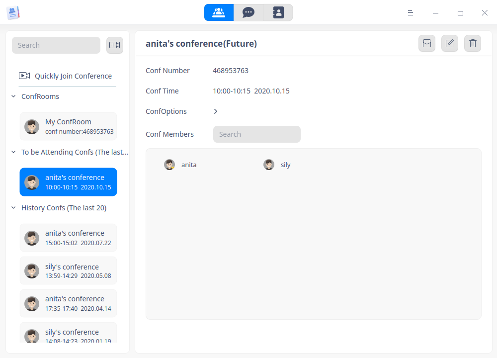

### History Conference

List of conferences finished and their related information are displayed below this title.

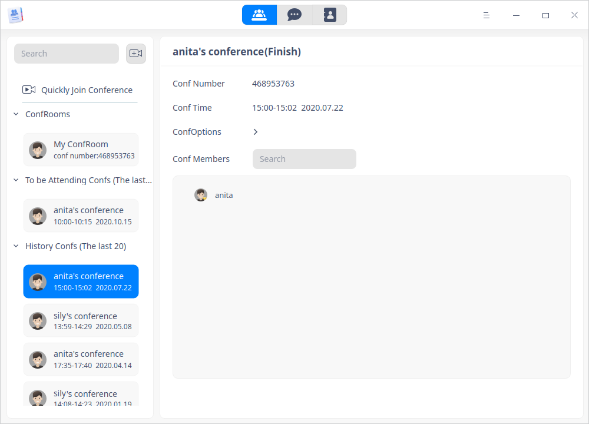

### Search/View Conference

Prerequisite: a conference is already created or it's finished.

Search a conference via conference room number or conference name.

- Search via conference room number: each user has a fixed conference room number. Searching by conference number means to search all conferences you have joined in, there may be many results. 
- Search via conference name: the conference name might repeats, so when you search by conference name, there may be many results, too.

## Main Menu

In the main menu, you can view your user personal info, settings, theme, help, and so on.

### User Personal Info

1. Clickon the main interface.

2. Click **User Personal Info** to view personal information and buy a service package. 

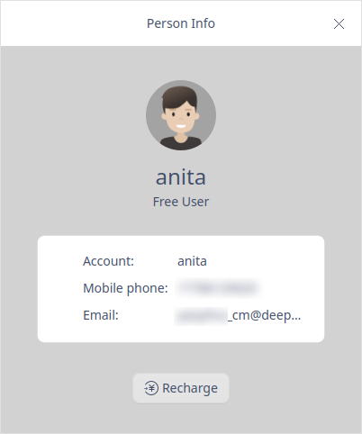

3. Click **Recharge**, you can choose to buy monthly, seasonly or annually, and you can also view your purchasing history. After you buy any service package, you have the following rights:

   - At most 100 participants of conference;
   - At most 12 hours for any individual conference room;

4. After selecting the service package you want, and click **Buy Now**. Corresponding service can be available after you finish paying.

5. After paying is done successfully, you can see your count down days of the service package, and you can also recharge. 

### Setting

1. Click on the main interface.

2. Click **Setting**.

3. You can set microphone, speaker, camera, whether to be notified mute or not, clear cache, etc. 

### Theme

The window theme includes Light Theme, Dark Theme and System Theme.

1. Click on the main interface.
2. Click  **Theme** to select one.

### Help

click Help to get the manual, which will help you further know and use Contacts.

1. Click on the main interface.
2. Click **Help** to view the manual.

### About

1. Click on the main interface.
2. Click **About** to view version information and introduction about Contacts.

### Exit

1. Click on the main interface.
2. Click  **Exit**.

Update Date: 2021-04-29 Version: 1.0
