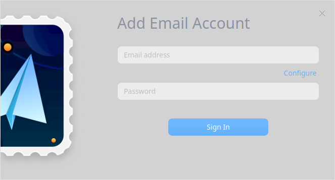
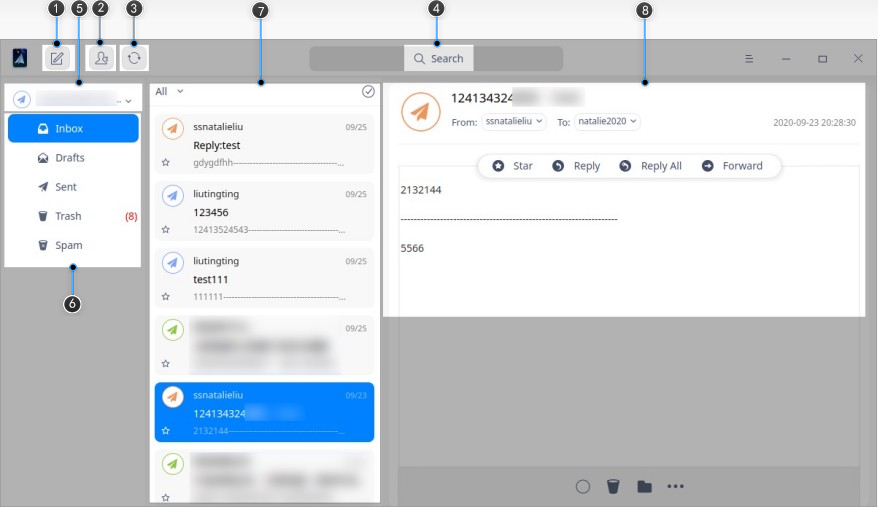
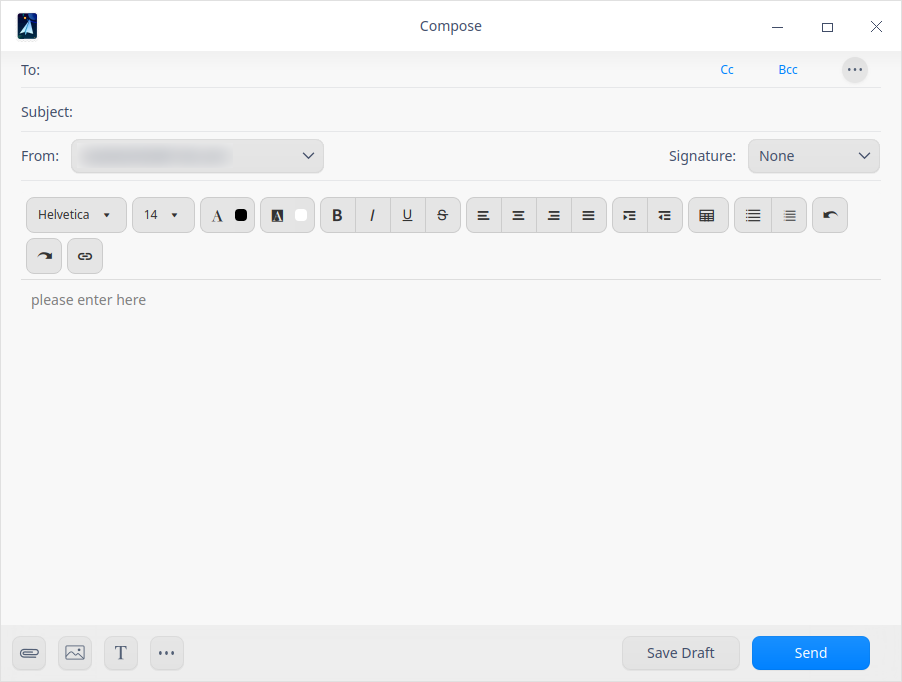
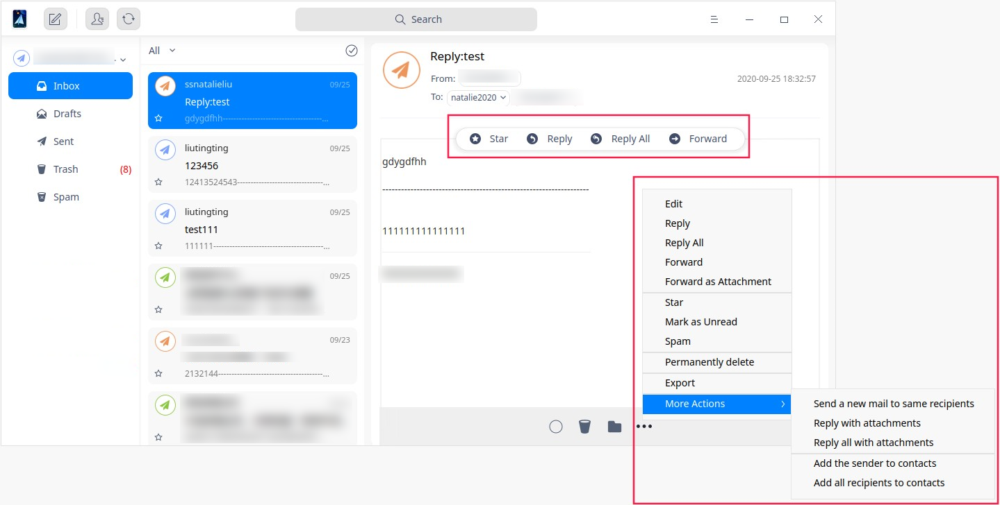
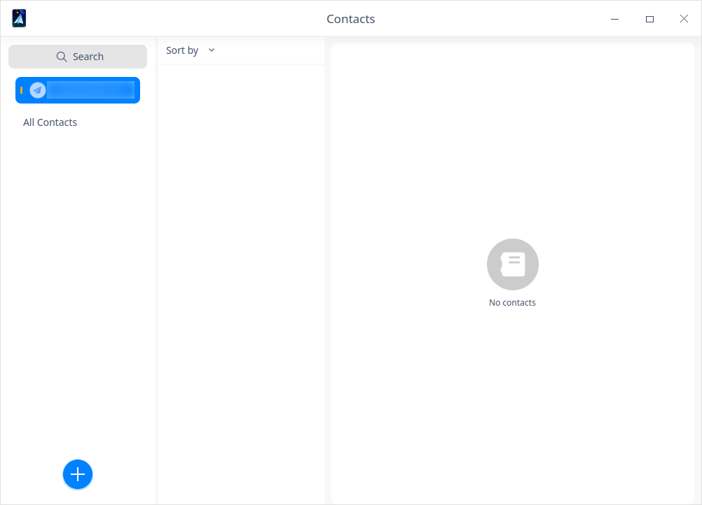
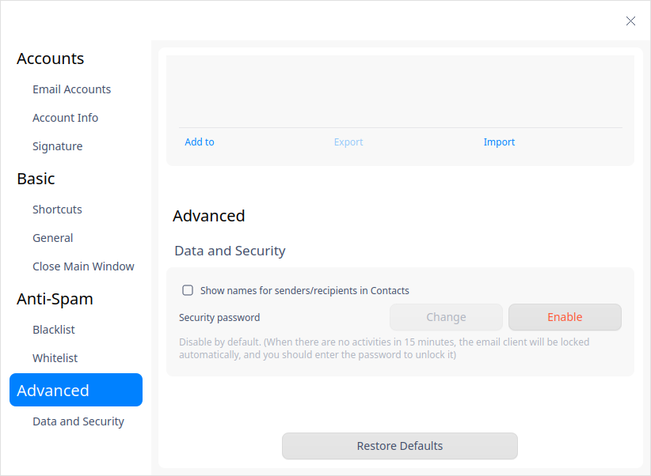

# Mail|../common/deepin-mail.svg|

## Overview

Mail is an easy-to-use desktop e-mail client supporting IMAP and POP3, which can manage multiple mailbox accounts at the same time.

## Guide

You can run, close or create a shortcut of Mail as follows.

### Run Mail

1. Click    in the lower left corner of the dock to enter launcher interface.
2. Locate by scrolling the mouse wheel or searching "Mail" in the Launcher interface and click it to run. 
3. Right-clickto:
   - Select **Send to desktop** to create a shortcut on the desktop.
   - Select **Send to dock** to fix it onto the dock.
   - Select **Add to startup** to add it to startup. When the computer starts up, Mail runs automatically.

### Exit Mail

- On Mail interface, click  to exit.
- Right-clickon Dock and select  **Close All** to exit.
- On Mail interface, click   and select  **Exit**.

## Sign in

1. Open Mail, enter your Email address and password and click **Sign In**. 

   

2. The program will automatically detect whether the entered Email address suffix is in the server database: 

   - If it is, you can sign in directly;

   - If it's not, you can click **Configure** to add it.

     
> Notes: Mailboxes such as QQ mailbox, Netease mailbox (163.com and 126.com), Sina mailbox and so on can be used in Mail only after POP3 / IMAP / exchange and other services are enabled. After enabling the service, the server will generate an authorization code. Enter the email address and authorization code in the sign-in interface to sign in. If it fails, click **Help** to view more information.
>
> 

## Main Interface

The main interface of Mail is composed of items and functions such as account, mailbox directory, mail list, mail body, compose, get new mails, and search. 

<table class="block1">
    <caption>Main Interface</caption>
    <tbody>
        <tr>
            <td width="20px">1</td>
            <td width="100px">Compose</td>
            <td>You can write a mail quickly.</td>
        </tr>
        <tr>
            <td>2</td>
            <td>Contacts</td>
            <td>A list of contacts is displayed here. You can also add information such as the contact's telephone number and address.</td>
        </tr>
         <tr>
            <td>3</td>
            <td>Get new mails</td>
            <td>To synchronize mailbox data from server, including mails, address book, calendar, etc.</td>
        </tr>
        <tr>
            <td>4</td>
            <td>Search</td>
            <td>To quickly find all messages with this keyword.</td>
        </tr>
         <tr>
            <td>5</td>
            <td>Account</td>
            <td>It displays a list of all mailbox accounts added.</td>
        </tr>
        <tr>
            <td>6</td>
            <td>Mailbox directory</td>
            <td>The mailbox directory is used to sort out mail data. Different categories of mailbox directories may be different. In addition to the general fixed directory, the others are created by users.</td>
        </tr>
         <tr>
            <td>7</td>
            <td>Mail list</td>
            <td>It displays all mails in the mailbox directory, including the sender, subject, abstract, sending time and star status.</td>
        </tr> 
          <tr>
            <td>8</td>
            <td>Mail body</td>
            <td>It displays the email title, sender and receiver information, time and content.</td>
        </tr> 
   </tbody>
   </table>

## Compose

1. On the main interface, click to enter mail composing page.
2. Enter the receiver's mailbox account or click   to add a receiver, you can also choose whether to "CC" or "BCC" or not. 
3. The e-mail body supports rich text editing, including inserting pictures, links and @ functions, and can be diversified to edit the text.
4. After editing is finished, click **Send**. 

## Get new mails

"Get new mails" is to synchronize mailbox data from the server, including mail, address book, calendar and other information. The system synchronizes mailbox data every 15 minutes by default. Here are two ways to receive email:

- Select an account, click.
- Select an account and right-click, select **Get new mails**.

## View mails

1. After a mail is selected in the mail list, the mail body area displays its relevant information, including the message subject, receiving and sending information, time and content.

2. Click the sender or recipient's mailbox to view the sender's details and correspondence, and add them to the Contacts.

   

3. In the mail body area, you can edit, forward, star, move, delete, print the mail.  

## Mail Filtering

The filtering functions helps you to find the mail you need quickly. 

1. Click **All**, you can see options such as "All", "Unread", "Starred", "Attachments" and "@me". 

   

2. When a filter element is selected, the mail list displays only those that meet the criteria. 

> Notes: If you need to search more precisely, clickto input keywords.  

3. In the mail list, you can select single or multiple mails.

   - To select single mail: click one mail;

   - To select multiple mails:

      - Press **Ctrl** key, click the mails you need one by one at the same time.

      - Click mail A, and then press **shift** key, and then click mail B, you can select all mails between A and B. 

## Delete mails

Delete messages can be individually or in batches. Generally, deleted messages will be stored in **Trash**. You can also choose to delete them permanently.

### Delete one mail

There are two ways to delete one mail. And deleted messages will be stored in **Trash**.

- Select a mail in the mail list and right-click, select **Delete**. 
- In the mail body area, click.

### Delete in batches

Select the specified directory to be deleted and right-click, and select **Mass delete**. You can delete the email according to the time range, for example, one week ago or a month ago.

## Import mails

In the mailbox directory list, select one directory and right-click to select **Import mails**. The interface of File Manager pops up, select the mails to be imported, and click **Open** to import the specified directory.

## Export mails

Mails can be exported separately or in batch.

### Export one mail

There are two ways to export one mail: 

- Select a mail in the mail list and right-click, select **Export**. 

- In the mail body area, click , and then select **Export**.

Select a storing path in File Manager and then click **Save**. 

### Export in batches

Select the specified directory and right-click, and select **Export mails**. The interface of File Manager pops up, select a storing path and then click **Save**. 

## Contacts

On the main interface, click to enter Contacts. You can view the contacts list and information, and supplement the contact phone number, address and other information. Click to add new contact. 

## Main Menu

In main menu, you can set the mailbox, switch the window themes, and view the help manual. 

### Settings

Click   on the main interface and click **Setting**. You can set the accounts, basic settings, anti-spam and advanced settings. 

#### Accounts

- Email Accounts: you can add or delete accounts. Click **Add account** to add more accounts. Click **Edit** to delete accounts. 

- Account Info: you can view the avatar, name and protocol, you can also change the avatar and server settings. 

- Signature: It is mainly used to provide the recipient with more contacting information and additional brand information. You can choose company signature, personal signature or custom signature according to your needs.

#### Basic

- Shortcuts: the shortcut keys for common operations.

- General: settings for launching or receiving of Mail. 

#### Anti-Spam

- Blacklist: All mails sent from the mailboxes listed in blacklist are rejected. You can add, export and import the blacklist.

- Whitelist: All mails sent from the mailboxes listed in whitelist are received. You can add, export and import the whitelist.

#### Advanced

You can enable security password. When there are no activities in 15 minutes, Mail will be locked automatically, and you should enter the password to unlock it. 

#### Restore Defaults

Click **Restore Defaults** to restore all your settings to defaults.

### Theme

The window theme includes Light Theme, Dark Theme and System Theme.

1. Click   on the main interface.
2. Click **Theme** to choose one theme.

### Help

Click Help to get the manual, which will help you further know and use Mail.

1. Click   on the main interface.
2. Click  **Help** to view the manual of Mail.

### About

1. Click   on the main interface.
2. Click **About** to view version information about Mail.

### Exit

1. Click   on the main interface.
2. Click  **Exit**.

Update Date: 2021-04-29 Version: 5.2
