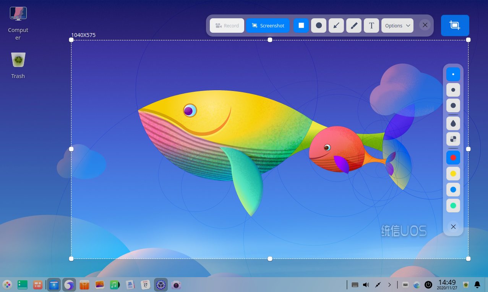
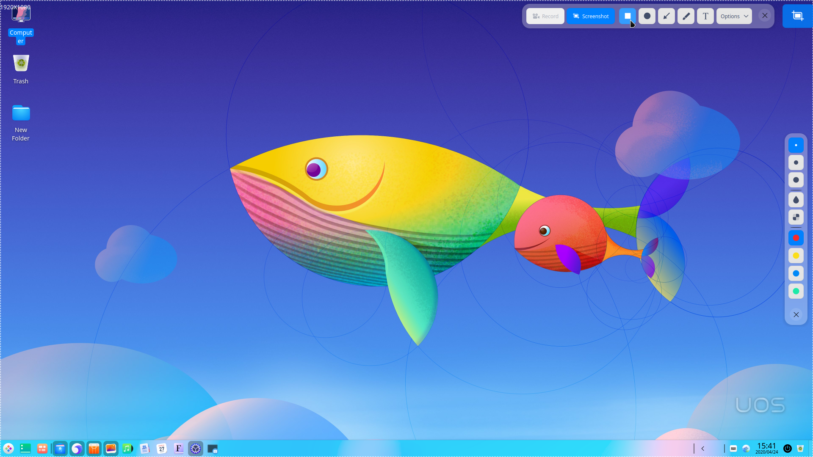
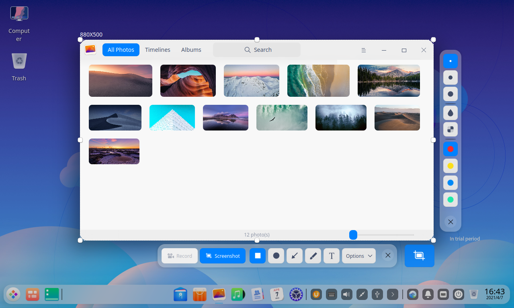
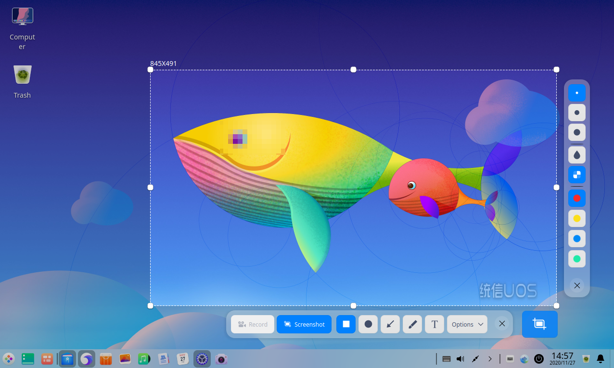
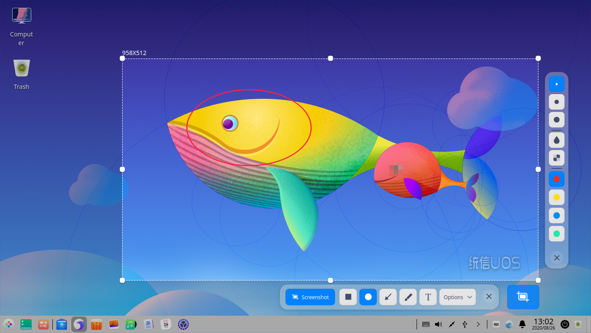
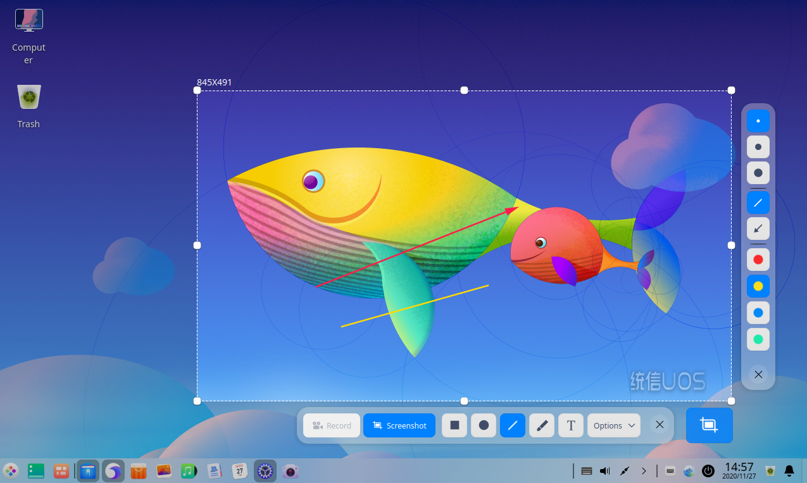
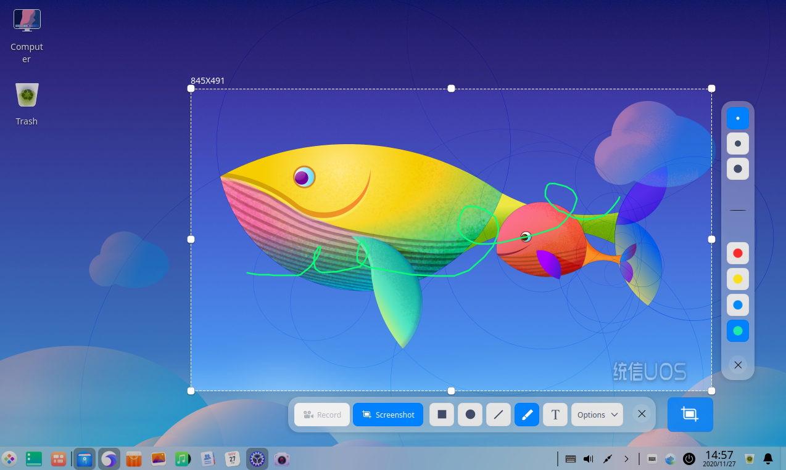
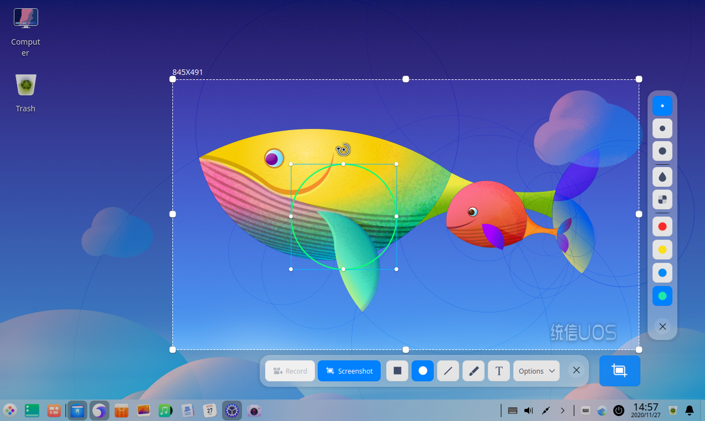

# Screen Capture|../common/deepin-screenshot.svg|

## Overview

Screen Capture is a tool integrates the screenshot and screen recorder into one. You are free to select windows or areas automatically or manually during screen capture or recording. 

## Guide

You can run, close or create shortcuts for screen capture by the following operations.

### Run Screen Capture

1.  Click  on dock to enter the launcher interface.
2.  Locate by scrolling the mouse wheel or searching "Screen Capture" in the Launcher interface and click it to run. 
3.  Right-click  and you can:

    - Click **Send to desktop** to create a desktop shortcut.
    - Click **Send to dock** to fix it on Dock.
    - Click **Add to startup** to add it to startup and it will automatically run when the system starts up.

> Notes: If Screen Capture has been fixed on dock by default, you can also click  on dock to run it.

### Close Screen Capture

- Screen Capture will exit automatically after screenshot or screen recording finishes.
- On the Screen Capture interface, click  to exit Screen Capture.
- On the Screen Capture interface, press **Ctrl + S** or **Esc** on the keyboard to save the screen capture or exit.
- On the Screen Capture interface, right-click to select **Save** or **Exit**.

## Operations

### Sceenshot

You can achieve quick screenshots  by the following ways:

- Press the   key on the keyboard to screenshot the entire display screen.
- Use the screenshot features of various applications such as Tencent QQ and the Chrome browser.
- Use the professional screenshot software to take screenshots , e.g. the Screen Capture software that comes with the operation system.

#### Shortcuts

It is convenient and time-saving to perform relevant operations through shortcuts.

1.  In the Screenshot  mode, press **Ctrl + Shift + ?** on the keyboard to open the shortcuts preview interface.
2.  On the shortcuts preview interface, you can view all shortcuts.

#### Select Screenshot Area

There are three kinds of common screenshot areas, the full screen, program window and customized area. During screenshot, the selected area will be bordered with dashed line and looks brighter than the other area.

> Notes: When the computer is connected to multiple monitors, you can also use Screen Capture to screenshot areas on different monitors.

##### Full Screen Selection

Full screen selection is to identify the entire screen of the current display.

&nbsp;&nbsp;&nbsp;&nbsp;&nbsp;&nbsp;&nbsp;&nbsp;&nbsp;&nbsp;&nbsp;&nbsp;&nbsp;

You can select the full screen by the following ways:

1.  Press ++  on the keyboard to enter the screen capture mode.
2.  Move the cursor to the desktop and the full screen will be selected automatically, with the screenshot dimension displayed in the upper left corner. 
3.  Click the desktop and a toolbar will pop up.
4.  Click on the toolbar or right-click to select **Exit** to exit Screen Capture.

You can also take a full screen screenshot directly by the following ways:

- If Screen Capture has been fixed on dock, right-click  on dock to select **Full screenshot**. 
- Press  on the keyboard to take a full screen screenshot.

##### Program Window Selection

Program window selection is to identify the current application window automatically.

&nbsp;&nbsp;&nbsp;&nbsp;&nbsp;&nbsp;&nbsp;&nbsp;&nbsp;&nbsp;&nbsp;&nbsp;&nbsp;

1.  Press ++  on the keyboard to enter the screen capture mode.
2.  Move the cursor to the application window and the window will be selected automatically, with the screenshot dimension displayed in the upper left corner. 
3.  Click the window and a toolbar will pop up in the lower right of the window.
4.  Clickon the toolbar or right-click to select **Exit** to exit Screen Capture.

##### Customized Area Selection

Customized area selection is to drag the mouse to select the screenshot area freely.

&nbsp;&nbsp;&nbsp;&nbsp;&nbsp;&nbsp;&nbsp;&nbsp;&nbsp;&nbsp;&nbsp;&nbsp;&nbsp;

1.  Press ++ on the keyboard to enter the screen capture mode.
2.  Hold down and drag the left mouse button to select the screen capture area with the screenshot dimension displayed in the upper left. 
3.  Release the left mouse button to complete screenshot area selection and the toolbar will pop up under the lower right corner of the screenshot area.
4.  Click on the toolbar or right-click to select **Exit** to exit the screen capture.

#### Adjust the Screenshot Area

You can do fine adjustments to the screenshot area, for example, enlarging or reducing the captured scope, moving the screenshot and so on. 

##### Enlarge/Reduce the Screenshot Area

Place the cursor over the white boarder of the screenshot area and the cursor will be changed to You can:

- Hold down the left mouse button and drag the mouse to enlarge or reduce the screenshot area. 
- Press + , , or   and drag the mouse to enlarge or reduce the screenshot area vertically or horizontally.

##### Move the Screenshot Position

Place the cursor over the screenshot area and it will be changed to . You can:

- Hold down the left mouse button and drag the mouse to move the position of the screenshot area.
- Press  ,  ,  or on the keyboard to move the screenshot area vertically or horizontally.

#### Edit Screenshot

The editing features of Screen Capture, such as graphics markup, text annotation, etc. can fully meet your daily needs of picture processing. You can also mosaic pictures to protect your privacy. 

You can edit screenshots by the following ways:

- Click the tool icon on the toolbar. 
- Quickly switch between various editing tools through shortcuts.
- Right-click to choose the editing tools after selecting the screenshot area.

#### Draw

You can draw some simple graphics in the screenshots, such as rectangle, ellipse, and so on.

##### Toolbar description

While capturing screenshots, you can click the icons on the toolbar to complete various operations. Run Screen Capture and the toolbar will automatically appear below the screenshot area after selecting the screenshot area. 

> Attention: Your settings in the toolbar and attribute column, such as line thickness and font size will be remembered and applied by default the next time you launch Screen Capture. You are also able to reset it before screen capture. 

<table class="block1">
    <caption>Icon Description</caption>
    <tbody>
        <tr>
            <td></td>
            <td>Rectangle</td>
            <td class="blank"></td>
            <td></td>
            <td>Elipse</td>
        <td class="blank"></td>
            <td></td>
            <td>Line</td>
        </tr>
          <tr>
            <td></td>
            <td>Pencil</td>
            <td class="blank"></td>
            <td></td>
            <td>Text</td>
            <td class="blank"></td>
            <td></td>
            <td>Exit</td>
        </tr>
    </tbody>
</table>

##### Rectangle

1.  Clickon the toolbar under the screenshot area.
2.  In the toolbar extension panel, select the thickness of rectangle border line. 
3.  Place the cursor on the screenshot area, and then the cursor will be changed to .
4.  Hold down the left mouse button and drag the mouse to finish drawing.
5.  Please click  or  in the toolbar extension panel to mosaic the private information in the screenshot (if any).

##### Ellipse

1.  Click on the toolbar under the screenshot area.
2.  In the toolbar extension panel, select the thickness of ellipse border line. 
3.  Place the cursor on the screenshot area and then the cursor will be changed to .
4.  Hold down the left mouse button and drag the mouse to finish drawing.
5.  Please click or in the toolbar extension panel  to mosaic the private information in the screenshot (if any).

##### Straight Line and Arrow

1.  Click on the toolbar under the screenshot area.
2.  In the toolbar extension panel, select the line thickness. 
3.  Click  or to toggle between straight line and arrow.
4.  Place the cursor on the screenshot area and then the cursor will be changed to or .
5.  Hold down the left mouse button and drag the mouse to finish drawing.

##### Pencil

1.  Click on the toolbar under the screenshot area.
2.  In the toolbar extension panel, select the pencil thickness. 
3.  Place the cursor on the screenshot area and then the cursor will be changed to .
4.  Hold down the left mouse button and drag the mouse to finish drawing.

If you need to draw a square, regular circle, etc., you can:

- Hold down the **Shift** key on the keyboard and select to draw a square.
- Hold down the **Shift** key on the keyboard and select  to draw a regular circle.
- Hold down the **Shift** key on the keyboard and selectorto draw a straight line or straight line with arrow horizontally or vertically.

#### Modify Graphics

You can modify and move the drawn graphics in the screenshot.

##### Move Graphics

1.  Place the cursor over the graphics border line and the mouse will be changed to .
2.  Hold down the left mouse button and drag the graphics to any place in the screenshot area.
3.  Press  , ,  or on the keyboard to move the graphics vertically or horizontally.

##### Edit Graphics

1.  Place the cursor over the graphics border line.
2.  Click the left mouse button to enter the editing mode and you can:
    - Press the **Delete** key on the keyboard to delete the graphics.
    - Press **Ctrl + Z** on the keyboard to return to the previous step.
    - Place the cursor over the edit box and the mouse will be changed to. You can enlarge or reduce the graphic area by dragging the cursor.
    - Press **Ctrl** + ,    , or   to extend the graphics area vertically or horizontally.
    - Place the cursor over  in the edit box and the cursor will be changed to . Rotate the graphics by dragging the cursor.
3.  Click the left mouse button outside the edit box to exit the editing mode.

#### Add Text Annotation

You are able to add text annotations to the screenshot in order to help others better understand it.

1.  Click on the toolbar under the screenshot area.
2.  In the toolbar extension panel, select the font size as needed. 
3.  Place the cursor over the screenshot and the mouse will be changed to .
4.  Click where you expect to add annotations and a text box will appear.
5.  Enter texts in the text box.

#### Modify Text Annotations

You can modify and move the text annotations added.

##### Move Text Annotations

1.   Place the cursor over the text and the cursor will be changed to .
2.   Hold down the left mouse button and drag to move the text anywhere in the screenshot area.

##### Edit Text Annotations

1.  Place the cursor over the text and the cursor will be changed to .
2.  Click the left mouse button to enter the text editing mode and you can:
    - Press **Delete** on the keyboard to delete text annotations.
    - Press  **Ctrl + Z** on the keyboard to return to the previous step.
    - Modify the text information in the text box.
3.  Click outside the text box to exit editing mode.

#### Set Colors

Four colors are provided for you in Screen Capture to mark the graphics.

1.  Select a tool on the toolbar that appears beside the screenshot area.
2.  Click,,orin the toolbar extension panel and select a color.

#### Save Screenshots

Save the screenshot for future use.

When the screenshot is saved successfully, you can see a prompt message in the upper right corner of the desktop. Click **View** to open the folder where the screenshot is located.

You can save the screenshot  by the following ways after launching Screen Capture and selecting the screenshot area:

- Double-click to save the screen capture.
- Click the "Start Shot" icon in the toolbar and press **Ctrl + S** to save the screenshot.
- Right-click the screenshot to select **Save** to save the screenshot.

> Notes: The screenshot is saved to the desktop by default.

Click **Options** in the toolbar of the Screen Capture interface and expand the drop-down list:

&nbsp;&nbsp;&nbsp;&nbsp;&nbsp;&nbsp;&nbsp;&nbsp;&nbsp;&nbsp;&nbsp;&nbsp;&nbsp;

- Select **Clipboard** to save the screenshot to clipboard.
- Click **Desktop** (the default setting) and the screenshot will be saved to the desktop.
- Click **Pictures** and the screenshot will be saved to the pictures folder automatically.
- Click **Folder**, select the destination folder of the screenshot and the screenshot will be saved to the folder directory set by the user automatically. 
- Select **Show cursor**, the cursor will be displayed in the screenshot area, and it's position and pattern will also be saved in the picture generated.
- Select **PNG/JPG/BMP** to set the screenshot format.

### Screen Recording

#### Toolbar Instructions

>Notes: 
- If window effect is turned off in Control Center, screen recording will be hidden.
- Loongson and SW platform don't support screen recording.

<table class="block1">
    <caption>Icon Description</caption>
    <tbody>
        <tr>
            <td></td>
            <td>Microphone</td>
            <td class="blank"></td>
            <td></td>
            <td>Sound On</td>
        <td class="blank"></td>
            <td></td>
            <td>Show Keystroke</td>
        </tr>
          <tr>
            <td></td>
            <td>Webcam On</td>
            <td class="blank"></td>
            <td></td>
            <td>Show Click</td>
            <td class="blank"></td>
            <td></td>
            <td>Exit</td>
        </tr>
    </tbody>
</table>

#### Select Recording Area

After running screen recorder, you can select the recording area, namely full screen, automatic identification window and custom window.

- Full screen and automatic identification window: when you select the recording area, screen recorder will automatically identify the window on the desktop along with mouse moving and there will be a rectangle selection box in the identified window.  Click to select the current window recording. As desktop is also a kind of windows, when the mouse is located on the desktop, full screen recording will be identified.
- Custom window:  When selecting a recording area, you can use the mouse to select any area, then adjust the rectangle box position and size and finally click to select the current window for recording.

#### Set Sound, Keystroke, Camera and Click for Recording 

In the toolbar of Screen Capture, you can set sound, keystroke, camera, etc. to make preparation for video recording.

- Record sound: including microphone and built-in audio (enabled by default).
- Keystroke: Click **Show Keystroke** and the operation keystroke will be displayed during screen recording. Up to five recent operation keystrokes can be displayed at the same time. Click **Hide Keystroke** to cancel keystroke display.
- Camera:  Click **Webcam On** and the camera window is displayed on the recording screen. Drag the camera window border to adjust the window size and position. Click the icon once again to disable the camera. No image can be displayed and it will be displayed as black screen.
- Click: Click **Show Click** to display mouse and touchscreen during screen recording and click it again to cancel display.

> Attention: Please check first whether the device connected supports sound recording and camera functions.

- When the device connected supports sound recording and camera functions, you are able to make corresponding operation settings.
- When the device connected does not support sound recording and camera functions, the icons are gray  and you are not able to make corresponding operation settings.

#### Set Recording Format and FPS (Frame Per Second)

Click **Options** to expand the drop-down list in the **Screen Capture** toolbar, select the options and you are able to record videos in GIG or MP4 format and set the FPS.

> Notes: Please start video recording after changing the corresponding settings if the default settings are not what you want.

#### Record Videos

You can customize the recording area and select the recording format before recording.

Click **Record** to select the recording area after launching screen recorder.

Select the recording format.

Click **Start Record** and the flickering **Record** icon appears in the system tray.

Click the icon on dock or in the system tray to finish recording.

The recorded video will be saved to the desktop automatically.

> Notes: During video recording, if multi-screen display is connected, whether the multi-screen display is in copy mode or extended mode, only the current operation screen is recorded.

### View Help

Press  on the keyboard to view the help manual after launching Screen Capture.