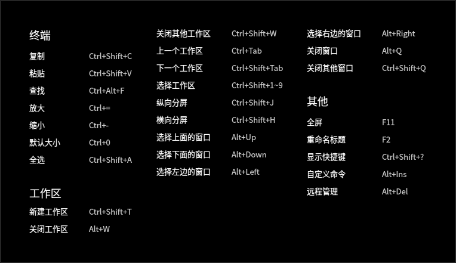
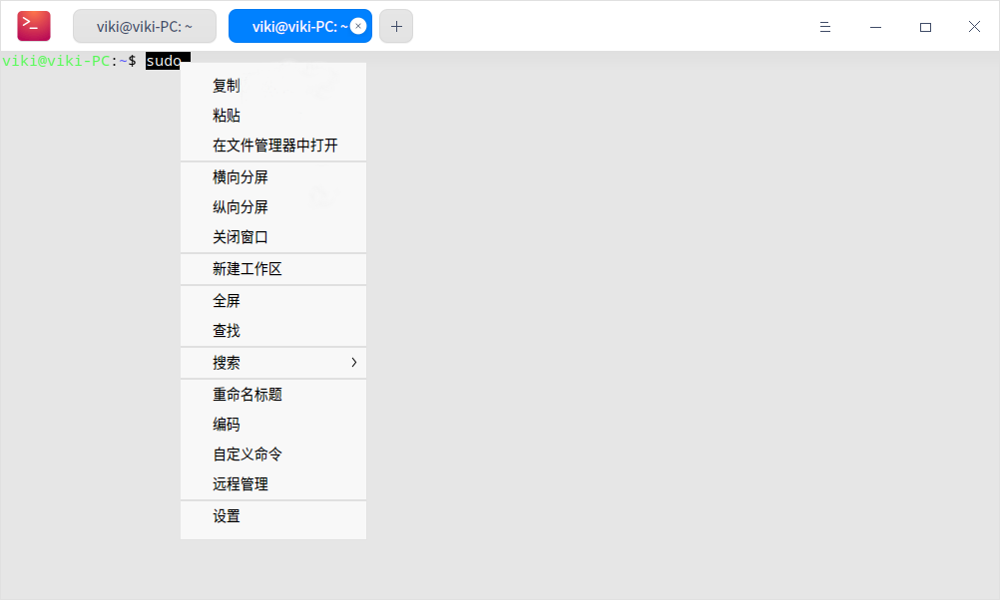
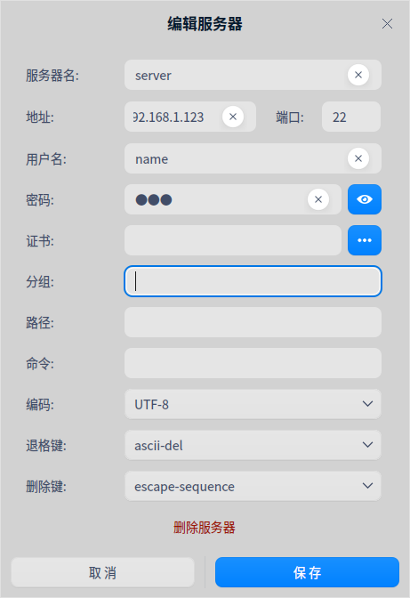
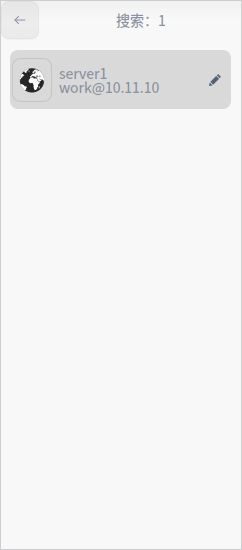
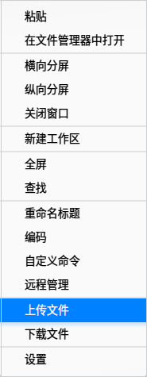

# 终端|../common/deepin-terminal.svg|

## 概述

终端是⼀款集多窗⼝、⼯作区、远程管理、雷神模式等功能的⾼级终端模拟器。它拥有简单的界面，丰富而强大的功能。您可以瞬间启动和关闭，使用起来像普通文件窗口一样流畅，让您在输入命令时心无旁骛，得心应手。试试雷神模式，一边看页面一边输入命令；当有多任务进行时，您可以像在浏览器中增加页签一样建立多个工作区或者将工作区分割成多个窗口；远程管理，上传下载文件再也不是问题。更多强大功能，静待您的发掘！

## 使用入门
通过以下方式运行或关闭终端，或者创建终端的快捷方式。

### 运行终端

1. 单击任务栏上的启动器图标 ，进入启动器界面。
2. 上下滚动鼠标滚轮浏览或通过搜索，找到终端图标 ，单击运行。
3. 右键单击 ，您可以：
   - 单击 **发送到桌面**，在桌面创建快捷方式。
   - 单击 **发送到任务栏**，将应用程序固定到任务栏。
   - 单击 **开机自动启动**，将应用程序添加到开机启动项，在电脑开机时自动运行该应用。

> 说明：使用快捷键 **Ctrl + Alt + T** 也可以启动终端。

### 关闭终端

- 在终端界面单击  ，退出终端。
- 在任务栏右键单击 ，选择 **关闭所有**，退出终端。
- 在终端界面单击 ，选择 **退出**，退出终端。

> 说明：如果关闭终端时终端里面依然有程序在运行，会弹出一个对话框询问用户是否退出， 避免强制关闭引起的用户数据丢失。

### 查看快捷键

在终端界面，使用快捷键 **Ctrl + Shift + ?** 打开快捷键预览界面。熟练地使用快捷键，将大大提升您的操作效率。

 

## 基本操作

您可以在终端界面单击鼠标右键来进行常规操作。

### 查找 ###
使用“查找”功能快速查找终端显示的内容。

1. 在终端界面，单击鼠标右键。
2. 选择 **查找**。
3. 在搜索框中输入要查找的字符。
4. 按下键盘上的 **Enter** 键，搜索到的结果将高亮显示。
5. 如果想隐藏搜索界面，可以单击终端空白区域按下键盘上的 **Esc** 键。

> 窍门：搜索时按下键盘上的 **Enter** 键是从当前位置向下搜索，您也可以通过单击搜索界面上的按钮  或  来向上搜索或向下搜索。

### 网页搜索 ###
使用“搜索”功能可以调用浏览器，搜索终端中的内容，快捷又方便。

1. 在终端界面，选中想要搜索的内容。
2. 单击鼠标右键，选择 **搜索**。
3. 在下拉选项中选择一个网站来搜索选中的内容。

   

### 复制和粘贴 ###

- 复制
   + 在终端界面，选中要复制的内容后使用快捷键 **Ctrl + Shift + C** 复制内容。
   + 在终端界面，选中要复制的内容后单击鼠标右键选择 **复制**。
- 粘贴
   + 在终端界面，使用快捷键 **Ctrl + Shift + V** 粘贴内容。
   + 在终端界面，单击鼠标中键粘贴内容。
   + 在终端界面，单击鼠标右键选择 **粘贴**。

> 窍门：
> + 如果当前光标下是超链接内容，即使没有选中任何内容，也可以通过右键菜单复制。
> + 在设置窗口中勾选 **选中文字时自动复制到剪切板**，提高您的工作效率。

### 雷神模式

雷神模式是终端特有的便捷功能，使用快捷键 **Alt + F2** 可以打开雷神终端窗口，再按一下 **Alt + F2** 隐藏雷神终端窗口。

> 窍门 ：您也可以右键单击任务栏上的图标  ，选择 **雷神终端**，来打开雷神模式的终端窗口。

### 打开文件和应用程序

在终端界面上选中当前目录下的文件，右键菜单会显示 **打开** 菜单项，单击 **打开** 会调用系统的应用打开选中的文件。

1. 在终端界面，输入 **ls -al** 显示当前目录下的文件。
2. 双击鼠标左键，选中文件名。
3. 单击鼠标右键选择 **打开**。

### 调整编码方式  ###
当某些文件信息显示乱码或者错误时，可以通过调整编码方式来解决问题。

1. 在终端界面，单击鼠标右键。
2. 选择 **编码**。
3. 在右侧展开的面板中，选择一种编码方式并查看调整后的效果。
4. 重复步骤3直到内容显示正确。

> 说明：通常终端都会匹配正确的编码方式，一些特殊情况出现错误后，可以手动调整编码方式，如果您确定需要哪种编码方式可以直接选择，不确定的情况下多尝试几次。

## 窗口操作

终端窗口是实现各种功能的基础，可以创建多个工作区，也可以分割为多个窗口。

### 新建窗口

在终端界面，通过以下方法新建窗口：

 - 选择 > **新建窗口**，打开一个新的终端窗口。
 - 右键单击任务栏上的图标  ，选择 **新建窗口**。

### 全屏显示

1. 在终端界面，按下键盘上的 **F11** 键或单击鼠标右键选择 **全屏**，终端窗口将全屏显示。
2. 如果要恢复正常大小显示，按下键盘上的 **F11** 键或单击鼠标右键选择 **退出全屏**。

### 分割窗口

1. 在终端界面，单击鼠标右键。
 - 选择 **纵向分屏**，窗口被分为左右两个部分。
 - 选择 **横向分屏**，窗口被分为上下两个部分。
2. 您可以在各个窗口中输入命令，并可以同时查看到命令执行的结果。

> 窍门 ：您也可以使用快捷键 **Ctrl + Shift + J** 来纵向分屏，使用快捷键 **Ctrl + Shift + H** 来横向分屏。

### 关闭窗口
执行以下操作来关闭窗口：

1. 在终端界面，将鼠标指针置于其中一个终端窗口中。
2. 单击右键，您可以：
 - 选择 **关闭窗口**，来关闭此终端窗口。
 - 选择 **关闭其他窗口**，来关闭除此窗口以外的其他终端窗口。

## 工作区操作

### 新建工作区 ###

通过以下方法新建工作区：
- 在终端界面，单击标签页上的按钮 **+** ，新建一个工作区。
- 在终端界面，单击鼠标右键，选择 **新建工作区**。
- 使用快捷键 **Ctrl + Shift + T** 新建工作区。

  

### 选择工作区 ###
通过以下方法在多个工作区之间任意切换：

 - 单击工作区标签来选择对应的工作区。
 - 使用快捷键 **Ctrl + Tab** 来依次切换工作区。
 - 使用快捷键 **Ctrl + Shift + 1~9** 来选择对应的工作区，当工作区大于9时， 将选中最后一个工作区而不是第9个工作区。

### 关闭工作区 ###
通过以下方式来关闭工作区：

 - 选择一个工作区标签页，单击按钮 关闭该工作区。
 - 右键单击某一个工作区标签页：
   + 选择 **关闭工作区**，关闭此工作区。
   + 选择 **关闭其他工作区**，关闭除此工作区以外的其他工作区。

> 窍门：当工作区中只有一个窗口时，单击右键选择 **关闭窗口** 也可以关闭当前工作区。

### 重命名标题

1. 在终端界面，单击鼠标右键。
2. 选择 **重命名标题**。
3. 在弹出的对话框中输入新名称，单击 **确定**。

> 窍门 ：您也可以按下键盘上的 **F2** 来重命名工作区。

## 远程服务器管理

通过主菜单或者右键菜单打开远程管理，将远程服务器添加到管理列表后，只需单击一下便可自动登录。

### 添加服务器
1. 在终端界面，选择 > **远程管理**。
2. 选择 **添加服务器**，弹出添加服务器窗口。
3. 输入 **服务器名**、**地址**、**用户名**、**密码** 等。
4. 单击 **添加**。

> 说明：在添加服务器时，您可以单击 **高级选项** 来设置更多参数。

### 编辑服务器
1.  打开终端远程管理界面，将光标置于某一个服务器上，会显示按钮 ，单击该按钮弹出编辑服务器窗口。
2.  修改服务器信息。
3.  单击 **保存**。

### 分组服务器

添加服务器时若设置了分组，该服务器会添加到远程管理对应的分组中。

1. 在终端远程管理界面，打开添加服务器或编辑服务器窗口。
2. 单击 **高级选项**。
3. 输入 **分组** 信息。
4. 单击 **保存**。

### 搜索服务器
当存在多个服务器或服务器分组时，服务器列表中会显示搜索框，可快速搜索服务器。

1. 在终端界面，单击鼠标右键。
2. 选择 **远程管理**。
3. 在搜索框中输入关键字。
4. 按下键盘上的 **Enter** 键，显示搜索结果。

### 上传和下载文件
登录远程服务器之后，可以直接通过终端上传和下载文件。

#### 上传文件

1. 打开终端远程管理界面，选择一个服务器登录。
2. 单击鼠标右键选择 **上传文件**。
3. 在弹出的窗口中选择要上传的文件。
4. 单击 **上传**，文件将被上传到远程服务器。

#### 下载文件

1. 打开终端远程管理界面，选择一个服务器登录。
2. 单击鼠标右键选择 **下载文件**。
3. 在弹出的窗口中选择文件需要存放的位置。
4. 输入要下载的文件路径，文件将下载到指定位置。

### 删除服务器

1. 在终端远程管理界面，打开编辑服务器窗口。
2. 单击 **高级选项**。
3. 单击 **删除服务器**。
4. 弹出删除服务器对话框，单击 **删除**，确认删除该服务器。

## 主菜单

在主菜单中，您可以[新建窗口](#新建窗口)、自定义命令、[远程管理](#远程服务器管理)、切换窗口主题、查看帮助手册、了解终端的更多信息。

### 主题

窗口主题包含浅色主题、深色主题和系统主题。
1. 在终端界面，单击  。
2. 单击 **主题**，选择一个主题。

### 自定义命令 ###

添加自定义命令，通过快捷键可快速调用命令。

1. 在终端界面，单击  > **自定义命令**。
2. 单击 **添加命令**。
3. 输入命令的 **名称**、**命令**、**快捷键**。
4. 单击 **添加**。

### 设置

#### 基础设置 ####

1. 在终端界面，单击  > **设置**。
2. 在 **基础设置** 页签下，您可以：
   - 设置终端的背景透明度。
   >说明：当窗口特效关闭后，透明度调节功能将会被隐藏。

   - 设置终端的字体样式和大小。

#### 快捷键设置 ####

1. 在终端界面，单击  > **设置**。
2. 在 **快捷键** 页签下，您可以：
   - 修改快捷键：单击要修改的快捷键，此时输入框呈可编辑状态，使用键盘输入新的快捷键。
   - 禁用快捷键：单击要修改的快捷键，此时输入框呈可编辑状态，按下键盘上的 **Backspace** 键。

#### 高级设置 ####

1. 在终端界面，单击   > **设置**。
2. 在 **高级设置** 页签下，您可以：
   - 设置光标样式。
   - 开启或关闭光标闪烁。
   - 开启或关闭选中文字时自动复制到剪切板。
   - 选择滚动效果。
   - 设置窗口默认大小。
   - 开启或关闭丢失焦点后隐藏雷神窗口。
   - 开启或关闭背景模糊。
   >说明：当窗口特效关闭后，背景模糊选项将会被隐藏。

   
   

### 帮助

查看帮助手册，进一步了解和使用终端。

1. 在终端界面，单击  。
2. 单击 **帮助**。
3. 查看终端的帮助手册。

### 关于

1. 在终端界面，单击  。
2. 单击 **关于**。
3. 查看终端的版本和介绍。

### 退出

1. 在终端界面，单击 。
2. 单击 **退出**。

文档更新时间: 2021-05-17 版本: 5.3
