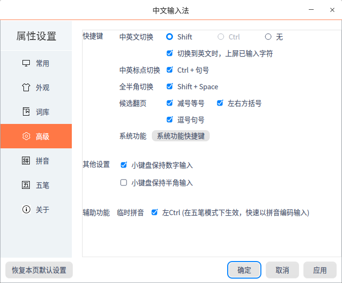
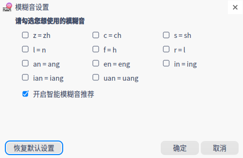

# 中文输入法|../common/inputer.svg|

## 概述

中文输入法是一款满足多类型终端在不同场景使用的输入法，支持拼音、五笔和手写输入方式，同时支持实体或虚拟键盘输入等。 

## 使用入门

### 切换输入法

1. 系统会预装中文输入法，单击右下角托盘上的 进入输入法配置页面。
2. 单击 **输入法**，选择**中文输入法**，托盘中输入法图标变为，则表示切换成功。

## 状态栏

中文输入法切换成功后，屏幕右下角会出现状态栏。在状态栏中，可进行以下设置。

**中文&英文**：选择键入的内容形式，默认为中文。

**半角&全角**：中文输入法对键入的非汉字数字及字符内容，输出时进行全、半角格式的转换，默认为半角。

**中文&英文标点**：选择键入的标点形式，默认为中文标点。

**简体&繁体**：中文输入法在输出中文的状态下，输出时进行简繁体的转换，默认为简体。

**拼音&五笔**：中文输入法在键入中文时，可选择拼音或五笔方式键入，默认为拼音。

**手写输入**：单击 ，进入手写输入界面，可实现屏幕手写输入。同时提供标点、数字及字母键，可用鼠标单击键入。手写输入适用于物理及虚拟键盘使用场景。

**属性设置**：单击 ，进入属性设置界面，可对中文输入法进行设置。

## 属性设置

进入属性设置界面有两种方式，一种是右键单击中文输入法 ，弹出选框，选择 **属性设置**；另一种是在状态栏中单击 。在属性设置界面，可对中文输入法进行设置，设置项为常用、外观、词库、高级、拼音和五笔。

### 常用 

#### **默认状态**

- 简体&繁体：中文输入法在输出中文的状态下，输出时进行简繁体的转换，默认为简体。
- 半角&全角：中文输入法对键入的非汉字数字及字符内容，输出时进行全、半角格式的转换，默认为半角。
- 中文&英文：选择键入的内容形式，默认为中文。
- 拼音&五笔：中文输入法在键入中文时，可选择拼音或五笔方式键入，默认为拼音。
- 隐藏状态栏：选择中文输入法状态栏是否隐藏，默认为不隐藏。

#### 标点符号

- 标点配对：勾选后，自动补全成对标点。
- 智能调整数字后标点：勾选后，数字后的标点符号自动切换为英文标点。

#### 候选扩展

1. 勾选**自定义短语**，单击**自定义语音设置**。
2. 在设置页面，您可以查看自带短语，也可以自定义常用的词组或符号。

### 外观

#### 显示设置

在中文输入的时候，会出现选项框，可根据个人习惯设置。

- 横排：勾选 **横排** 选项，则横排显示，默认为横排。
- 竖排：勾选 **竖排** 选项，则竖排显示。
- 候选项数：候选项数可选择3到9，默认为5。
- 候选窗口跟随光标：勾选后，候选窗口跟随光标移动。

#### 皮肤设置

- 更换字体：勾选后，下拉框中可选择需要的字体。
- 字体大小：勾选后，下拉框中可选择字号。

### 词库

#### 细胞词库

- 添加细胞词库：可从本地添加词库到列表，勾选、应用后才可生效。

- 查看：单击 **查看**，显示词库详细信息。

- 删除：单击 **删除** 并确定后，即可删除选中词库。

### 高级

#### 快捷键

- 中英文切换：可勾选 Shift 或 Ctrl 为快捷键；勾选无，则不设置快捷键；
- 中英标点切换：可勾选设置快捷键，快捷键固定为Ctrl + 句号。
- 全半角切换：可勾选设置快捷键，快捷键固定为Shift + Space。
- 候选翻页：可勾选多个选项为翻页快捷键，选项为减号等号、左右方括号、逗号句号。
- 系统功能：主要设置简繁切换、英文输入法和五笔拼音切换的快捷键。
  

#### 其他设置

- 小键盘保持数字输入：勾选后，小键盘保持数字输入。
- 小键盘保持半角输入：勾选后，小键盘保持半角输入。

#### 辅助功能

1. 勾选选框后，在五笔模式下，单击左Ctrl。

2. 界面会切换到临时拼音候选框，并显示对应的拼音结果。

   

3. 选择输入的内容，则完成本次输入，临时拼音模式失效。

4. 再次输入时，还是为五笔模式。

### 拼音
#### 输入习惯
- 全拼：勾选 **全拼** 选项，可勾选首字母简拼。全拼和双拼只能选择一种，默认为全拼。

- 双拼：勾选 **双拼** 选项，全拼自动去勾选，可自定义双拼方案。

   - 双拼展开提示：勾选后，输入字母时，在光标后会同步展现输入内容。
   - 可勾选双拼下同时使用全拼：勾选后，在双拼模式下同时使用全拼。

- 拼音纠错：勾选 **拼音纠错**，可进行拼音纠错设置。

   

- 模糊音设置：可进行模糊音设置。

   

#### 基础词库
- 中文用户词库：可选择导入、导出、清空中文用户词库。
- 英文用户词库：可选择清空英文用户词库。
- 网址邮箱词库：可选择清空网址邮箱词库。
- 一键恢复初始状态：选择一键恢复，将执行：清空中文、英文、网址邮箱用户词库。

#### 常规候选
常规候选可勾选多个选项，选项为动态词组、拆分输入、智能人名，适用于中文输入。

- 动态词组：勾选后，如果想要输入常用的句子，输入头几个字时，可带出下面常用的词组。
- 拆分输入：勾选后，可将不认识的字拆分为简单的部分输入，输入拼音时前面加u，候选窗口会显示由输入部分组成的复杂字。
- 智能人名：勾选后，输入人名后，候选窗口优先显示人名。

#### 候选扩展
候选扩展可勾选多个选项，选项为英文补全、网址邮箱补全。

- 英文补全：勾选后，输入英文单词时，输入首字母，候选框会显示对应首字母的英文单词。

 > ：使用前提是输入法设置为中文，单击Ctrl + Shift + E，输入英文单词时可补全。

- 网址邮箱补全：勾选后，第一次输入网址或邮箱，输入法会记忆。后续输入头几个字母，输入法会自动补全。

#### 其他设置
- 按空格出字：勾选后，输入拼音，按空格键才会显示候选框。

- 编辑候选项：勾选后，输入拼音后回退光标，对候选项进行编辑。

- 英文输入法设置

  英文输入法设置可勾选多个选项，根据您的使用习惯进行设置。

   - 启动时进入英文输入法：勾选后，当切换到拼音输入方式时，直接进入英文输入。

   - 以通配符”代替部分字母“：勾选后，当输入英文单词时，忘记了某个单词，就可以使用通配符替代。

   - 完全匹配单词始终在前：勾选后，当输入英文单词时，完全匹配单词始终显示在前。

   - 补全后自动补加空格：勾选后，当输入英文单词时，输入头几个字母时会自动补全并补加空格。

   - 动态调频：勾选后，候选框按近期输入排序。

   - 英文输入法词库：单击 **恢复**，可以恢复英文输入法词库。

   - 自动补全第一候选项快捷键：可选择空格、Tab和回车键作为快捷键。

     

### 五笔
#### 输入风格

- 五笔混输：勾选后，以五笔编码为汉字高优先级选项。当五笔编码的汉字较少时，候选框可同时显示五笔编码和拼音编码汉字。
- 生僻字：五笔每个字最多四个码，对于复杂的字，四个码输入后，候选框并没有显示想要的字。勾选后，会自动显示生僻字。

#### 特殊习惯

- 四码唯一时自动上屏：勾选后，当输入四码后显示结果唯一，则自动上屏。
- 第五码将首选上屏：勾选后，输入第五码时没有显示结果，则自动将前四码的首选项上屏。
- 动态调频：按近期输入排序
- 空码时取消输入：勾选后，当输入字母没有对应的文字时，则取消输入。
- 回车键取消输入：勾选后，按回车键可取消输入。
- 智能造词：勾选后，单个输入某个词语或短语时，系统会记录，下次输入时就不用单个输入。

#### 高级

编码时逐渐提示：勾选后，每输入一个字母，候选框都会出现不同的结果。

仅在全码匹配时显示词组：勾选后，仅在全码匹配时才显示词组，没有输完时不显示。

单字输入：勾选后，只能单字输入。

#### 辅助功能

符号表情：勾选后，支持符号表情输入。

#### 基础词库

- 五笔拼音词库：可选择导入、导出、清空五笔拼音词库。
- 五笔词库：可选择导入、导出、清空五笔词库。
- 网址邮箱词库：可选择清空网址邮箱词库。
- 一键恢复初始状态：选择一键恢复，将执行：清空五笔拼音、五笔、网址邮箱用户词库。

### 关于
查看中文输入法的版本和介绍。

### 恢复本页默认设置

单击恢复本页默认设置，可恢复当前页面设置。

