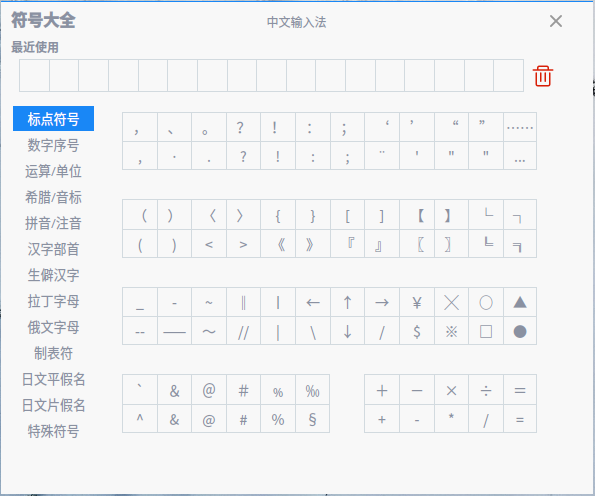

# 中文输入法|../common/inputer.svg|

## 概述

中文输入法是一款满足多类型终端在不同场景使用的输入法，支持拼音、五笔和手写输入方式，同时支持实体或虚拟键盘输入等。 

## 使用入门

### 切换输入法

1. 系统会预装中文输入法，单击右下角托盘上的 进入输入法配置页面。
2. 单击 **输入法**，选择**中文输入法**，托盘中输入法图标变为，则表示切换成功。

## 状态栏

中文输入法切换成功后，屏幕右下角会出现状态栏。在状态栏中，可进行以下设置。

**拼音&五笔**：中文输入法在键入中文时，可选择拼音或五笔方式键入，默认为拼音。

**中文&英文**：选择键入的内容形式，默认为中文。

**半角&全角**：中文输入法对键入的非汉字数字及字符内容，输出时进行全、半角格式的转换，默认为半角。

**中文&英文标点**：选择键入的标点形式，默认为中文标点。

**手写输入**：单击 ，进入手写输入界面，可实现屏幕手写输入，支持单字手写和多字行写。同时提供标点、数字及字母键，可用鼠标单击键入。手写输入适用于物理及虚拟键盘使用场景。

**全拼&双拼**：中文输入法在拼音输入的状态下，可以进行全拼、双拼的转换，默认为全拼。

**简体&繁体**：中文输入法在输出中文的状态下，输出时进行简繁体的转换，默认为简体。

## 属性设置

将光标放在状态栏上并单击右键，选择 **属性设置**，你可以进行基本设置、词库设置、快捷键设置、拼音及五笔设置等。

### 基本设置 

#### **默认设置**

在输入中文的时候，可以选择候选项数及输入方式。

- 候选项数：候选项数可选择3到9，默认为5。
- 输入方式：可选择拼音或五笔输入。
- 隐藏状态栏：系统默认为不隐藏状态栏，勾选后即隐藏状态栏。

#### 输入法管理

在基本设置界面，单击 **打开输入法管理器**，进入输入法配置界面。可以对系统中已安装的输入法进行设置，包括快捷键、外观等，系统新安装的输入法也会同步显示到该应用的输入法列表中。

### 词库设置
#### 用户词库

用户词库是每个人专有的词库，记录的是手动或自动造的词句。单击 **清除用户词库** 后，再次输入常用的词句后候选框中可能不会直接显示出来，需要一个个去选择，这样会降低输入效率。

> 注意：请谨慎操作，用户词库被删除后无法恢复。

#### 自定义短语

单击 **添加自定义短语**，可以将常用的短语自定义为简单的小写字母，提高输入效率。比如输入“a”，显示“我爱中国”，并显示在候选框的第一位。

#### 分类词库

系统自带了部分词库，单击 **添加分类词库** ，您可以下载到本地使用。

### 快捷键设置

在快捷键设置界面，您可以设置翻页按键及其他快捷键，如拼音五笔切换快捷键。

### 拼音设置

#### 特殊习惯

拼音输入方式有全拼和双拼，您可以根据个人习惯选择使用，如果选择 **双拼**，可以设置双拼方案。

#### 模糊音

在使用拼音输入时，将部分容易混淆的音节相互通用，可以部分提高输入效率。您可以根据个人习惯选择使用。

### 五笔设置
#### 输入风格

- 纯五笔：勾选后，没有拼音辅助功能，纯五笔输入方式。

- 五笔拼音混输：勾选后，以五笔编码为汉字高优先级选项。当五笔编码的汉字较少时，候选框可同时显示五笔编码和拼音编码汉字。

  

#### 特殊习惯

- 四码唯一时自动上屏：勾选后，当输入四码后显示结果唯一，则自动上屏。

### 恢复本页默认

单击 **恢复本页默认** ，可恢复当前页面为默认设置。

## 符号大全

将光标放在状态栏上并单击右键，选择 **符号大全**。可选择使用标点符号、数字序号、运算/单位等各种符号。

## 设置向导

将光标放在状态栏上并单击右键，选择 **设置向导**，进入个性化设置向导界面，设置内容可参考[属性设置](#属性设置)。

## 帮助中心

将光标放在状态栏上并单击右键，选择 **帮助中心-关于输入法**，可以查看中文输入法的版本等信息。

