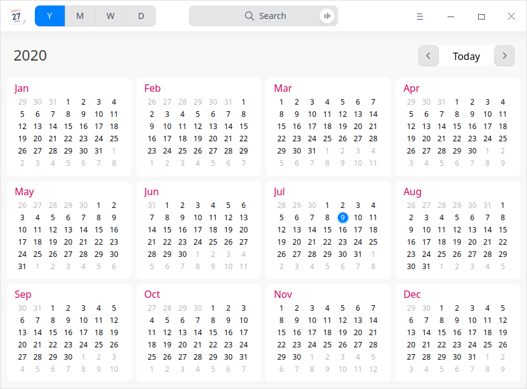
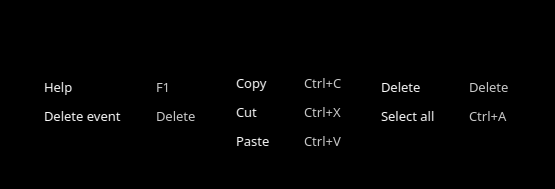
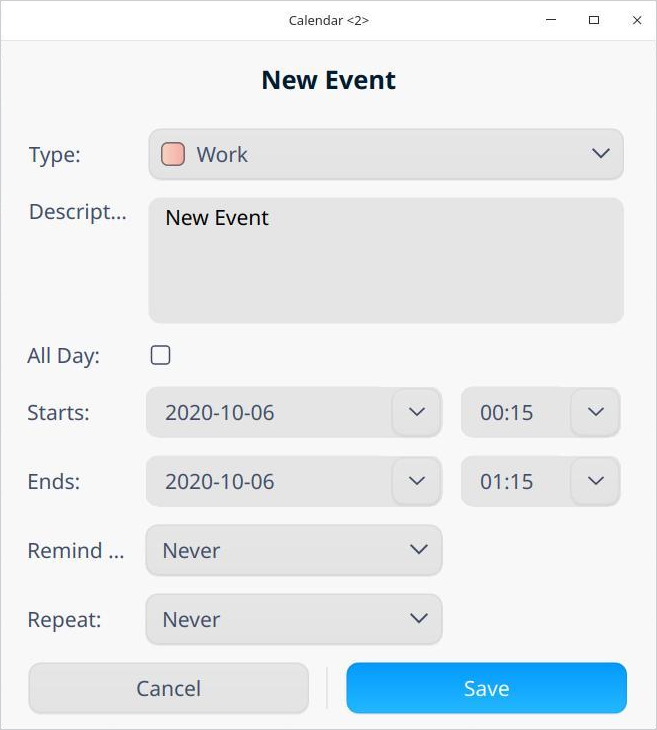

# Calendar|../common/dde-calendar.svg|

## Overview

Calendar is a useful tool to manage your personal life. By relating events with specific time, it allows you to keep records and make plans for your schedule.

## Guide

You can run, close, and create a shortcut for Calendar in the following ways.

### Run Calender

1. Click  in the dock to enter the Launcher interface.
2. Locate  by scrolling the mouse wheel or searching "calendar" in the Launcher interface and click it to run.
3. Right-click  and you can:
   - Click **Send to desktop** to create a desktop shortcut.
   - Click **Send to dock** to fix it in the Dock.
   - Click **Add to startup** to add the application to startup and it will automatically run when the system starts up.

### Exit Calendar

- On the Calendar interface, click  to exit calendar.
- Right-click  in the dock and select **Close All** to exit.
- Click  on the Calendar interface and select **Exit** to exit.

### View Shortcuts

On the Calendar interface, press **Ctrl** + **Shift** + **?** on the keyboard to view shortcuts. Proficiency in shortcuts will greatly improve your efficiency.

## Operations

Calendar can be divided into yearly view, monthly view, weekly view, and daily view, displaying date attributes by different views.

Monthly view is defaulted and you can click to switch between different views.

- Lunar calendar dates will only be displayed in the Chinese system in paring with the solar calendar dates.
- The date starts from the year **1900** and you cannot view dates earlier than that year during date switching. 
- In the monthly and weekly view, the display of Saturday and Sunday is different from that of days between Monday to Friday. 

| View         | Feature                                                      |
| ------------ | ------------------------------------------------------------ |
| Yearly View  | Display the months and days of the whole year.               |
| Monthly View | Display the holiday information and schedule.                |
| Weekly View  | Display the schedule of this week.                           |
| Daily View   | Display the holiday information and detailed schedule arrangements. |

### Create Events

1. Select a date in the monthly, weekly or daily view.
2. Double-click, or right-click to select **New event** in the blank area on a date and a **New event** window will pop up.
3. Set the schedule type, description, time, and reminder, etc.

   - Type: work, life, and other.
   - Event time: all day, start time, and end time.
      - When all day is checked:
         - You can only select dates as starts and ends, and cannot set hours and minutes. 
         - Remind me: Never, On start day (9:00 AM), 1 day before (the default setting), 2 days before, or 1 week before.
      - When all day is not checked:
         - You can select dates, hours, and minutes as starts and ends.
         - Remind me: Never, At time of event, 15 minutes before, 30 minutes before, 1 hour before, 1 day before, 2 days before, or 1 week before. 
   - Repeat: Never, Daily, Weekdays, Weekly, Monthly, or Yearly.
   - End Repeat: Never, after n time(s), or on the date selected.

 >  Notes: Only when you enable the **Repeat** feature can **End Repeat** be displayed.

4.  Click **Save** to create the event.

### Edit Events

1. Right-click a date with schedule in the monthly, weekly, or daily view.
2. Select **Edit** and an **Edit Event** dialogue will pop up.
3. Set properties for the event under editing.  
4. Click **Save**. 
5. If it is set as an all day event or a repeated event, a prompt box will pop up for you to confirm information and then complete editing. 

When editing an event, different prompt information will be displayed according to the changes of content. Description of icons contained in the prompt information is listed as below.

| Icon              | Description                                                  |
| ----------------- | ------------------------------------------------------------ |
| All               | Only effective for the changes of relevant repeating events. |
| Only This Event   | Only effective for the current event modification.           |
| All Future Events | All the future events on and after the selected date will be changed and the events before the selected date will remain unchanged. |
| Change All        | All repeating events will be changed.                        |

### Set an All-day or Multiple-day Event

Check **All Day**, set the **Starts** and **Ends **and you are able to set an all-day or consecutive all-day events when creating or editing an event.

### Set Repeating Events

1. Click the drop-down list on the right of **Repeat** and select an option when creating or editing an event.
   - **Daily**: Enter the number of days between each repetition.
   - **Weekdays**: Enter the number of weekdays between each repetition.
   - **Weekly**: Enter the number of weeks between each repetition and select the day on which the event shall occur.
   - **Monthly**: Enter the number of months between each repetition.
   - **Yearly**: Enter the number of years between each repetition and click the month in which the schedule shall occur.

2. Click the drop-down list on the right of **End Repeat** and select the end time of the schedule.

### View Events

Double-click an event title in the monthly, weekly, or daily view and a **My Event** window will pop up. You can view events, [Edit Events](#Edit Events), or [Delete Events](#Delete Events). 

### View Schedule Reminder Details

Click the notification prompt box to view the schedule reminder details after the system sends out a notification.

Description of icons contained in the prompt information is listed as below.

| Icon                   | Description                                                  |
| ---------------------- | ------------------------------------------------------------ |
| Remind me later        | The reminder is set on the current day. After the first reminder is given, click **Remind me later** and you will be reminded 10 minutes later. The following reminder intervals will be increased by 5 minutes each time on the basis of the then reminder internal when you click the **Remind me later**. |
| Remind  me    tomorrow | The reminder is set to one day or two days ahead of the schedule. |
| One day before start   | The reminder is set to one week ahead of the schedule.       |
| Close                  | Turn off the prompt information.                             |

### Search Events

In the yearly, monthly, weekly, or daily view, when the events are entered in the top search box, the corresponding search results will be displayed automatically on the right of the calendar.

1. In the top search box of the Calendar interface, you can clickto enter keywords.
2. Press the **Enter** key on the keyboard for searching.
   - When there is matched information, the search result list will be displayed on the right.
   - When there is no matched information, **No search results** will be displayed on the right.
3. Click  or delete the entered information in the search box to clear the current keywords or cancel the search. 

### Delete Events

1. Right-click a date with event in the monthly, weekly, or daily view.
2. Click **Delete** and a **You are deleting an event** prompt box will pop up.
3. Confirm the prompt information and delete the event.

You can also click **Cancel** to cancel the operation.

Description of icons contained in the prompt information for repeating and non-repeating events when deleting a event is listed as below.

| Icon                     | Description                                                  |
| ------------------------ | ------------------------------------------------------------ |
| Delete                   | Delete non-repeating events.                                 |
| Delete all               | Delete all occurrences of this event.                        |
| Delete Only This Event   | Delete only the selected occurrence of the event. This is only applicable to the repeating events. |
| Delete All Future Events | Delete this and all future occurrences of this event but the occurrences of the event before the selected date will be retained. This is only applicable to the repeating events. |

### Delete All Occurrences of Repeating Events

In the Calendar, if you select the first occurrence of the repeating events, you can click **Delete All** to delete all occurrences of the event. 

### Delete Part of the Repeating events

In the Calendar, if you select one or more occurrences of the repeating events, you can perform below tasks when deleting events:

- Click **Delete Only This Event**: delete the selected event only.
- Click **Delete All Future Events**: delete the selected occurrence and all future occurrences of the event.

## Main Menu

On the main menu, you can view help manual and get more information about Calendar.

### Help

1. On the Calendar interface, click .
2. Click **Help** to view the manual of Calendar.

### About

1. On the Calendar interface, click .
2. Click **About** to view the version and introduction of Calendar. 

### Exit

1. On the Calendar interface, click . 
2. Click **Exit** to exit Calendar.

