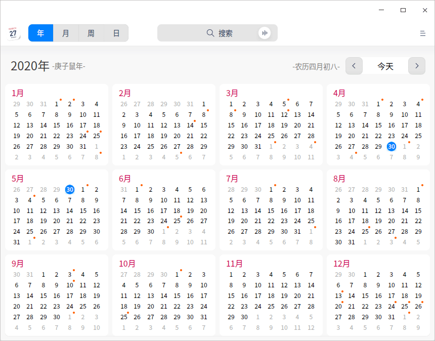
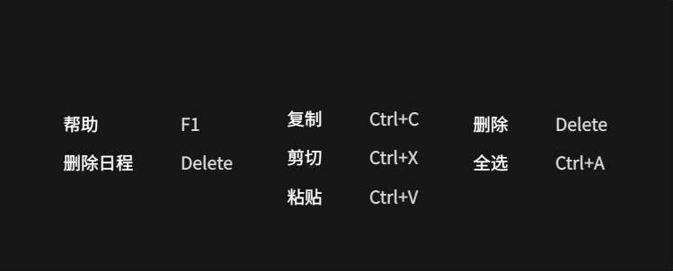
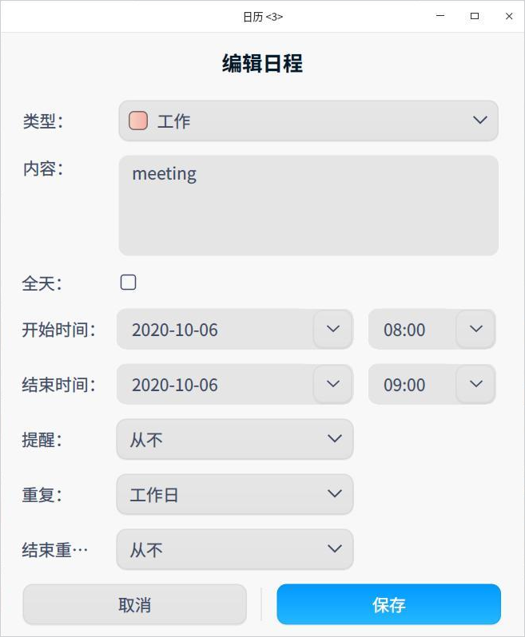

# 日历|../common/dde-calendar.svg|

## 概述

日历是一款查看日期、管理日程的小工具，支持查看农历、黄历、节气和常见的节日信息等，内置日程提醒功能帮您更好地规划时间。

## 使用入门

通过以下方式运行或关闭日历，或者创建日历的快捷方式。

### 运行日历

1. 单击任务栏上的启动器图标  ，进入启动器界面。
2. 上下滚动鼠标滚轮浏览或通过搜索，找到日历图标 ，单击运行。
3. 右键单击  ，您可以：

   - 单击 **发送到桌面**，在桌面创建快捷方式。
   - 单击 **发送到任务栏**，将应用程序固定到任务栏。
   - 单击 **开机自动启动**，将应用程序添加到开机启动项，在电脑开机时自动运行该应用。

### 关闭日历

- 在日历界面单击  ，退出日历。
- 在任务栏右键单击  ，选择 **关闭所有**，退出日历。
- 在日历界面单击  ，选择 **退出**，退出日历。

### 查看快捷键

在日历界面，使用快捷键 **Ctrl + Shift + ?** 打开快捷键预览界面，熟练地使用快捷键，将大大提升您的操作效率。

## 操作介绍

日历分为年、月、周、日视图，通过不同的视图方式展示日期属性。

系统默认显示月视图，可以通过鼠标单击切换年、月、周、日视图。

- 仅在中文系统中，日历会显示日期所对应的农历日期、黄历和节日信息。
- 日期以 **1900** 年为起点，在日期切换时，不能查看早于**1900 **年的日期。
- 在月视图、周视图中，周六周日的日期显示会区别于周一至周五。

| 视图 | 亮点                                 |
| ---- | ------------------------------------ |
| 年   | 显示全年的月份、天数。               |
| 月   | 显示节日信息、日程安排。             |
| 周   | 显示这一周每天的日程安排。           |
| 日   | 显示节日信息、详细的日程安排和黄历。 |

### 新建日程

1. 在月、周或者日视图中，选中一个日期。
2. 双击日期空白处或者单击右键选择 **新建日程**，弹出 **新建日程** 窗口。
3. 设置日程类型、内容、时间、提醒等信息。

   
&nbsp;&nbsp;&nbsp;&nbsp;&nbsp;&nbsp;&nbsp;&nbsp;&nbsp;&nbsp;&nbsp;&nbsp;&nbsp;
   - 类型：工作、生活和其他。
   - 日程的时间：全天、开始时间和结束时间。

      - 当勾选全天时：
         - 开始时间、结束时间：不能设置小时和分钟，只能选择日期。
         - 提醒设置：从不、日程发生当天（上午9时）、1天前、 2天前和1周前，其中1天前为默认设置。
   
      - 当不勾选全天时：
         - 开始时间、结束时间：既能设置小时和分钟，也能选择日期。
         - 提醒设置：从不、日程开始时、15分钟前、30分钟前、1小时前、1天前、 2天前、1周前。

   - 重复：从不、每天、工作日、每周、每月和每年。

   - 结束重复：从不、于n次后、于日期。

   > 说明：只有设置了 **重复** 功能，**结束重复** 才会出现。

4. 单击 **保存**，创建日程。
   
   > 说明：支持将日程标签拖拽到指定的日期或时间上。

### 编辑日程

1. 在月、周或者日视图中，双击或右键单击日程标签。
2. 选择 **编辑**，弹出“编辑日程”窗口。
3. 设置编辑日程的相关属性。 
4. 单击 **保存**。 
5. 如果有设置全天或者重复，则弹出提示框，确认提示信息，完成日程编辑。

编辑日程时，系统会根据所更改内容的不同显示不同的提示信息。提示信息中按钮说明如下表。

| 按钮         | 说明                                                         |
| ------------ | ------------------------------------------------------------ |
| 全部日程     | 修改所有与此相关的重复日程。                                 |
| 仅此日程     | 只修改当前日程。                                             |
| 所有将来日程 | 修改当前选中日期及以后日期的日程，选中的日期之前的日程仍然保留。 |
| 全部更改     | 修改所有重复日程。                                           |

### 设置全天或多天日程

在创建日程或编辑日程时，设置 **开始时间**、**结束时间**，可以设置全天或多天持续的日程。

### 设置重复日程

1. 在创建日程或编辑日程时，单击 **重复** 右侧的下拉列表，选择 **每天**、**工作日**、**每周**、**每月** 或 **每年** 重复日程。
2. 单击 **结束重复** 右侧的下拉列表，设置日程的停止时间。

### 搜索日程

1. 在日历界面顶部搜索框中，单击 ，输入关键字。
2. 按下键盘上的 **Enter** 键进行搜索。
3. 在搜索框中单击或删除输入的信息，清除当前输入的关键字或取消搜索。

### 查看日程

在月、周、日视图下，双击日程标签，弹出“我的日程”窗口，此时即可以查看日程，也可以 [编辑日程](#编辑日程) 或 [删除日程](#删除日程)。

### 查看日程提醒详情

当系统发出通知后，单击通知提示框，查看日程详情。

日程提醒时，提示信息按钮说明如下表。

| 按钮        | 说明                                                         |
| ----------- | ------------------------------------------------------------ |
| 稍后提醒    | 提醒设置为当天，首次提醒后，单击“稍后提醒”，10分钟后再次提醒，此后每次单击“稍后提醒”增加5分钟的时间间隔。 |
| 明天提醒    | 提醒设置为1天前或2天前时，出现该按钮。                       |
| 提前1天提醒 | 提醒设置为1周前时，出现该按钮。                              |
| 关闭    | 关闭提示信息。                                               |

### 删除日程

1. 在月、周或者日视图中，双击或右键单击日程标签。
2. 选择 **删除**，弹出“您正在删除日程”提示框。
3. 确认提示信息，删除日程。

您也可以 单击 **取消**，停止删除日程。

删除日程时，重复与非重复日程提示信息中按钮说明如下表。

| 按钮             | 说明                                                         |
| ---------------- | ------------------------------------------------------------ |
| 删除日程         | 删除非重复日程。                                             |
| 全部删除         | 删除所有的重复日程。                                         |
| 仅删除该日程     | 针对重复日程，仅删除当前所选日程。                           |
| 删除所有将来日程 | 针对重复日程，删除当前选中日期及以后日期的日程，选中的日期之前的日程仍然保留。 |

## 主菜单

在主菜单中，您可以切换窗口主题、查看帮助手册，了解日历的更多信息。

### 主题

窗口主题包含浅色主题、深色主题和系统主题。

1. 在日历界面，单击 。
2. 选择 **主题**，选择一个主题颜色。

### 帮助

查看帮助手册，进一步了解和使用日历。

1. 在日历界面，单击  。
2. 选择 **帮助**。
3. 查看日历的帮助手册。

### 关于

1. 在日历界面，单击  。
2. 选择 **关于**。
3. 查看日历的版本和介绍。

### 退出

1. 在日历界面，单击  。
2. 选择 **退出**。

文档更新时间: 2021-04-02 版本: 5.8
