# App Store|../common/deepin-appstore.svg|

## Overview
App Store is a piece of application that integrates functions such as application display, downloading, installation, uninstallation, commenting, rating, and recommendation. App Store collects different types of applications for you, each one has been installed and verified manually. You can search the popular applications with one-click download and automatic installation.           

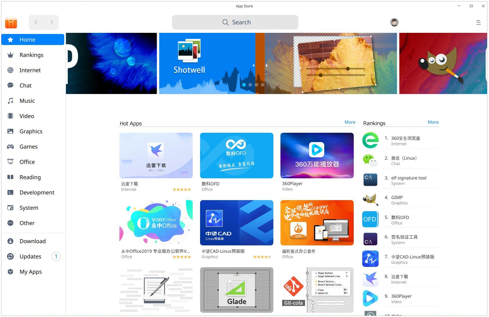

## Guide

You can run, close or create a shortcut of App Store as follows.

### Run App Store

1. Click    in the lower left corner of the dock to enter launcher interface.
2. Locate  by scrolling the mouse wheel or searching "App Store" in the Launcher interface and click it to run. 
3. Right-click    to:
 - Select **Send to desktop** to create a shortcut on the desktop.
 - Select **Send to dock** to fix it onto the dock.
 - Select **Add to startup** to add it to startup. When the computer starts up, App Store runs automatically.

>  Notes: App Store has been fixed on the dock by default. You can click   on the dock to run it.

### Exit App Store

- On App Store interface, click  to exit.
- Right-click   on Dock and select  **Close All** or **Force Quit** to exit.
- On App Store interface, click   and select  **Exit**.

## Main Interface
Main interface consists of navigation bar, search box, main menu, slide show, rankings, hot apps, download management, updates and my apps.

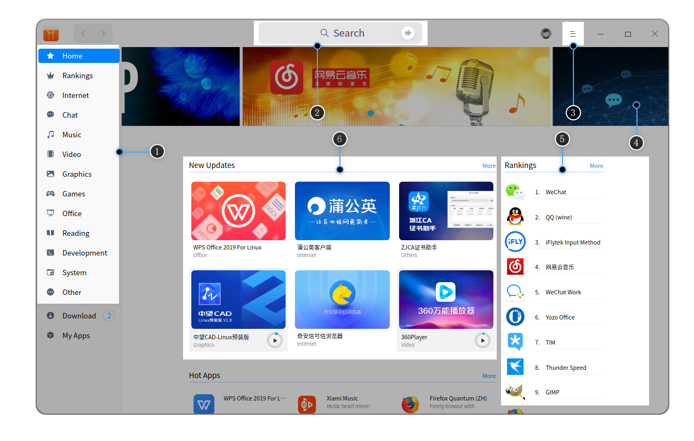

<table class="block1">
    <caption>Main Interface</caption>
    <tbody>
        <tr>
            <td width="20px">1</td>
            <td width="100px">Left panel</td>
            <td>It mainly displays the home page, rankings and application categories.</td>
        </tr>
        <tr>
            <td>2</td>
            <td>Search box</td>
            <td>You can quickly search applications in App Store by search box.</td>
        </tr>
         <tr>
            <td>3</td>
            <td>Main menu</td>
            <td>You can clear cache, view contents of Help and About, and exit App Store.</td>
        </tr>
        <tr>
            <td>4</td>
            <td>Slide show</td>
            <td>Images of recommended apps are played in a slide show.</td>
        </tr>
         <tr>
            <td>5</td>
            <td>Rankings</td>
            <td>App downloading rankings are displayed in the homepage.</td>
        </tr>
        <tr>
            <td>6</td>
             <td>Hot Apps</td>
            <td>Recommended popular apps are displayed here.</td>
        </tr>
        <tr>
            <td>7</td>
            <td>Download</td>
            <td>Currently downloading tasks, downloading and installing progress are displayed here. You can pause and delete any download task.</td>
        </tr>
        <tr>
            <td>8</td>
            <td>Updates</td>
            <td>You can view applications to be updated here and you can choose whether to update it or not.</td>
        </tr>
        <tr>
            <td>9</td>
            <td>My Apps</td>
            <td>You can view all apps installed and uninstall apps you don't need any more here.</td>
        </tr>
   </tbody>
   </table>

## Application Management
You can search, download and install different categories of applications, and also, you can explore more splendid applications through slide show, hot apps, rankings, user comments and other ways. 

### Search Applications
1. Search function is built in App Store, you can click to input keywords;

2. When you input a keyword, all applications containing that keyword will be displayed automatically below, then you can view all applications containing that keyword.

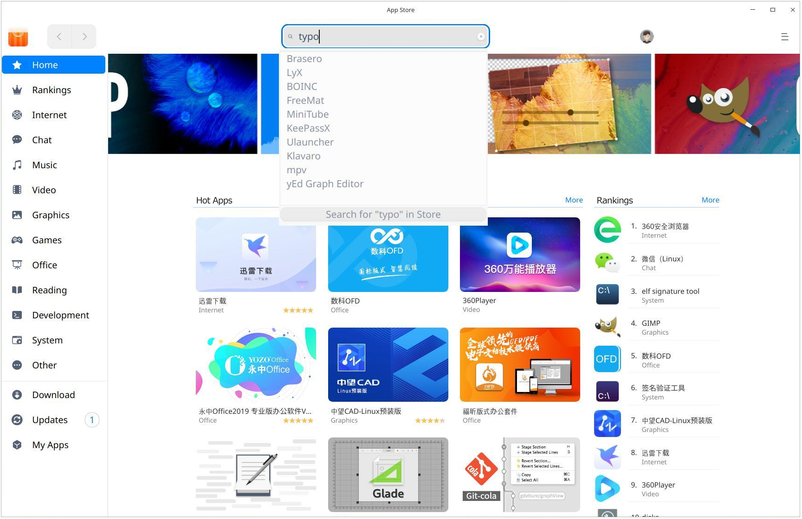

### Download/Install Applications
App Store offers one-click downloading and installation of applications. 

App Store supports Union ID synchronization. After signing in, downloaded and installed apps will be displayed in both local and cloud applications simultaneously. When you log in to the same Union ID on other devices, you can install cloud applications with one click.

1. On App Store interface, you can directly hover the cursor over the application icon or name, then click   .

2. Click **Download** in the left panel to view downloading/installing progress. You can also pause or delete the downloading task.

   

   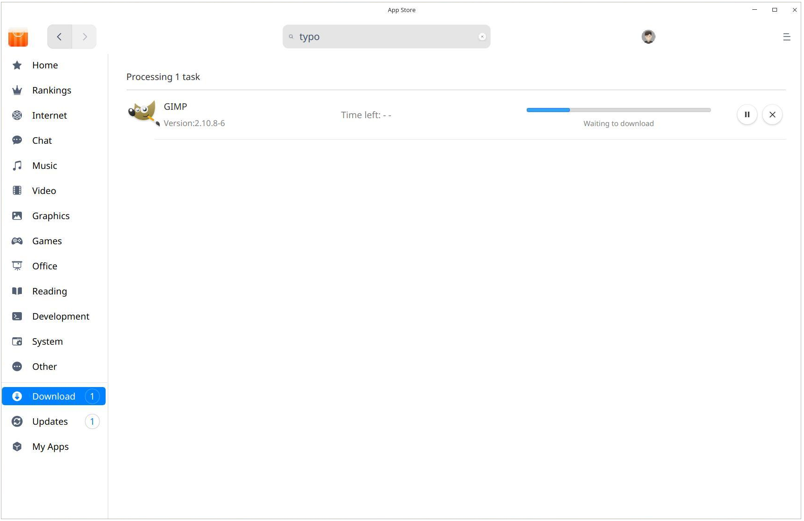

>Notes: When the union ID is not logged in, the downloaded and installed apps will only be displayed in the **Local Apps**.

#### Local Apps
1. On App Store interface, click **My Apps** to enter **Local Apps** by default. 
2. In **Local Apps** interface, you can view all installed apps in a list. Click **App filter** to filter apps by category.
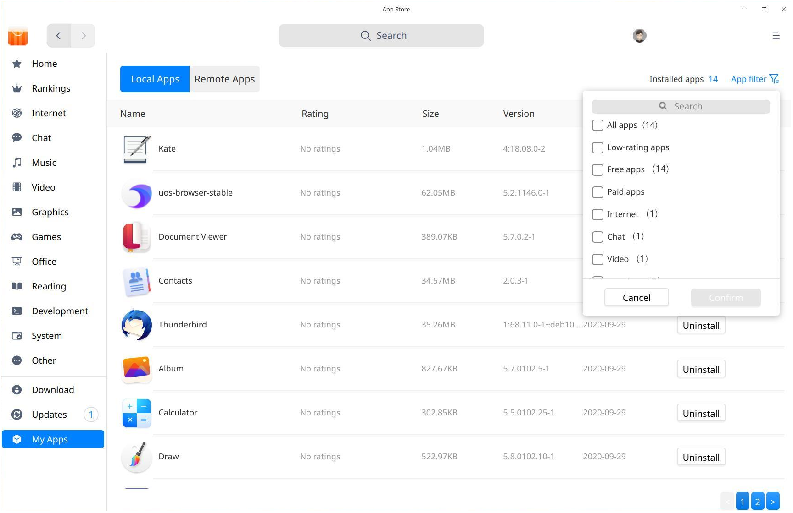

#### Remote Apps

1. Sign in your Union ID, select  **My Apps**>**Remote Apps** to show all cloud apps installed by the account.
2. Select the ones you want to install and click  .
3. After installation, the apps will be displayed both in **Local Apps** and **Remote Apps** synchronically.
4. If you want to install applications in batches, you can choose  **Install All **. Check all cloud applications you want to install, click  **Start Installation**.

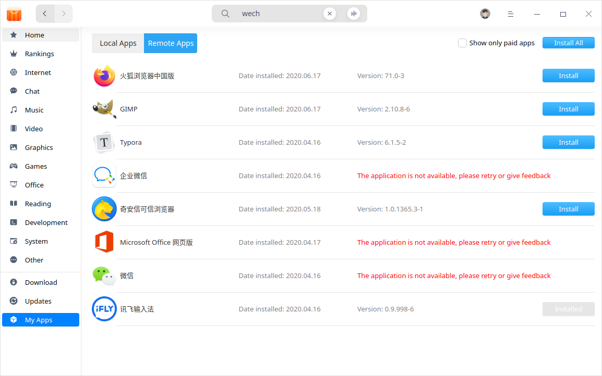

### Updates

Select **Updates** on the interface to view applications to be updated here and you can choose whether to update it or not. You can click **Recent** to view all recently updated apps and their information.

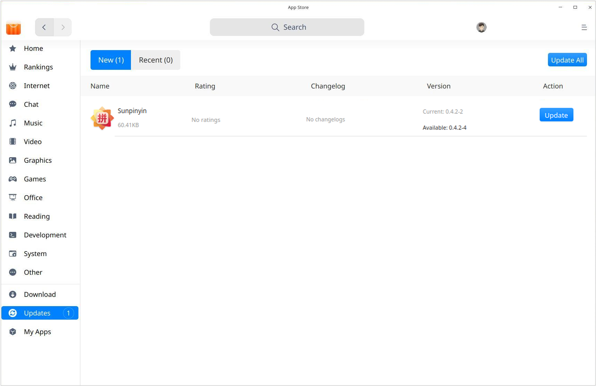

> Tips: You can also update/upgrade applications in Control Center. Refer to [Update Settings](dman:///dde#Update Settings) for particular operations.

### Uninstall Applications

On  **My Apps ** interface, click **Local Apps**, find the applications you want to uninstall, click  .

Besides uninstalling applications in App Store, you can directly uninstall applications inLauncher (specific operations refer to [Uninstall Applications](dman:///dde#Uninstall Applications)) .

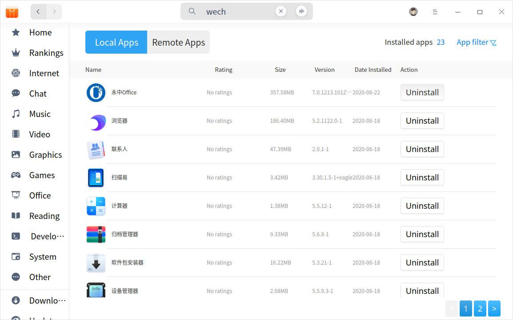

## Application Page

### Application Details
You can open the information page of any application to view its ratings, download times, category, version, package size, updated date and information such as application tags, sources, brief introduction and comments.

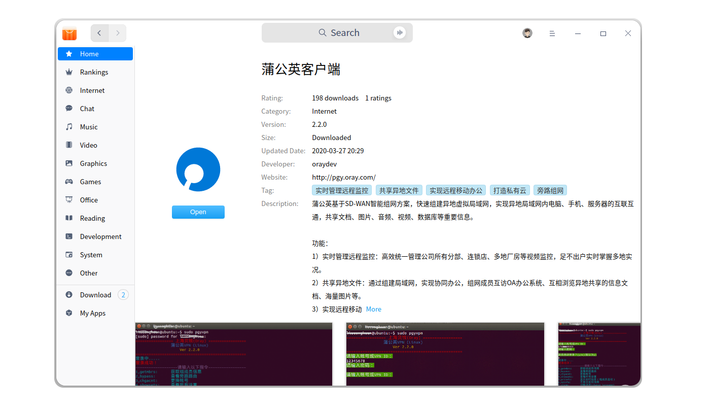

### Comment and Rate

- After sign in your Union ID, you can comment on and rate the applications. But comments and ratings must be submitted at the same time to be successful.

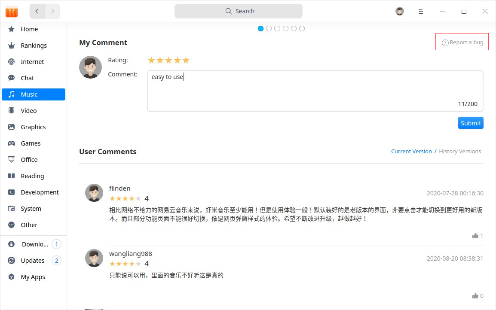

- Click the avatar on the title bar and select  **My Comments**  to view and edit all your ratings and comments. 
!Notes: If you have not logged in, you can only view comments and ratings.

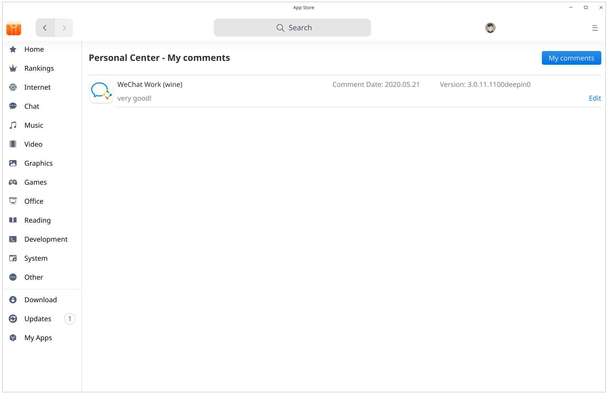

> Tips: You can also click the icon to the right of the comment to like it.

## Main Menu

### Sign In
1. On App Store interface, click the avatar on the title bar.
2. In the pop-up window, input username/email/phone number and password.

3. Click **Sign In**.

> Attention: If you don't have an account yet, you can click **Sign Up** in the pop-up box to sign up. 

### Clear cache
1. Click   on the main interface.
2. Click  **Clear cache** to clear up package caches.

### Help

Click Help to get the manual, which will help you further know and use App Store.

1. Click   on the main interface.
2. Click  **Help** to view the manual of App Store.

### About
1. Click   on the main interface.
2. Click **About** to view version information and introduction about App Store.

### Exit
1. Click   on the main interface.
2. Click  **Exit**.
