# 应用商店|../common/deepin-appstore.svg|

## 概述
应用商店是一款集应用展示、下载、安装、卸载、评论、评分、推荐于一体的应用程序。应用商店为您精心筛选和收录了不同类别的应用，每款应用都经过人工安装并验证。您可以进入商店搜索热门应用，一键下载并自动安装。

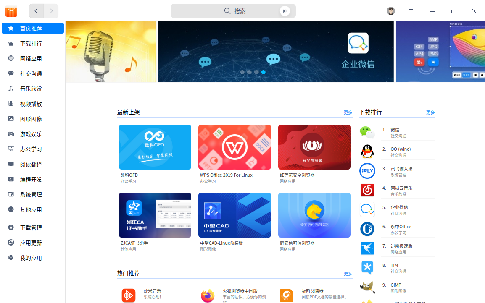

## 使用入门

通过以下方式运行或关闭应用商店，或者创建应用商店的快捷方式。

### 运行应用商店

1. 单击任务栏上的启动器 ，进入启动器界面。
2. 上下滚动鼠标滚轮浏览或通过搜索，找到应用商店 ，单击运行。
3. 右键单击  ，您可以：
 - 单击 **发送到桌面**，在桌面创建快捷方式。
 - 单击 **发送到任务栏**，将应用程序固定到任务栏。
 - 单击 **开机自动启动**，将应用程序添加到开机启动项，在电脑开机时自动运行该应用。

>  说明：应用商店默认固定在任务栏上，您也可以单击任务栏上的  打开应用商店。

### 关闭应用商店

- 在应用商店界面，单击  ，退出应用商店。
- 在任务栏右键单击 ，选择 **关闭所有** 来退出应用商店。
- 在应用商店界面，单击  ，选择 **退出** 来退出应用商店。

## 主界面
应用商店主界面由导航栏、搜索框、主菜单、首页轮播、热门推荐、排行榜、装机必备、专题专栏、下载管理、应用更新和我的应用组成。

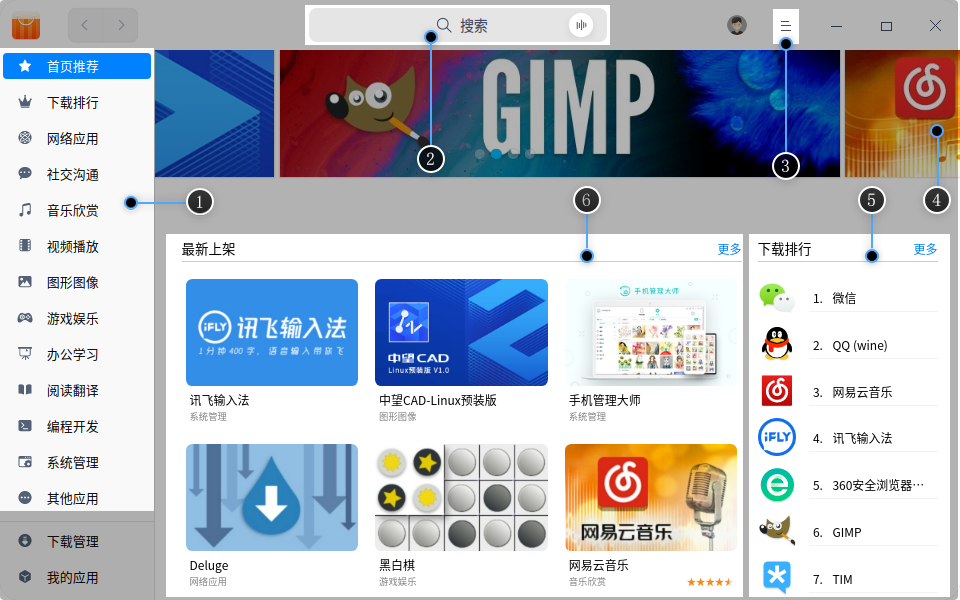

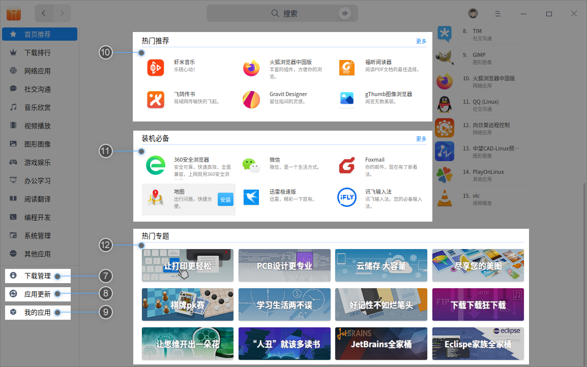

<table class="block1">
    <caption>主界面</caption>
    <tbody>
        <tr>
            <td width="20px">1</td>
            <td width="100px">导航栏</td>
            <td>导航栏主要显示应用商店的首页、排行榜以及应用分类。</td>
        </tr>
        <tr>
            <td>2</td>
            <td>搜索框</td>
            <td>用户可以通过搜素框快速查找应用商店中的所有应用。</td>
        </tr>
         <tr>
            <td>3</td>
            <td>主菜单</td>
            <td>通过主菜单您可以清除缓存、切换主题、查看帮助手册、关于信息、退出应用商店。</td>
        </tr>
        <tr>
            <td>4</td>
            <td>轮播区域</td>
            <td>首页轮播区域主要循环播放推荐应用的图片。</td>
        </tr>
         <tr>
            <td>5</td>
            <td>排行榜</td>
            <td>首页栏目区域主要展示应用下载排行榜。</td>
        </tr>
        <tr>
            <td>6</td>
            <td>最新上架</td>
            <td>主要展示新上架的应用合集。</td>
        </tr>
        <tr>
            <td>7</td>
            <td>下载管理</td>
            <td>下载管理主要显示当前下载任务，下载及安装进度，您还可以暂停和删除下载任务。</td>
        </tr>
        <tr>
            <td>8</td>
            <td>应用更新</td>
            <td>在应用更新中，您可以查看待更新的应用，并选择是否更新。</td>
        </tr>
        <tr>
            <td>9</td>
            <td>我的应用</td>
            <td>在我的应用中，您可以查看已安装的所有应用，卸载您不需要的应用。</td>
        </tr>
            <tr>
            <td>10</td>
            <td>热门推荐</td>
            <td>首页热门推荐区域主要展示热门的应用合集。</td>
        </tr>
             <tr>
            <td>11</td>
            <td>装机必备</td>
            <td>主要展示装机必备软件，可选择性安装。</td>
        </tr>
      <tr>
            <td>12</td>
            <td>热门专题</td>
            <td>主要展示热门专题的应用分类。</td>
        </tr>
   </tbody>
   </table>

## 应用管理

您可以通过应用商店搜索、下载、安装不同分类的应用，同时还可以根据轮播图、最新上架、装机必备、热门推荐、热门专题、下载排行、用户评论等不同方式挖掘更多精彩应用。

### 搜索应用
1. 应用商店中自带搜索功能，单击搜索按钮，输入关键字；

2. 输入关键字后，含该关键字的应用名称将在搜索栏下方显示，可查看包含该关键字的所有应用。

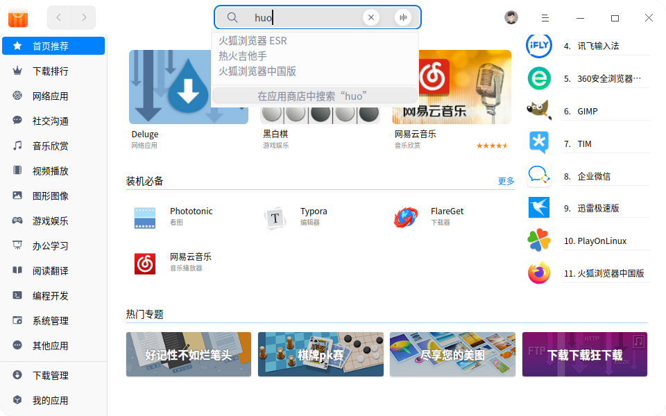

### 下载/安装应用
应用商店提供一键式的应用下载和安装，无需手动处理，同时在下载安装应用的过程中，您可以在 **下载管理** 界面查看当前应用的下载和安装进度，还可以暂停或删除下载任务。

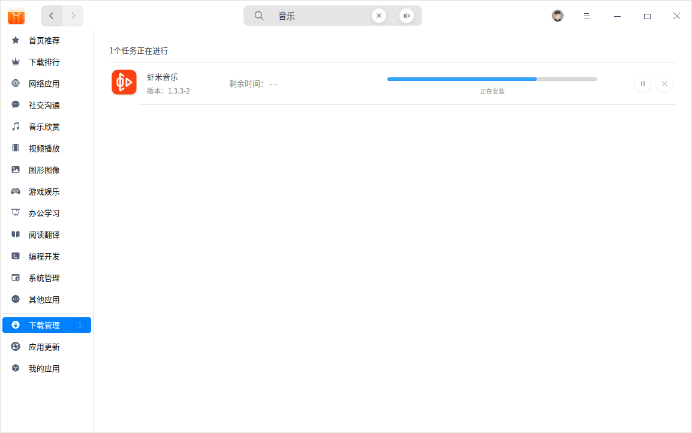

应用商店支持网络帐号同步功能。您用网络帐号登录后，下载安装的应用会同步显示在本地应用和云端应用。当在其他设备上登录该帐号时，可以一键安装云端应用。

> 说明：未登录时，下载安装的应用仅会显示在本地应用中。

#### 本地应用

1. 在应用商店界面，直接将鼠标悬停在应用的封面图或名称上，单击  。

2. 单击 **下载管理** ，可查看应用下载和安装的进度。

  > 窍门：您还可以单击应用的封面或名称，进入应用详情页面，查看应用的基本信息，然后单击  。

3. 安装完后，应用仅显示在本地应用中，单击 **应用筛选**，可根据应用分类筛选对应的应用。

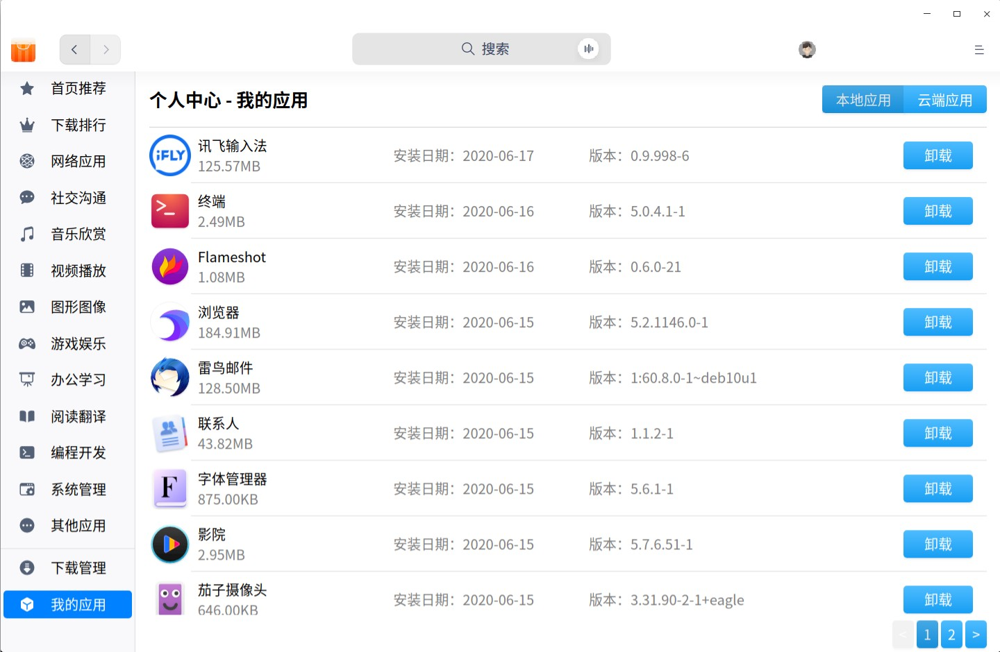

#### 云端应用

1. 登录您的网络帐号，选择 **我的应用**，单击 **云端应用**，即可看到该帐号下安装的全部云端应用。
2. 选择想要安装的云端应用，单击。
3. 安装完后，应用会同步显示在本地应用和云端应用列表中。
4. 如果想要批量安装，可以选择 **一键安装**，勾选想要安装的云端应用，单击 **开始安装**，将下载并安装云端应用。

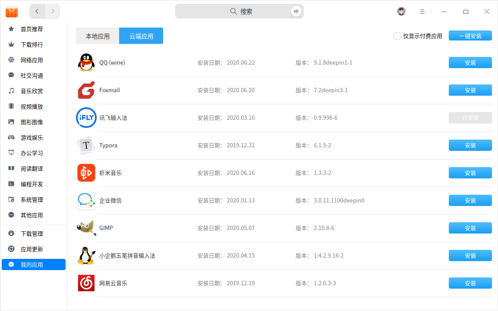

### 更新应用

在应用商店界面，选择 **应用更新**，可查看待升级的应用，并选择是否更新。

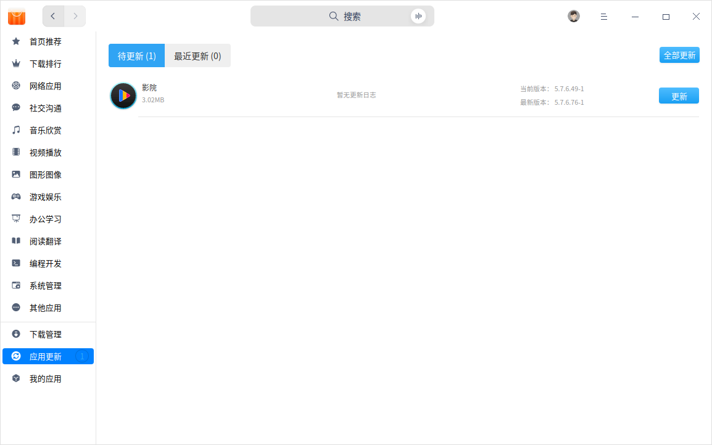

> 窍门：通过控制中心也可以更新和升级系统预装的应用，具体操作请参阅 [更新设置](dman:///dde#系统更新)。

### 卸载应用

除了通过启动器卸载应用（具体操作请参阅 [卸载应用](dman:///dde#卸载应用)），您还可以直接在应用商店进行卸载。

在 **我的应用 **界面，单击 **本地应用**，找到您要卸载的应用，单击 。

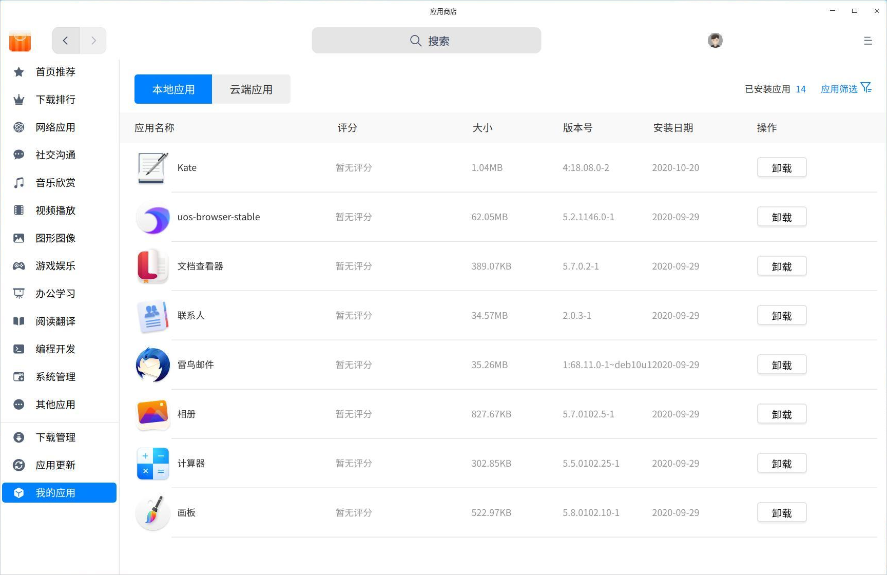

## 应用界面

### 应用详情
您可以进入应用详情界面，了解应用的评分、下载量、分类、版本、软件包大小、更新日期，以及应用标签、来源、简介、评论等信息。

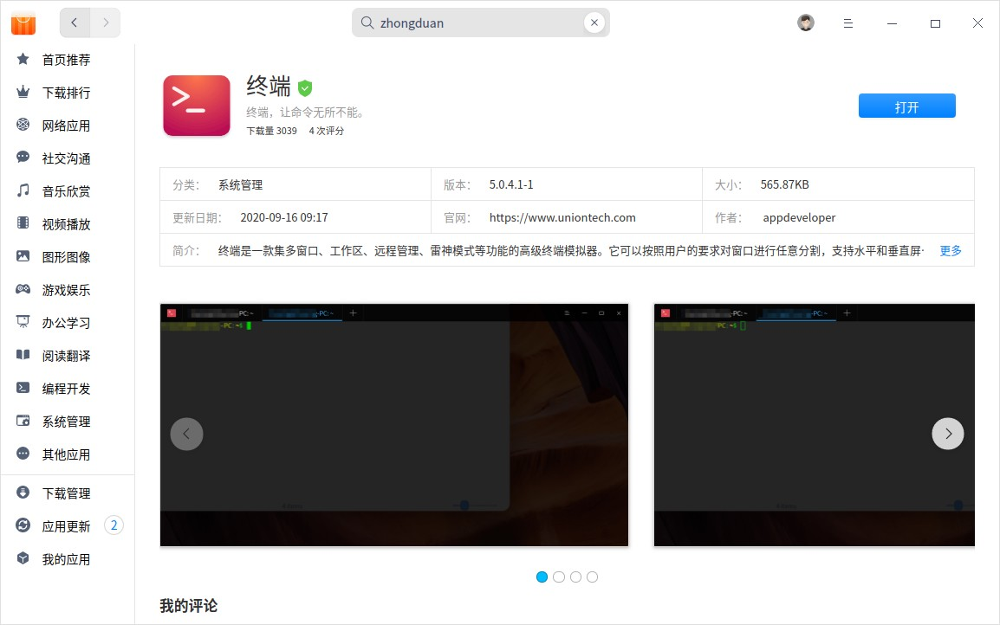

### 评论和评分

- 在应用商店登录网络帐号后，您可以对应用进行评论或评分，但评论和评分必须同时提交才能成功。

- 单击标题栏上的头像，选择 **我的评论**， 可以查看并修改您的所有评分和评论。

 > 说明：如果您未登录则只能查看评论和评分。

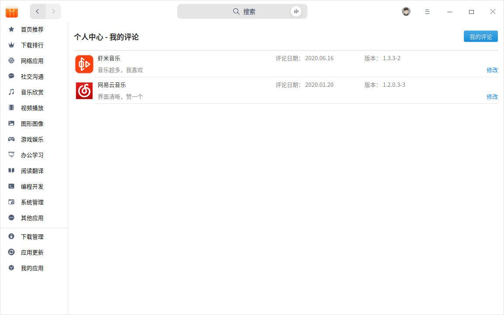

> 窍门：您还可以单击评论右侧的图标，点赞该条评论。

## 主菜单

### 登录
1. 在应用商店界面，单击标题栏上的头像。
2. 弹出网络帐户登录界面，输入用户名/邮箱/手机号，和密码。

3. 单击 **登录**。

> 注意：如果您未注册帐号，单击对话框中的 **注册** 按钮跳转到网页进行注册。

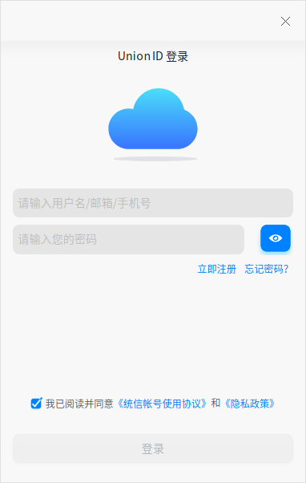

### 清除缓存
1. 在应用商店界面，单击 。
2. 单击 **清除缓存**，清除本地缓存的安装包。

### 主题

窗口主题包含浅色主题、深色主题和系统主题，其中系统主题为默认设置。

1. 在应用商店主界面，单击 。
2. 单击 **主题**，选择一个主题颜色。

### 帮助

1. 在应用商店界面，单击 。
2. 单击 **帮助**，查看应用商店的帮助手册，让您进一步了解和使用应用商店。

### 关于
1. 在应用商店界面，单击 。

2. 单击 **关于**，查看应用商店的版本、介绍及《统信软件隐私政策》。

### 退出
1. 在应用商店界面，单击 。
2. 单击 **退出**，即可退出应用商店。
