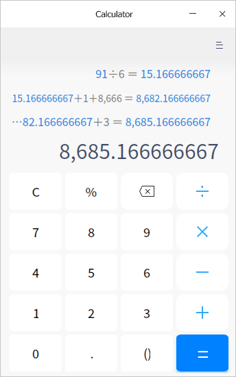

# Calculator|../common/deepin-calculator.svg|

## Overview

Calculator is a simple and easy to use desktop calculator, supporting addition, subtraction, multiplication and division. It supports keyboard input perfectly. It also supports symbol fault tolerance and calculation result linkage when keyboard input.

## Operations

### Symbols 

| Icon                                | Name                                                | Description                                                  |
| ----------------------------------- | :-------------------------------------------------- | ------------------------------------------------------------ |
| 0~9                                 | Number Key                                          | Basic Arabic numerals                                        |
| C                                   | Clear                                               | Click once to clear current contents and click twice to clear all. |
| %                                   | Percent Sign                                        | To input percent sign                                        |
|           | Delete                                              | Click once to delete a character forward                     |
| +-×÷                                | Addition, subtraction, multiplication, and division | Basic math operators for addition, subtraction, multiplication and division |
| .                                   | Decimal Point                                       | To input decimal point                                       |
| ()                                  | Bracket                                             | To input brackets with the left and right bracket completed automatically. |
| =                                   | Equal Sign                                          | To get result                                                |

> Tips: You can use the mouse to select the current input line to modify or copy.

### Symbolic Fault-tolerant Computing

Calculator supports keyboard operation and fault-tolerant computing of special symbols besides normal numbers and operation symbols. The input of expressions will not be affected by the input status as well as the case state of the keyboard.

In addition, it supports some special symbol fault tolerance:

- Fault-tolerance processing of multiplication: Input asterisk (*) or letter x to trigger multiplication;
- Fault-tolerance processing of division: Input division (/)  to trigger division;
- Fault-tolerance processing of addition: Input addition (+)  to trigger addition;
- Fault-tolerance processing of subtraction: Input minus (-) or underline (_) to trigger subtraction;
- Fault-tolerance processing of percent sign: Input percent sign (%)  to trigger remainder percent sign;
- Fault-tolerance processing of decimal point: Input an English decimal point (.) or a Chinese period (。) to trigger decimal point.
- Fault-tolerance processing of the bracket symbol: Input open and close brackets to trigger bracket;
- Fault-tolerance processing of equal sign: Input = in English and Chinese or press the **Enter** key to trigger equal sign;
- Fault-tolerance processing of the clear symbol: Press **Esc** to trigger clearing;
- Fault-tolerance processing of the delete symbol: Press **Backspace**  to trigger deleting;

### Expression

- Historical Expression

  - Click  =  in the current expression input area or press the **Enter** key on the keyboard to perform calculation and display the calculated result in the current input box. The expression becomes historical expression. There is no limit on the number of historical expressions.
  - Reedit: Click a single expression to reedit. The expression is displayed in the expression input area. After editing, press the **Enter** key or **=** on the keyboard or click = in the expression input area to modify the result of historical expression and linkage expression.
  - Expression error: If the expression input is incorrect, it is unavailable to perform calculation and "Expression error" is displayed.

- Input Expression

  + Large characters show the expression currently being entered in the area.

  + Press **Ctrl + C** on the keyboard to copy the calculation result of the current expression to the system clipboard. If there is expression error, the current expression will be copied to the system clipboard.
  + Percentage conversion rule:

    - Percentage is treated as operation symbol and converted to number directly. For example, when you input 1%, 0.01 is displayed on the interface.  When you input another 1, the number displayed will be 0.011. Input another %, the number displayed will be 0.00011.

    - Affect digital linkage effect: The result of the former expression will be automatically displayed in the input line. The % entered will be converted to a number without linkage with the former expression. For example, if the result for the former expression is 10, the number in the input line is 10. When you input %, it will become 0.1.

  - Expressions with no actual operation symbol will not listed in the history record.

### Digital Linkage

- It is available to continue entering operator after an expression displays its numerical result. The first number in the expression now is the calculation result of the previous one.  Take the current expression 10 + 20 = 30 for example. The displayed result is 30.  Input + and number 9 and a new expression will be formed, 30 + 9. Press the **Enter** key and the calculation result of the new expression will be 39.
- After the two expressions are linked, modify the numbers and operators of the previous expression. If the calculation result changes, it will affect the result of the new expression linked to it. For example, the two expressions 10 + 20 = 30 and 30 +9 = 39 are linked. If the operator +  in the first expression is changed to *, the expression will be 10 x 20 = 200. The second expression will be changed to 200 + 9 = 209 automatically. Up to 9 expression linkages are supported according to this rule.
-  In the process of re-editing an expression containing linked numbers, if the expression of linked numbers or linked numbers are modified incorrectly, the linkage can be released. 

## Main Menu

On the main menu, you can view help manual and get more information about Calculator.

### Help

View Help to get more information about Calculator.

1.  On the Calculator interface, click .
2.  Select **Help** to view the manual.

### About

1. On the Calculator interface, click .
2. Select **About** to view the version description.

### Exit

1. On the Calculator interface, click .
2. Click **Exit** to exit.

Update Date: 2021-06-23 Version: 5.6
