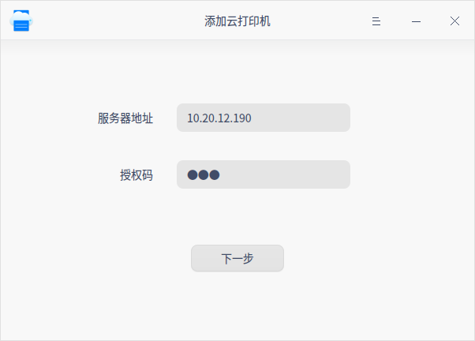
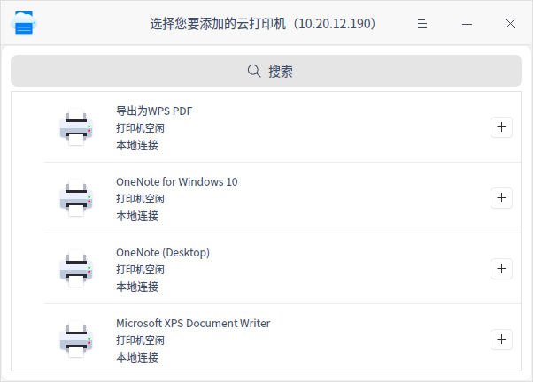
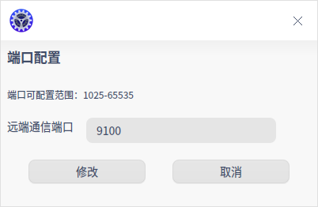

# 云打印|../common/deepin-cloud-print-configurator.svg|

## 概述

统信云打印解决方案利用windows现有的打印机适配优势，让用户可以直接在统信UOS中使用没有适配过的打印机，大大提高了打印机的利用率。

## 操作介绍

统信云打印解决方案需要在客户端及服务端安装对应的程序。

### Windows云打印服务端

1. 在Windows操作系统中安装云服务程序 “UniontechCloudPrintServerInstaller.exe”。

2. 双击云打印服务端并根据界面提示进行安装。

3. 安装完成后进入云打印设置界面，自动获取本机网络地址。

   

4. 输入新的授权码，单击 **更新** 后，完成授权码设置。

5. 当云打印和Windows其他程序端口冲突时，可以手动修改远程通信端口。在云打印设置界面，选择> **设置**，设置远端通信端口，配置范围为1025-65535。

### 统信操作系统云打印客户端

#### 添加云打印机

1. 单击任务栏上的启动器图标 ，进入启动器界面。

2. 上下滚动鼠标滚轮浏览或通过搜索，找到统信云打印配置助手图标 ，单击运行。

3. 进入添加云打印机界面，输入服务器地址和授权码，单击 **下一步**。

   

4. 系统自动加载云打印机列表，单击搜索按钮，可以根据云打印机IP或名称进行搜索。选择需要添加的云打印后，单击添加按钮。

   

5. 添加成功后，打印机会添加至打印管理器中的打印机列表中，单击可以跳转到打印管理器界面查看。

6. 在统信操作系统中打印文件时，就可以选择添加的打印机进行打印了。

#### 主菜单

在主菜单中，您可以进行端口设置、切换窗口主题、查看帮助手册等。

**设置**

1. 在云打印界面，单击。

2. 单击 **设置**，可以设置远端通信端口，配置范围为1025-65535。如果服务端修改了远程通信端口，则需要同步修改客户端的远程通信端口。

   

**主题**

窗口主题包含浅色主题、深色主题和系统主题。

1. 在云打印界面，单击。
2. 单击 **主题**，选择一个主题颜色。

**帮助**

1. 在云打印界面，单击 。
2. 单击 **帮助**，查看帮助手册，进一步了解和使用云打印。

**关于**

1. 在云打印界面，单击 。
2. 单击 **关于**，查看云打印的版本和介绍。

**退出**

1. 在云打印界面，单击 。
2. 单击 **退出**。

文档更新时间: 2021-04-02 版本: 5.3
