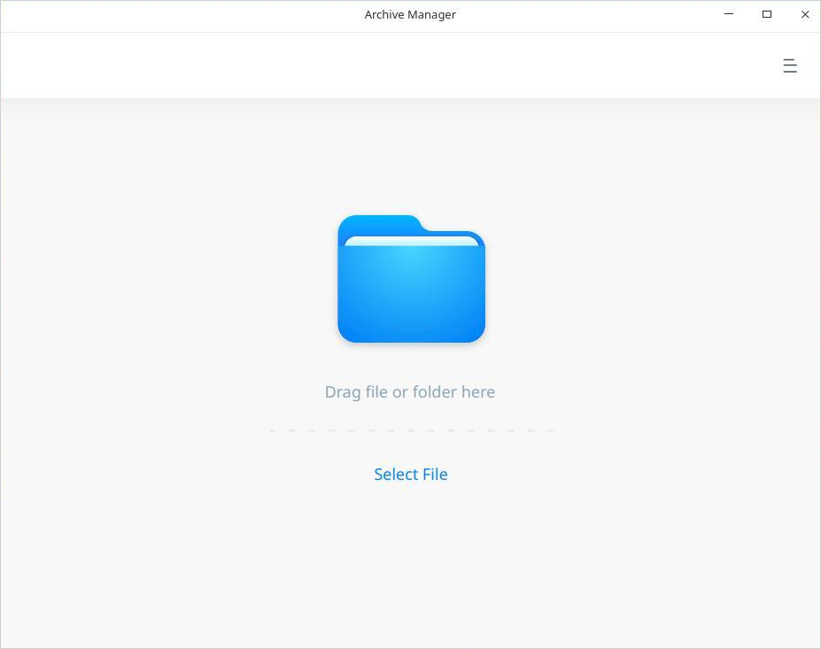
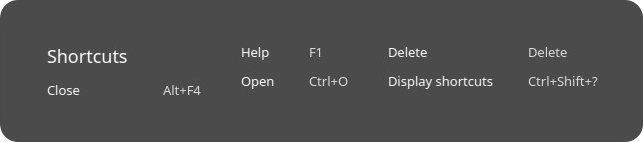
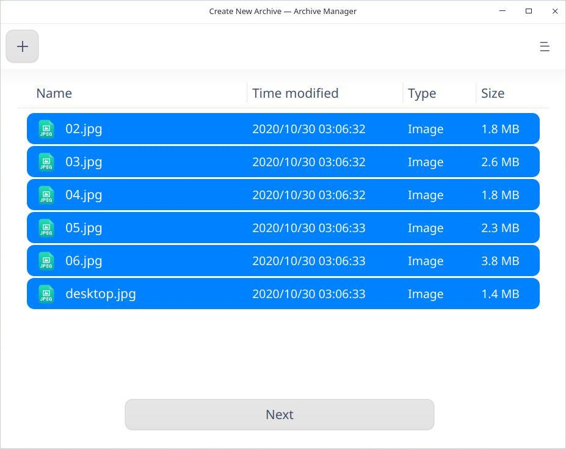
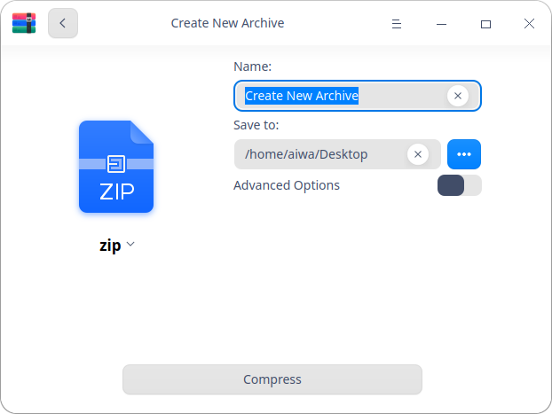
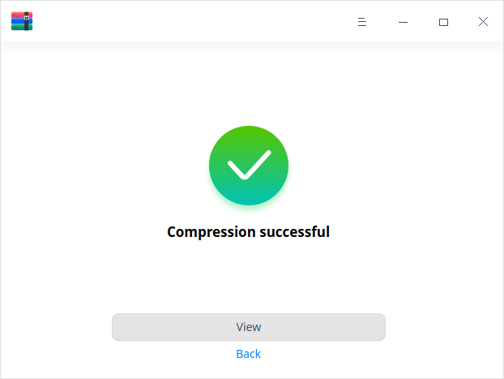
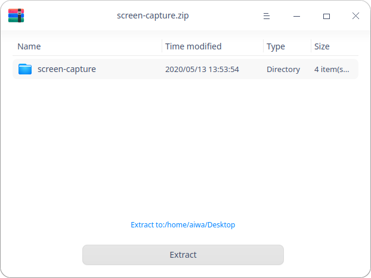
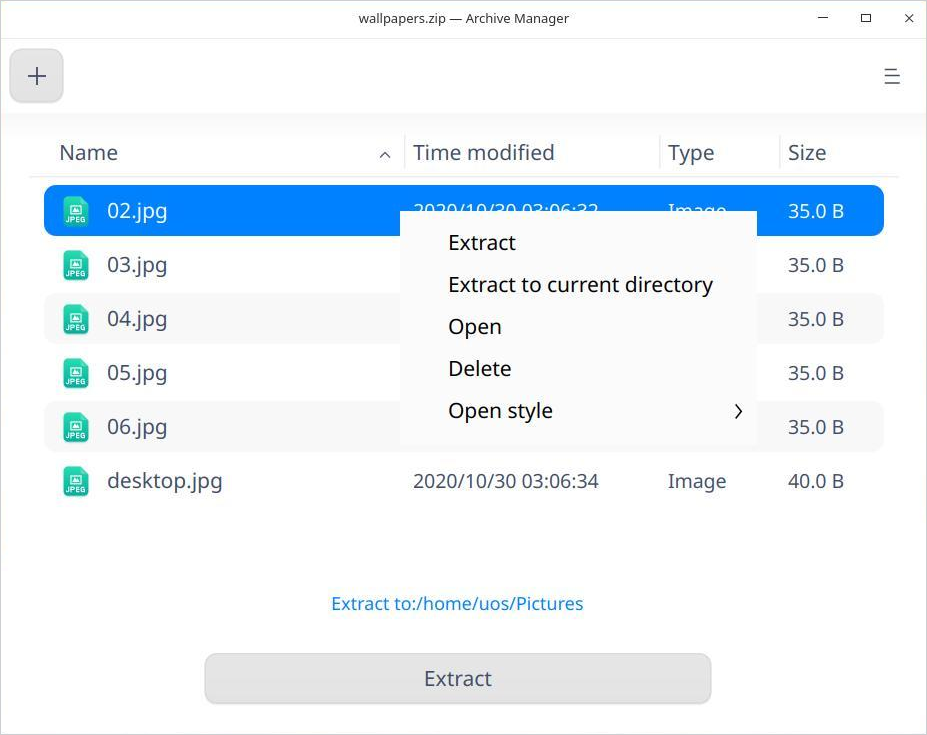

# Archive Manager|../common/deepin-compressor.svg|

## Overview

Archive Manager is a user-friendly and easy-to-use compressing and decompressing software, supporting multiple compressing formats such as 7z, jar, tar, tar.bz2, tar.gz, tar.lz, tar.lzm, tar.lzo, tar.Z, zip as well as encrypted compressing settings.

## Guide

You can run, exit or create a shortcut for Archive Manager by the following ways.

### Run Archive Manager

1.  Click  on dock  to enter the Launcher interface.
2.  Locate  by scrolling the mouse wheel or searching Archive Manager in the Launcher interface and click it to run.
3.  Right-click  and you can:
 - Click **Send to desktop** to create a desktop shortcut.
 - Click **Send to dock** to fix it on Dock.
 - Click **Add to startup** to add it to startup and it will auto run when the system boots.

> Tips: You can set Archive Manager in the control center as the default compression and decompression viewer. Please refer to [Default Program Settings](#Default Program Settings) for details.

### Exit Archive Manager

- Click   on the Archive Manager interface to exit Archive Manager.
- Right-click on dock and select **Close All** to exit.
- Click  on the Archive Manager interface and select  **Exit** to exit.

### View Shortcuts

On the Archive Manager interface, press  **Ctrl** + **Shift** + **？** on the keyboard to view shortcuts. Proficiency in shortcuts will greatly improve your efficiency.

## Operation Instructions

### Compress

It is available for you to compress a single file/folder/package or a collection of multiple files/folders/packages.

1. On the Archive Manager interface, click **Select File** to select the file to be compressed and click **Open**.

   > Tips: You can drag one or more files directly to the Archive Manager interface for compression.
   
2.  Click   to add files to be compressed.

   > Tips: It is available for you to click   > **Open file** to add files to be compressed.

   

3.  Click **Next**.

4.  Set the compressed file name, storage location, package format, etc.

5.  If you enable the advanced option mode, it is available for you to set the package encryption password and volume compression.

   > Notes: The default package format is zip and the available formats are 7z, cbz, exe and zip.
   
   

6.  Click **Compress**.

7.  Click **View** to view the specific storage location or click **Back** to return to the main interface after successful compression.

   > Tips: You can also right-click **Compress** to compress the file.

   

### Extract

1.  On the Archive Manager interface, click **Select File** to select the file to be extracted and click **Open**.
3.  Click **Extract to:  /home/de/Desktop**  to customize the extraction path.
4.  Click **Extract** to extract the files to the default path.

   > Notes: When the file to be extracted is encrypted, you need to enter the password to complete extraction.

5.  Click **View** after successful extraction to view the specific storage location for the files extracted or click **Back** to return to the main interface.

   > Tips: You can also right-click **Extract** to decompress the file.

   

### Extract Files

On the Archive Manager interface, click **Select File** and then select a file to be extracted. 

Click **Extract** or **Extract to  /home/de/Desktop** to extract the files to the corresponding path. You can also customize the extraction path.

> Notes: When the file to be extracted is encrypted, you need to enter the password to open and extract the files. 

## Main Menu

On the main menu, you can open the compression interface, switch window themes, view the help manual and get more information about Archive Manager.

### Open
1.  Click   on the Archive Manager interface.
2.  Select **Open file** and select the file to be compressed or extracted from the file selector.

### Set up

1.   Click   on the Archive Manager interface.
2.  Click **Settings**.
3.  You can perform the following settings as needed:
 - Set the default extraction location.
 - Set to create folders automatically.
 -  Set to automatically open the corresponding folder  after extraction.
 - Set the associated file type.

Tips: Click **Restore Defaults** on the interface to restore the default setting.

### Theme

The window theme includes Light Theme, Dark Theme and System Theme (default).

1.   On the Archive Manager interface, click.
2.   Click **Theme** to select a theme.

### Help

View Help to get more information about Archive Manager.

1.  On the Archive Manager interface, click .
2.  Click **Help**.
3.  View the manual.

### About

1.   On the Archive Manager interface, click  . 
2.  Click **About**.
3.   View the version description.

### Exit

1.  On the Archive Manager interface, click  .
2.  Click **Exit** to exit.
