# Contacts|../common/deepin-contacts.svg|

## Overview

Contacts is a communication management software based on Cloud accounts supporting functions such as video conference, desktop sharing and so on, which provides users with great convenience in discussion and communication, and efficiency improvement as well.  

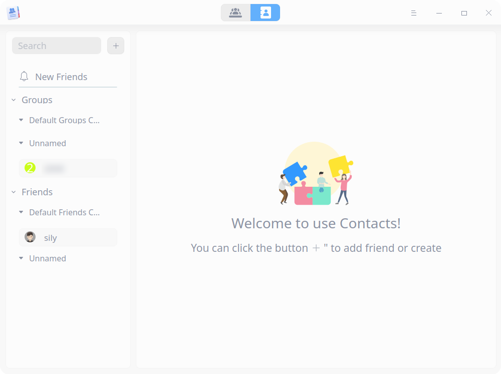

## Guide

You can run, close or create a shortcut for Contacts as follows.

### Run Contacts

1. Click  on the Dock to enter the interface of launcher.
2. Locate  by scrolling the mouse wheel or searching "Contacts" and click it to run.
3. Right-click  to: 
   - Select **Send to desktop** to create a shortcut on the desktop.
   - Select  **Send to dock** to fix it onto the dock.
   - Select **Add to startup** to run it automatically when the computer is turned on.

### Exit Contacts

- On the main interface, click    to exit.
- Right-click  on the Dock, select **Close all** or **Force Quit** to exit.
- On the main interface, click  and select **Exit** to exit.

## Sign In

Once **Contacts** is run, the interface **Union ID Sign in** pops up automatically.

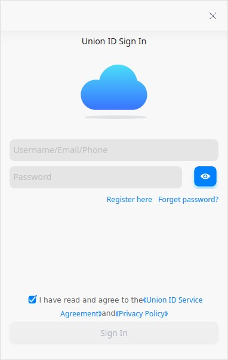

#### Sign up

Once **Contacts** is run, the interface **Union ID Sign in** pops up automatically. If you don't have a Union ID account, you can sign up for one as follows.

1. Click hyper link **Sign up**, the default browser of the operation system is called successfully and a signing-up page is opened.
2. Input information to sign up for an account accordingly as required.
3. After signing up is completed, you can return to the interface of Union ID Sign in to sign in your account.

#### Forgot Password？

Once **Contacts** is run, the interface **Union ID Sign in** pops up automatically. If you have forgotten password, you can get it back as follows.

1. Click hyper link **Forgot password?** , the default browser of the operation system is called successfully and you can reset your password.
2. After password is reset, you can return to the interface of Union ID Sign in to sign in your account.

#### Auto-login

Prerequisite: you have logged in the operation system with the Union ID. 

1. Once **Contacts** is run, the system will enter into main interface of Contacts without inputing Union ID and password.

#### Manually login

Prerequisite: you haven't logged in the operation system with the Union ID.

1. Once **Contacts** is run, the interface **Union ID Sign in** pops up automatically.

2. Input your Union ID and password. After verification is completed successfully, logging in from the client terminal is also done and main interface of Contacts is opened. 

## Contacts

On the main interface, click  .

### Search

Prerequisite: you have already added some friends or created groups.

1. To find a friend quickly, you can input his/her Union ID, nickname, remark name, or group name into the searching box.

  >  Notes: The object being searched should be somehow related to the Union ID, instead of a totally stranger.

### New friends

This interface mainly displays the contacts who request to add you as a friend.

1. When somebody requests to add you as a friend, a red prompt will pop up from the lower right corner.
2. Click **New friends**, you can select **Agree** or **Refuse** to add this contact. You can also view history.

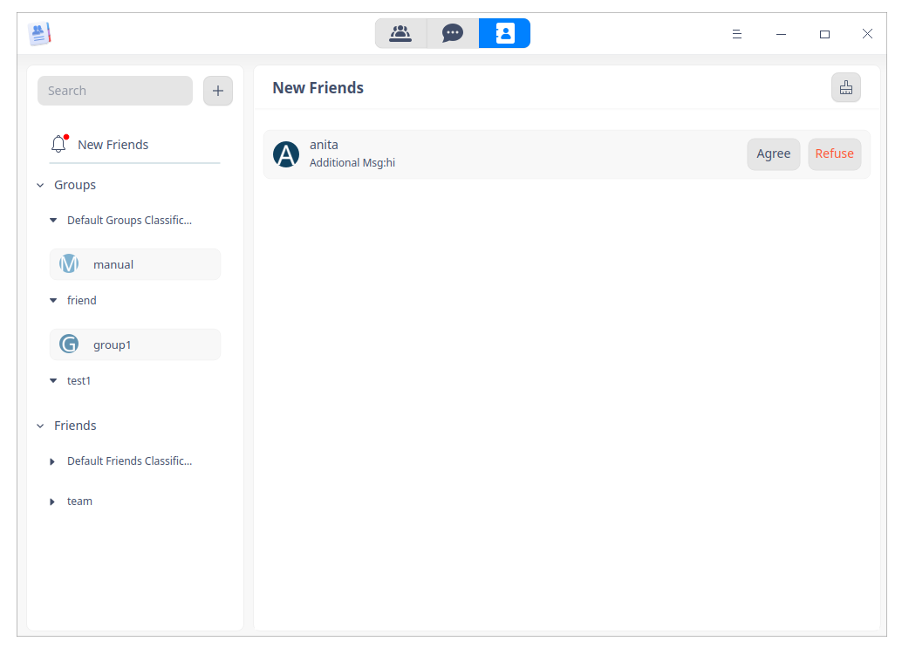

### Friends

#### Add Friends Classification

One default friends classification is displayed here, if you want to add others, do as follows.

1. Hover the cursor over **Friends** and right-click; or click , a popping-up box saying  **Add Friends Classification** appears.

2. Input a name and press **Enter** key, then, a new classification is created. If you have to change its name, you can right-click to select **Rename Classification**.

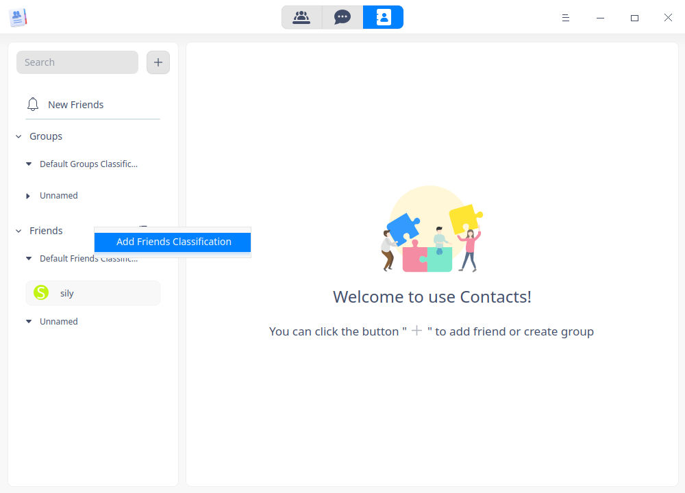

#### Delete Classification

1. Select the classification you want to delete and right-click; or, click to select **Delete Classification**.
2. A confirming box pops up, click **OK** then the selected classification will be deleted, and members in that classification will move to default classification.

#### Add Friend

There are three ways to add friends, including: 

- Click from the main interface to select **Add Friend**; 

- Select the objective friends classification and right-click, select **Add Friend**; 

- Click  located after the objective friends classification and select **Add Friend**.

To add a friend, you can:

1. Click **Add Friend**.
2. Input user name, email or phone number to search a friend, and he/she will appear in the list if searched successfully, click .
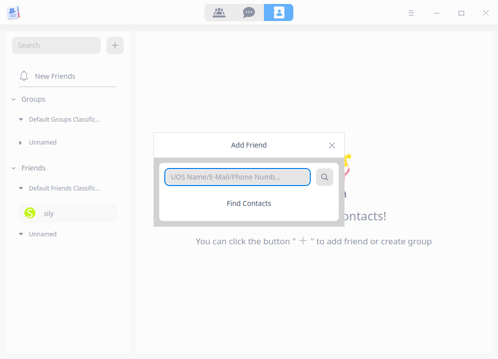
3. A dialogue box "Add Friend Request" pops up. Select classification, input a message and click  **Send**.
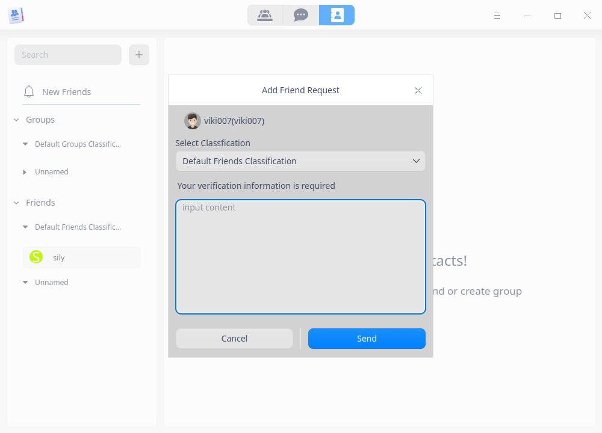
4. After the friend agrees to add you, you can see him/her in the list, which means you have added him/her successfully. 
5. You can add a remark name for him/her.

#### Contact Information

1. Click a friend you want to view in the list, you can see detailed information about him/her.
2. The detailed information includes account, remark name, mobile phone and email. You can also create a conference here.

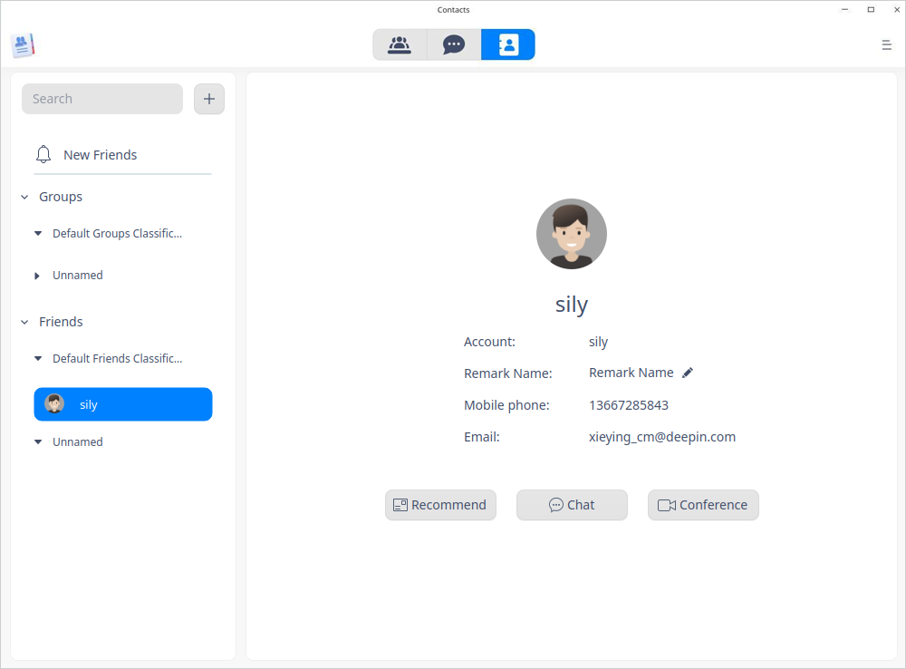

#### Move Friend to

1. Select the friend you want to move, right-click and select **Move Friend To**.
2. Select the target classification in the popped-up box to complete this operation.

#### Delete Friend

1. Select the friend you want to delete, and right-click, then select **Delete Friend**.
2. A confirming box pops up, click **OK** then the selected friend will be deleted.

#### Create conference

1. Prerequisite: the friend is online.
2. Click to create a video conference.

#### Chat with friend

1. Click  to chat with a friend
2. In the chatting window, you can send emoji, screenshots and files, share contact card, view chat history and make video calls.
   - In Chat History, you can enter keywords to search relevant history; click  to empty all history.
   - Click  to view the friend's information and create a new group.
   - In the list on the left side, right-click a friend's name, select **Top**, this friend will be displayed on the top; select **Mute**, there will be no reminders when the friend sends you messages; select **Delete**, the friend will be deleted from the chatting list.

### Groups

#### Add Groups Classification

One default groups classification is displayed here, if you want to add others, do as follows.

1. Hover the cursor over **Groups** and right-click; or click , a popping-up box saying  **Add Groups Classification** appears.
2. click **Add Groups Classification** to input a name, then, a new group classification is created. If you haven't input a name for the new classification when creating it, you can right-click to select **Rename Classification**.

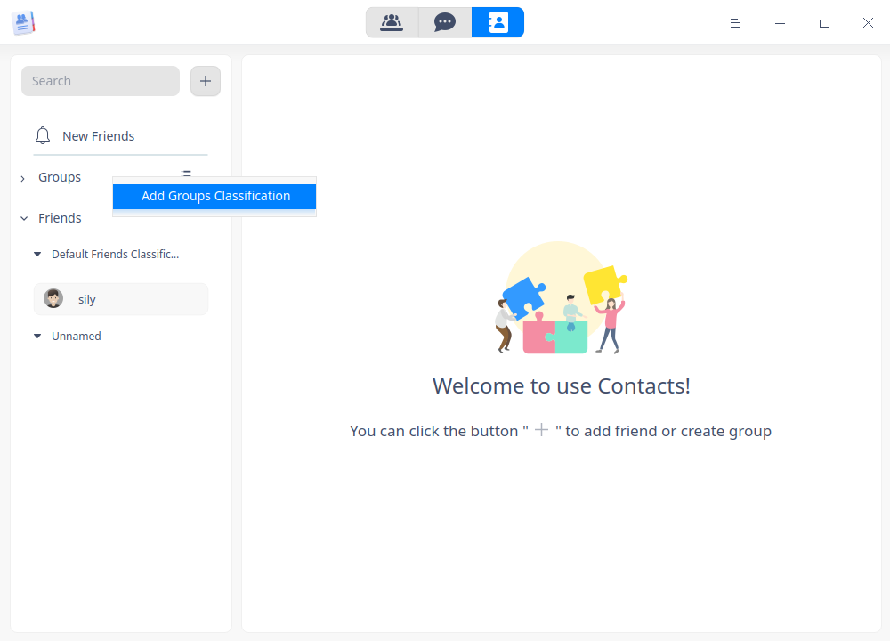

#### Delete Groups Classification

1. Select the groups classification you want to delete, and right-click; or click then select **Delete Classification**.
2. A confirming box pops up, click **OK** then the selected groups classification will be deleted, members in the classification will be moved into default groups classification.

#### Create New Group

There are three ways to add friends, including:
- Click from the main interface to select **Create New Group**; 
- Select the objective groups classification and right-click, select **Create New Group**; 
- Click  located after the objective groups classification and select **Create New Group**. After created successfully, the group will appear automatically in members' list and the new group will be classified into their **Default Groups Classifications**.

To create a new group, you can:

1. Select **Create New Group**.

2. Customize the group's name, and select the friends you want to add in this new group from Friends.

3. Click **OK**. After created successfully, you can see it in Default Groups Classifications.

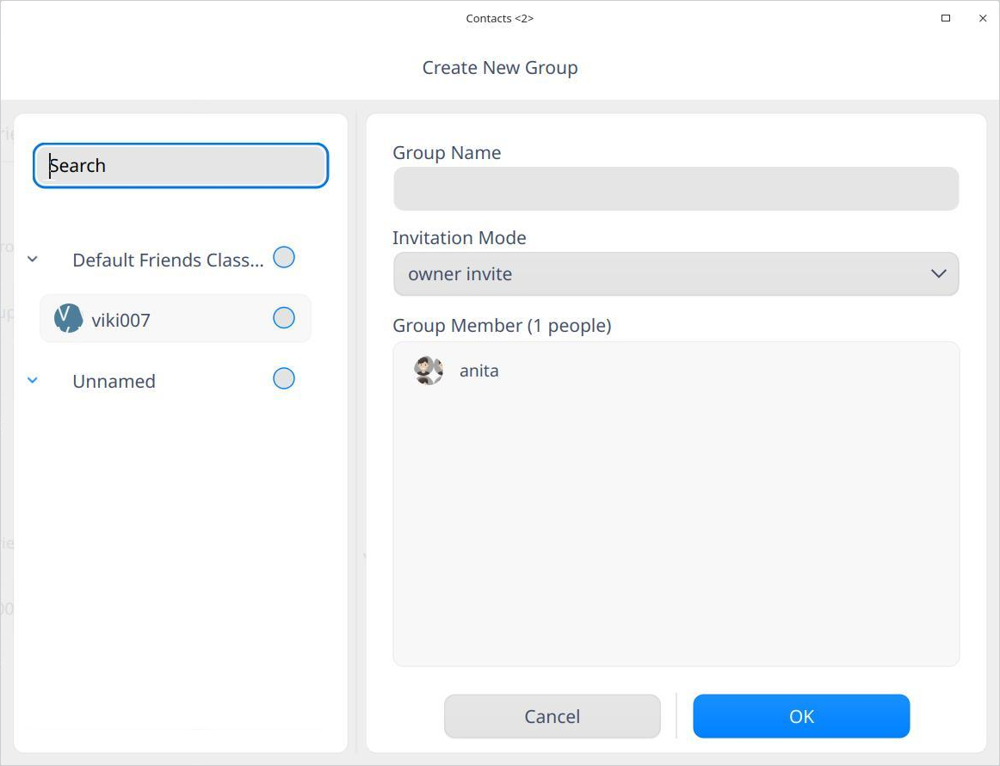

#### Group Info

1. Select the group you want to view, and the detailed information will appear on the right side.
2. You can see group name, group notice, create time, invitation mode and group members. You can also dismiss group or transfer group here.

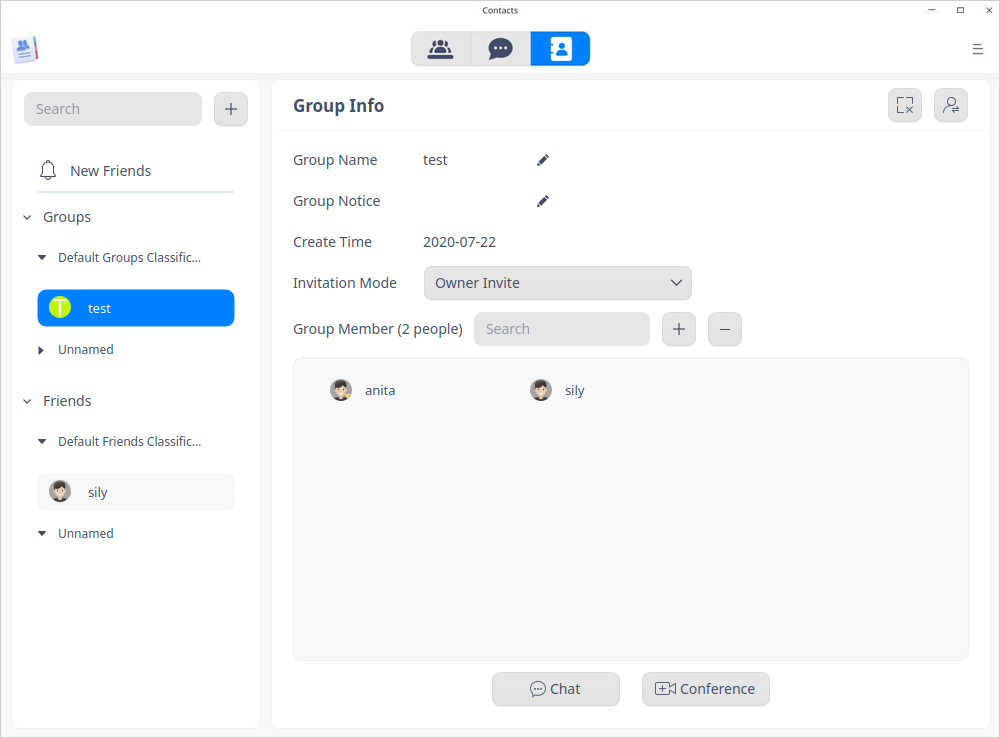

#### Move Group to

1. Select the group you want to move, right-click and select **Move Group To**.
2. Select the target groups classification in the popping-up box to complete this operation.

#### Dismiss Group

1. When you don't need a group any more, you can choose to dismiss it.
2. Select the group you want to dismiss, and click   .
3. Click  **OK**, then the group doesn't exist any more. The group will also disappear from the members' lists of groups automatically.
>  Notes: Only the creator of the group can dismiss it. Group members can only select to quit it.

#### Transfer Group

1. Select the group you want to transfer, and click  .
2. Search or browse the friends to be transfered, select and click **OK**. Transferring is completed successfully when the transfer button disappears from this interface.

#### Create Group Conference

1. Click to create a video conference.
2. Select members, set attributes, and click **OK**.
3. Then the conference is created successfully. You can view it from the interface of conference.

#### Start group chatting

1. Click  to start chatting in the group. 
2. In the chatting window, you can send emoji, screenshots and files, share contact card, view chat history and make video calls.
   - In Chat History, you can enter keywords to search relevant history; click  to empty all history.
   - Click  to view the information about the group and its members; click **Dismiss Group** to exit the group.
   - In the list on the left side, right-click the group's name, select **Top**, this group will be displayed on the top; select **Mute**, there will be no reminders when there's any group message; select **Delete**, the group will be deleted from the chatting list.

     

## Conference

On the main interface, click  to enter the interface of conference.

### Search

1. Prerequisite: a conference is already created or it's finished.

2. You can search a conference by conference room number or by conference name.

   - Searching by conference room number: each user has a fixed conference room number. Searching by conference number means to search all conferences you have joined in, there may be many results.
   - Searching by conference name: Conference names may be repeated. When you search a name, many results may appear.

### Create Conference

1. Click to create a video conference.

2. An setting interface pops up, you can set the conference according to practical needs here.

   - Conference name: you can customize a name or use the default name.

   - Conference room number: each user has a fixed conference room number. It can't be set.

   - Start time: To start a conference immediately, you can click **Start Now**; or select a time. If you want to book a conference, you can select a date and time.

   - Duration: select a duration according to your needs. It is recommended to select a duration longer than the actual. The conference closes automatically when the preset duration time is up.

   - Conference password: you can set a password and share it with all members. People who doesn't have the password could not join the conference, which can guarantee the security of the conference.

   - Conference invite mode: there are three options including allow guest dial-in, participant invite, owner invite, ranking by rights from high to low. 

     - Allow guest dial-in: share the conference room number and password with guests, and the guests can click **Quickly Join Conference**, and then input the conference room number and password to join the conference.
     
     - Participant invite: participants have the right to invite other people to join the conference.
     
     - Owner invite: participants could only be invited by conference owner to join the conference.

   - Participant limit: you can set at most 10 people to join the conference.

   - Invite participants: you can select participants from the list on the left.

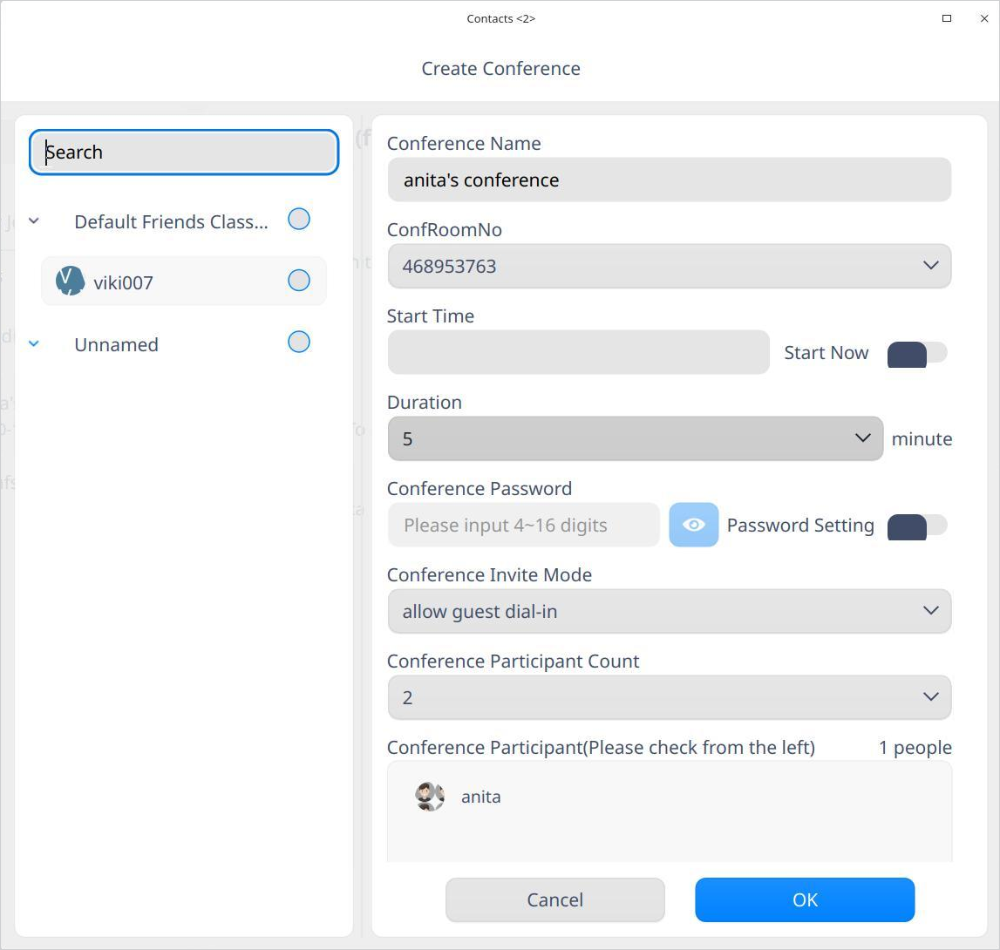

### Quickly Join Conference

This function is designed only for the option **Allow guest dial-in** .

1. Click  **Quickly Join Conference**, a popped-up box appears.

2. Input the conference room number and password, select whether to "turn off camera" or "turn off microphone" or not, then click **Join**. 

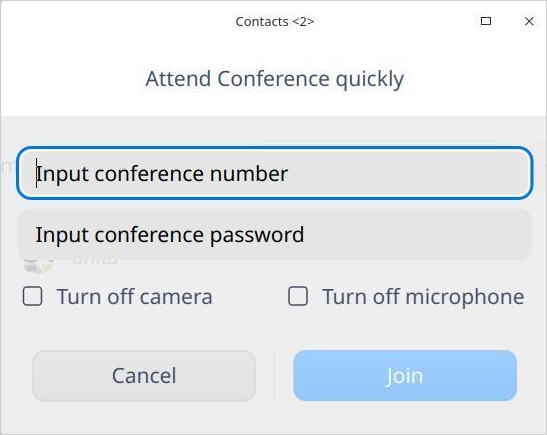

### During Conference

During conference the owner can do the following settings.

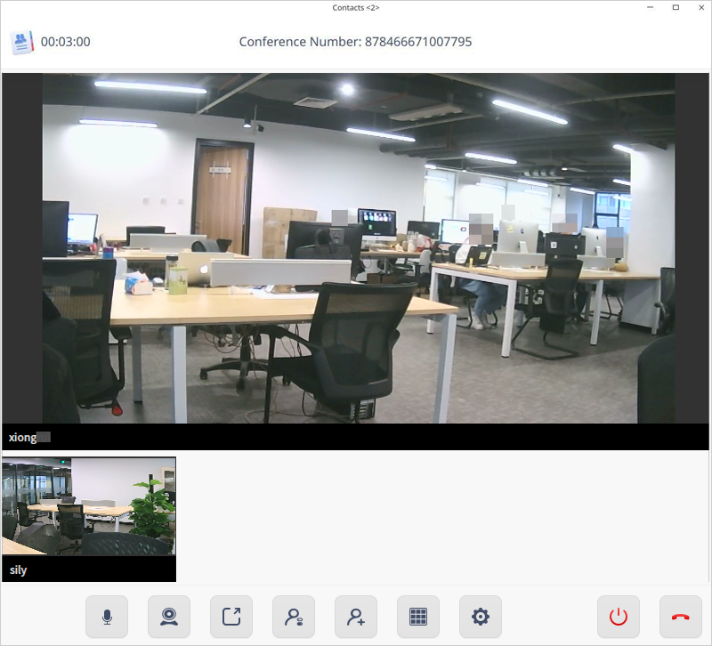

   - Mute : you can mute your microphone. "Unmute" is set by default. 

   - Camera off : you can turn off your camera. The camera is turned on by default.

   - Desktop share : you can share your desktop. click this button, all participants could see your desktop.

   - Conference control : this button is to control the conference order. Different roles have different controlling rights.

     **Owner's rights **

       - Turn off/on all microphones; 
       - Turn off/on some participant's microphone; 
       - Allow/Prohibit all participants to turn on their own microphones freely;
       - Set/Unset a participant or several participants as conference operator(s); 
       - Hand down participants.

     **Operator's rights**

       - Turn off/on all microphones;
       - Turn off/on some participant's microphone; 
       - Allow/Prohibit all participants to turn on their own microphones freely;
       - Hand down participants.

     **Participants' rights**

       - Hand up/Hand down.

     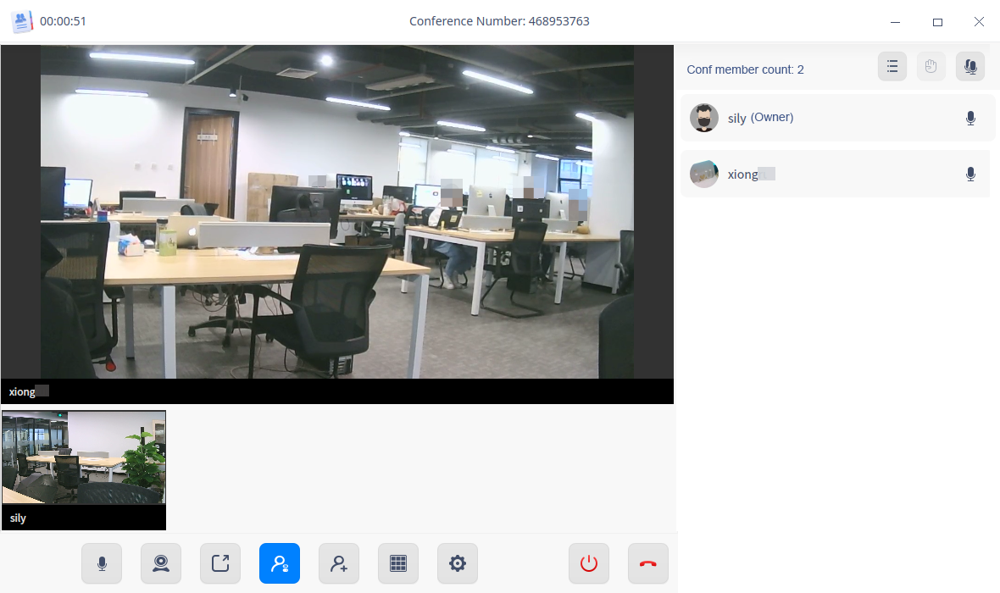

   - Conference invite : owner can click this button to invite other participants.

   - Layout : speaker mode and gallery mode are included. In speaker mode, the speaker's view is bigger than others'. While in gallery mode, all views are in the same size arranged in 2x2 windows. If there are more than four windows, they are displayed in the order of speech activation. 

     

   - Settings  : options such as microphone, speaker, camera and notify mute are included.

     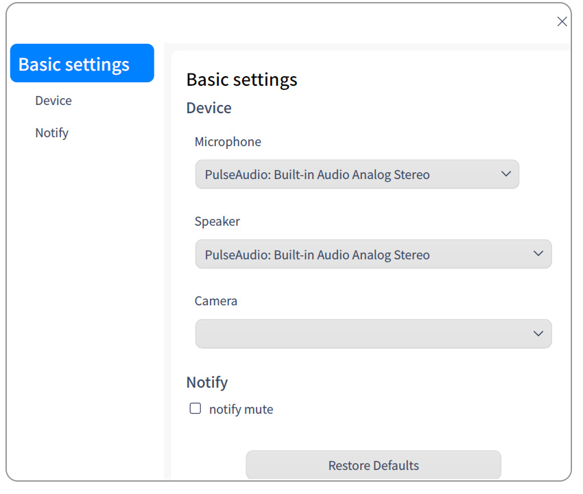

   - Terminate conference : only the owner can click this button to terminate the conference while participants could not terminate a conference. 

   - Hang up conference : the conference will not terminate if you click this button. You can enter the conference again.

     

### ConfRooms

List of conference rooms and their particular numbers are displayed below this title. You can see **My ConfRoom** generated by default in the list.
   - Conference Room Number: the room number is generated when you run Contacts for the first time. This number is fixed and unique for each user.  

   - Participants Limit: users with ordinary rights can only allow 10 participants to join at most.

   - Grant Access to Conference Room: you can grant your conference room to others so they are able to create conferences using your room, and, your room will appear in their lists of **ConfRooms**.

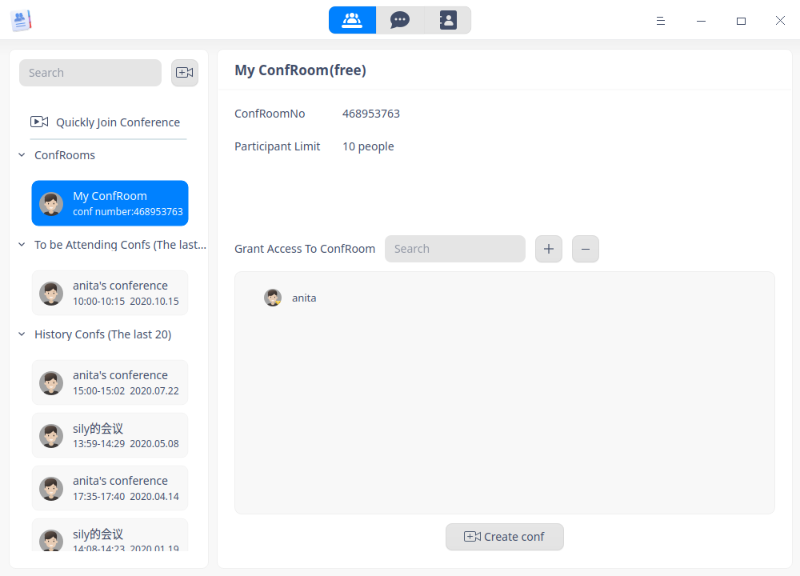

### To be Attending Conferences

List of conferences to be attending and their related information are displayed below this title.
   - Conference number: conference room numbers of conferences to be attending.
   - Conference time: starting date, starting time and ending time are displayed here. 
   - Conference Mode: as mentioned above.
   - Participants Limit: number of participants allowed.
   - Conference members: all participants are displayed here.
   - Share: click to copy conference info and access and send to participants.
   - Edit: click to revise conference info.
   - Delete: click to delete conferences to be attending.

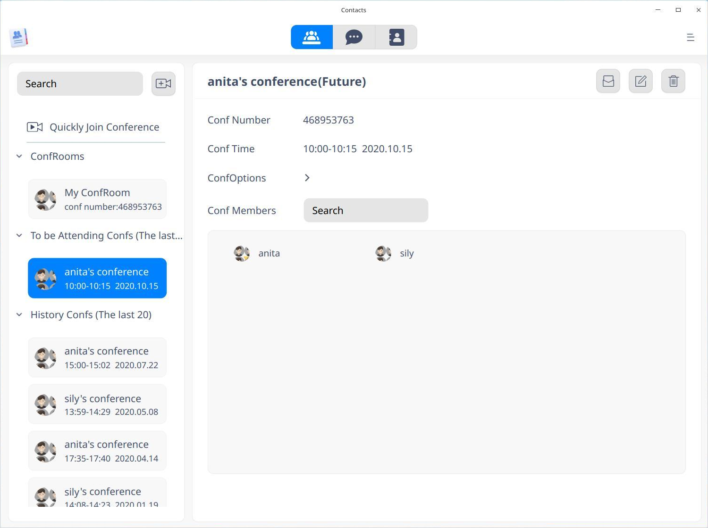

### History Conference

List of conferences finished and their related information are displayed below this title.

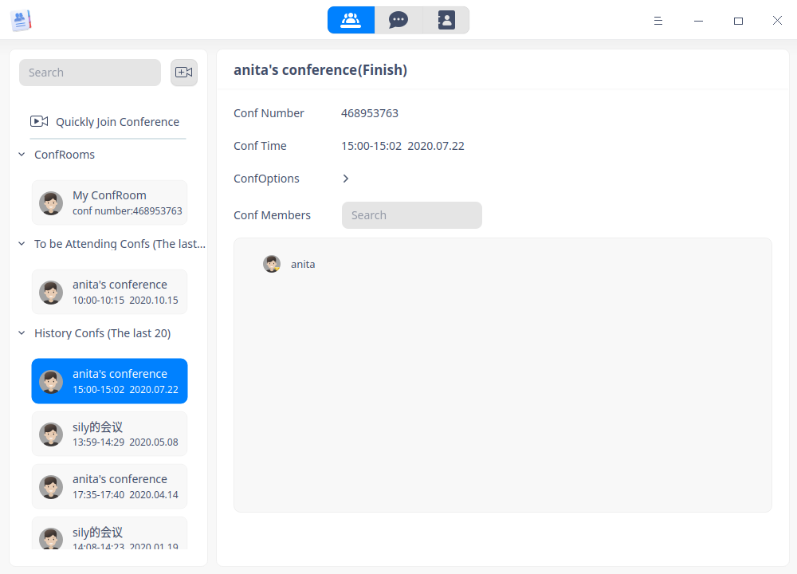

## Main Menu

In the main menu, you can view your user personal info, setting, theme, help, and so on.

### User Personal Info

1. Click on the main interface.

2. Click **User Personal Info** to view personal information and buy a service package. 

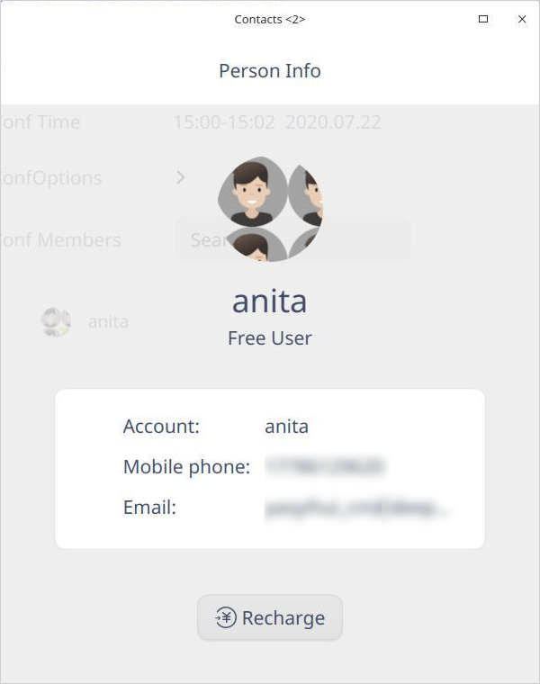

3. Click **Recharge**, you can choose to buy monthly, seasonly or annually, and you can also view your purchasing history. After you buy any service package, you have the following rights:

   - At most 100 participants of conference;
   - At most 12 hours for any individual conference room;

4. After selecting the service package you want, and click **Buy Now**. Corresponding service can be available after you finish paying.

5. After paying is done successfully, you can see your count down days of the service package, and you can also recharge. 

### Setting

1. Click on the main interface.

2. Click **Setting**.

3. You can set microphone, speaker, camera and whether to be notified mute or not. You can also do these settings during a conference. 

### Theme

The window theme includes Light Theme, Dark Theme and System Theme (default).

1. Click on the main interface.
2. Click  **Theme** to select one.

### Help

click Help to get the manual, which will help you further know and use Contacts.

1. Click on the main interface.
2. Click **Help** to view the manual.

### About

1. Click on the main interface.
2. Click **About** to view version information and introduction about Contacts.

### Exit

1. Click on the main interface.
2. Click  **Exit**.

Update Date: 2020-10-20 Version: 1.0
