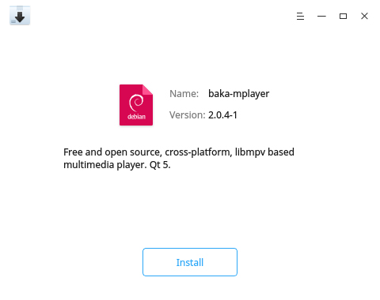
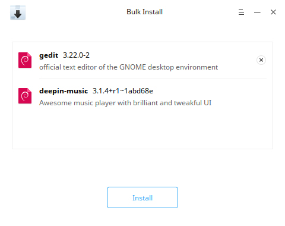

# Package Installer |../common/deepin-deb-installer.svg|

## Overview

Package Installer is an easy-to-use .deb package management tool with a simple interface for users to quickly install customized applications not included in App Store supporting bulk installation, version identification and auto completion.  

## Operations

### Run Package Installer

You can open Package Installer as follows:

- Double click a .deb package to run.
- Click the icon of Package Installer from Launcher to run. 

### Install

Package Installer is capable to install an individual application or multiple applications.

### Singularly Install

1. On Package Installer interface, click **Select File** to add a .deb package.
2. Select the package you want to install, click **Open**.
3. Click **Install**. 
4. If authentication window pops up, please input your password.
5. Click  or  to display or collapse the installing process.
6. Click **Back** to continue installing other packages or click **OK** to exit.

> Notes: Package Installer will automatically detect your installation package. If the application has been installed locally, the prompt message "same version installed" or "other version installed" will be displayed. You can choose **Remove** or **Reinstall** at this time.

### Bulk Install

To install multiple .deb packages at a time, you can click **Select File** or drag files into Package Installer. Please refer to [Singularly Install](Singularly Install) for operation steps. Pay attention to the following:

- You can view installing process when multiply installing.
- Only **Install** button is displayed in the window. Installation would be done for packages of those other versions have been installed locally before. Re-installation would be done for packages of those the same versions have been installed locally before.
- To remove a package from the list, right-click it and select **Delete**. 

### Unable to Install

Package Installer is able to identify the packages could not be installed automatically.

Please read the prompt carefully, common causes include: 

- Broken dependencies.
- Unmatched package architecture.

### Uninstall

Package Installer is used to uninstall .deb packages of those the same or different versions have been installed already. 

1. On Package Installer interface, click **Select File** to add a .deb package.
2. Select the package which is already installed in the system, click **Open**.
3. Click **Remove**, then there will be a prompt and click **Confirm** to uninstall.
4. Click **OK** to exit.

> Attention: The system or other applications would be affected if you have uninstalled some applications. Please operate carefully. 

## Main Menu

On the main menu, you can view manual and get more information about Package Installer.

### Help

You can click to view the manual, which will help you further know and use Package Installer.

1. Click on the interface.
2. Click **Help**.
3. View the manual.

### About

1. Click on the interface.
2. Click **About**.
3. View the version description.

### Exit

1. Click on the interface.
2. Click **Exit**.

Update Date: 2021-06-23 Version: 5.7
