# Device Manager|../common/deepin-devicemanager.svg|

## Overview 

Device Manager is a tool to view and manage hardware devices, through which you can view all kinds of parameters and export data of all hardware devices running in the operating system, you can also disable/enable some hardware drives. 

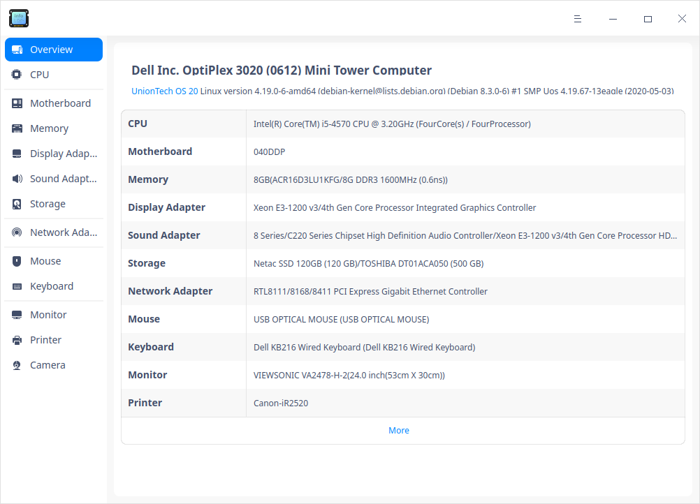

## Guide

You can run, close or create a shortcut for Device Manager as follows.

### Run Device Manager

1. Click  on the Dock to enter the interface of launcher.

2. Locate  by scrolling the mouse wheel or searching "Device Manager" in the Launcher interface and click it to run. An authentication box pops up. You should input the login password for verification. 

   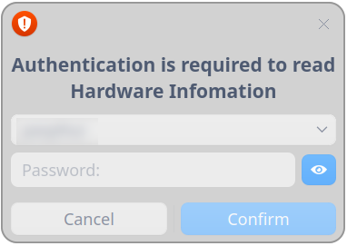

3. Right-click to:

   - Select **Send to desktop** to create a shortcut on the desktop.

   - Select  **Send to dock** to fix it onto the dock.

   - Select **Add to startup** to run it automatically when the computer is turned on.

   

### Exit Device Manager

- On the main interface, click to exit.
- Right-click   on the Dock, select **Close all** or **Force Quit** to exit.
- On interface of Device Manager, click   and select **Exit** to exit.

## Operations

The following hardware device information is for reference only. If there is no mouse, keyboard, and other devices inserted into your computer, the corresponding hardware information will not be displayed in the device manager.

### Overview

1. On the main interface, click **Overview**.
2. You can see a list containing **CPU**, **Motherboard**, **Memory** and so on in this interface, and particular info such as brands, names, models and specifications in it as well. 

### CPU

1. On the main interface, click **CPU**.
2. You can view a CPU list and particular info such as name, vendor, architecture, model and so on. 

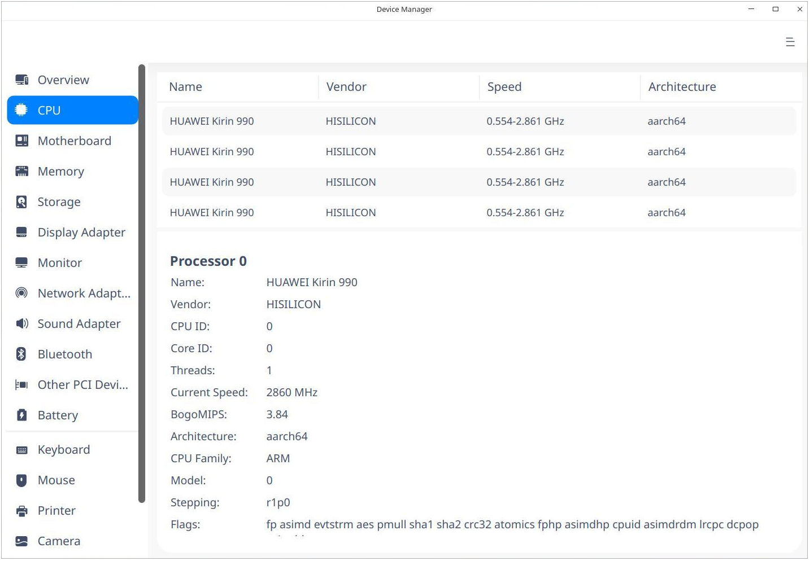

### Motherboard 

1. On the main interface, click **Motherboard**. 
2. You can view info about motherboard, memory bank, system, BIOS, chassis, and so on.

### Memory

1. On the main interface, click **Memory**.
2. You can view a memory list and particular info such as name, vendor, size, type, speed and so on.

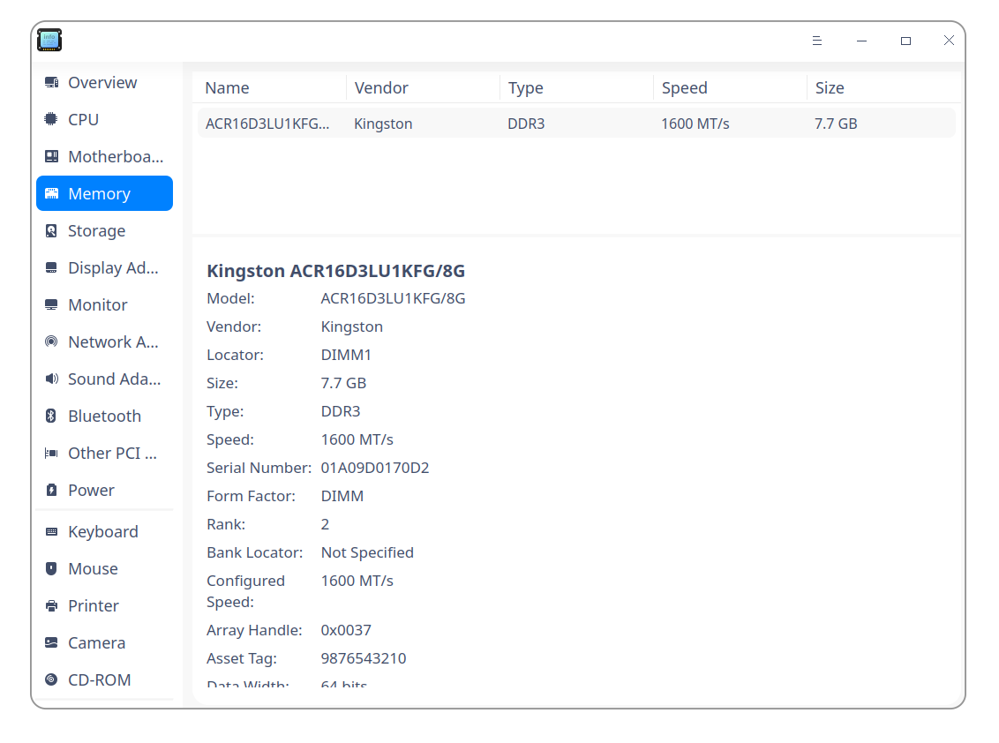

### Display Adapter

1. On the main interface, click **Display Adapter**.
2. You can view info about Display Adapter such as name, vendor, model and so on.

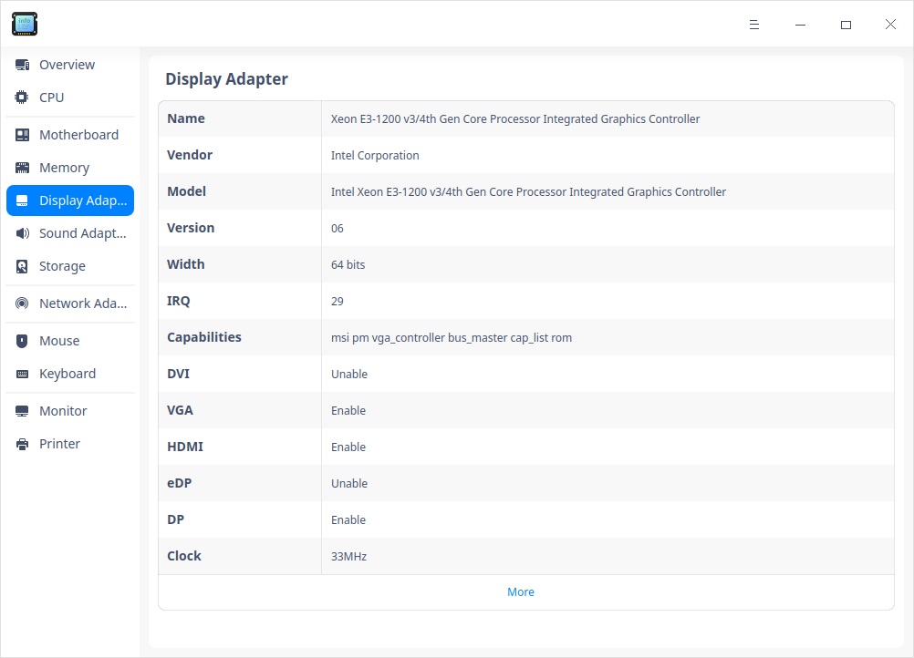

### Sound Adapter

1. On the main interface, click **Sound Adapter **。
2. You can view a list of audio adapters and info such as name, vendor, model and so on.

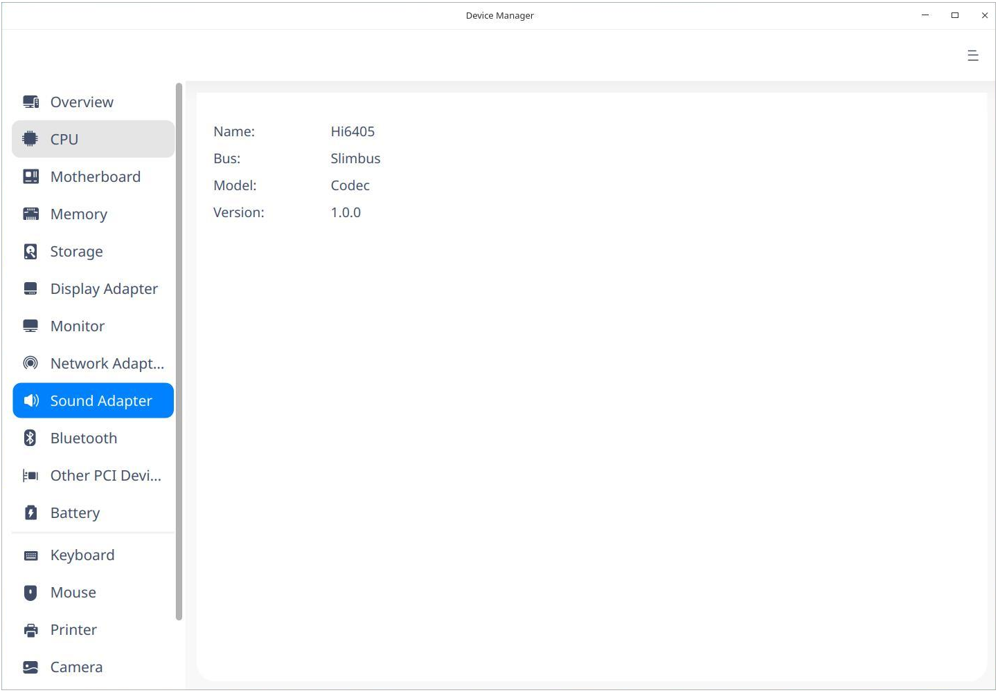

### Storage

1. On the main interface, click **Storage**.
2. You can view a storage device list and particular info such as model, vendor, media type, size, and so on.

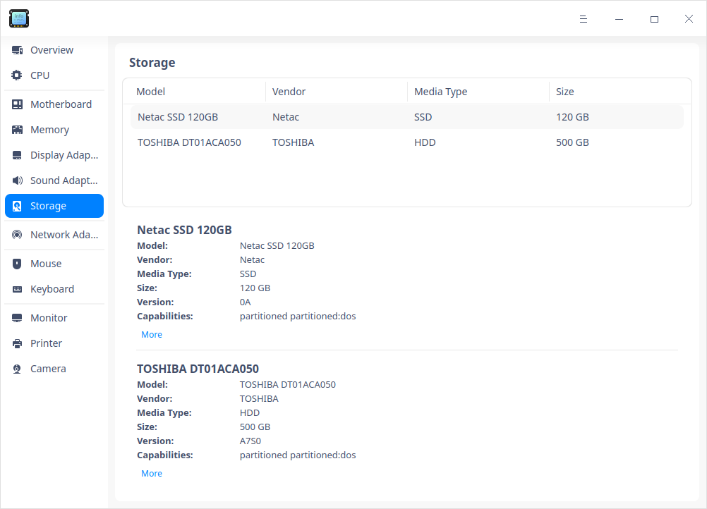

### Network Adapter

1. On the main interface, click **Network Adapter**.
2. You can view info about Network Adapter such as name, vendor, type, driver and so on.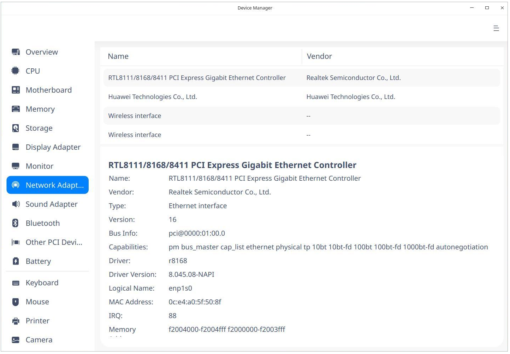

### Mouse

1. On the main interface, click **Mouse**.
2. You can view info such as name, vendor, bus info, driver, speed and so on.

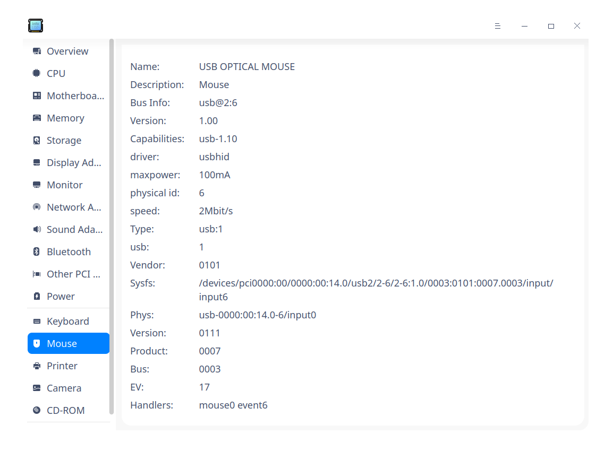

### Keyboard

1. On the main interface, click **Keyboard **。
2. You can view info such as name, vendor, model, bus info, driver and so on.

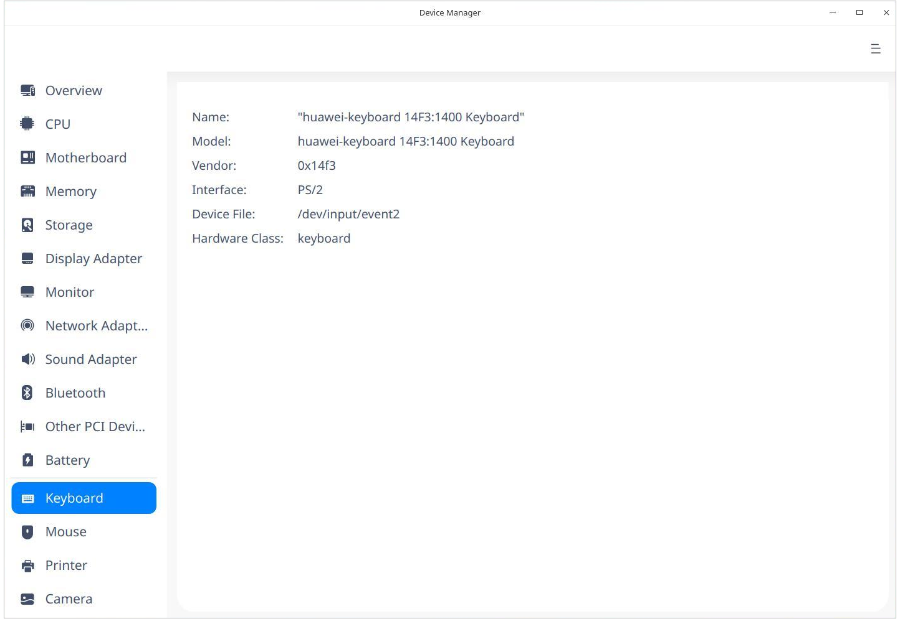

### Monitor

1. On the main interface, click **Monitor **.
2. You can view info about Monitor such as name, vendor, type and so on.

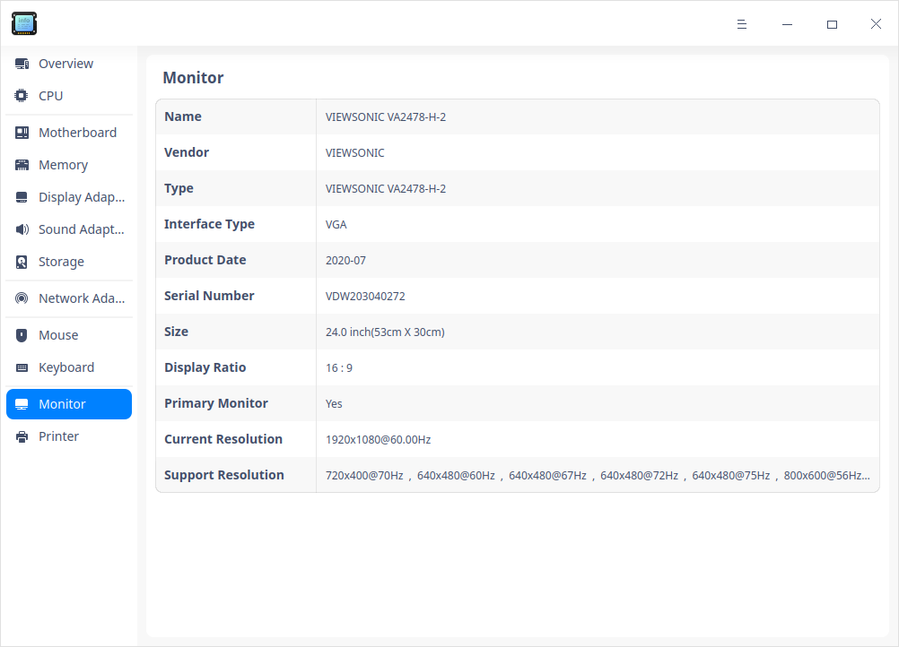

### Printer

1. On the main interface, click **Printer**.
2. You can view a list of printers connected and info such as name, model, vendor, URI and so on.

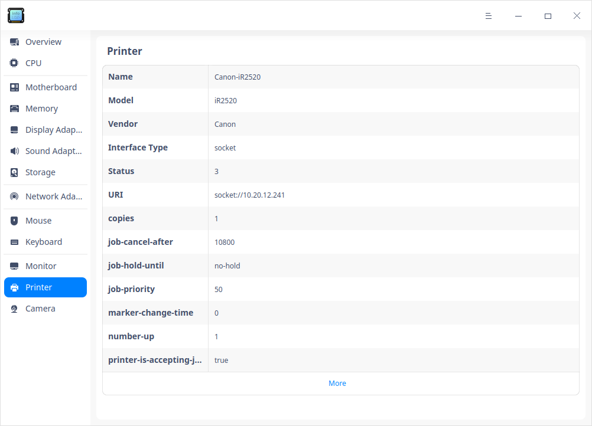

### Right-click Operations 

**Copy**: To copy contents selected by cursor, right-click to select  **Copy**.

**Disable/Enable**: You can disable some hardware drives. You can judge whether the hardware device supports the disable function according to the right-click menu options. 

**Refresh**: Right-click and select  **Refresh** to reload info of all devices of the operating system. You can also use shortcut key F5 to realize this function.

**Export**: You can export the device information to the specified folder,formats such as txt/docx/xls/html are supported. 

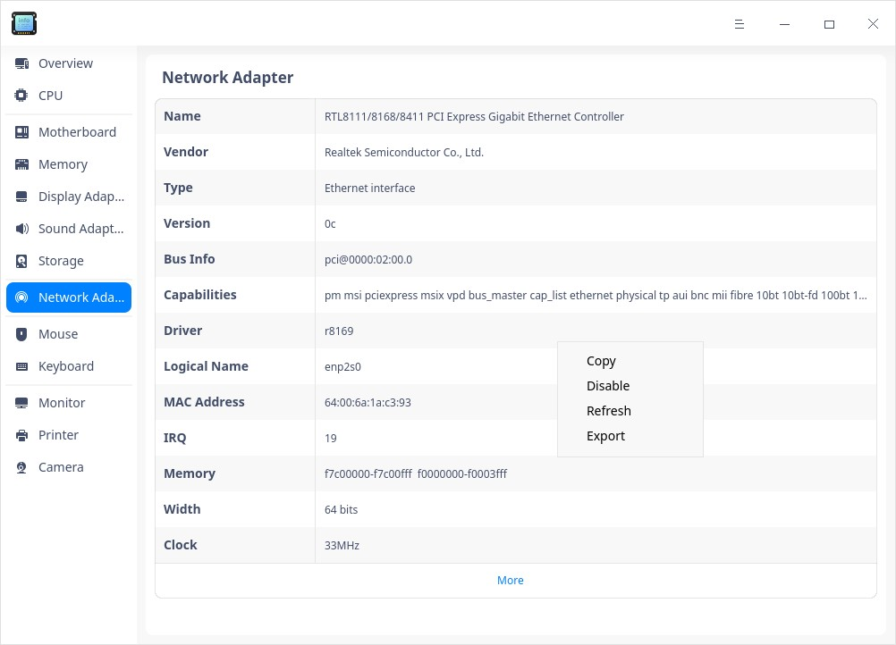

## Main Menu

In the main menu, you can switch themes, view manual, and so on.

### Theme

The window theme includes Light Theme, Dark Theme and System Theme (default).

1. Click on the interface.
2. Click  **Theme** to select one.

### Help

Click Help to get the manual, which will help you further know and use Device Manager.

1. Click on the interface.
2. Click **Help** to view the manual.

### About

1. Click on the interface.
2. Click **About** to view version and introduction about Device Manager.

### Exit

1. Click on the interface.
2. Click  **Exit**.

Update Date: 2020-09-30 Version: 5.6
