# 设备管理器|../common/deepin-devicemanager.svg|

## 概述

设备管理器是查看和管理硬件设备的工具，可针对运行在操作系统的硬件设备，进行参数状态的查看、数据信息的导出等，还可以禁用或启动部分硬件驱动。

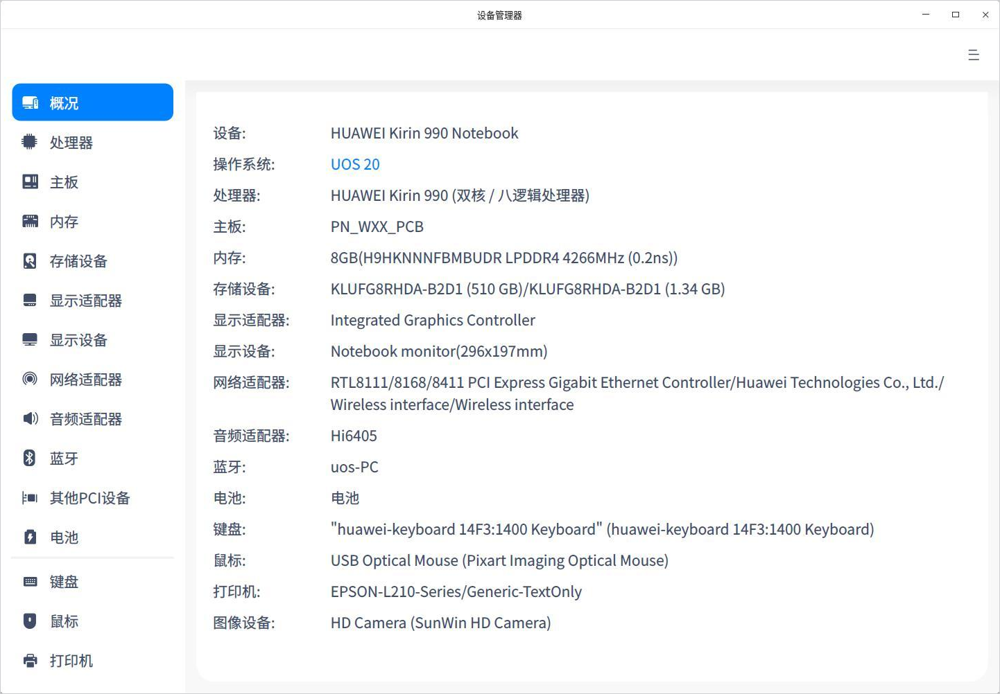

## 使用入门

您可以通过以下方式运行或关闭设备管理器，或者创建快捷方式。

### 运行设备管理器

1. 单击任务栏上的启动器 ，进入启动器界面。

2. 上下滚动鼠标滚轮浏览或通过搜索，找到设备管理器  ，单击运行。弹出授权框，需要输入系统登录密码认证。

   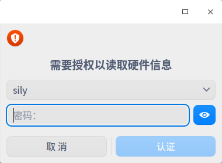

3. 右键单击 ，您可以：

   - 单击 **发送到桌面**，在桌面创建快捷方式。

   - 单击 **发送到任务栏**，将应用程序固定到任务栏。

   - 单击 **开机自动启动**，将应用程序添加到开机启动项，在电脑开机时自动运行该应用程序。

### 关闭设备管理器

- 在设备管理器界面，单击   ，退出设备管理器。
- 右键单击任务栏上的   图标，选择 **关闭所有** 来退出设备管理器。
- 在设备管理器界面单击  ，选择 **退出** 来退出设备管理器。

## 操作介绍
以下介绍的硬件设备信息仅供参考，如果您的电脑上没有插入鼠标、键盘等设备，设备管理器中则不会显示对应的硬件信息。

### 概况

1. 在设备管理器界面，单击 **概况**。
2. 界面显示操作系统内核信息，各硬件设备的列表，以及对应的详细信息如品牌、名称和规格等信息。

### 处理器

1. 在设备管理器界面，单击 **处理器**。
2. 界面显示处理器列表，以及所有处理器的详细信息如名称、制造商、架构及型号等信息。

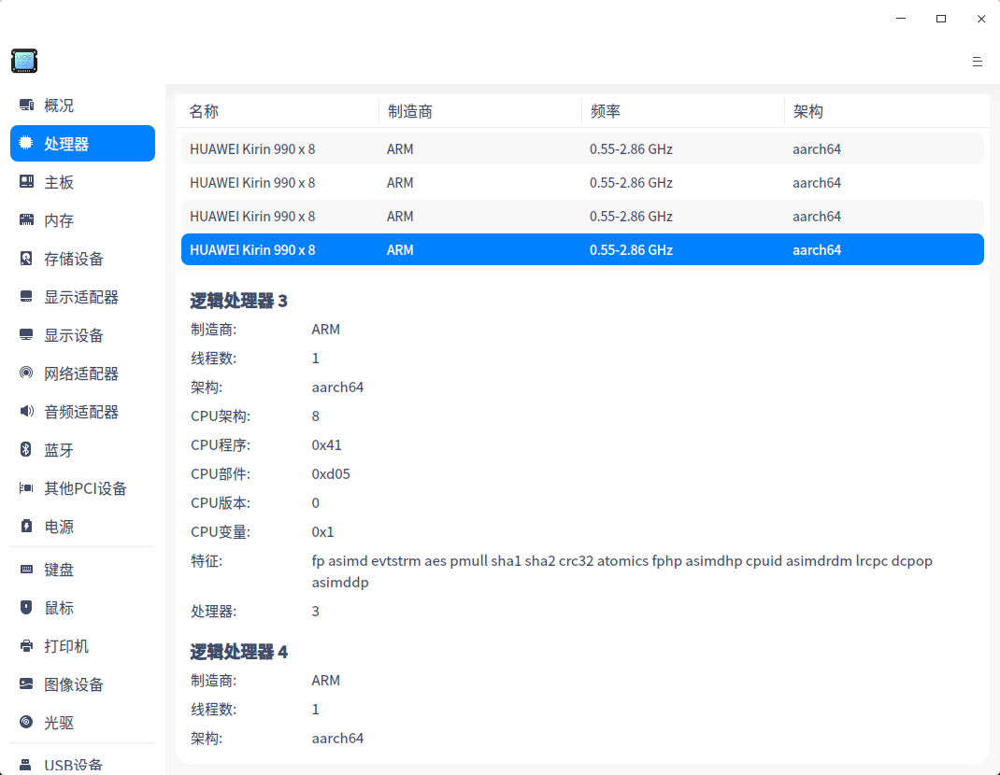

### 主板

1. 在设备管理器界面，单击 **主板**。
2. 界面显示主板的制造商、芯片、BIOS信息、系统信息及机箱信息等。

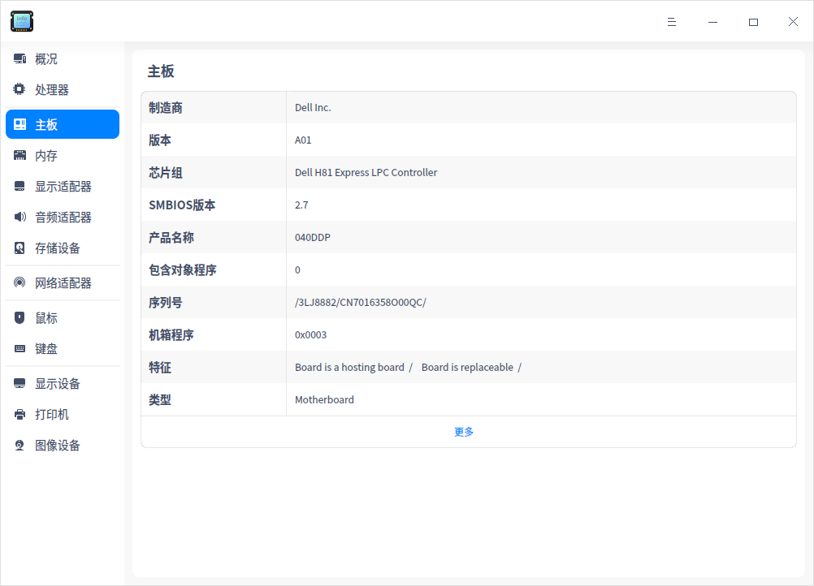

### 内存

1. 在设备管理器界面，单击 **内存**。
2. 界面显示内存列表，以及所有内存的详细信息如名称、制造商、大小、类型及速度等信息。

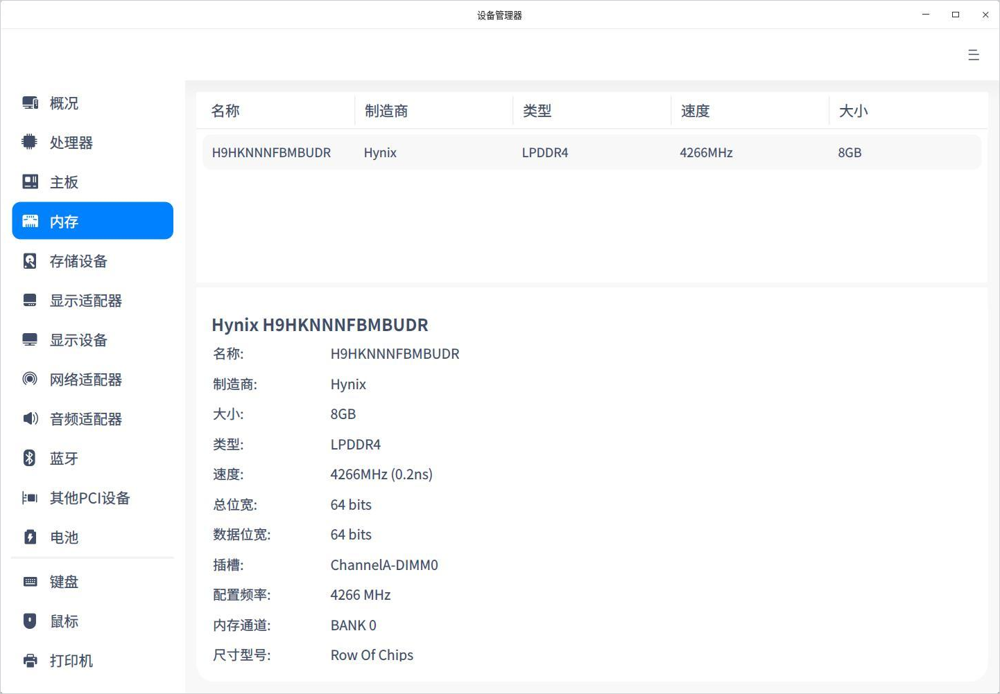

### 显示适配器

1. 在设备管理器界面，单击 **显示适配器**。
2. 界面显示设备的名称、制造商、型号等信息。

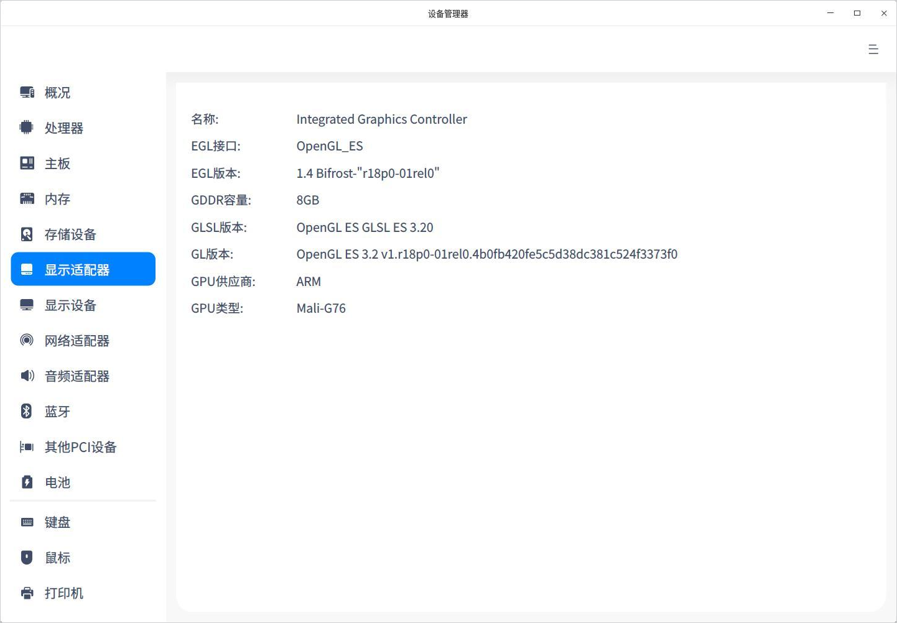

### 音频适配器

1. 在设备管理器界面，单击 **音频适配器 **。
2. 界面显示音频适配器列表，以及所有音频适配器的详细信息如名称、制造商及型号等信息。

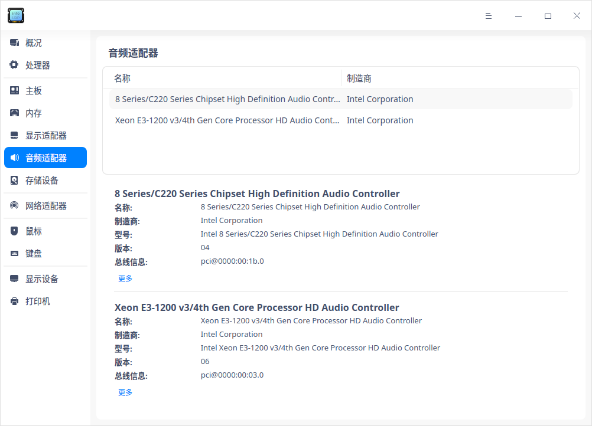

### 存储设备

1. 在设备管理器界面，单击 **存储设备**。
2. 界面显示存储设备列表，以及所有存储设备的详细信息如型号、制造商、介质类型、容量等信息。

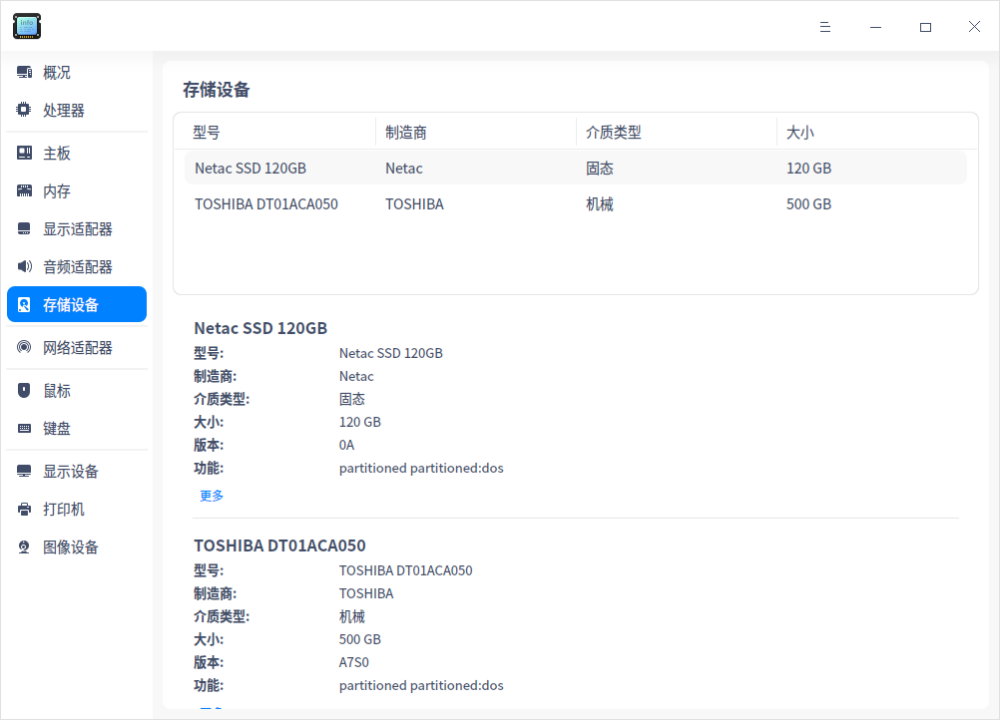

### 网络适配器

1. 在设备管理器界面，单击 **网络适配器 **。
2. 界面显示网络适配器的名称、制造商、类型及驱动等信息。

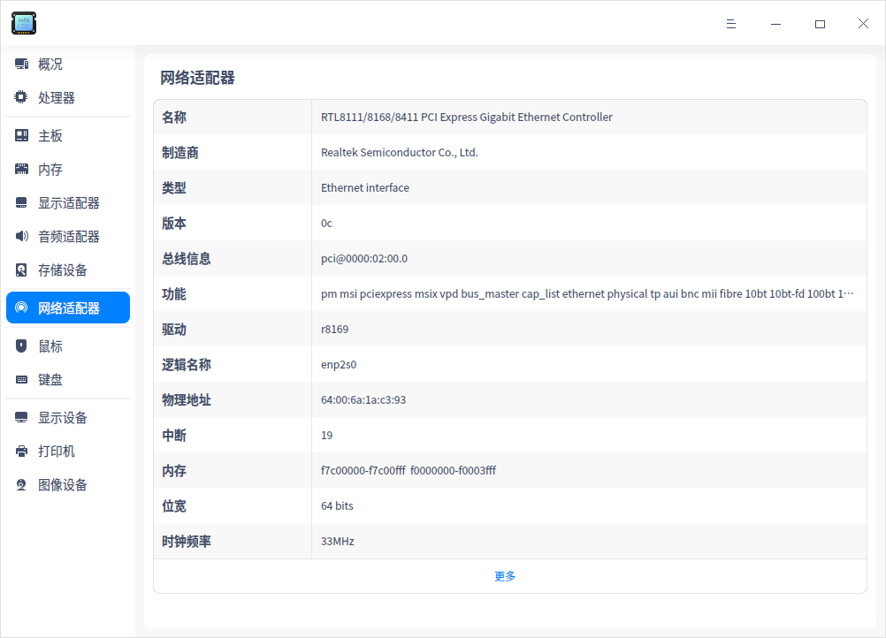

### 鼠标

1. 在设备管理器界面，单击 **鼠标 **。
2. 界面显示鼠标的名称、制造商、总线信息、驱动及频率等信息。

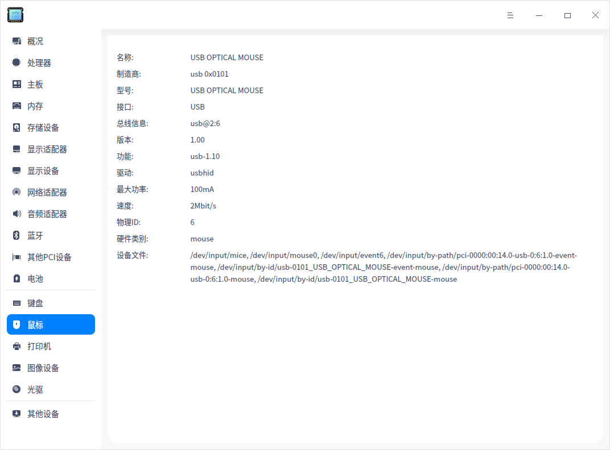

### 键盘

1. 在设备管理器界面，单击 **键盘 **。
2. 界面显示键盘的名称、型号、制造商、总线信息及驱动等信息。

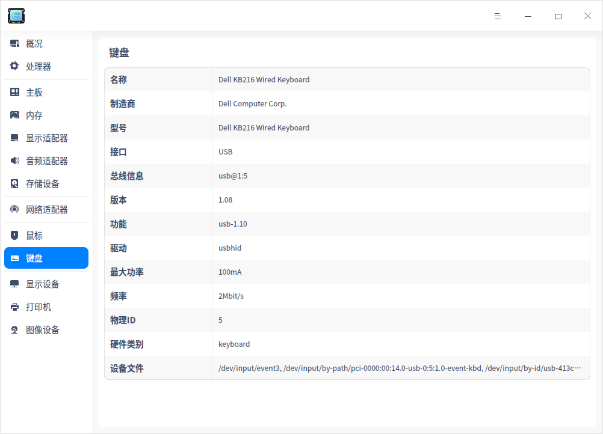

### 显示设备

1. 在设备管理器界面，单击 **显示设备 **。
2. 界面显示设备的名称、制造商、类型、接口类型及分辨率等信息。

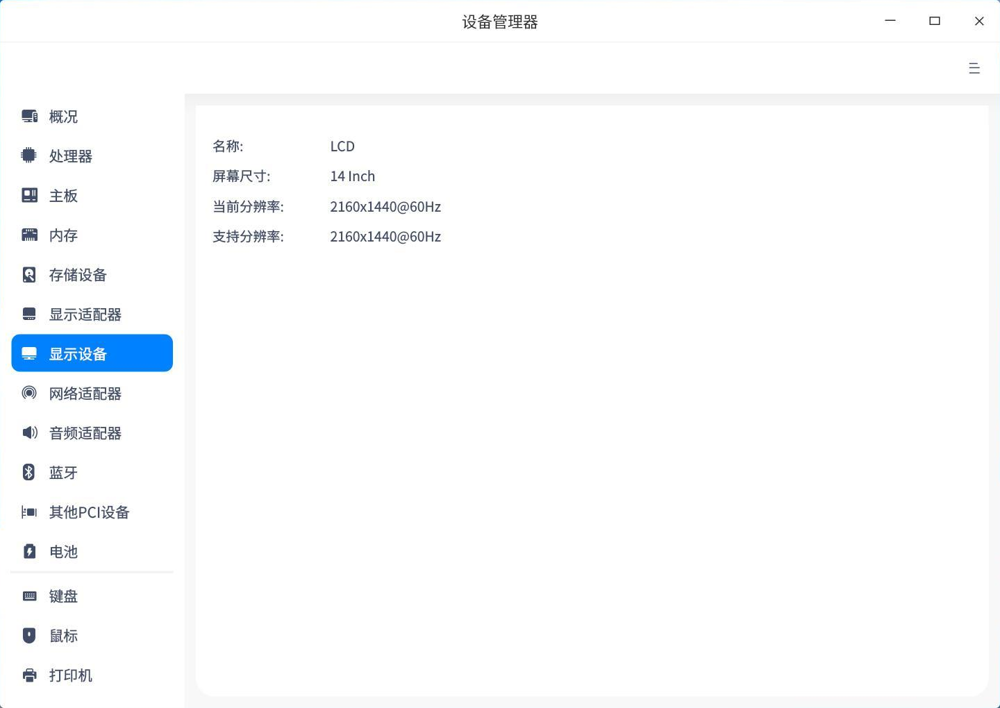 

### 打印机

1. 在设备管理器界面，单击 **打印机 **。
2. 界面显示连接的打印机列表，以及所有打印机的详细信息如名称、型号、制造商、设备URI等信息。

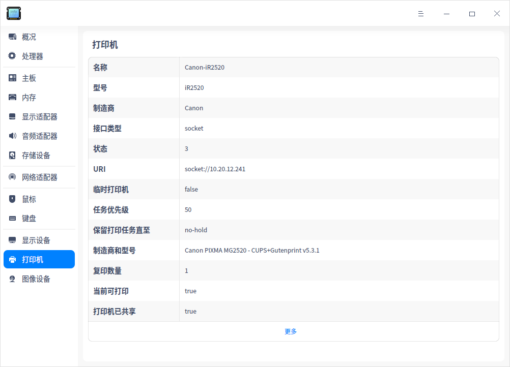

### 右键菜单

在设备详细信息区域，单击右键，可以进行以下操作：

**复制**：可复制光标选中的内容。

**禁用/启用**：可禁用或启用部分硬件驱动，可根据右键菜单选项判断硬件设备是否支持禁用功能。

**刷新**：将重新加载操作系统当前所有设备的信息，快捷键为 **F5**。

**导出**：将设备信息导出到指定的文件夹，支持导出 txt/docx/xls/html 格式。

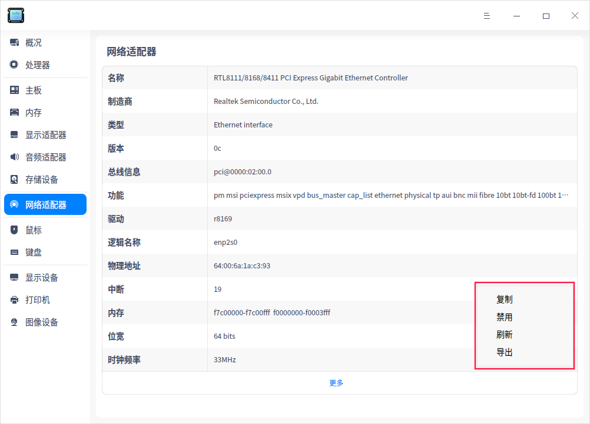

## 主菜单

在主菜单中，您可以切换窗口主题，查看帮助手册等操作。

### 主题

窗口主题包含浅色主题、深色主题和系统主题，其中系统主题为默认设置。

1. 在设备管理器界面，单击。
2. 单击 **主题**，选择一个主题颜色。

### 帮助

1. 在设备管理器界面，单击 。
2. 单击 **帮助**，查看设备管理器的帮助手册，进一步让您了解和使用设备管理器。

### 关于

1. 在设备管理器界面，单击 。
2. 单击 **关于**，查看关于设备管理器的版本和介绍。

### 退出

1. 在设备管理器界面，单击 。
2. 单击 **退出**。

文档更新时间: 2020-09-30 版本: 5.6
