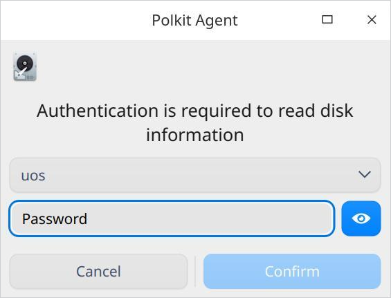
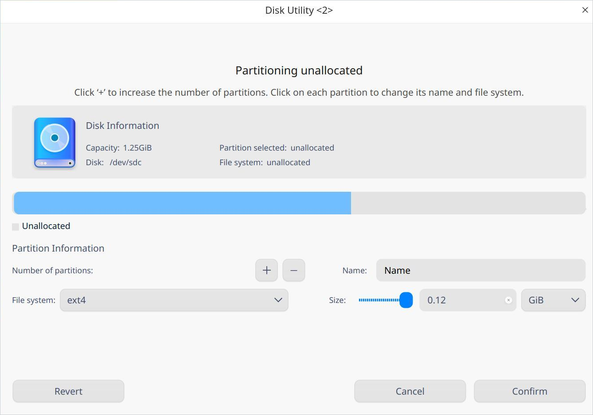
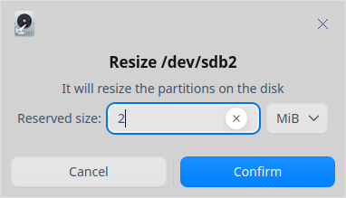
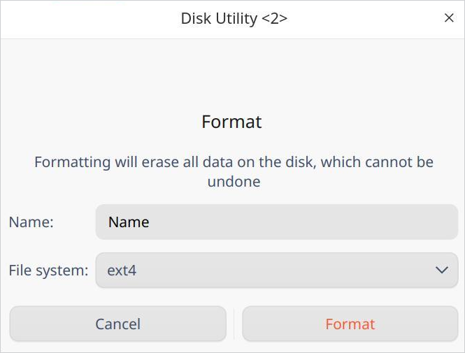
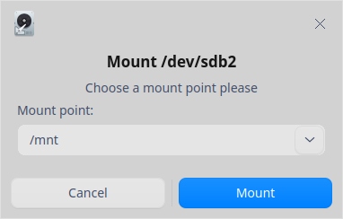
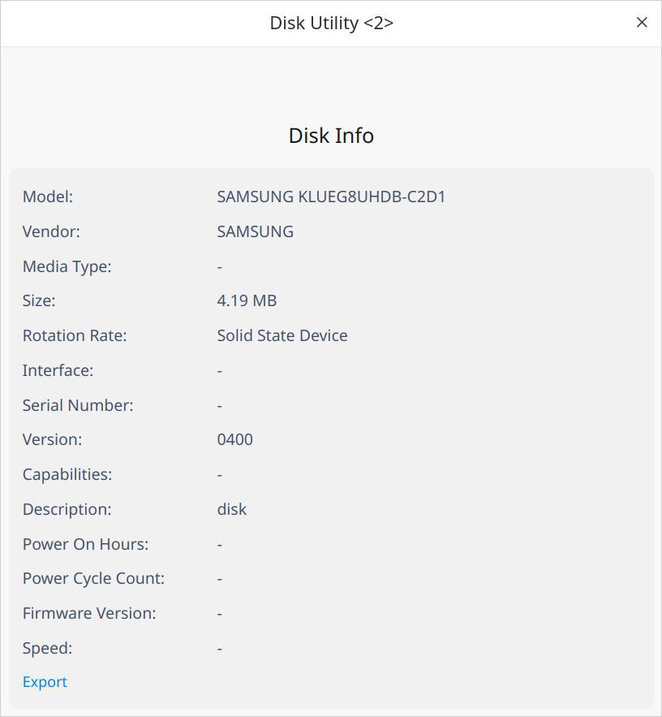

# Disk Manager|../common/disk-manager.svg|

## Overview

Disk Manager is a useful tool to help you better manage your disks through disk partitioning, disk data administration, and health management. 

## Guide

You can run, close, and create shortcuts for Disk Manager in the following ways.

### Run Disk Manager

1. Click  in the Dock and enter the Launcher interface.
2. Locate  by scrolling the mouse wheel or searching "disk manager" in the Launcher interface and click it to run. An authentication box pops up. Enter password for authentication. 

   

3. Right-click  to:

 - Click **Send to desktop** to create a desktop shortcut.
 - Click **Send to dock** to fix the application in the dock.
 - Click **Add to startup** to add the application to startup and it will automatically run when the system starts up.

### Exit Disk Manager

- On the Disk Manager interface, clickto exit Disk Manager.
- Right-click  in the dock and select **Close All** to exit Disk Manager.
- On the Disk Manager interface, click  and select **Exit** to exit Disk Manager.

## Disk Partitioning

On the Disk Manager interface, a list of disk(s) and information about relevant partition(s) are displayed, including format, capacity, and mount points of partitions. You can create, resize, format, mount, and unmount a partition.

### Create a Partition

1. On the Disk Manager interface, select an unallocated partition, and click the Partition icon  on the top toolbar.
2. A confirmation dialogue pops up. Click **Confirm** to enter the partitioning unallocated interface, where you can check the size, name, and file system of this partition, and read information of the disk where this partition locates. 
3. In the partition information area, fill in the name and size of partition, select file system of partition, and click the  icon. You can also create multiple partitions, and each partition name will be displayed on the bar graph under disk information. You can delete a partition by clicking the  icon when you're creating a new partition.

&nbsp;&nbsp;&nbsp;&nbsp;&nbsp;&nbsp;&nbsp;&nbsp;&nbsp;&nbsp;&nbsp;&nbsp;&nbsp;
>  Attention: A maximum of 24 partitions can be created. To create a partition, you need a storage space of at least 52 MB. 

4. After setting up, click **Confirm**. The newly created partition will be displayed under the corresponding disk. 
5. The new partition will be automatically formatted when you create it. You can use the newly created partition after it's mounted. Please refer to [Mount a Partition](#Mount a Partition) for detailed information.

>  Notes: If the partition is created on a portable device, such as a USB flash drive, this partition will be automatically mounted to the /media/... directory when it's replugged. Thus, You don't need to manually mount the device.

### Resize a Partition

You can resize a partition if the size is too small. Please note that you can only resize an unmounted partition.

1. On the Disk Manager interface, select an unmounted partition, and click the Resize icon  on the top toolbar.
2. A resizing interface pops up. Fill in the reserved size, and click **Confirm**. 

&nbsp;&nbsp;&nbsp;&nbsp;&nbsp;&nbsp;&nbsp;&nbsp;&nbsp;&nbsp;&nbsp;&nbsp;&nbsp;

3. You can check the capacity of partition once it's resized.

### Hide a Partition

After a partition is hidden, it will not be displayed on the Computer interface. However, it will be displayed on the Disk Manager interface. Documents saved in the hidden partition will not be lost, yet they cannot be accessed normally. 

Please note that you can only hide an unmounted partition. Also, system partition cannot be hidden. 

1. On the Disk Manager interface, select a partition and right-click it. 
2. Select **Hide partition** and a confirmation dialogue pops up. Click **Hide** and the icon of this partition will be changed to the hidden status. 

### Unhide a Partition

1. On the Disk Manager interface, select a hidden partition and right-click it. 
2. Select **Unhide partition** and a confirmation dialogue pops up. Click **Unhide** and the icon of this partition will be changed to the unhidden status. 
3. Once a partition is unhidden, it will be unmounted automatically. Please manually mount the partition for normal use. 

## Disk Data Administration

### Format a Partition

Formatting a partition is normally executed to change the format of partitions, and will erase all data on the disk. Please proceed with caution as this action is irreversible. 

Notice that you can only format an unmounted partition which is not currently in use.

1. On the Disk Manager interface, select a partition and click Format  icon on the top toolbar.
2. A formatting interface pops up. Fill in the name and select file system. 

&nbsp;&nbsp;&nbsp;&nbsp;&nbsp;&nbsp;&nbsp;&nbsp;&nbsp;&nbsp;&nbsp;&nbsp;&nbsp;
3. Click **Format** to confirm. 

### Mount a Partition

1. On the Disk Manager interface, select an unmounted partition and click Mount  icon on the top toolbar.
2. A mounting interface pops up. Select or create a mount point, and click **Mount** to confirm.

&nbsp;&nbsp;&nbsp;&nbsp;&nbsp;&nbsp;&nbsp;&nbsp;&nbsp;&nbsp;&nbsp;&nbsp;&nbsp;
>  Attention: A partition can be mounted to an existing directory and such directory can be not empty. However, once mounted, all previous files and contents under this directory will not be available. Please proceed with caution. 

### Unmount a Partition

If you want to change the mount point of a partition, you can unmount it first, and then mount it again.

1. On the Disk Manager interface, select a partition and click Unmount  icon on the top toolbar.
2. A confirmation dialogue pops up. Click **Unmount** if you confirm that there are no programs running on the partition. 

### Delete a Partition

Once a partition is deleted, you will lose all data in it. Please proceed with caution.

Please note that you can only delete an unmounted partition.

1. On the Disk Manager interface, select a partition and right-click it. 
2. Select **Delete partition** and a confirmation dialogue pops up. Click **Delete**, and this partition will disappear under the corresponding disk.

## Disk Health Management

### Check Disk Info

1. On the Disk Manager interface, select a disk. Right-click it and select **Disk info**.
2. You can check the serial number, device model, user capacity, and rotation rate of the disk.

&nbsp;&nbsp;&nbsp;&nbsp;&nbsp;&nbsp;&nbsp;&nbsp;&nbsp;&nbsp;&nbsp;&nbsp;&nbsp;
3. Click **Export** to export the disk info to your designated folder. 

### Run Health Management

1. On the Disk Manager interface, select a disk. Right-click it and select **Health Management** > **Check health**. 
2. You can check the health status, current temperature, and status of different attributes of the disk.

&nbsp;&nbsp;&nbsp;&nbsp;&nbsp;&nbsp;&nbsp;&nbsp;&nbsp;&nbsp;&nbsp;&nbsp;&nbsp;
3. Click **Export** to export the health check results of the disk to your designated folder. 

### Check Partition Table Error

1. On the Disk Manager interface, select a disk. Right-click it and select **Health Management** > **Check partition table error**. 

2. If there is no error in the partition table, a **No errors found in the partition table** prompt will pop up; if an error is found in the partition table, an **Errors in Partition Table** report will pop up. You can fix the problem according to the report. 

## Main Menu

In the main menu, you can switch window themes, view help manual, and get more information about Disk Manager.

### Theme

The window theme provides three theme types, namely Light Theme, Dark Theme, and System Theme.

1.  On the Disk Manager interface, click .
2.  Click **Theme** to choose one theme.

### Help

1.  On the Disk Manager interface, click .
2.  Click **Help** to view the manual of Disk Manager.

### About

1.  On the Disk Manager interface, click .
2.  Click **About** to view the version and introduction of Disk Manager.

### Exit

1.  On the Disk Manager interface, click .
2.  Click **Exit** to exit Disk Manager.

Update Date: 2020-11-24 Version: 1.1
