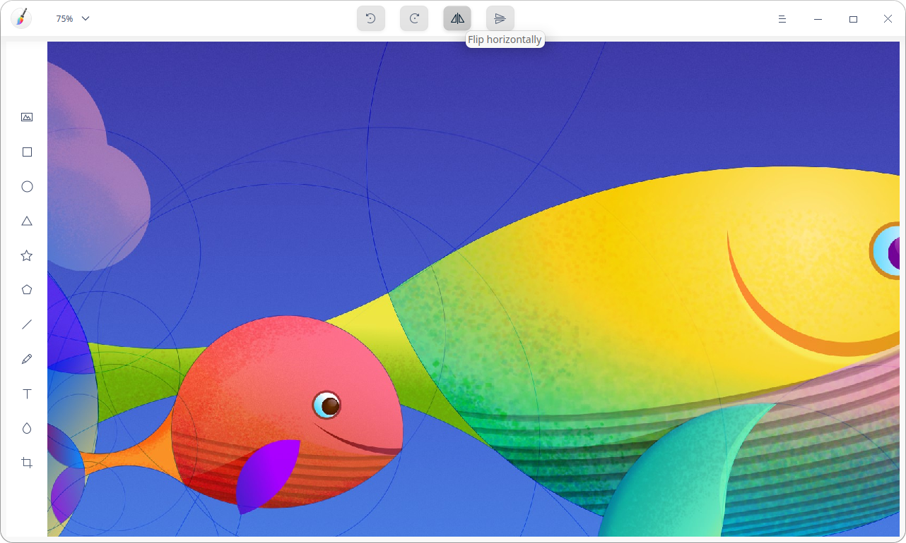

# Draw|../common/deepin-draw.svg|

## Overview

Draw is a simple drawing tool, supporting rotation, cropping, flipping, adding texts and shapes, etc. You can edit local pictures or draw pictures freely.

## Guide

You can run, close and create shortcuts for Image Viewer by the following ways.

### Run Draw

1.   Click on dock to enter the Launcher interface.
2.   Locate by scrolling the mouse wheel or searching "Draw" in the Launcher interface.
3.   Right-click and the user can:
 - Click **Send to desktop** to create a desktop shortcut.
 - Click **Send to dock** to fix the application on dock.
 - Click **Add to startup** to add the application to startup and it will automatically run when the system starts up.

: In Control Center, you can set Draw as default picture viewer. Please refer to  [Default Application Settings](dman:///dde#Default Application Settings) for specific operations.

### Exit Draw

- On the Draw interface, click   to exit Draw.
- Right-click  on dock and select **Close All** to exit Draw.
- Click  on the Draw interface and select **Exit** to exit Draw.

### View Shortcuts

On the Draw interface, press **Ctrl** + **Shift** + **?** on the keyboard to view shortcuts. Proficiency in shortcuts will greatly improve your efficiency.

## Basic Functions

You are able to process imported pictures, draw pictures freely with Draw and save them in multiple formats.

Create New Tabs

Only one window is available in Draw. But you can create multiple new tabs.

- On the Draw interface, click  > **New** to create a new tab.
- You can also click  to create a new tab when there are two or more tabs in the window.

When there are multiple tabs, you can adjust the tab order by dragging the tab to or clicking  or  icon.

### Open Pictures

1.   On the Draw interface, click .
2.   Select the picture to be imported and click **Open**.

> : You are able to import multiple pictures at one time or import pictures via > **Open**. 

Currently it is only available to import 30 pictures in JPG, PNG, TIF and BMP.

### Export Pictures

1.   On the Draw interface, click   > **Export**.
2.  Set the parameters such as file name, path, format and picture quality and click **Save**. 

### Save Pictures

1.   On the Draw interface, click  > **Save** or   > **Save as**.
2.   Set the file name and format to be saved and click **Save**.

> : The suffix of the file name can be omitted and it can be saved as the selected format automatically. 

### Print Pictures

1.   On the Draw interface, click  > **Print**.
2.  Select the printer and set the printing parameter.
3.  Click **Print**.

> : Click **Properties** and **Options** to customize your printing effect.

## Drawing Tools

With the drawing tools of Draw, you can give full play of your imagination and creativeness to draw various graphics  freely. 

### Selection Function

By clicking the graphics drawing tool to draw entities, you can perform the following operations:

- Select drawn graphics, texts or blurred areas.
- Perform marquee selection and all graphics within the marquee selection area are in selected status.
- Drag to adjust the size of the graphic within the selected area.
- Hold down the **Shift** key and click to select more graphics.
- Hold down the **Alt** key and drag the entity to copy graphics.

> : Click the blank area in Draw to cancel the graphic selected.

### Shape Tool

1.   On the Draw interface, click  ,,,or.
2.   You can set the parameters for graphics as follows:
 - Click **Fill** to set the fill color and transparency for graphics.
 - Click **Stroke** to set the stroke color and transparency for graphics pens.
 - Click **Radius** to set the radius for graphics, which is only applicable to rectangles. 
 - Click **Width** to set graphics width.
 - Click **Point**s and **Diameter** to set the points and diameter for graphics, which applies to star only.
   - The number of the points ranges from 3 to 50, which can be adjusted by clicking the up and down adjustment icon or entering the value manually. 
   - Diameter ranges from 0% to 100%, which can be adjusted by clicking the up and down adjustment icon or entering the value manually.
 - Click **Slides** to set slides for graphics, which applies to polygons only.
   - Slides range from 4 to 10, which can be adjusted by clicking the up and down adjustment icon or entering the value manually.
3.   Drag the mouse to draw graphics in Draw area. 

>: Facilitated by the **Shift** or **Shift**+ **Alt** keys on the keyboard, you can draw a square, perfect circle, equilateral triangle, regular pentagram and regular pentagon when drawing graphics with , , ,  and .

### Line/Pencil Tool

1.   On the Draw interface, click or .
2.   You can set parameters for your pencil as follows:

   - Click **Type** to choose one pencil style, with which you can draw straight lines, free curves and straight lines with arrows.
- Click **Stroke** to set pencil color and transparency.
   - Click **Width** to set stroke width.
- Click **Start** or **End** to set the start and end style of the line.
  
3.   Drag the mouse in the Draw area to draw lines.

### Text Tool

1.   On the Draw interface, click .
2.   You can set text styles as follows:
   - Click **Color** to set the text fill color and transparency.
   - Select your font style under the **Font** drop-down list.
   - Adjust the **Size** by entering manually a value or selecting a size in the dropdown list.
3.   Click in the Draw area to enter texts in the text box.

### Blur Tool

1.   On the Draw interface, click .
2.   Select the blur type.
3.   Change the blur area width by dragging the Width slider.
4.   Drag the mouse in the Draw area to blur the area as needed.

## Edit Functions

### Copy and Paste

1.  On the Draw interface, select the graphics to be copied.
2.  Right-click to select **Copy** or use the shortcuts **Ctrl** + **C** to copy the graphics to the clipboard.
3.  Right-click to select **Paste** or use the shortcuts **Ctrl** + **V** to paste the graphics to Draw.

### Crop

1.  On the Draw interface, select an imported picture.
2.  Click  to enter the cropping mode.
  - Free:  Enter the dimension manually or adjust the area to be cropped by dragging the cropping border to realize customized cropping.
  - Original: crop in proportion to the original picture, such as: 1:1, 2:3, 8:5 and 16:9.

3.  Select the cropping mode to select the area to be cropped.
4.  Press the **Enter** key to crop out the graphics out of the selected area.

### Flip

1. On the Draw interface, select an imported picture.
2.  Click or  to flip the picture vertically or horizontally.

### Rotate

1.  On the Draw interface, select an imported picture.
2.  Click  or  to rotate the picture for 90 degrees clockwise or counterclockwise.: You can also rotate it freely by dragging the origin of the picture or graphics with the mouse.

### Delete

1.  On the Draw interface, select an imported picture.
2.  Right-click to select **Delete** or use the **Delete** key on the keyboard to delete the selected picture.

### Adjust Layers

1.  On the Draw interface, select an imported picture.
2.  Right-click to select **Raise Layer**, **Lower Layer**, **Layer to Top** or **Layer to Bottom** to adjust the layer order.

### Align Texts

1.  On the Draw interface, click .
2.  Right-click **Text Alight Left**, **Text  Align Right** or **Text Align Center** to align texts as needed.

## Main Menu

In the main menu, you can create a new drawing,  [Open Pictures](#Open Pictures), [Export Pictures](#Export Pictures), [Save Pictures](#Save Pictures), switch window themes, view help and get more information about Draw.

### New

You can create a new drawing.

1.  On the Draw interface, click .
2.  Click **New** to add a new drawing.

### Theme

1.  On the Draw interface, click .
2.  Select **Dark Theme**, **Light Theme** or **System Theme** as needed and the interface will switch to the corresponding theme.

### Help

Click "Help" to get the manual, which will help you further know and use Draw.

1.  On the Draw interface, click .
2.  Click **Help** to view the manual of  Draw.

### About

1.   On the Draw interface, click .
2.  Click **About** to view the version and introductions of Draw.

### Exit

1.  On the Draw interface, click .
2.  Click **Exit** to exit Draw.
