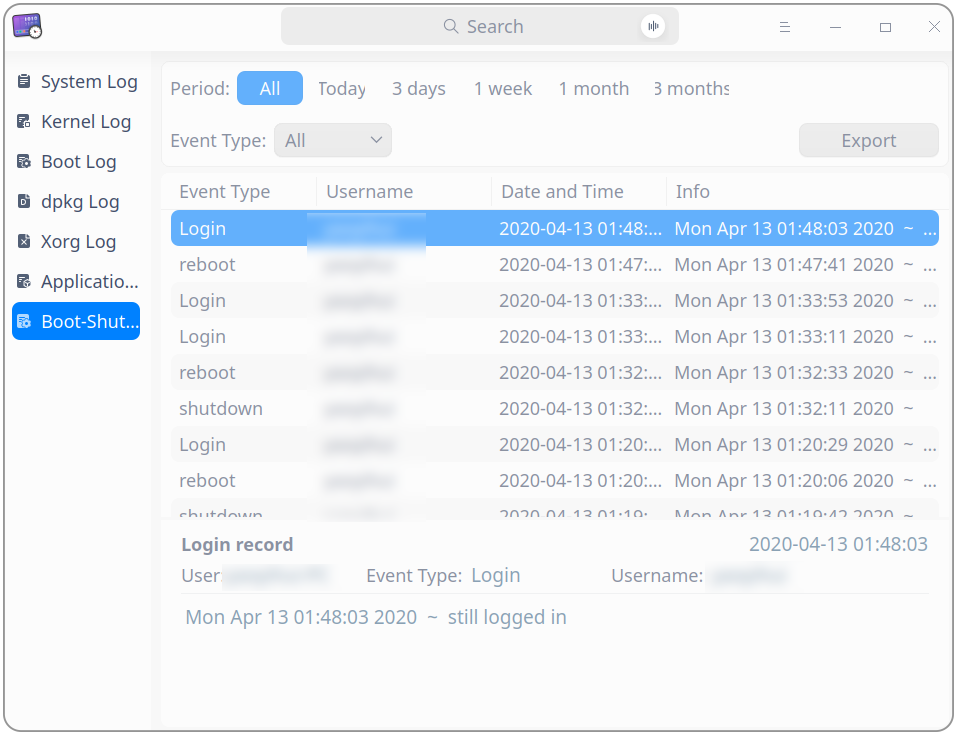
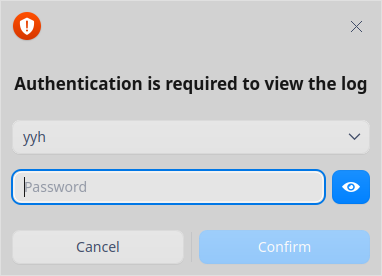
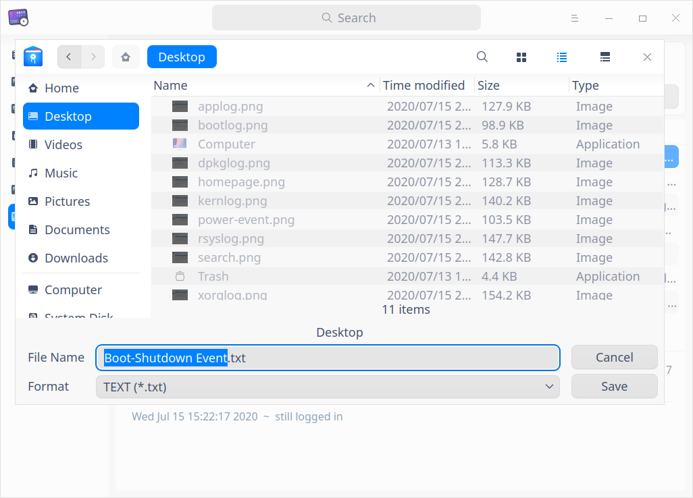
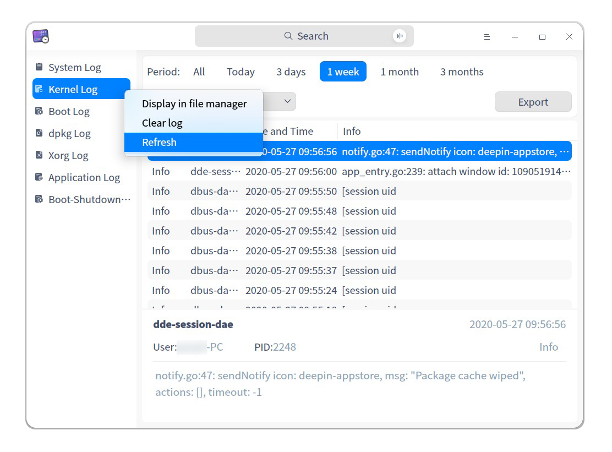

# Log Viewer|../common/deepin-log-viewer.svg|

## Overview 

Log viewer is a tool that collects logs generated when an application is running, for example, logs generated when operating system and applications start up and run. You can do trouble-shooting and solve problems quickly by analyzing logs. 

## Guide

You can run, close or create a shortcut for Log Viewer.

### Run Log Viewer 

1. Click on the Dock to enter the interface of launcher.
2. Locate  by scrolling the mouse wheel or searching "Log Viewer" in the Launcher interface and click it to run.
3. Right-click to:
   - Select **Send to desktop** to create a shortcut on the desktop.

   - Select  **Send to dock** to fix it onto the dock.

   - Select **Add to startup** to run it automatically when the computer is turned on.

### Exit Log Viewer 

- On the main interface, click   to exit.
- Right-click  on the Dock, select **Close all** or **Force Quit** to exit.
- On interface of Log Viewer, click  and select **Exit** to exit.

## Operations

### Search

1. Log Viewer supports searching by keywords and speech.

   - Search by keywords: clickto input keywords;

   - Search by sound: click and speak, your speech will be turned into characters and displayed in the search box;

2. Results are displayed after input. If no matched service is found, you will see a hint **No search results**.

3. Click  to close current searching.

### Selector

Selectors include **period**, **level**, **status**, and **application list**. 
- Selecting by period: selecting in the order of log generating date

  Options include: "All", "Today", "3 days", "1 week", "1 month", and "3 months". Default option is "All".

  Applicable for: system logs, kernel logs, dpkg logs, and application logs

- Selecting by level: selecting by seriousness levels of events

  Options include: "All", "Emergency", "Allert", "Critical", "Error", "Warning", "Notice", "Info"and "Debug". Default option is "Info".

  Applicable for: system logs and application logs

- Selecting by status: 

  only applicable for startup logs, options include "All", "OK", and "Failed". Default option is "All".

- Selecting by application list: 

  only applicable for application logs, default option is the first one. 
  
- Selecting by event type: 
  
  only applicable for boot-shutdown events, options include:  "All", "Login", "Reboot", and "Shutdown", the default option is "all".  
  
  

### System Log

1. On the main interface, click **System Log **. 
2. You can see a list of system logs which are detailed by "Level", "Process", "Date and Time", and "Info".
3. Click a log, you can see its particular info below the list, including process, user, PID, time and info.

### Kernel Log

1. On the main interface, click  **Kernel Log **.
2. You can see a list of kernel logs which are detailed by "Date and time", "User", "Process" and "Info".
3. Click a log, you can see its particular info below the list, including time, user, process, and info.

### Boot Log

1. On the main interface, click **Boot Log**.
2. You can see a list of boot logs which are detailed by "Status" and "Info".
3. Click a log, you can see its particular info below the list, including process, user, status and info.

### dpkg Log

1. On the main interface, click **dpkg Log**. 
2. You can see a list of dpkg logs which are detailed by "Date and time" and "Info".
3. Click a log, you can see its particular info below the list, including process, user, action, time and info.

### Xorg Log

1. On the main interface, click **Ｘorg Log**.
2. You can see a list of Xorg logs which are detailed by "Date and time" and "Info".
3. Click a log, you can see its particular info below the list, including process, user, time and info.

### Application Log

1. On the main interface, click  **Application Log **.
2. You can see a list of application logs which are detailed by "Level", "Date and Time", "Source" and "Info".
3. Click a log, you can see its particular info below the list, including source, user, time, level and info.

### Boot-Shutdown Event

1. On the main interface, click  **Boot-Shutdown Event**.
2. You can see a list of boot-shutdown events which are detailed by "Event Type", "Username", "Date and Time", and "Info".
3. Click a log, you can see its particular info below the list, including user, event type, username, and detailed info.

> ：When using Log Viewer, if a prompt appears saying **Authentication is required to super permissions**, you can input UOS password to continue viewing.

### Export

You can export logs and save them in format of  txt/doc/xls/html.

1. On the main interface, click **Export**. 
2. An interface of file manager pops up. Input a file name and select a format. 
3. Click **Save**. 

### Right-click Operation

You can select a log type in the left panel, right-click to display in file manager, to clear log and to refresh the log.

   - Select **Display in file manager**, the folder path of the current log will be opened. 

> : **Display in file manager** is only applicable for kernel log, boot log, dpkg log, Xorg log and application log.

   - Select **Clear log**, click **Confirm** button in the pop-up window to clear current logs.
If authentication window pops up, please input password to finish the operation.

> : **Clear log** is only applicable for kernel log, boot log, dpkg log, Xorg log and application log.

   - Select **Refresh** to reload the log and update log list.

## Main Menu

In the main menu, you can switch themes, view help manual, and so on.

### Theme

The window theme includes Light Theme, Dark Theme and System Theme (default).

1. Click on the interface.
2. Click  **Theme** to select one.

### Help

Click Help to get the manual, which will help you further know and use Log Viewer.

1. Click on the interface.
2. Click **Help** to view the manual.

### About

1. Click on the interface.
2. Click **About** to view version information and introduction about Log Viewer.

### Exit

1. Click on the interface.
2. Click  **Exit**.

