# 邮件客户端|../common/deepin-mail.svg|

## 概述

邮箱是系统预装的易于使用的桌面电子邮件客户端，可同时管理多个邮箱帐号。

## 使用入门

您可以通过以下方式运行或关闭邮件客户端，或者创建快捷方式。

### 运行邮件客户端

1. 单击任务栏上的 进入启动器界面。
2. 上下滚动鼠标滚轮浏览或通过搜索找到【邮件客户端】按钮 ，单击打开邮箱 。
3. 右键单击，您可以：
   - 单击 **发送到桌面**，在桌面创建快捷方式。

   - 单击 **发送到任务栏**，将应用程序固定到任务栏。

   - 单击 **开机自动启动**，将应用程序添加到开机启动项，在电脑开机时自动运行该应用程序。

### 关闭邮件客户端

- 在邮件客户端界面，单击   ，退出邮件客户端。
- 右键单击任务栏上的图标，选择 **关闭所有** 来退出邮件客户端。
- 在邮件客户端界面单击  ，选择 **退出** 来退出邮件客户端。

## 邮箱登录

邮件客户端支持UOS帐号及邮箱登录，第一次运行时可以任选一种方式登录，进入界面后再添加另外类型的帐户。

> 说明：您可以选择登录UOS ID或邮箱帐户，也可以同时登录。

### UOS ID登录

邮件客户端可以从UOS帐户体系中获取用户的头像，昵称，以及邮箱地址等信息。在邮件客户端中使用UOS帐户可以实现邮箱帐号、地址簿、过滤器数据、设置数据同步。

1. 在邮箱登录界面单击 **UOS ID登录**。
2. 弹出网络帐户登录界面，输入用户名/邮箱/手机号和密码，单击 **登录**。

> 注意：如果您未注册帐号，单击对话框中的 **注册** 按钮跳转到网页进行注册。

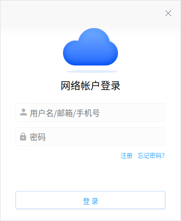

3. 单击头像，选择 **开启同步**，可将绑定UOS帐户的邮箱信息同步到客户端，包括收发的邮件、设置项等。

4. 在邮箱主界面，您还可以添加邮箱信息，有如下三种方式进入添加界面：

   - 单击头像，选择 **帐号设置**；在左侧导航栏，选择 **邮箱帐号** ，单击 **添加帐号**。
   - 单击主菜单，选择 **设置**；在左侧导航栏，选择 **邮箱帐号** ，单击 **添加帐号**。
   - 单击界面左下角添加按钮。

5. 跳转到登录界面，添加邮箱的详细操作参考 [邮箱帐户登录](#邮箱帐户登录)。

### 邮箱帐户登录

1. 在邮箱登录界面输入邮箱帐号及密码，单击 **添加**。

2. 弹出网络帐户登录界面，输入用户名/邮箱/手机号和密码，单击 **登录**。

3. 程序会检测输入的邮箱后缀是否在服务器数据库中：

   - 如果邮箱后缀在服务器数据库中，则可直接登录；

   - 如果邮箱后缀不在服务器数据库中，则需单击 **手动配置** 手动添加。

     
> 说明：QQ邮箱、网易邮箱（163.com及126.com）、新浪邮箱需要开启POP3/IMAP/exchange等服务后才可以在邮件客户端中使用。开启服务后，服务端会产生授权码。在登录界面输入邮箱帐户及授权码即可登录邮件客户端。如图登录错误，单击 **查看帮助** 则可查看帮助信息。
>
> 
4. 在邮箱主界面，您还可以登录UOS帐户，有如下两种方式进入登录界面：

   - 单击头像，选择 **登录**。
   - 单击主菜单，选择 **设置**。在左侧导航栏，选择 **UOS ID**，单击 **登录**。

5. 跳转到网络帐户登录界面，详细登录操作请参考 [UOS ID登录](#UOS ID登录)。

## 主界面

### 邮箱帐户

通过邮箱服务器验证的邮箱，会显示在帐户列表区域，可添加多个帐户。

右键单击选中的邮箱帐户，您可以进行以下操作：

- 设置：跳转到邮箱设置界面，详细内容请参考 [设置](#设置)。

- 收取邮件：开始从服务器同步邮箱数据，包括 邮件，地址簿，日历等。

- 新建文件夹：在邮箱帐户下新建一个新的邮箱目录，最多可以创建二级目录。

- 修改帐号显示名称：添加的邮箱帐户默认显示邮箱号，可以修改为自己的名字或昵称。

  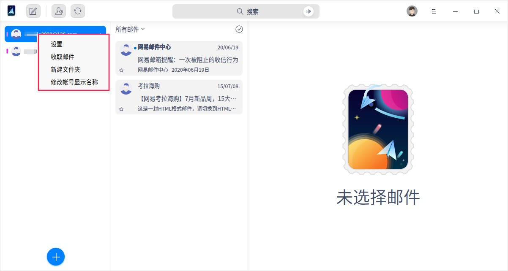

### 邮箱目录

邮箱目录用于分类整理邮件数据，邮箱通用固定目录为：收件箱、已发送、草稿、已删除、星标邮件、未读邮件、已归档及垃圾邮件。除了通用固定目录外，其他的就是用户个人创建的目录。

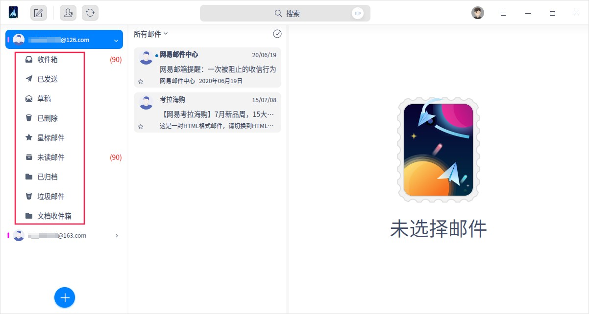

> 说明：固定目录不可被删除，用户自己创建的新目录可以自由删除。

### 邮件列表

邮箱列表以列表形式展示邮箱目录下的所有邮件，显示内容包括：发件人、主题、摘要、发件时间及标星状态。

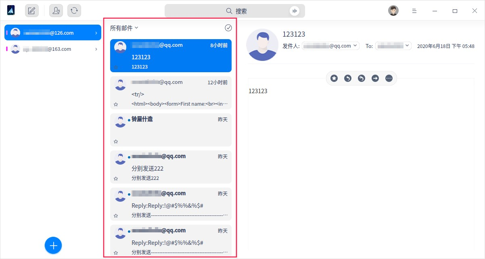

#### 查看邮件

- 左键单击列表中邮件标题，邮件正文区域显示邮件正文内容；
- 左键双击列表中的邮件标题，弹出邮件正文内容页签。

#### 筛选邮件

邮件筛选功能可以帮您快速的找到需要的邮件。

1. 单击 **所有邮件**，显示筛选条件为：所有邮件、未读邮件、星标邮件、含附件及@我。

   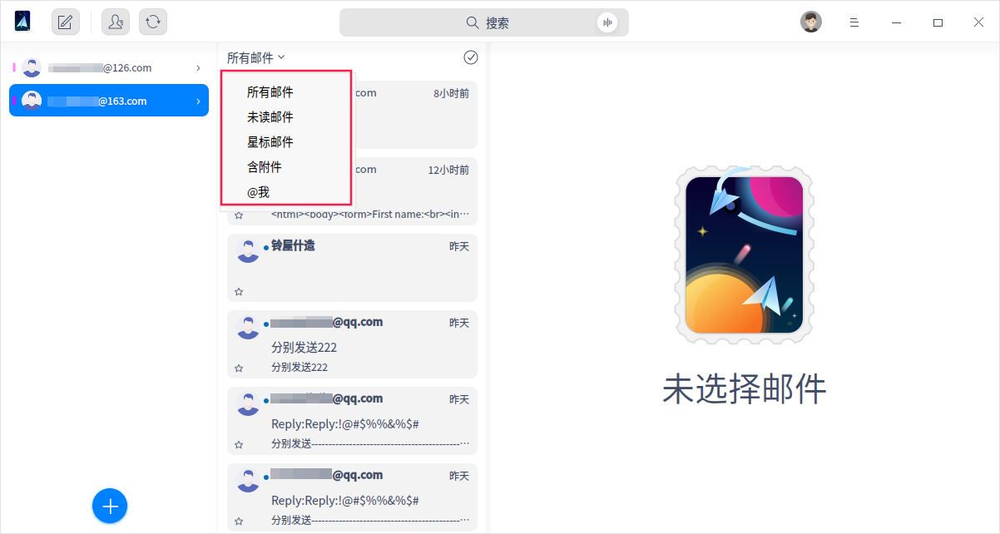

2. 选中后，邮件列表只显示符合条件的邮件列表。

#### 选中邮件

- 选中单个邮件：左键单击邮件标题；

- 选中多个邮件：

   - ctrl +鼠标左键单击，可依次选中的多个邮件；

   - shift + 鼠标左键单击A邮件，再shift + 鼠标左键单击B邮件，选中从A到B之间的所有邮件。

#### 右键菜单
右键单击选中的邮件，您可以进行以下操作：

- 编辑

- 回复

- 回复全部

- 转发

- 作为附件转发

- 标星/取消标星：如果选中的邮件是标星状态，此处显示取消标星；如果选中的邮件是未标星状态，此处显示标星；

- 标为已读/标为未读：如果选中的邮件是已读状态，此处显示 **标为未读**；如果选中的邮件是未读状态，此处显示 **标为已读** ；

- 标为垃圾邮件/这不是垃圾邮件：将邮件标为垃圾邮件后，邮件就归档到垃圾箱目录了。在垃圾箱目录中，右键单击后，选择 **这不是垃圾邮件**，邮件则返回到收件箱目录；

- 移动到：可将邮件移动到其他的邮件目录；

- 删除：选择后直接将邮件删除，并归档到已删除目录。

- 打印：可将邮件打印，并设置打印参数；

- 导出：可将邮件导出到指定的文件夹；

- 更多操作

   - 发送新邮件给相同接收人

   - 回复带原邮件附件

   - 将发件人添加到通讯录

   - 将所有收件人添加到通讯录

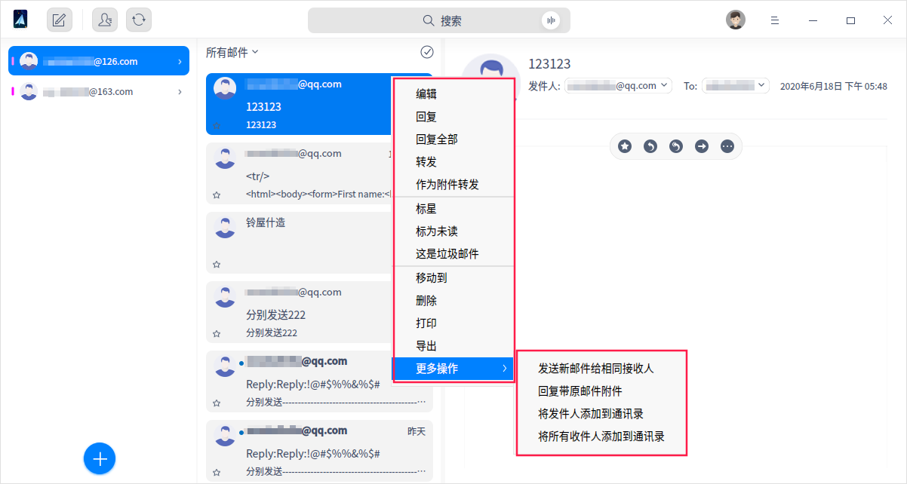

### 邮件正文

#### 查看邮件 
单击邮件列表中的邮件后，邮件正文展示邮件标题、收发件人信息、时间及正文内容。

#### 查看收发件人信息

单击发件人或收件人邮箱，可查看收发件人的详细信息及往来邮件，您还可以将他们添加到通讯录。

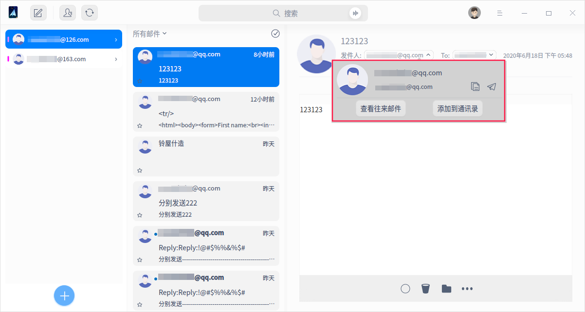

#### 邮件操作

在邮件正文界面，您可以对邮件进行很多操作（如标星、回复、转发及删除等），详细可参考邮件[右键菜单](#右键菜单)。

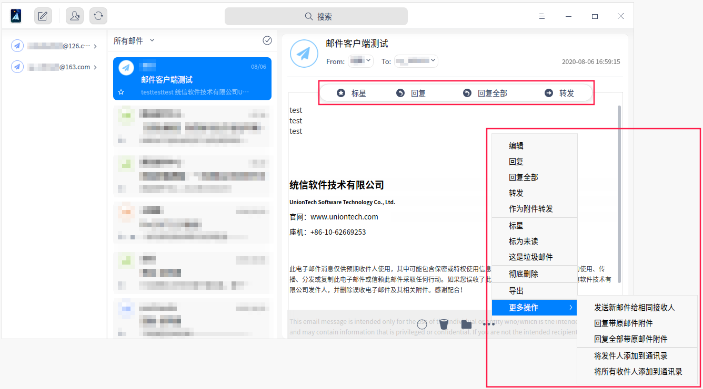

### 邮箱全局功能
#### 写邮件

在邮箱主界面，单击写邮件按钮，进入写邮件界面。邮件客户端支持富文本编辑，包括插入图片、链接及@功能等。

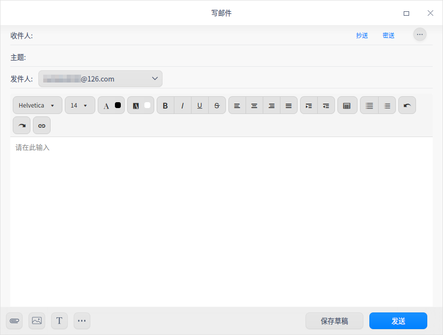

#### 通讯录

在邮箱主界面，单击通讯录按钮，进入通讯录界面。可查看通讯录列表及联系人的信息，同时可补充联系人电话号码、地址等信息，单击还可添加新联系人。

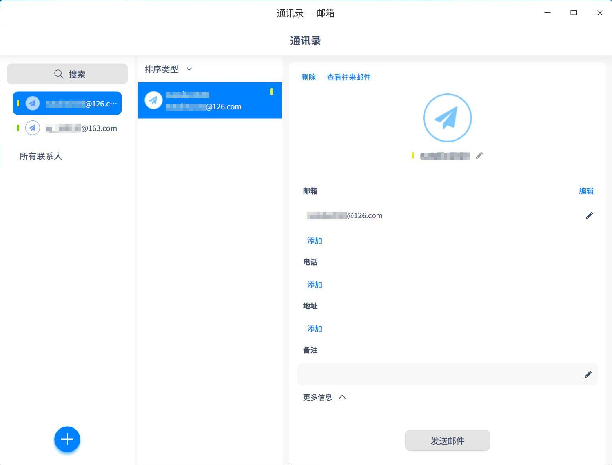

#### 收邮件

在邮箱主界面，单击刷新按钮， 立即从服务器同步邮箱数据，包括 邮件，地址簿，日历等，系统默认每15分钟同步1次邮箱数据。

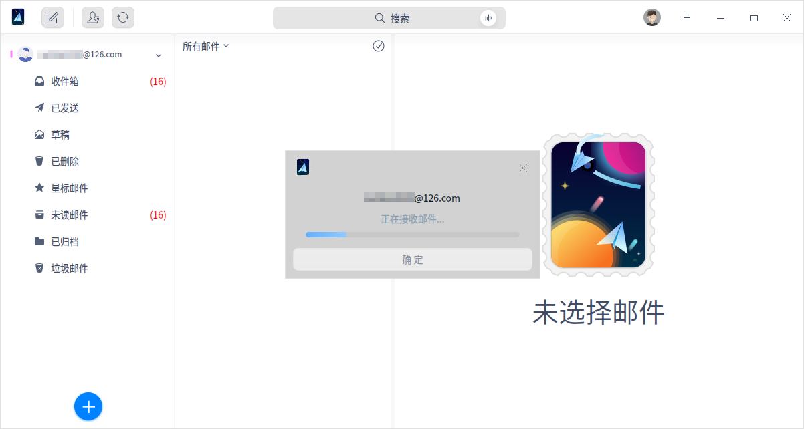

#### 搜索

1. 邮箱中自带搜索功能，支持文字和语音两种搜索方式。
   - 文字搜索：单击，输入关键字；
   - 语音搜索：单击， 输入语音，语音会转化为文字显示在搜索框中；
2. 输出关键字，可查看包含该关键字的所有邮件。

## 主菜单

在邮箱主菜单中，您可以进行邮箱设置、切换窗口主题，查看帮助手册等操作。

### 设置

在邮箱主界面，单击 。进入邮件设置界面，可进行帐号设置、基本设置、反垃圾设置及高级设置。

#### 帐号设置

UOS ID：登录或退出登录UOS ID。

邮箱帐号：增加或删除邮箱帐号。

邮箱信息：显示发件人头像、姓名及邮箱协议，还可以更换头像及服务器设置。

签名：主要是向收件人提供更多联系信息，以及额外的品牌展示信息。您可以根据需求选择公司签名、个人签名或自定义签名。

#### 基本设置

快捷键：邮箱中常用操作的快捷键。

程序设置：邮箱开启或收件提醒的基本设置。

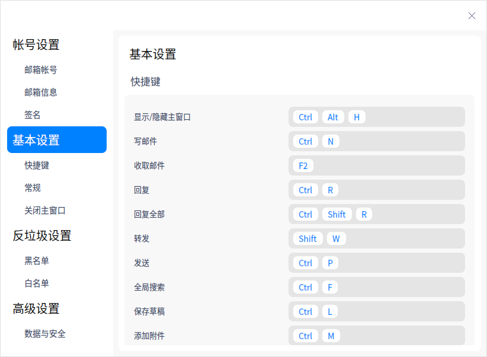

#### 反垃圾设置

黑名单：在黑名单列表里的邮箱发过来的邮件全部拒收，可添加、导出及导入黑名单。

白名单：在白名单列表里的邮箱 发过来的邮件全部接收，可添加、导出及导入白名单。

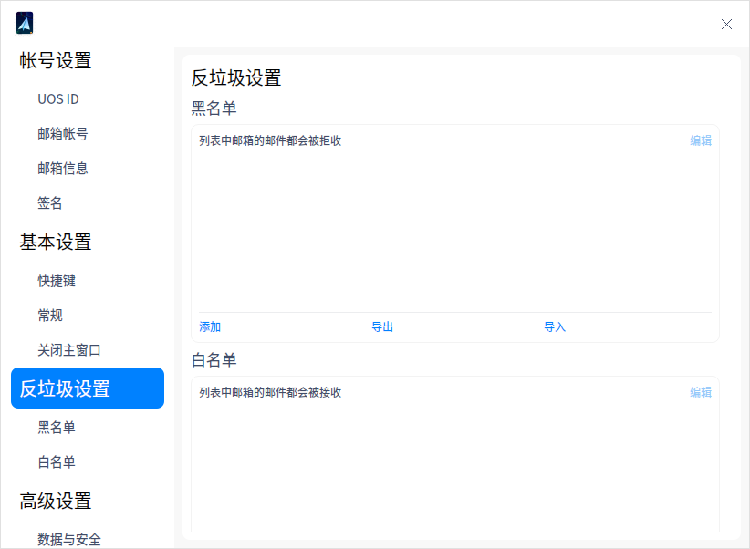

#### 高级设置

开启安全锁，设置开启密码。当鼠标和键盘超过15分钟未操作，邮箱将自动锁定，唤醒时需要输入开启密码。

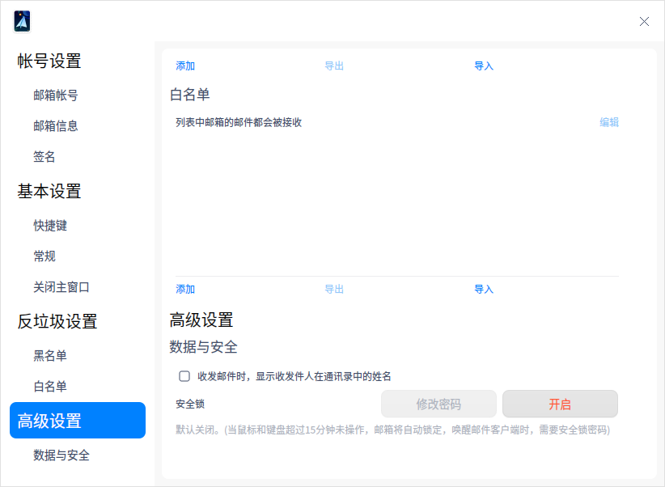

### 主题

窗口主题包含浅色主题、深色主题和系统主题，其中系统主题为默认设置。

1. 在邮箱主界面，单击。
2. 单击 **主题**，选择一个主题颜色。

### 帮助

查看帮助手册，通过帮助进一步让您了解和使用邮箱。

1. 在邮箱主界面，单击 。
2. 单击 **帮助**。
3. 查看关于邮箱的帮助手册。

### 关于

1. 在邮箱主界面，单击 。
2. 单击 **关于**。
3. 查看关于邮箱的版本和介绍。

### 退出

1. 在邮箱主界面，单击 。
2. 单击 **退出**。

