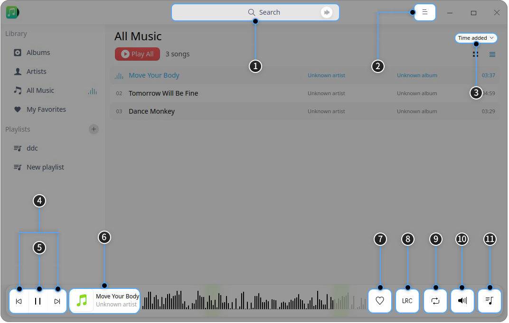
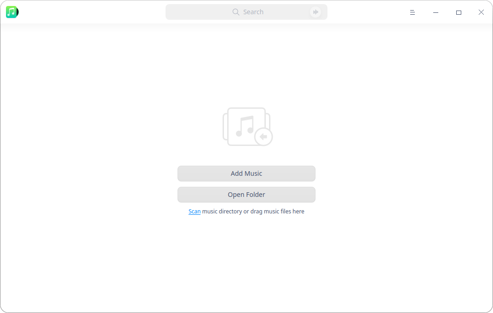
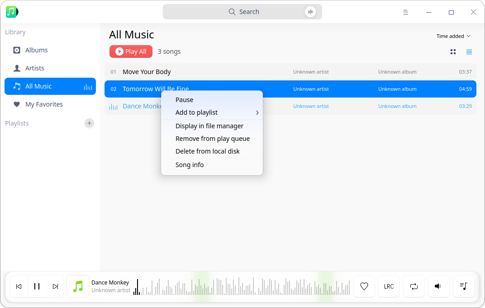
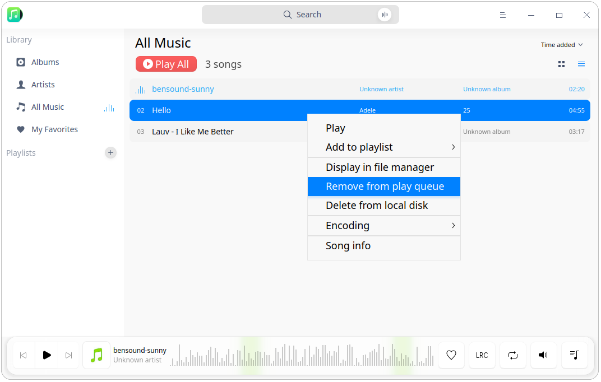
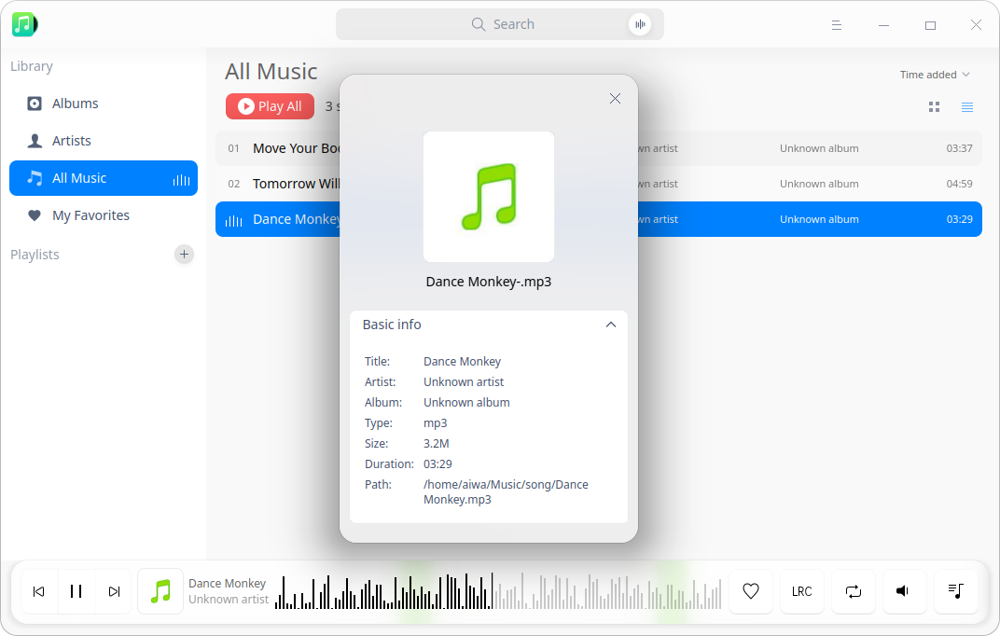
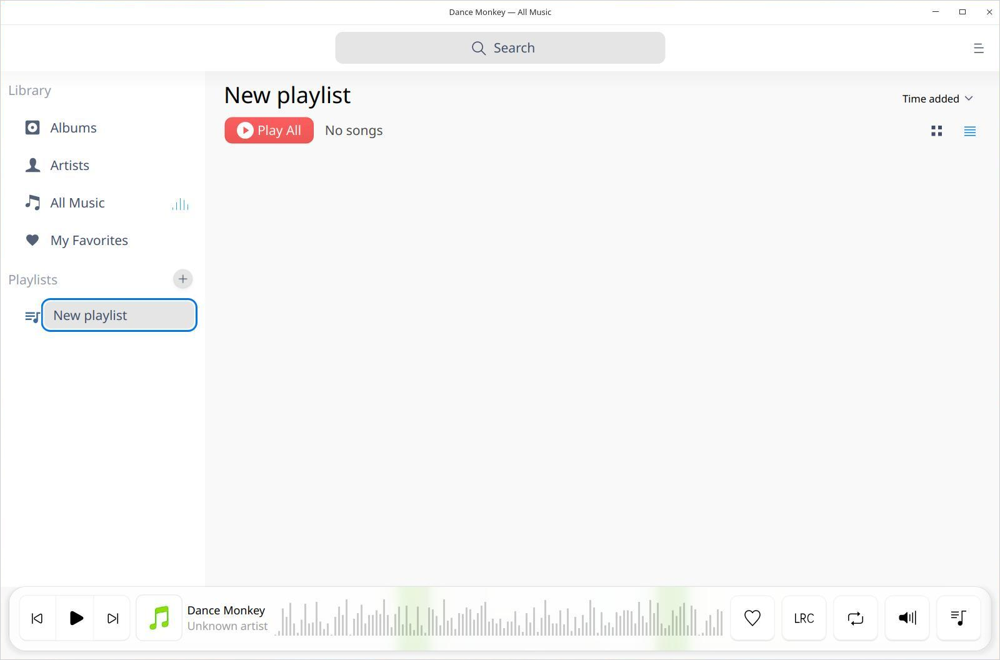
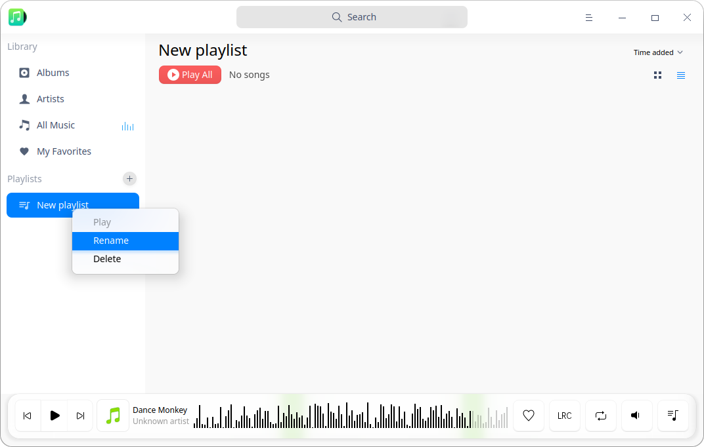
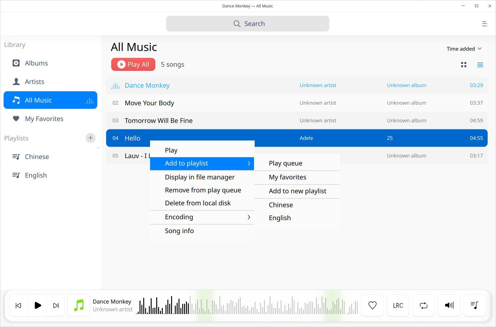
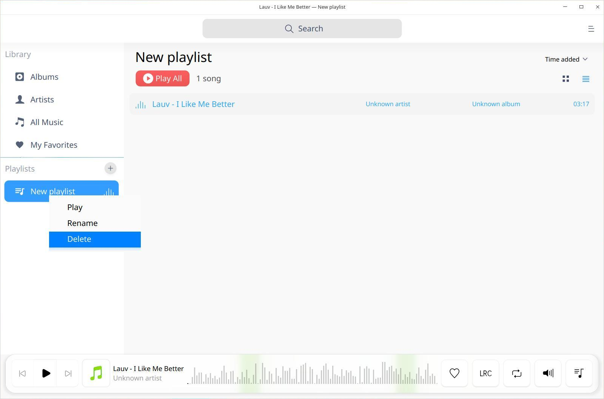

# Music|../common/deepin-music.svg|

## Overview

Music is a local music playing application with brand new UI design and extreme playing experience featured with local music scanning and lyric sync functions, etc.

## Guide

You can run, close and create a shortcut for Music by the following ways.

### Run Music

1. Click  on dock to enter the Launcher interface.
2. Locate  by scrolling mouse wheel or searching "music" in the Launcher interface.
3. Right-click the Music application icon and you can:
 - Click **Send to desktop** to create a desktop shortcut.
 - Click **Send to dock** to fix the application on dock.
 - Click **Add to startup** to add the application to startup and it will automatically run when the system starts up.

> Notes: If Music has been fixed on Dock, you can also click its icon to run it.

### Minimize to System Tray

Music can be minimized to the system tray.

Click  on the Music interface to close the main window,  select **Minimize to system tray** and click **Confirm** to minimize it in the system tray.

> Notes: Check **Do not ask again** and the pop-up will no longer be displayed.

Right-click the Music application icon in the tray and you can perform the following operations:

 - Click **Play/Pause** to play/pause the song;
 - Click **Previous** to play the previous song;
 - Click **Next** to play the next song.
 - Click **Exit** to exit Music.

### Exit Music

- On the Music interface, click  and select  **Exit** to exit Music.
- Right-click the Music application icon on Dock and select **Close All** to exit Music.
- Right-click   in the system tray and select **Exit** to exit Music. 

### View Shortcuts

On the Music interface, press **Ctrl** + **Shift**+ **?** to view the shortcuts. Proficiency in shortcuts will greatly improve your efficiency.

## Main Interface

On the main interface, you can do common playing operations and view playlist and song info.

<table class="block1">
    <caption></caption>
    <tbody>
        <tr>
            <td>1</td>
            <td>Search box</td>
            <td>Users can search music quickly by search box.</td>
        </tr>
        <tr>
            <td>2</td>
            <td>Main menu</td>
            <td>Users can add playlist, add music, set options, view manual and about information, and exit the application by main menu.</td>
        </tr>
    	<tr>
            <td>3</td>
            <td>Sort options</td>
            <td>Users can sort the list by time added, title, artist or album name.</td>
        </tr>
    	<tr>
            <td>4</td>
            <td>Play box</td>
            <td>Show the name of the song being played, cover and album name.</td>
        </tr>
    		<tr>
            <td>5</td>
            <td>Play/Pause button</td>
            <td>Click to Play/Pause music.</td>
        </tr>
    	<tr>
            <td>6</td>
            <td>Previous/Next</td>
            <td>Click to switch to Previous/Next music.</td>
        </tr>
    	<tr>
            <td>7</td>
            <td>Favorite</td>
            <td>Click to add music to my favorites and click again to unfavorite it.</td>
        </tr>
    	<tr>
            <td>8</td>
            <td>Lyrics</td>
            <td>Click it to switch to the lyrics interface and click it again to close lyrics.</td>
        </tr>
    		<tr>
            <td>9</td>
            <td>Play mode</td>
            <td>Click it to switch the play mode, including list loop, single loop and shuffle.</td>
        </tr>
    		<tr>
            <td>10</td>
            <td>Volume</td>
            <td>Click it to Mute/Unmute and move on to show the volume bar to adjust the volume.</td>
        </tr>
    		<tr>
            <td>11</td>
            <td>Play Queue</td>
            <td>Click it to show/hide the playlist.</td>
        </tr>
    </tbody>
</table>

## Common Operations

You can add, delete and view info of the local music in Music.

### Add Music

On the Music interface, you can: 
- Click **Add Music** and add local music to the playlist or click **Scan** to add music if there is no music file in Music.
- Click **Open Folder** to customize the local song directory and add music files in batch if there is no music file in Music.
- Click  > **Add playlist** or  > **Add music** to add music files to the playlist.
- Drag the music file/folder to the Music interface and add the music file to the playlist.

### Search Music

1. In the search box on top of the Music interface, you can: 

   - Click  to enter keywords.
   - Click  to enter voices and the voices will be converted to texts which will be displayed in the search box.

2. Press the **Enter** key on the keyboard to conduct search.

   - When there is matched information, click **Play All** in the search result list to play the music in the search result list.

   - When there is no matched information, "No search results" will be displayed in the search result list.

3. Click or delete the entered information in the search box to clear the currently-entered information or cancel search.

### Play Music

You can play music by the following ways:

- Double-click or right-click a selected music in the palylist to play the music.
- Select a list under the playlist in the left navigation bar and right-click **Play** to play all the songs in the list according to the currently-set order.
- Click **Play All** to Play all the songs in the current list according to the order set. 

> Tips: On the Music interface, click  to play the selected music. Click  to pause the play. Click  or  to switch to the previous or next song according to the current play mode.

### Add Music to My Favorites

On the Music interface, click  to add music to my favorites.

The prompt information **Successfully added to "My Favorites"** pops up and the music is added to **My Favorites** list.

> Notes: You can also right-click the music, and click on **Add to playlist** > **My Favorites** to finish this task.

### View Lyrics

On the Music interface, click  to switch to the lyrics interface. Click it again to collapse the interface.

### Adjust Play Mode

On the Music interface, click  ,   or  to adjust the play mode.

: Single loop

 : Shuffle

: List loop

### Display in File Manager

1. On the Music interface, right-click the music.
2. Click **Display in file manager** and you can view the the music file in File Manager.

### Delete Music

1. On the Music interface, right-click the music and you can:

2. Click **Remove from play queue** to remove the music from the play queue, but the music file will be still on the local disk.

3. Click **Delete from local disk** to remove the music from the playlist and local disk. 

   

### Encoding

1. On the Music interface, right click the music.
2. Click **Encoding**, you can select the encoding you want.

### View Music Info

1. On the Music interface, right-click the music file in the playlist.
2. Click **Song info** to view the music title, artist, album, type, size, duration, path and other information.

## Playlist Management

On the Music interface, you can create, delete, rename playlist and add music to the playlist.

> Notes: **All music**  and **My favorites ** are the default lists and cannot be deleted. Custom playlists are subsets of the **All Music ** list. **My Favorites ** list can be managed directly or through the Favorites button on the main interface.

### Create a New Playlist

1.  On the  Music interface, click  next to the playlist.
2.  Enter the name of the playlist.
3.  Press the **Enter** key on the keyboard.

### Rename Playlist

2.  Right-click the playlist to select **Rename**.
2.  Enter the name of the playlist.
3.  Click the blank area of the Music, or press the Enter key.

### Add Music to Playlist

1. On the Music interface, select a music you want to add.
2. Right-click to select **Add to playlist** to add the music to the selected playlist.

> Notes: You can drag the local music to a specified playlist to add the music to the current playlist and **All Music**. 

### Remove Music from Playlist

1. On the Music interface, select the music you want to remove.
2. Right-click to select **Remove from play queue**.

### Delete Playlist

2. Right-click the playlist to be deleted and select **Delete**.
3. In the popup window, select **Delete** to confirm the operation.

## Main Menu

You can [Add Music](#Add Music), set the options, switch window themes, view the help manual and get more information about Music.

### Settings

It is available to set the basic information and shortcuts in settings.

#### Basic Settings

1. On the Music interface, click .
2. Select **Settings** > **Basic**.
3. In the option **Play**, you can:
 - Check the  **Autoplay** box and the music will be played automatically when  Music runs.
 - Check the **Remember playback position** box and the music will be played automatically from the last position played when Music runs.
 - Check the **Enable fade in/out** box and the music will fade in and out when Music runs.
4. In the option **Close Main Window**, you can:

   Select **Minimize to system tray**.

   Select **Exit Music**. 

5. Click **Restore Defaults** to restore the default settings.

### Shortcuts Settings

1. On the Music interface, click .
2. Select **Settings** > **Shortcuts** to view the shortcuts.
3. It is available to select and re-enter shortcut keys to customize shortcut keys.

### Theme

The window theme includes Light Theme, Dark Theme and System Theme (default).

1.  On the Music interface, click.

2.  Click **Theme** to select a theme.

### Help

You can click **Help** to view the manual.

1.  On the Music interface, click  in the top right corner.

2.  Click **Help** to view the manual of Music.

### About

Click **About** to view the introduction of Music.

1. On the Music interface, click  in the top right corner.

2. Click **About** to view the version and introduction of Music.

### Exit

Click **Exit** to exit Music.

1.  On the Music interface, click  in the top right corner.

2.  Click **Exit** to exit.

