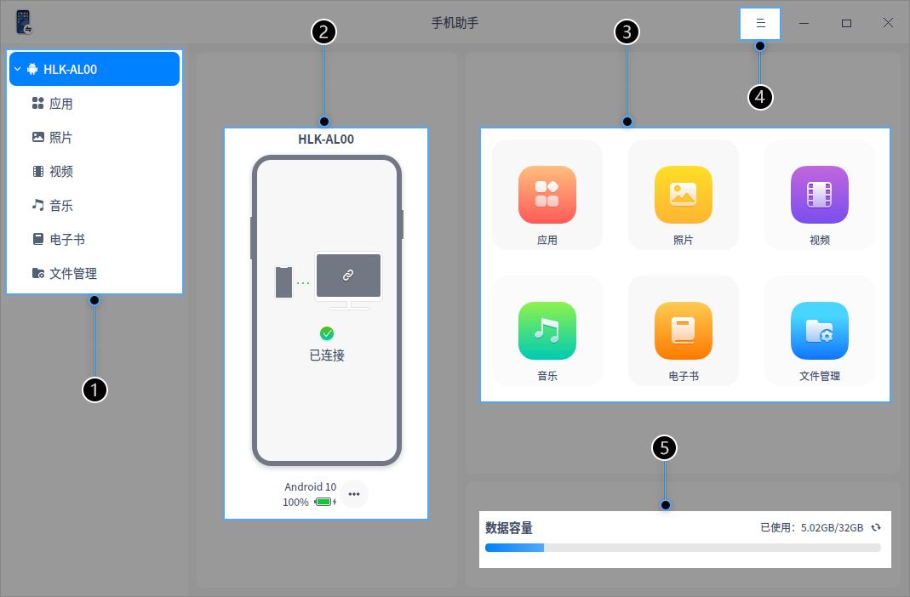
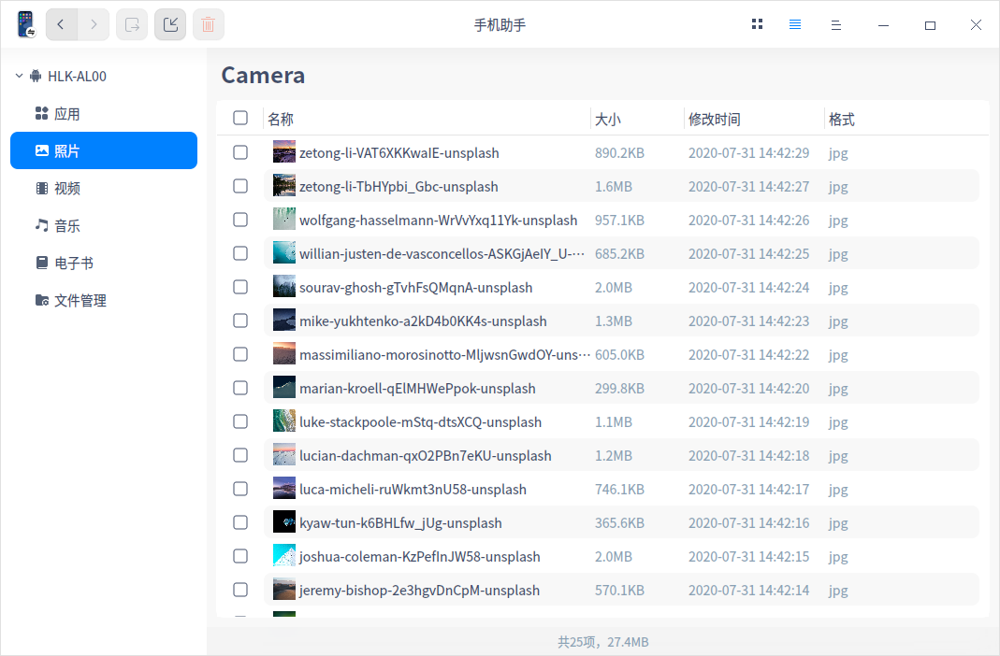
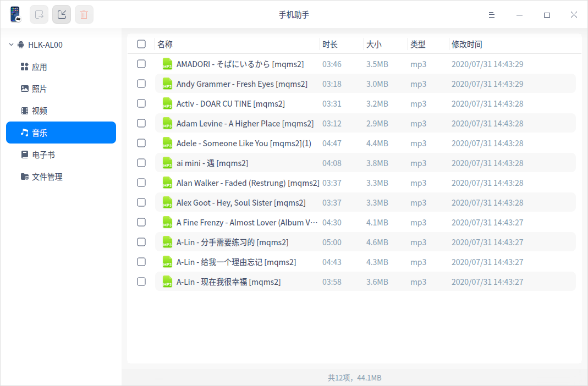

#  手机助手|../common/deepin-phone-master.svg|

## 概述

手机助手是一款智能手机PC端的管理工具，支持多种型号的手机，满足不同手机用户的需求。通过手机助手，您可以更轻松、更便捷地管理手机文件。

## 使用入门

通过以下方式运行或关闭手机助手，或者创建手机助手的快捷方式。

### 运行手机助手
1. 单击任务栏上的启动器 ，进入启动器界面。
2. 上下滚动鼠标滚轮浏览或通过搜索，找到手机助手 ，单击运行。
3. 右键单击 ，您可以：
   - 单击 **发送到桌面**，在桌面创建快捷方式。
   - 单击 **发送到任务栏**，将应用程序固定到任务栏。
   - 单击 **开机自动启动**，将应用程序添加到开机启动项，在电脑开机时自动运行该应用。

### 关闭手机助手
- 在手机助手窗口，单击 ，退出手机助手。
- 在任务栏右键单击 ，选择 **关闭所有** 来退出手机助手。
- 在手机助手界面，单击 ，选择 **退出** 来退出手机助手。

## 主界面

| 标号 | 名称   | 描述                                                 |
| ---- | ------ | ---------------------------------------------------- |
| 1    | 导航栏 | 点击导航栏图标可快速访问手机中的应用、照片、视频等。 |
| 2    | 设备信息栏 | 显示手机的型号、连接状态、电量；点击   查看手机的具体信息。 |
| 3   | 功能区 | 点击功能区图标快速访问手机中的应用、照片、视频等。 |
| 4   | 主菜单 |通过主菜单进行基础设置、查看版本号、查看帮助文档和更换主题背景。  |
| 5   | 数据容量 |显示手机总容量、已用容量和可用容量。  |

>说明：iOS系统不支持音乐和电子书。

## 设备连接

手机助手可同时连接多部手机，使用手机助手需要进行如下设置。

### 安卓系统
1. 解锁手机，在手机中找到“设置”>“关于手机”>“版本号”，连续点击“版本号”直到弹出提示“开发者模式已启用”。  
   
   >说明：
   >+ 不同品牌的手机，“设置”>“关于手机”>“版本号”路径名称会不一样，具体以您自己的手机为准。
   >+ 开发者模式启用后，以后每次设备连接不需要再次点击版本号来启用，直接执行以下步骤即可。

2. 使用数据线将手机与PC端连接，并在PC端运行手机助手。
3. 下拉手机通知栏，找到“正在通过USB充电”的通知并进入，将充电模式切换成“传输文件（MTP）”的模式。
4. 在“设置”中找到“开发者选项”并打开，找到”USB调试“并开启，此时手机端弹出需要授权的提示，点击“确定”完成授权。

 5. 手机端会弹出安装“UOS手机助手”的提示，请根据提示安装客户端手机助手，安装完成后方可在PC端进行操作。

 

>说明：若手机挂载失败，请断开USB线并重新连接。

>注意：为保证PC端手机助手功能正常使用，请保持数据线正常连接，且客户端手机助手正常运行。

### iOS系统

1. 使用数据线将手机与PC端连接，并在PC端运行手机助手。
2. 解锁手机，手机端弹出“是否信任此电脑”的对话框，点击“信任”完成连接。连接完成后方可在PC端手机助手上进行操作。

> 说明：若手机挂载失败，请断开USB线并重新连接。

## 功能介绍

通过手机助手，您可以对手机中的应用、照片、视频、音乐、电子书及文件进行管理和操作。
&nbsp;&nbsp;&nbsp;&nbsp;&nbsp;&nbsp;&nbsp;&nbsp;&nbsp;&nbsp;&nbsp;&nbsp;&nbsp;

> 说明：iOS系统仅在文件管理界面支持导入的功能，其它界面暂不支持此功能。

### 应用管理
点击左侧导航栏  图标或者主界面  进入应用管理界面，您可以导出或者卸载手机中的应用。

- 导出应用：选择一个或多个应用，点击工具栏上的，将应用保存到PC端自定义的位置。
  
   > 说明：iOS系统暂不支持导出的功能。
- 卸载应用：选择一个或多个应用，点击工具栏上的 ，在弹出的对话框中点击 **确定** 卸载应用。

### 照片管理
点击左侧导航栏  图标或者主界面  进入照片管理界面，您可以导入、导出或者删除手机中的照片。

- 导出照片：选择一张或多张照片，点击工具栏上的 ，将照片保存到PC端自定义的位置。
- 导入照片：点击工具栏上的  ，将PC端照片导入到手机中。
- 删除照片：选择一张或多张照片，点击工具栏上的 ，在弹出的对话框中点击 **确定** 删除照片。

### 视频管理

点击左侧导航栏  图标或者主界面  进入视频管理界面，您可以导入、导出或者删除手机中的视频文件。

- 导出视频：选择一个或多个视频，点击工具栏上的 ，将视频保存到PC端自定义的位置。
- 导入视频：点击工具栏上的 ，将PC端视频导入到手机中。
- 删除视频：选择一个或多个视频，点击工具栏上的 ，在弹出的对话框中点击 **确定** 删除视频。

### 音乐管理

点击左侧导航栏  图标或者主界面  进入音乐管理界面，您可以导入、导出或者删除手机中的音乐文件。

- 导出音乐：选择一个或多个音乐文件，点击工具栏上的  ，将音乐保存到PC端自定义的位置。
- 导入音乐：点击工具栏上的 ，将PC端中的音乐文件导入到手机中。
- 删除音乐：选择一个或多个音乐文件，点击工具栏上的 ，在弹出的对话框中点击 **确定** 将音乐文件删除。

### 电子书管理

点击左侧导航栏  图标或者主界面  进入电子书管理界面，您可以导入、导出或者删除手机中的电子书。

- 导出电子书：选择一个或多个电子书，点击工具栏上的 ，将电子书保存到PC端自定义的位置。
- 导入电子书：点击工具栏上的 ，将PC端电子书导入到手机中。
- 删除电子书：选择一个或多个电子书，点击工具栏上的 ，在弹出的对话框中点击 **确定** 将电子书删除。

### 文件管理

点击左侧导航栏  图标或者主界面 进入文件管理界面，您可以创建文件夹，也可以导入、导出或者删除手机中的文件。

- 创建文件夹：点击工具栏上的  创建一个新文件夹。
- 导出文件：选择一个文件，点击工具栏上的 ，将该文件保存到PC端自定义的位置。
- 导入文件：点击工具栏上的 ， 将PC端文件导入到手机中。
- 删除文件：选择一个文件，点击工具栏上的  或单击鼠标右键选择 **删除**，将该文件删除。

## 主菜单

在主菜单中，您可以设置手机助手、切换窗口主题、了解手机助手的更多信息。

### 设置

1. 在手机助手界面，点击 。
2. 点击 **设置**。
   - 在启动设置项：勾选 **开机时启动手机助手**，当电脑开机后，手机助手自动运行。
   - 在关闭主窗口项：
     + 勾选 **退出**，关闭主窗口后直接退出应用。
     + 勾选 **最小化到系统托盘**，关闭主窗口后，应用将隐藏到系统托盘中。
     + 勾选 **每次询问**，关闭主窗口时，系统会询问是否关闭应用。
   - 在快捷方式项：勾选 **在桌面显示“手机助手”图标**，系统将会在桌面创建一个手机助手的快捷图标。

3. 点击 **恢复默认** 按钮，将所有设置恢复到初始状态。

### 主题

窗口主题包含浅色主题、深色主题和跟随系统主题，其中跟随系统主题为默认设置。

1. 在手机助手界面，点击 。
2. 点击 **主题**，选择一个主题颜色。

### 关于

1. 在手机助手界面，点击 。
2. 点击 **关于**。
3. 查看手机助手的版本和介绍。

### 退出

1. 在手机助手界面，点击 。
2. 点击 **退出**。

文档更新时间: 2020-09-09 版本: 5.1
