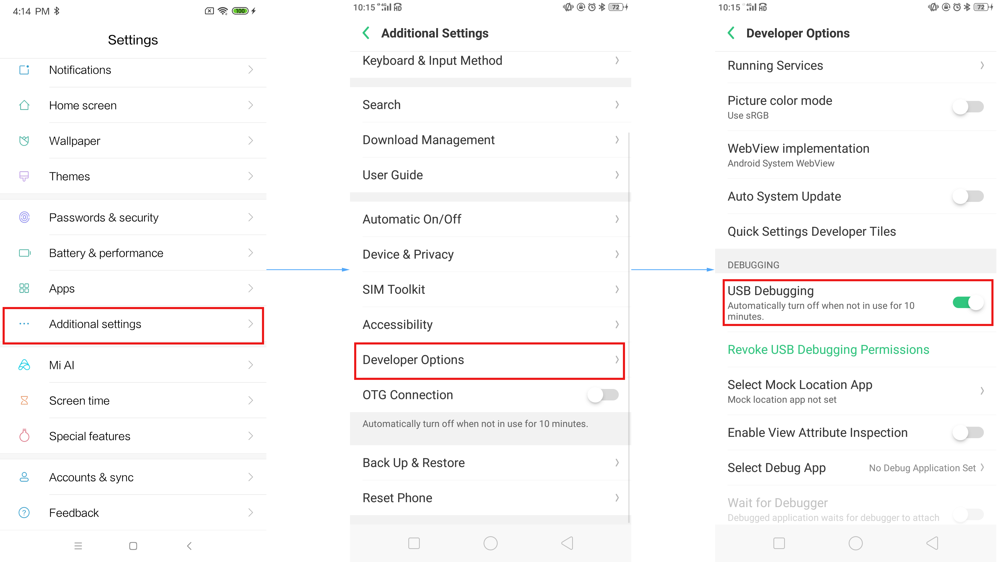
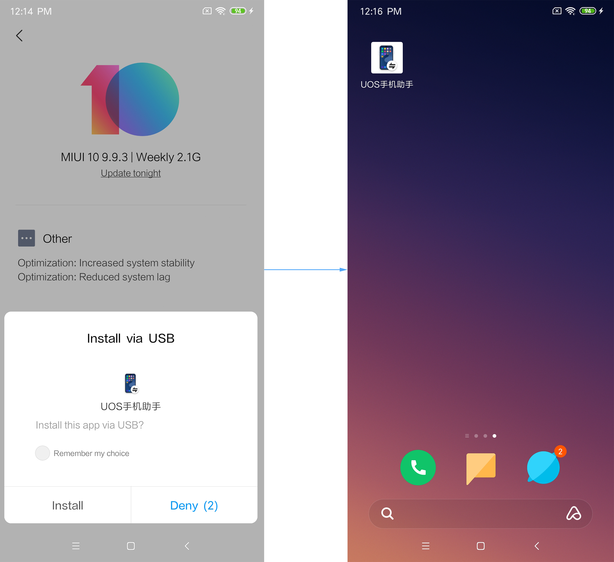
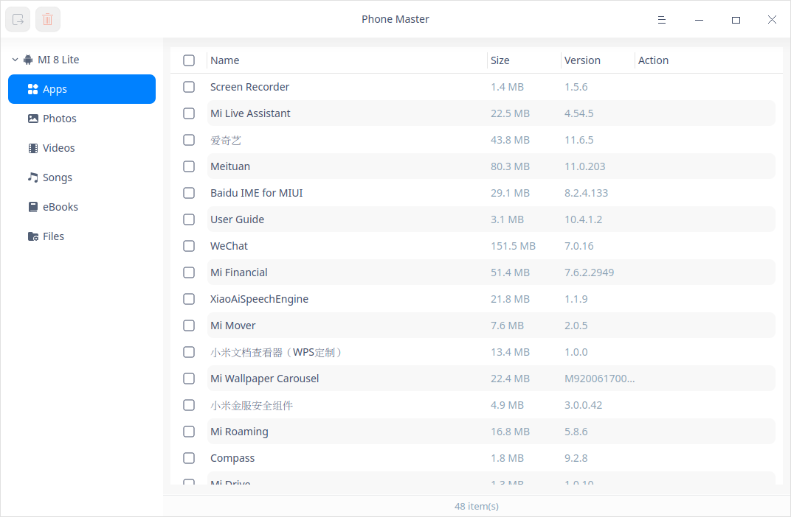
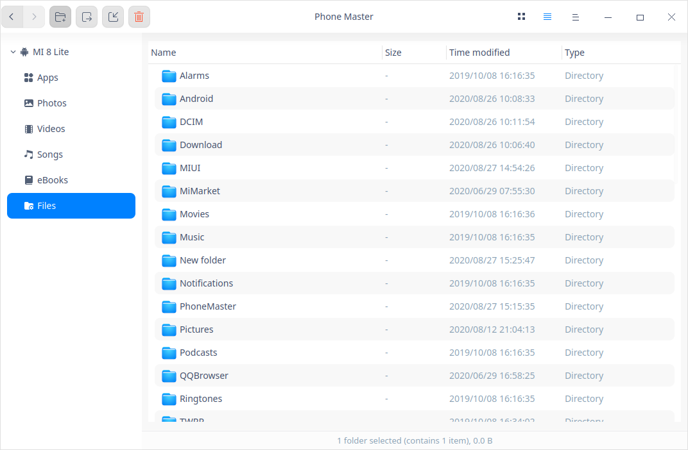

# Phone Master|../common/deepin-phone-master.svg|

## Overview

Phone Manager is a convenient tool for managing smart phones from your personal computer which supports a wide range of mobile phone models to best meet your needs. 

## Guide

You can run, exit or create a shortcut for Phone Master by the following ways.

### Run Phone Master

1.  Click  on dock to enter the Launcher interface.
2.  Locate  by scrolling the mouse wheel or searching Phone Master in the Launcher interface and click it to run.
3.  Right-click  and you can:

   - Click **Send to desktop** to create a desktop shortcut.
   
   - Click **Send to dock** to fix it on Dock.
   
   - Click **Add to startup** to add it to startup and it will auto run when the system boots.
   
     

## Main Interface

| No.  | Name                      | Description                                                  |
| ---- | ------------------------- | ------------------------------------------------------------ |
| 1    | Navigation Panel          | You can quickly access apps, photos and videos in your phone by clicking icons on this panel. |
| 2    | Device Information Column | It displays the model, connection and battery of your phone; Click  to locate your phone specifically. |
| 3    | Functions                 | You can quickly access apps, photos and videos in your phone by clicking icons in the Functions area. |
| 4    | Main Menu                 | You can set options, check app version number, view contents of Help and About, and switch themes on the Main Menu. |
| 5    | Data Capacity             | It displays the total battery volume, used volume and available volume of your phone. |

>Notes: Songs and eBook functions are not supported for iOS system.

## Device Connection

You can use Phone Master to connect with multiple phones concurrently. Follow below instructions to finish setting on your phone before using the Phone Master.

### Android

1. Unlock your phone, and go to **Settings** > **Additional Settings** to locate **Build Number**. Click it continuously to enable the **Developer Options** screen.  

   >Notes: 
   >
   >  - Above path is for your reference only as the path directory might differ by their names. Navigate your phone to get more detailed information. 
   >  - Once **Developer Options** screen is enabled on your phone, please keep it on so you can proceed to step 5 directly every time when you use Phone Master.

2. Connect your phone to your computer with a USB cable and run Phone Master on your computer.

3. Pull down the notification bar on your phone to locate the message displaying **Charging this device via USB**. Click this message to switch to **Use USB for File Transfer** mode.

4. Go to **Settings** > **Additional Settings** > **Developer Options** and locate **USB debugging** option on your phone. Click it to open and a prompt will show displaying **Allow USB debugging**. Click **OK** to grant authorization.

 
&nbsp;&nbsp;&nbsp;&nbsp;&nbsp;&nbsp;&nbsp;&nbsp;&nbsp;&nbsp;&nbsp;&nbsp;&nbsp;
6. A pop-up window will show on your phone requesting **Install via USB** for UOS Phone Master. Grant permit for installation and the UOS Phone Master will be installed on your phone. Once it's completed, you can operate Phone Master on your computer.

 
&nbsp;&nbsp;&nbsp;&nbsp;&nbsp;&nbsp;&nbsp;&nbsp;&nbsp;&nbsp;&nbsp;&nbsp;&nbsp;
   >Attention: To ensure normal function of Phone Master on your computer, you shall keep the USB  cable connected and make sure Phone Master runs on your computer. 

### iOS

1. Connect your phone to your computer with a USB cable and run Phone Master on your computer.
2. Unlock your phone and a pop-up window shows asking for your permission to **Trust This Computer**. Click **Trust** to connect your phone to your computer.

## Main Functions

Manage apps, photos, videos, songs, eBooks and files with your Phone Master. 

   >Notes: For iOS system, currently importing function is only supported on the File Management interface.  

### Manage Apps

Click  on the left navigation bar or  on the main interface to enter the Apps interface, where you can export or delete apps stored in your phone. 

- Export: select one or multiple apps, click  on the toolbar, and save the app(s) to the destination on your computer per your needs.
- Delete: select one or multiple apps, click  on the toolbar, and click **Confirm** in the pop-up box to delete the app(s). 

### Manage Photos

Click  on the left navigation bar or  on the main interface to enter the Photos interface, where you can import, export or delete photos stored in your phone. 

- Export: select one or multiple photos, click  on the toolbar, and save the photo(s) to the destination on your computer per your needs.
- Import: click  on the toolbar, select photo(s) from your computer and import to your phone. 
- Delete: select one or multiple photos, click  on the toolbar, and click **Confirm** in the pop-up box to delete the photo(s). 

### Manage Videos

Click  on the left navigation bar or  on the main interface to enter the Videos interface, where you can import, export or delete videos stored in your phone. 

- Export: select one or multiple videos, click  on the toolbar, and save the video(s) to the destination on your computer per your needs.
- Import: click  on the toolbar, select video(s) from your computer and import to your phone. 
- Delete: select one or multiple videos, click  on the toolbar, and click **Confirm** in the pop-up box to delete the video(s). 

### Manage Songs

Click  on the left navigation bar or  on the main interface to enter the Songs interface, where you can import, export or delete Songs stored in your phone. 

- Export: select one or multiple songs, click  on the toolbar, and save the song(s) to the destination on your computer per your needs.
- Import: click  on the toolbar, select song(s) from your computer and import to your phone. 
- Delete: select one or multiple songs, click  on the toolbar, and click **Confirm** in the pop-up box to delete the song(s). 

### Manage eBooks

Click  on the left navigation bar or  on the main interface to enter the eBooks interface, where you can import, export or delete Songs stored in your phone. 

- Export: select one or multiple ebooks, click  on the toolbar, and save the ebook(s) to the destination on your computer per your needs.
- Import: click  on the toolbar, select ebook(s) from your computer and import to your phone. 
- Delete: select one or multiple ebooks, click  on the toolbar, and click **Confirm** in the pop-up box to delete the ebook(s). 

### Manage Files

Click  on the left navigation bar or  on the main interface to enter the Files interface, where you can create folders, and import, export or delete files stored in your phone. 

- Create: click  on the toolbar to create a new folder.
- Export: select one or multiple files, click  on the toolbar, and save the file(s) to the destination on your computer per your needs.
- Import: click  on the toolbar, select file(s) from your computer and import to your phone. 
- Delete: select one or multiple files, click  on the toolbar, and click **Confirm** in the pop-up box or right click and select **Delete** to delete the file(s). 

## Main Menu

On the main menu, you can set options, switch window themes, view help manual and get more information about Phone Master.

### Settings

1. Click  on the Phone Master interface.

2. Click **Basic**.

    - In the option **Startup**, click **Auto startup (Recommended)** and Phone Master will automatically run when system starts up.
    - In the option **Close Main Window**, you can:
        - Select **Exit** to close the main window and exit Phone Master. 
        - Select **Minimize to system tray** to close the main window and hide the Phone Master to system tray.
        - Select **Ask me always** to prompt system notification and confirm whether to exit Phone Master when the main window is closed.
    - In the option **Desktop Shortcut**, click the **Show icon on desktop** icon and add a shortcut for Phone Master to your desktop.
3. Click **Restore Defaults** to restore the default settings.

### Theme

The window theme includes Light Theme, Dark Theme and System Theme (default).

1. On the Phone Master interface, click .
2. Click **Theme** to select a theme.

### Help

1.  On the Phone Master interface, click .
2.  Click **Help**.
3.  View the manual.

### About

1.  On the Phone Master interface, click . 
2.  Click **About**.
3.  View the version description.

### Exit

1. On the Phone Master interface, click .
2.  Click **Exit** to exit.

Update Date: 2020-08-28 Version: 5.1
