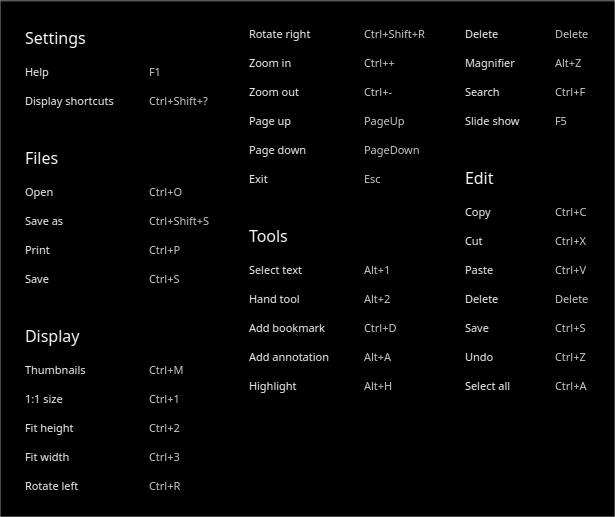
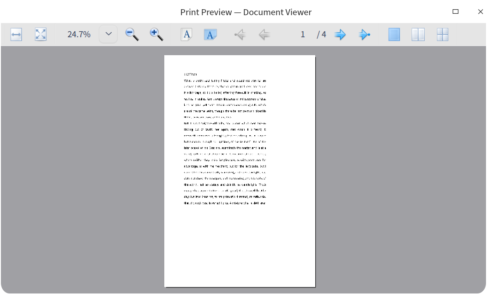
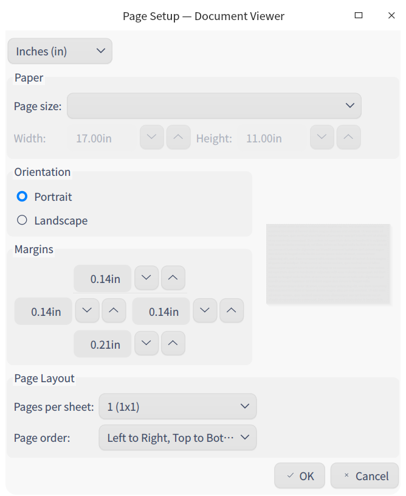
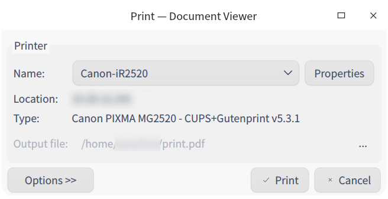

# Document Viewer|../common/deepin-reader.svg|

## Overview

Document Viewer is a powerful and easy-to-use software built-in the system for viewing PDF files quickly, supporting operations such as adding bookmarks, adding notes, and highlighting some text. 

## Guide

You can run, close or create a shortcut of Document Viewer as follows. 

### Run Document Viewer

1. Click    in the lower left corner of the dock to enter launcher interface.
2. Locate   by scrolling up and down the mouse wheel or search in launcher, and click it to run.
3. Right-click  to:

 - Select **Send to desktop** to create a shortcut on the desktop.
 - Select **Send to dock** to fix it onto the dock.
 - Select **Add to startup** to add it to startup. When the computer starts up, it runs automatically.

> Tips: You can set Document Viewer as the default application to view documents in Control Center, refer to  [Default Applications](dman:///dde#Default Application Settings) for details. 

### Exit Document Viewer

- On Document Viewer interface, click to exit. 
- Right-click  on Dock and select  **Close All** or **Force Quit** to exit.
- On Document Viewer interface, click   and select  **Exit**.

### View Shortcut Keys

On Document Viewer interface, press   +  +  to view all shortcut keys quickly, which helps you to use them skillfully and improves your working efficiency. 

## Basic functions

Document Viewer realizes basic document management such as opening files, saving files, printing files, as well as managing tabs, bookmarks and notes. 

### Open files

You can open a file by: 

- Dragging it directly into the interface or onto the icon. 

- Right-clicking it and selecting **Open with** > **Select default program**, and then selecting Document Viewer from the list.

   > Tips: Document will be opened by default program by directly double clicking on it. You can right-click it and select a default program by clicking on **Properties** > **Open with**. Or you can set a default program for this type of documents in [Default Applications](dman:///dde#Default Application Settings) from Control Center. 

- Clicking **Select File** and selecting a file on Document Viewer interface.

- On Document Viewer interface, pressing  + and selecting the file you want to open. 

> Notes: Document Viewer supports PDF and DJVU formats.

### Save documents

To save the document that has been edited and modified, you can 

- Press + .
- Click  > **Save**.
> Tips: Besides, you can press +  +  or click  > **Save as**.

### Print documents

To print you have to connect and configure a printer. 

1. Click  > **Print** or press + to preview.
2. In this previewing interface, you can preview and set the printing page. 
3. In this previewing interface, click the printer icon on the right, and select a printer from the popped out window and set the parameters you want. 
4. Click **Print**  then the document will be sent to the printer for printing. 

### Manage tabs

New tab

1. Click  or  > **New tab** to add a tab. 

To switch/adjust tabs, you can:

- Drag within the window to adjust the sequence of tabs. 
- Click the  or button to move left and right. 
- The left button for the first tab is unavailable, and so is the right button for the last one. 
- Scroll the mouse wheel to switch tabs automatically.  
- When there is only one window currently, double-click or right-click the file and select Document Viewer to open the file in a new tab in the window. 

Operations among windows

- Drag any tab to move it out of the window and create a new window. 
- Drag a tab from one window to another. 
- When there are several windows, double-click or right-click the file and select Document Viewer to open the file in the first window.

Dragging rule for multiple windows and tabs:

- When you drag several files to Document Viewer at the same time, they are opened as several tabs in one window. 
- You can open several windows at a time, and tabs can be dragged from one window to another. 
- No matter how many windows there are, one file can be opened only once. 
- If no operation is done to a file, the save button is unavailable. 

### Manage bookmarks

On Document Viewer interface, open a file. 

- Add bookmark:
   - Right-click any page in Document Viewer, select **Add bookmark** to mark this page. 
   - Move the cursor to the top right corner of the page until  appears, click this icon to add a bookmark for this page, and this icon will be filled in blue.
- Delete bookmark:
   - Right-click the bookmark and select **Remove bookmark**. 
   - Click the colored bookmark icon to cancel/delete the bookmark.

> Notes: The bookmark icon appears only when the cursor moves to the bookmark area, and it disappears when the cursor moves out of the area. It will be colored after you click it when it appears and always displayed no matter where the cursor is.

### Manage notes

On Document Viewer interface, open a file. 

- Add note

   1. Select text using the selecting tool and right-click, select **Add annotation** and an inputing window pops up. When you finish the operation, the text selected is highlighted.
   
   2. Move the cursor to the place where you want to add a note, right-click and select **Add annotation**. When you finish the operation, a note icon appears. 
   
   3.  Click the note icon on the bottom of the left panel, and click **Add annotation**, and click the place where you want to add a note on the current page to add a note.
   
   4. Click "**x**" of the window or in any blank area outside the window, the note will be saved automatically.  The selected text will be highlighted after the note is added successfully. 
   
  > Tips: You can also right-click at any blank area or the place you want to add a note and select **Add annotation**. After a note is successfully added, a highlighted note icon appears.

  > Notes: 
  > * Click "**x**" of the window without inputing any content, then the note is not added successfully or is deleted automatically. 
  > * Click "**x**" of the window after inputing some content, the content will be saved automatically and displayed as a small icon. 

- Copy note
   -  Right-click the highlighted text to which a note is successfully added and select **Copy** to copy the content.
   -  Right-click the note icon, select **Copy** to copy the content.
   -  Click and the catalog icon  on the left and select a note, right-click and select **Copy**. 
   
- Show note  
   1.  Hove the cursor over the note icon to show the content. 
   2.  Click the note icon to pop up a window, you can view and re-edit. 

- Delete note 
   - Right-click the highlighted text to which you have added a note, and select **Remove highlight**. 
   - Right-click the note icon and select **Remove annotation**. 
   - Click the catalog icon  on the left column, and select a note, right-click to select **Remove annotation**, this note is deleted and so is its content. 

> Notes: You can not add annotations to DJVU files.

## Common operations

Document Viewer integrates many features to make document management simpler and more efficient. 

### Search
This function is only applicable for the current tab.
1. On Document Viewer interface, open a file. 
2. Right-click and select **Search** or press **Ctrl**+**F** to open a searching window. 
   
3. In the searching box, you can :
   - Click  to input keywords. 
   - Click  to speak, and your speech will be turned into words and displayed in the searching box. 

4. Press  **Enter** to search. 
   - All matching information will be displayed in a list and are highlighted in the document.
   - If searching fails, "No search results" will be displayed. 
   
5.  When matching results are found, click or  to view results one by one. 

6. Click one result, you can skip to the page it's located, and it's highlighted. 
   
> Attention: The above mentioned operations are only applicable when PDF file supports searching. Searching fails in case the text is coded in pictures in some PDF files. 

7. Clear up words in the searching box to clear up all results. 

> Notes: You can not search in DJVU files.

### Move in files

To move in each page of the file you can: 

- Scroll the mouse wheel up and down. 
- Drag the scroll bar up and down in the window. 
- Press the up key and down key on the keyboard. 
- Use the hand tool  and drag by the mouse, just like you are holding the page by your hand. 

### Flip pages quickly 

To move from page to page, you can: 

- Right-click and select **Previous page** or **Next page**. 
- Press   or  on the keyboard. 
- To go to a specialized page, you can: 
  - Input the page number and press enter key. 
  - To go the beginning or the end of the file, you can right-click and select **First page** or **Last page**. 

### Switch catalog 

Using thumbnails you can switch file thumbnails catalog, file catalog, bookmark catalog and annotation catalog. Drag the frame of the catalog, thumbnails vary as the width that can be dragged changes. 

### Slide show

1. On Document Viewer interface, click . 
2. Select **Slide show** to display the file as slides. 
3. Clickor to switch pages, or click to pause. 
4. Press **Esc** key to quit. 

### Zoom in and out

To zoom in or out a page, you can:

- Press +  or + 
- Press and scroll the mouse wheel up and down at the same time. 
- On Document Viewer interface, click   or  . 
> Notes: Manual input is supported here. You can choose display percentage from the drop-down box of the menu bar: 10%, 25%, 50%, 75%, 100%, 125%, 150%, 175%, 200%, 300%, 400%, and 500%, according to which the file is zoomed in and out.

### Highlight

1. On Document Viewer interface, click   and select . 

2. Select the text, right-click and select **Highlight**, there are several colors for you to choose. 
   
> Notes: If no text is highlighted, **Remove highlight** button is unavailable. 

3. Select a color, the text selected will be highlighted in that color. 

4. Select the highlighted text, click **Remove highlight** to restore it to the status it was. 

> Notes: 
>
> - Document Viewer memorizes the color choice of the user, which will be the default color used when the user highlights any text the next time.  You can change the color as you wish. 
> - DJVU files don't support highlighting.

### Adjust view

Click , and in its submenu you can:

- Click **Two-page View** to view two pages at a time. 
- Click **Fit Height**, the page's displayed in the window fully in vertical direction. 
- Click **Fit Width**, the page's displayed in the window fully in horizontal direction.

### Adapt window

To make the window adapted to all sizes, you can:

- Drag the window, and the file will be displayed as the window size varies automatically.
- The size of the left catalog column is adapted to the window size as you change it. 
- In case of high-resolution screen, the width of the left column of thumbnails is adapted to the resolution and the width of the screen. 

### Rotate

1. On Document Viewer interface, open a document. 
2. Click and select **Rotate Left** or **Rotate Right** from the submenu, the page will rotate to the left or right by 90°. 

### Magnifier 

1. On Document Viewer interface, open a document. 
2. Click >  **Magnifier**.
3. Move the cursor to the area you want to view to magnify. 
4. Press **Esc** or right-click to cancel magnifying. 

## Main Menu

In the main menu, you can [Save](#Save), [Print](#Print), view document info, switch themes, view help to know more about Document Viewer. 

### Document info

1. Click  on the main interface.
2. Click **Document info** to view relevant parameters about the document. 

### Display in file manager

1. Click  on the main interface.
2. Click **Display in file manager** to open and show the file's storing location in File Manager. 

### Theme

There are options including light theme, dark theme and system theme. System theme is set by default.

   1. Click  on the main interface.
   2. Click  **Theme** to select one.

### Help

click Help to get the manual, which will help you further know and use Document Viewer.

   1. Click  on the main interface.
   2. Click **Help** to view the manual.

### About

1. Click  on the main interface.
2. Click **About** to view version information and introduction about Document Viewer. 

### Exit

1. On Document Viewer interface, click . 
2. Click  **Exit**.

