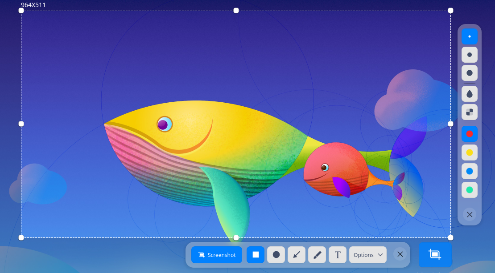
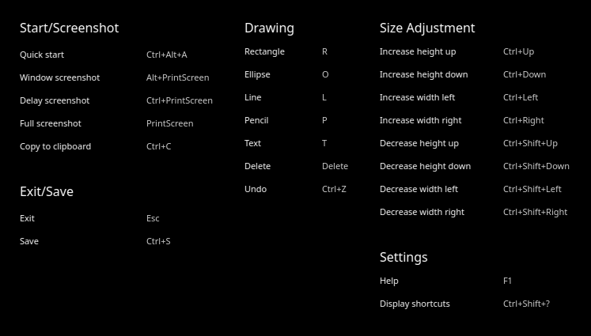
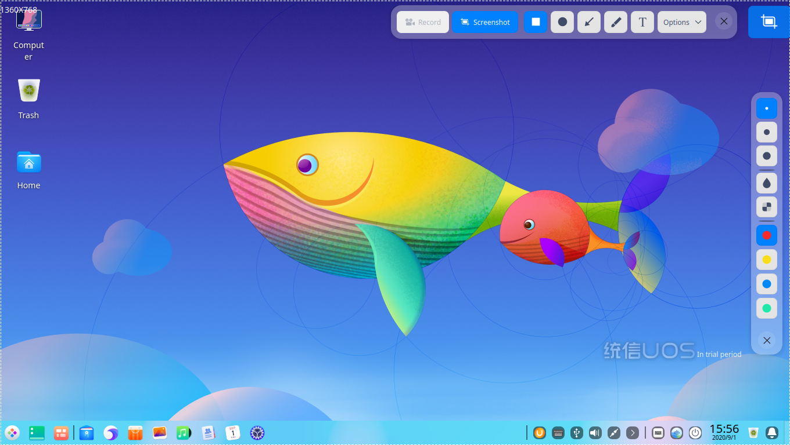
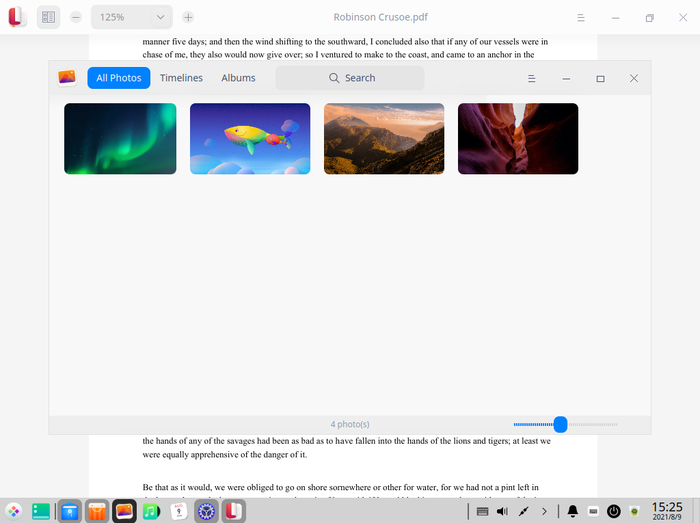
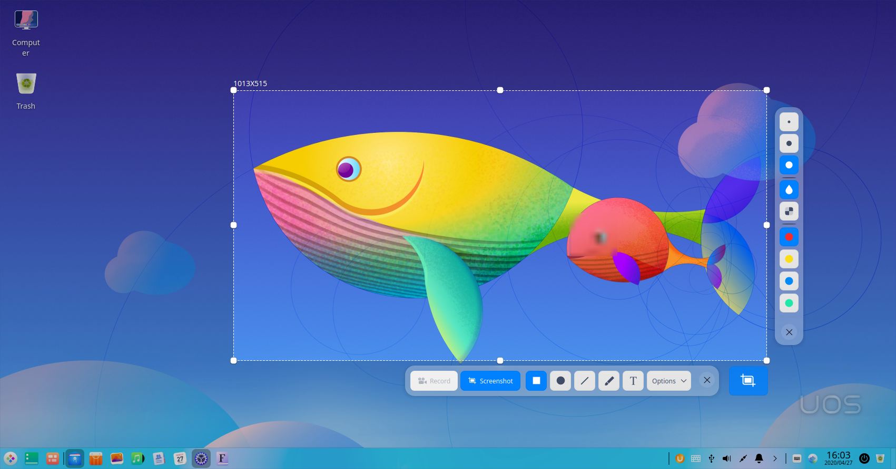
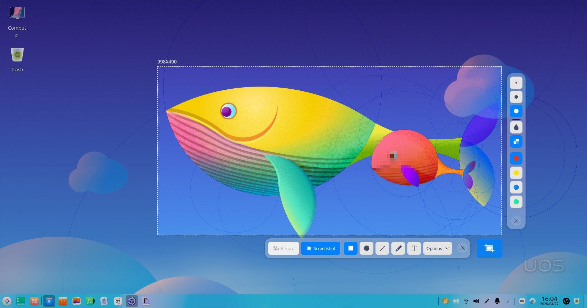
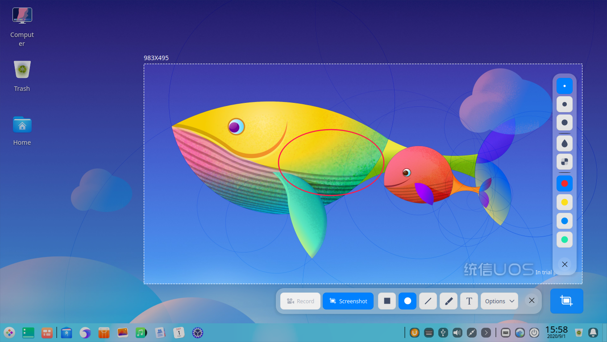
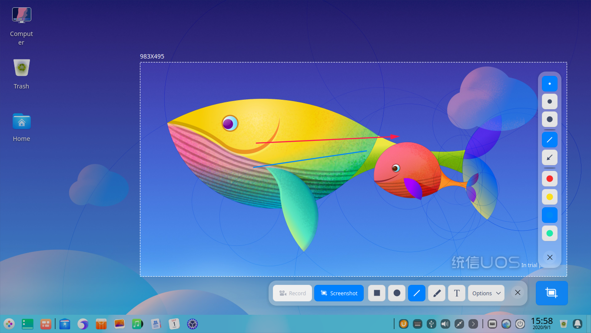
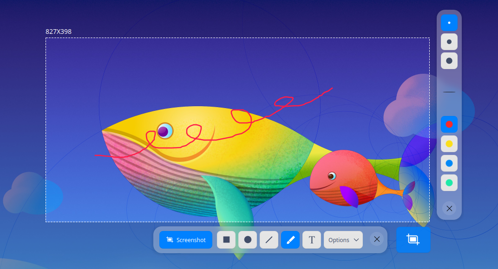
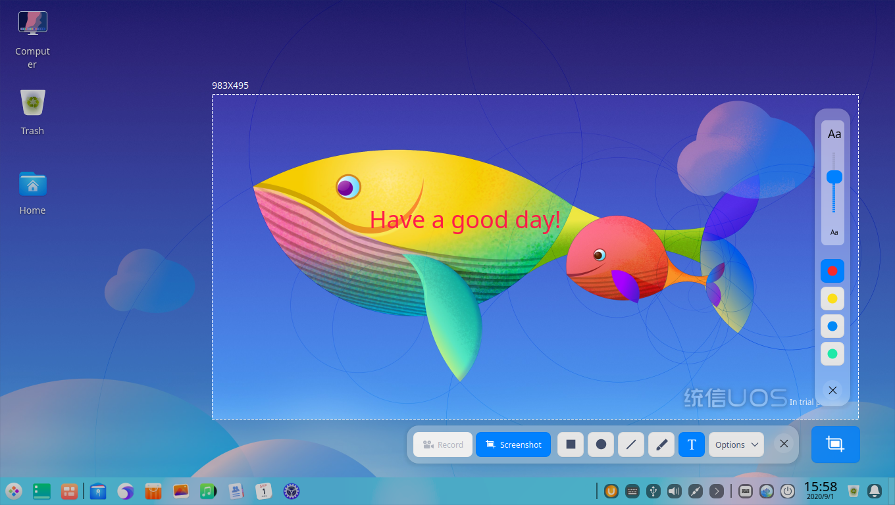

# Screen Capture|../common/deepin-screen-capture.svg|

## Overview

Screen Capture is a tool which integrates the screen capture and recorder functions into one. You are free to select windows or areas automatically or manually during screen capturing or recording. 

## Guide

You can run, close, and create shortcuts for Screen Capture in the following operations.

### Run Screen Capture

1. Click  in the dock to enter the launcher interface.
2. Locate  by scrolling the mouse wheel or searching "screen capture" in the Launcher interface and click it to run. 
3. Right-click  and you can:

    - Click **Send to desktop** to create a desktop shortcut.
    - Click **Send to dock** to fix it in the Dock.
    - Click **Add to startup** to add it to startup and it will automatically run when the system starts up.

>  Notes: If Screen Capture has been fixed in the dock by default, you can click  in the dock to run it.

### Close Screen Capture

- Screen Capture will exit automatically after screen capturing or screen recording completes.
- On the Screen Capture interface, click  to exit Screen Capture.
- On the Screen Capture interface, press **Ctrl + S** or **Esc** on the keyboard to save the screen capture or exit.
- On the Screen Capture interface, right-click and select **Save** or **Exit**.

## Operations

### Take Sceenshots

You can quickly capture screenshots in the following ways:

- Press the  key on the keyboard to capture the entire monitor screen.
- Use the screen capture features of various applications such as Tencent QQ and Chrome browser.
- Use specialized screen capture software to take screenshots, such as the Screen Capture software that comes with the operating system.

#### Shortcuts

In the Screenshot mode on the Screen Capture interface, press **Ctrl + Shift + ?** to view shortcuts. Proficiency in shortcuts will greatly improve your efficiency.

#### Select Screenshot Area

There are three kinds of common screenshot areas, namely the full screen, program window, and customized area. When a screenshot is captured, the selected area will be bordered with dashed white line and looks brighter than the other area.

>  Notes: When the computer is connected to multiple monitors, you can also use Screen Capture to capture areas on different monitors.

##### Select Full Screen

Full screen selection is used to identify the entire screen of the current monitor.

&nbsp;&nbsp;&nbsp;&nbsp;&nbsp;&nbsp;&nbsp;&nbsp;&nbsp;&nbsp;&nbsp;&nbsp;&nbsp;

You can select the full screen in the following ways:

1. Press **Ctrl + Alt + A** on the keyboard to enter the screen capture mode.
2. Move the cursor to the desktop and the full screen will be selected automatically. The screenshot dimension will be displayed in the upper left corner. 
3. Click the desktop and a toolbar will pop up.
4. Click  on the toolbar or right-click to select **Exit** to exit Screen Capture.

You can also take a full screen screenshot directly in the following ways:

- If Screen Capture has been fixed in the dock, right-click  in the dock to select **Full screenshot**. 
- Press  on the keyboard to take a full screen screenshot.

##### Select Program Window

Program window selection is used to identify the current application window automatically.

&nbsp;&nbsp;&nbsp;&nbsp;&nbsp;&nbsp;&nbsp;&nbsp;&nbsp;&nbsp;&nbsp;&nbsp;&nbsp;

1. Press **Ctrl + Alt + A** on the keyboard to enter the screen capture mode.
2. Move the cursor to the application window and the window will be selected automatically. The screenshot dimension will be displayed above the upper left corner. 
3. Click the window and a toolbar will pop up.
4. Click  on the toolbar, or right-click and select **Exit** to exit Screen Capture.

##### Select Customized Area

Customized area selection is used to select the screenshot area freely by dragging the mouse.

&nbsp;&nbsp;&nbsp;&nbsp;&nbsp;&nbsp;&nbsp;&nbsp;&nbsp;&nbsp;&nbsp;&nbsp;&nbsp;

1. Press **Ctrl + Alt + A** on the keyboard to enter the screen capture mode.
2. Hold down and drag the left mouse button to select the screen capture area. The screenshot dimension will be displayed above the upper left corner. 
3. Release the left mouse button to complete area selection, and a toolbar will pop up.
4. Click  on the toolbar, or right-click and select **Exit** to exit the screen capture.

#### Adjust the Screenshot Area

You can fine-tune the screenshot area. For example, you can enlarge or reduce the screenshot area, and move the screenshot position, among other functions. 

##### Enlarge/Reduce the Screenshot Area

Place the cursor over the white boarder of the screenshot area and the cursor will be changed to . You can:

- Hold down the left mouse button and drag the mouse to enlarge or reduce the screenshot area. 
- Press **Ctrl** +  ,  ,  or  and drag the mouse to enlarge or reduce the screenshot area vertically or horizontally.

##### Move the Screenshot Position

Place the cursor over the screenshot area and it will be changed to . You can:

- Hold down the left mouse button and drag the mouse to move the position of the screenshot area.
- Press  ,  ,  or  on the keyboard to move the screenshot area vertically or horizontally.

#### Edit Screenshots

Screen Capture can help you process pictures with a variety of editing features for your daily needs, including graphics markup, text annotation, etc. You can also mosaic pictures to protect your privacy. 

You can edit screenshots in the following ways:

- Click the tool icon on the toolbar. 
- Quickly switch between various editing tools through shortcuts.
- Right-click and choose the editing tools after selecting the screenshot area.

#### Draw

You can draw some simple graphics in the screenshots, such as rectangle, ellipse, and other shapes.

##### Toolbar

While capturing screenshots, you can click the icons on the toolbar to complete various operations. Run Screen Capture, and the toolbar will automatically appear beside the screenshot area after selecting the screenshot area. 

>  Attention: Your settings in the toolbar and attribute column, such as the line weight and font size, are remembered and applied by default and will be resumed the next time when you launch the Screen Capture. You are also able to reset it. 

&nbsp;&nbsp;&nbsp;&nbsp;&nbsp;&nbsp;&nbsp;&nbsp;&nbsp;&nbsp;&nbsp;&nbsp;&nbsp;
<table class="block1">
    <caption>Icon Description</caption>
    <tbody>
        <tr>
            <td></td>
            <td>Rectangle</td>
            <td class="blank"></td>
            <td></td>
            <td>Elipse</td>
        <td class="blank"></td>
            <td></td>
            <td>Line</td>
        </tr>
          <tr>
            <td></td>
            <td>Pencil</td>
            <td class="blank"></td>
            <td></td>
            <td>Text</td>
            <td class="blank"></td>
            <td></td>
            <td>Exit</td>
        </tr>
    </tbody>
</table>

&nbsp;&nbsp;&nbsp;&nbsp;&nbsp;&nbsp;&nbsp;&nbsp;&nbsp;&nbsp;&nbsp;&nbsp;&nbsp;
##### Rectangle

&nbsp;&nbsp;&nbsp;&nbsp;&nbsp;&nbsp;&nbsp;&nbsp;&nbsp;&nbsp;&nbsp;&nbsp;&nbsp;
1. Click  on the toolbar which appears beside the screenshot area.
2. In the toolbar extension panel, select the weight of outline for the rectangle shape. 
3. Place the cursor on the screenshot area, and the cursor will be changed to .
4. Hold down the left mouse button, and drag the mouse to complete drawing.
5. Click  or  in the toolbar extension panel to mosaic the private information in the screenshot (if any).

&nbsp;&nbsp;&nbsp;&nbsp;&nbsp;&nbsp;&nbsp;&nbsp;&nbsp;&nbsp;&nbsp;&nbsp;&nbsp;
##### Ellipse

&nbsp;&nbsp;&nbsp;&nbsp;&nbsp;&nbsp;&nbsp;&nbsp;&nbsp;&nbsp;&nbsp;&nbsp;&nbsp;
1. Click  on the toolbar which appears beside the screenshot area.
2. In the toolbar extension panel, select the weight of outline for the ellipse shape. 
3. Place the cursor on the screenshot area, and the cursor will be changed to .
4. Hold down the left mouse button, and drag the mouse to complete drawing.
5. Click  or in the toolbar extension panel to mosaic the private information in the screenshot (if any).

##### Straight Line and Arrow

&nbsp;&nbsp;&nbsp;&nbsp;&nbsp;&nbsp;&nbsp;&nbsp;&nbsp;&nbsp;&nbsp;&nbsp;&nbsp;
1. Click  on the toolbar which appears beside the screenshot area.
2. In the toolbar extension panel, select the weight of line. 
3. Click  or  to toggle between straight line and arrow.
4. Place the cursor on the screenshot area, and the cursor will be changed to  or .
5. Hold down the left mouse button, and drag the mouse to complete drawing.

##### Pencil

&nbsp;&nbsp;&nbsp;&nbsp;&nbsp;&nbsp;&nbsp;&nbsp;&nbsp;&nbsp;&nbsp;&nbsp;&nbsp;
1. Click  on the toolbar which appears beside the screenshot area.
2. In the toolbar extension panel, select the weight of pencil. 
3. Place the cursor on the screenshot area, and the cursor will be changed to .
4. Hold down the left mouse button, and drag the mouse to complete drawing.

If you need to draw a square, circle or other shapes, you can:

- Hold down the **Shift** key on the keyboard, and select  to draw a square.
- Hold down the **Shift** key on the keyboard, and select  to draw a circle.
- Hold down the **Shift** key on the keyboard, and select  or  to draw a straight line or a straight line with arrow horizontally or vertically.

#### Modify Graphics

You can modify and move the drawn graphics in the screenshot.

&nbsp;&nbsp;&nbsp;&nbsp;&nbsp;&nbsp;&nbsp;&nbsp;&nbsp;&nbsp;&nbsp;&nbsp;&nbsp;
##### Move Graphics

1. Place the cursor over the graphics outline, and the mouse will be changed to .
2. Hold down the left mouse button, and drag the graphics to any place in the screenshot area.
3. Press  ,  ,  or  on the keyboard to move the graphics vertically or horizontally.

##### Edit Graphics

1. Place the cursor over the outline of graphics.
2. Left-click to enter the editing mode, and you can:
   - Press the **Delete** key on the keyboard to delete the graphics.
   - Press **Ctrl + Z** on the keyboard to return to the previous step.
   - Place the cursor over the edit box, and the mouse will be changed to. Enlarge or reduce the graphic area by dragging the cursor.
   - Press **Ctrl** +  ,  ,  or  to extend the graphics area vertically or horizontally.
   - Place the cursor over  in the edit box, and the cursor will be changed to . Rotate the graphics by dragging the cursor.
3. Left-click outside the edit box to exit the editing mode.

#### Add Text Annotation

Add text annotations to the screenshot in order to help others better understand.

&nbsp;&nbsp;&nbsp;&nbsp;&nbsp;&nbsp;&nbsp;&nbsp;&nbsp;&nbsp;&nbsp;&nbsp;&nbsp;
1. Click  on the toolbar which appears beside the screenshot area.
2. In the toolbar extension panel, select the font size via the scroll bar. 
3. Place the cursor over the screenshot, and the mouse will be changed to .
4. Click where you want to add an annotation, and a text box will appear.
5. Enter texts in the text box.

#### Modify Text Annotations

You can modify and move the text annotations after they're entered.

##### Move Text Annotations

1. Place the cursor over the text, and the cursor will be changed to .
2. Hold down the left mouse button, and drag to move the text anywhere in the screenshot area.

##### Edit Text Annotations

1. Place the cursor over the text, and the cursor will be changed to .
2. Left-click to enter the text editing mode, and you can:
   - Press **Delete** on the keyboard to delete text annotations.
   - Press **Ctrl + Z** on the keyboard to return to the previous step.
   - Modify the text in the text box.
3. Click outside the text box to exit editing mode.

#### Set Colors

Four colors are provided for you in Screen Capture to mark the graphics.

1. Select a tool on the toolbar which appears beside the screenshot area.
2. Click,,orin the toolbar extension panel, and select a color.

#### Save Screenshots

Save the screenshot for future use.

When the screenshot is saved successfully, you can see a prompt message in the upper area of the desktop. Click **View** to open the folder where the screenshot is located.

You can save the screenshot in the following ways after launching Screen Capture, and selecting the screenshot area:

- Double-click to save the screen capture.
- Click  on the toolbar.
- Press **Ctrl + S** on the keyboard to save the screenshot.
- Right-click the screenshot, and select **Save** to save the screenshot.

>  Notes: The screenshot is saved to the desktop by default.

Click **Options** on the toolbar of the Screen Capture interface, and expand the drop-down list:

&nbsp;&nbsp;&nbsp;&nbsp;&nbsp;&nbsp;&nbsp;&nbsp;&nbsp;&nbsp;&nbsp;&nbsp;&nbsp;
- Select **Clipboard** to save the screenshot to the clipboard.
- Click **Desktop** (default), and the screenshot will be saved to the desktop.
- Click **Pictures**, and the screenshot will be saved to the pictures folder.
- Click **Folder**. Select the destination folder of the screenshot, and the screenshot will be saved to the folder directory selected by you. 
- Select **Show cursor**, and the cursor will be displayed in the screenshot area. Its position and pattern will also be saved in the picture.
- Select **PNG/JPG/BMP** to set the screenshot format.

### Record a Screen

#### Introduce Toolbar

&nbsp;&nbsp;&nbsp;&nbsp;&nbsp;&nbsp;&nbsp;&nbsp;&nbsp;&nbsp;&nbsp;&nbsp;&nbsp;

<table class="block1">
    <caption>Icon Description</caption>
    <tbody>
        <tr>
            <td></td>
            <td>Microphone</td>
            <td class="blank"></td>
            <td></td>
            <td>Sound On</td>
        <td class="blank"></td>
            <td></td>
            <td>Show Keystroke</td>
        </tr>
          <tr>
            <td></td>
            <td>Webcam On</td>
            <td class="blank"></td>
            <td></td>
            <td>Show Click</td>
            <td class="blank"></td>
            <td></td>
            <td>Exit</td>
        </tr>
    </tbody>
</table>
&nbsp;&nbsp;&nbsp;&nbsp;&nbsp;&nbsp;&nbsp;&nbsp;&nbsp;&nbsp;&nbsp;&nbsp;&nbsp;

#### Select Recording Area

After running screen recorder, you can select the recording area, namely the full screen, automatic recognition window and custom window.

- Full screen and automatic recognition window: when you select the recording area, screen recorder will automatically recognize the window on the desktop along with the movement of your mouse, and there will be a rectangle selection box in the identified window. Click to select the current window recording. As the desktop is also a type of window, therefore, when the mouse is located on the desktop, full screen recording will be recognized.
- Custom window: when you select the recording area, you can use the mouse to select any area freely. The selected area will be bordered with dashed white line. You can later adjust the position and size of the selected area by dragging the mouse inside the area or dragging the dashed white line. Then, click to select the current window for recording.

#### Set Sound, Keystroke, Camera and Click for Recording 

On the toolbar of Screen Capture, you can set sound, keystroke, camera, etc. to get ready for video recording.

- Record sound: include microphone and built-in audio (enabled by default).
- Keystroke: hover the cursor over , and **Show Keystroke** will display. Click it, and the operation keystroke will be displayed during screen recording. Up to five recent operation keystrokes can be displayed at the same time. Click the icon again to enable **Hide Keystroke** and cancel keystroke display.
- Camera: hover the cursor over , and **Webcam On** will display. Click it, and the camera window will be displayed on the recording screen. Drag the camera window outline to adjust the window size and position. Click the icon again to disable the camera. No image can be displayed except for a black screen.
- Click: hover the cursor over , and **Show Click** will display. Click it to display mouse and touchscreen during screen recording. Click it again to cancel display.
  
> Attention: First, check whether the device connected supports sound recording and camera functions.
 > - When the device connected supports sound recording and camera functions, you are able to process relevant operations.
 > - When the device connected does not support sound recording and camera functions, the icons are grayed out, and you are not able to process relevant operations.

#### Set Recording Format and FPS (Frame Per Second)

Click **Options** to expand the drop-down list on the **Screen Capture** toolbar. Select the options, and you are able to record videos in GIG or MP4 format. You can also set the FPS.

>  Notes: Start video recording after making changes to the settings if the default setting doesn't meet your needs.

#### Record Videos

You can customize the recording area, and select the recording format before recording.

1. Click  **Record** to select the recording area after launching screen recorder.
2. Select the recording format.
3. Click **Start Record**, and the flickering **Record** icon appears in the system tray.
4. Click the icon in the dock or in the system tray to complete recording.

The recorded video will be saved to the desktop automatically.

>  Notes: During video recording, if multiple monitors are connected, whether the multi-monitor display is set in copy mode or extended mode, only the current operation screen is recorded.

### View Help

Press  on the keyboard to view the help manual after launching Screen Capture.