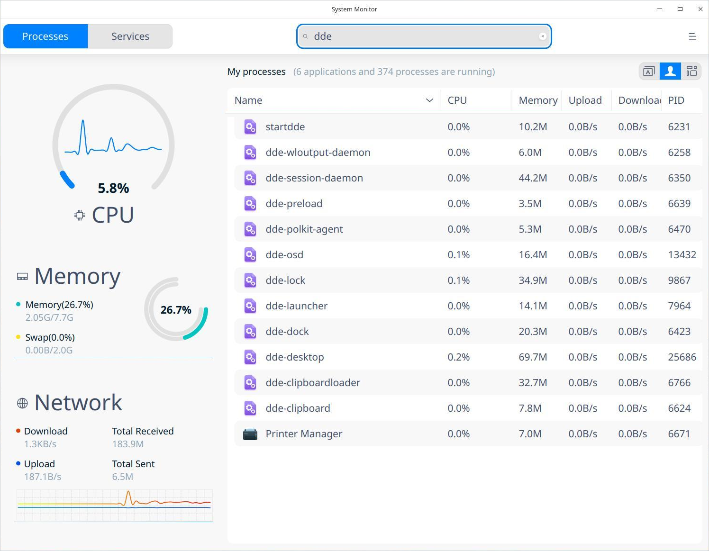
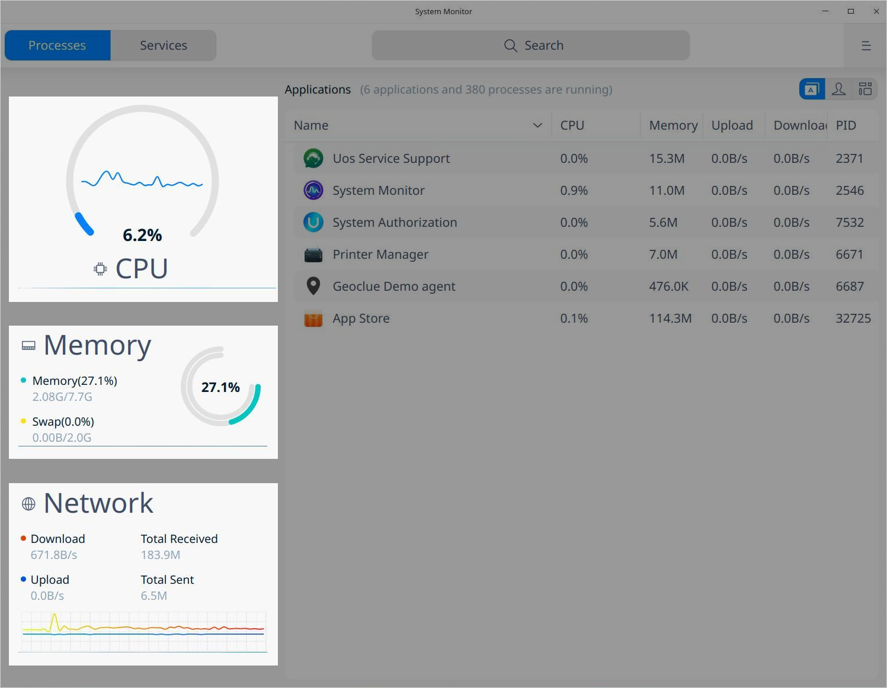
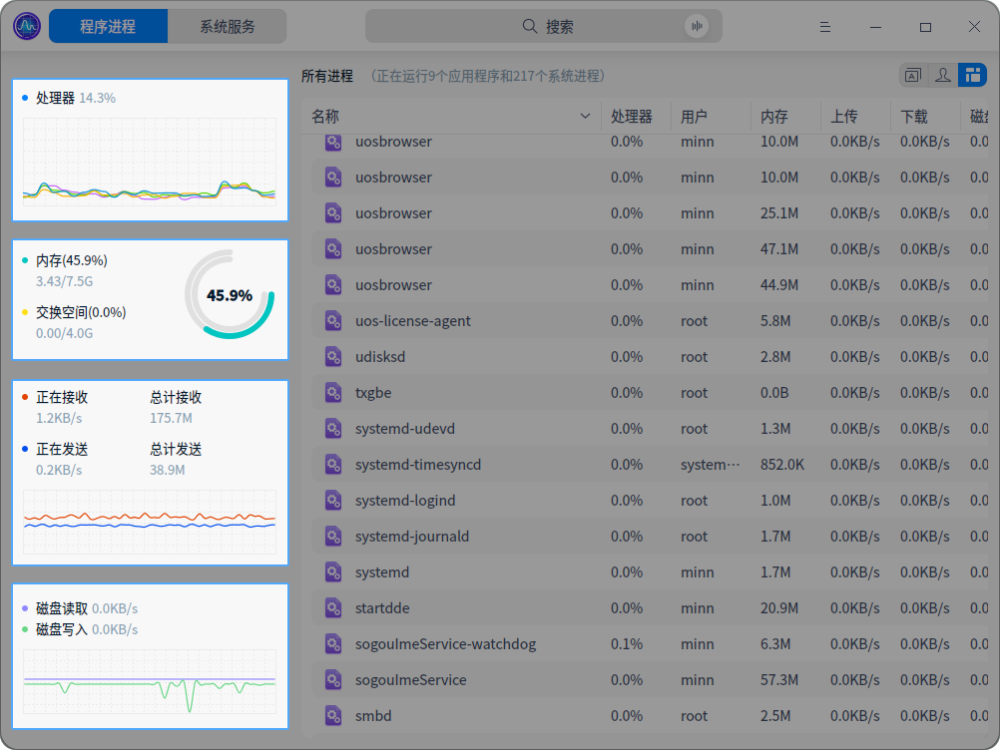
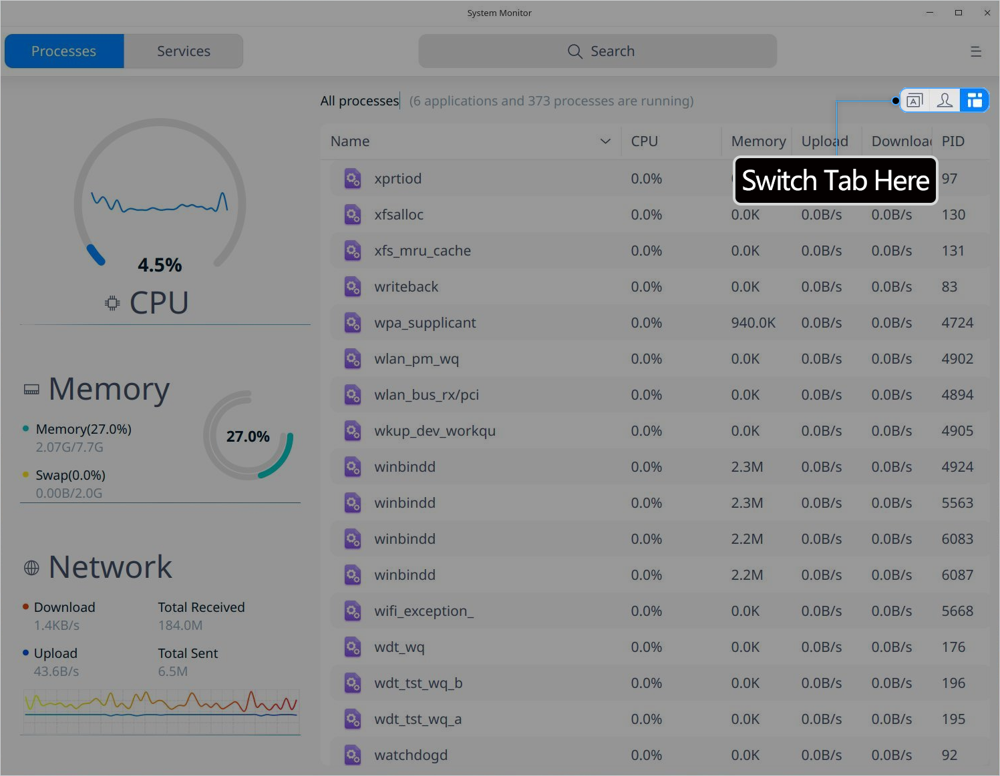
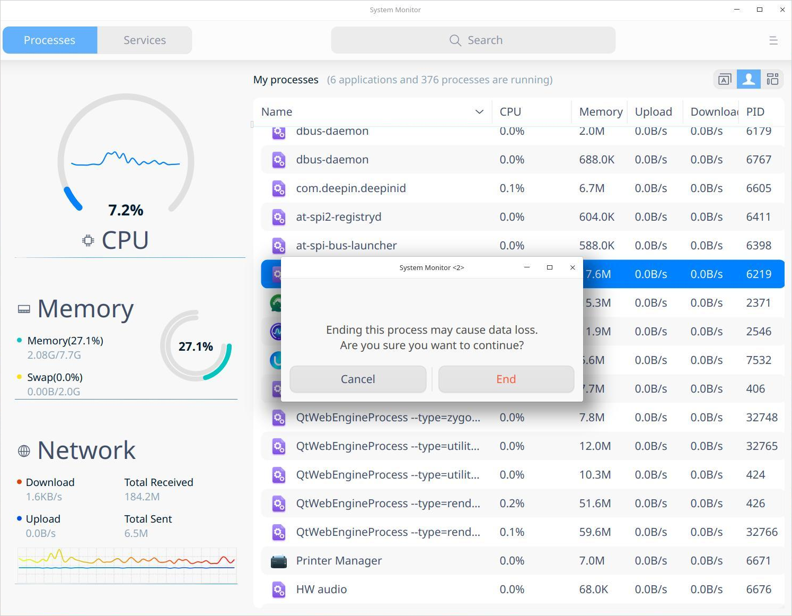
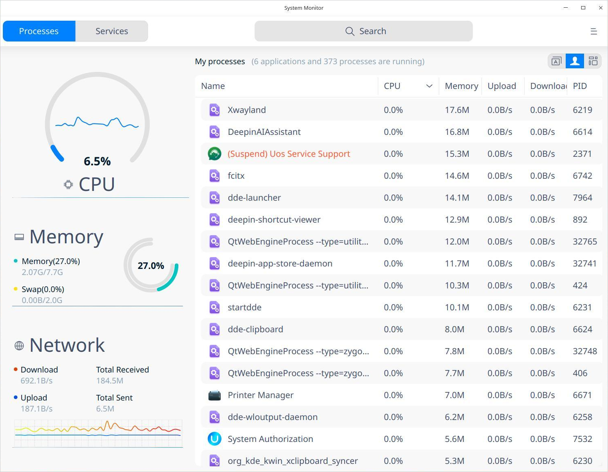
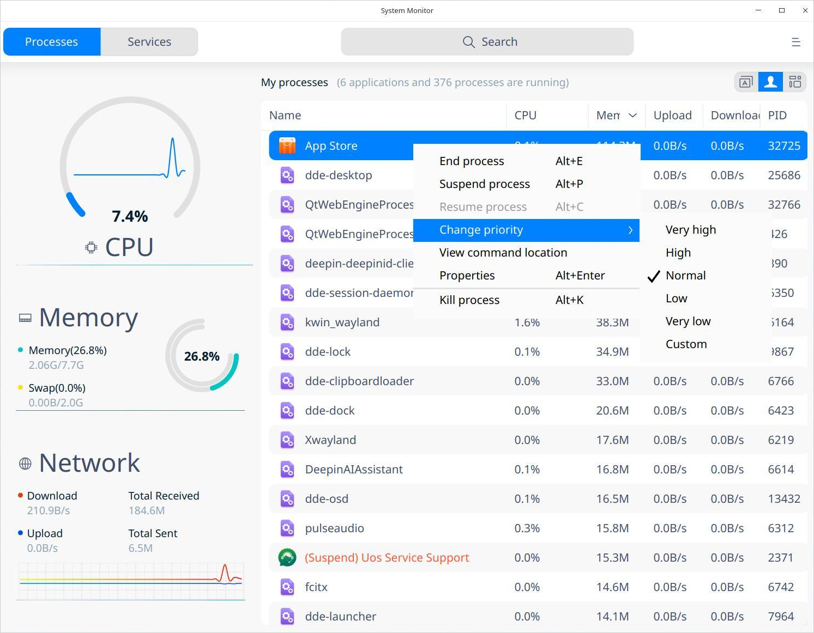
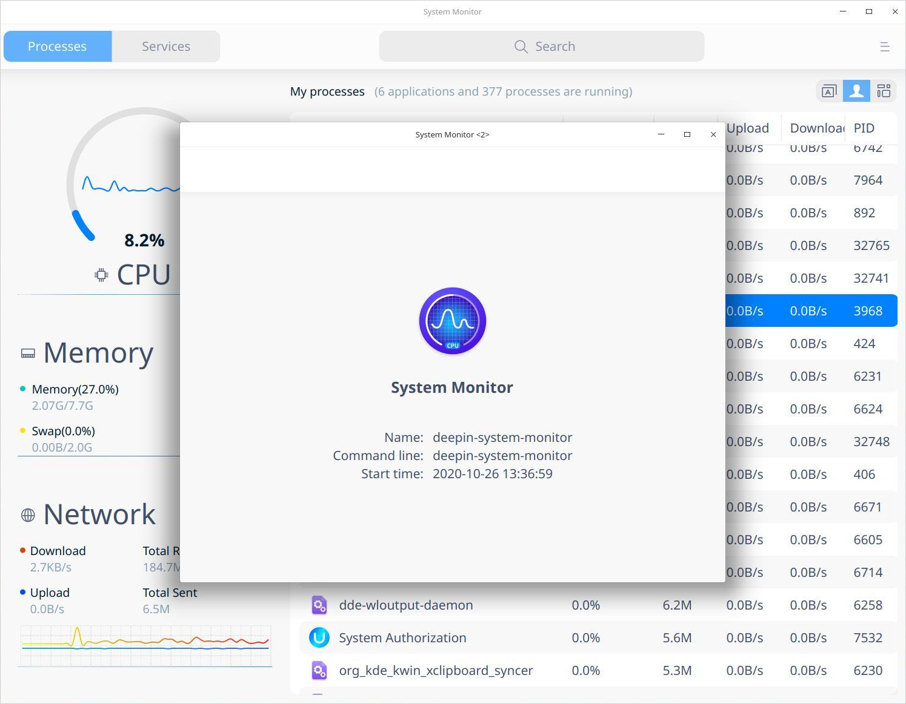

# System Monitor |../common/deepin-system-monitor.svg|

## Overview

System Monitor is a system tool monitoring and managing hardware load, program running and system services. It supports real-time monitoring of CPU status, memory footprint, and upload/download speed, helps manage system and application process, and enables searching and force ending of processes.

## Basic Operations

### Search Process

1. In the Search box, click  to input keywords. 
2. Press **Enter** key on the keyboard to locate quickly. 
   - When there is information matched, a search result list will be displayed on the interface.
   - When there is no information matched, **No search results** will be displayed on the interface.

### Hardware Monitoring

System Monitor can monitor the CPU, memory and network status of your system:

- CPU monitoring: you can view the CPU usage and recent usage trends through graphics, numerical and curve displays.

  - In **Expand view**, CPU load is displayed in doughnut chart with percentage. The curve inside the doughnut shows the recent CPU load summary, the height of which automatically fits the inner height of doughnut. 
  
  - In **Compact view**, CPU load is displayed in oscillogram with percentage. The curve shows the recent CPU load summary, the height of which automatically fits the height of the oscillogram. 
  
- Memory monitoring shows the real-time usage of memory, total memory and current usage, total swap space and current usage in percentage and graphics.
- Network monitoring shows the current downloading and uploading speed, and the recent trend of such activities in waves.
- Disk monitoring shows the current reading and writing speed, and the recent trend of such activities in waves.

### Process Management

#### Switch Process Tabs

Click the top right tabs on the System Monitoring interface to view **Applications**, **My processes** and **All processes**.

- Click  to switch to **Applications**. 
- Click  to switch to **My processes**. 
- Click  to switch to **All processes**.

#### Adjust Process Order

You can adjust the process order by Name, CPU, User, Memory, Upload, Download, Disk read, Disk write, PID, Nice and Priority.

- On System Monitor interface, click the tabs in the top of the process list to sort the processes. Multiple clicks allows sorting from low to high or high to low.
- Right-click the top tabs to check the options you want to view or uncheck the options you want to hide.

#### End Process

System Monitor can be used to end processes.

1. On the System Monitor interface, right-click the process you want to end.
2. Select **End Process**.
3. Click **End** in the pop-up window to confirm.

#### End Application

1. On the System Monitor interface, click .

2. Select **Force end application**.
> Notes: This function can only end graphical processes.

3. Click the window of application you want to close according to the prompt.

4. Click **Force End** in the pop-up window to confirm.

> Tips: You can end a process by selecting a process, right-clicking and selecting **End Process**. 

#### Suspend/Resume Process

1. On the System Monitor interface, right-click the process you want to suspend.
2. Select **Suspend process**. The process will be tagged with **(Suspend)** and turned red in the list. 
3. Right-click it again and select **Resume process** to resume it.

#### Change Process Priority 

1. On the System Monitor interface, right-click a process.

2. Select **Change priority** and select a priority level.

Notes: You can also select **custom** priority level.

#### View Process Location

1. On the System Monitor interface, right-click the process you want to view.
2. Select **View command location** to open the location in File Manager. 

#### View Process Properties

1. On the System Monitor interface, right-click the process you want to view.
2. Select **Properties** to view the name, command line and start time of process.

### System service management

You can start, stop, restart, set startup type, refresh system service processes.
In the list of system services, force-ending application is prohibited.

>Attention: For better system operation, please don't end any processes of the system services and root processes.

#### Start system service
1. Select **Services** tab on the System Monitor interface.
2. Select a process that is not started yet, right-click and select **Start**. Enter password if authentication window pops up.
3. **active** is displayed in the **Active** column.
4. Right-click and select **Startup type** to select from **Auto** and **Manual** options.
5. Right-click and select **Refresh**.

#### Stop system service

1. Select **Services** tab on the System Monitor interface.
2. Select a process that is started already, right-click and select **Stop**. Enter password if authentication window pops up.
3. **inactive** is displayed in the **Active** column.
4. Right-click and select **Refresh**.

You can also right-click a system process and select **Restart**. 

## Main Menu

In the main menu, you can switch monitoring modes and themes, view help manual and learn more information of System Monitor.

### Theme

The window theme provides three theme types, namely Light Theme, Dark Theme and System Theme (default).

1. On the System Monitor interface, click .
2. Click **Theme** to select one theme.

### View

System Monitor offers Expand view and Compact view for your choice.

1. On the System Monitor interface, click .

2. Click **View** to select one mode.

> Notes: If you switched views under the **Services** tab, you would need to go to the **Processes** tab to view the effect.

### Help

1. On the System Monitor interface, click .
2. Click **Help** to view the manual of System Monitor.

### About

1.  On the System Monitor interface, click .
2.  Click **About** to view the version and introduction of System Monitor.

### Exit

1. On the System Monitor interface, click .
2. Click **Exit** to exit System Monitor.

Update Date: 2020-09-22 Version: 5.6
