# Terminal|../common/deepin-terminal.svg|

## Overview

Terminal is a terminal emulator with simple interface, rich and powerful functions such as multi-windows, workspace, remote management, Quake mode and etc. You can instantly start and close Terminal smoothly like normal file window, allowing you to input commands with facility and no distractions. Let's try the Quake mode, browse webs while inputting commands. When there are multiple tasks, you can add tabs in terminal to create more workspaces like in the browser or split the workspace into multiple windows. It's a piece of cake to upload and download files with remote management. More powerful functions are waiting for you to explore!

 

## Guide

You can run, exit or create shortcuts for Terminal.

### Run Terminal ###

1. Click  on dock to enter launcher interface.
2. Locate  by scrolling the mouse wheel or searching "Device Manager" in the Launcher interface and click it to run.
3. Right-click  to: 
 - Select **Send to desktop** to create a desktop shortcut.
 - Select **Send to dock** to fix it on dock.
 - Select **Add to startup** to add it to startup, it will automatically run when the system starts up.

> : You can also press ++ to open Terminal.

### Exit Terminal ###

1. On Terminal interface, click   to exit.

2. Right-click   on Dock and select **Close All** or **Force Quit** to exit.

3. On Terminal interface, click  to select **Exit**.

> : There will be a prompt when programs are still running in terminal to avoid your data loss.

### View Shortcuts ###

You can press ++ on keyboard to open shortcuts preview interface.

 

## Basic Operations

You can right-click Terminal interface to do daily operations.

 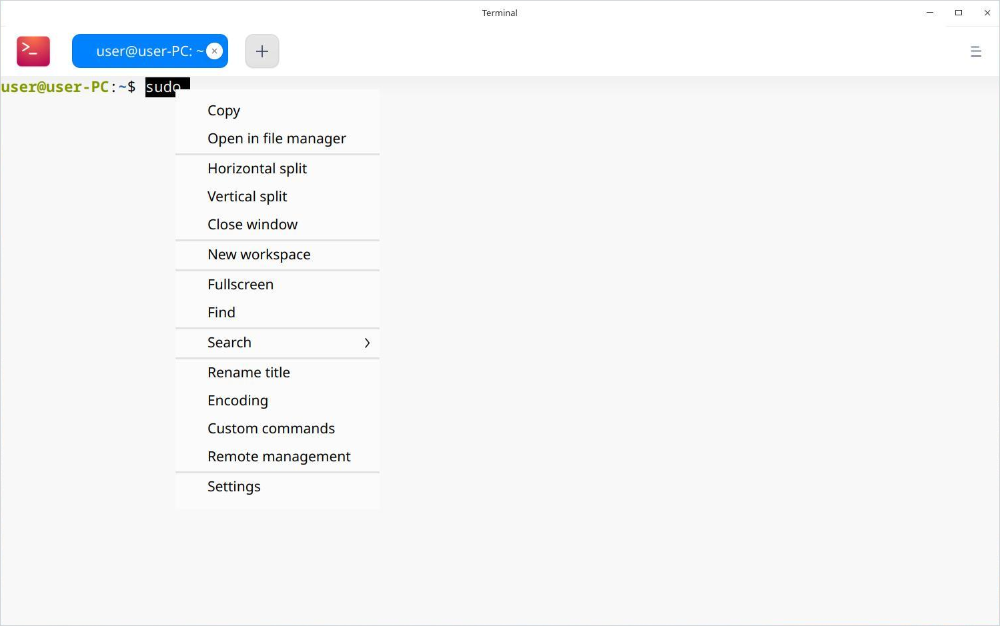

### Find ###

You can use the "Find" function to quickly search contents in terminal.

1. Right-click Terminal interface.

2. Click **Find**.

3. Type the word in search box and press key on keyboard.

4. Then the search results will be highlighted.

5. Press  on keyboard or click any blank location of terminal interface to hide search.

> : Press  to search down from current location. You can also click  and  to search.

### Web Search ###

You can search the keyword through web browser in terminal.

1. Select the words in terminal.

2. Right-click to select **Search** and select a search engine.

3. Your browser will pop up and start searching.

### Copy/Paste ###

You can freely copy and paste the contents or commands in terminal and anywhere else.

1. Select the commands or contents.

2. Right-click to select **Copy**.

3. Right-click to **Paste** the contents at anywhere.

> : If it is a link, just right-click it to copy without selection.

> : Check **Copy on select** in settings window, to copy the selected text to clipboard automatically.

### Quake Mode ###

Quake Mode is the unique function of Terminal. Press  +  to open a quake window, and press again to hide it.

> : You can also click  on Dock to select **Quake Terminal** to open a quake window.

### Open File and Application ###

On Terminal interface, select the file in current directory and right click to **Open** it by the application.

1. On Terminal interface, input **ls -al** to display files in current directory.
2. Double-click to select the file name.
3. Right-click and select **Open**.
4. The file will be opened with the proper application.

 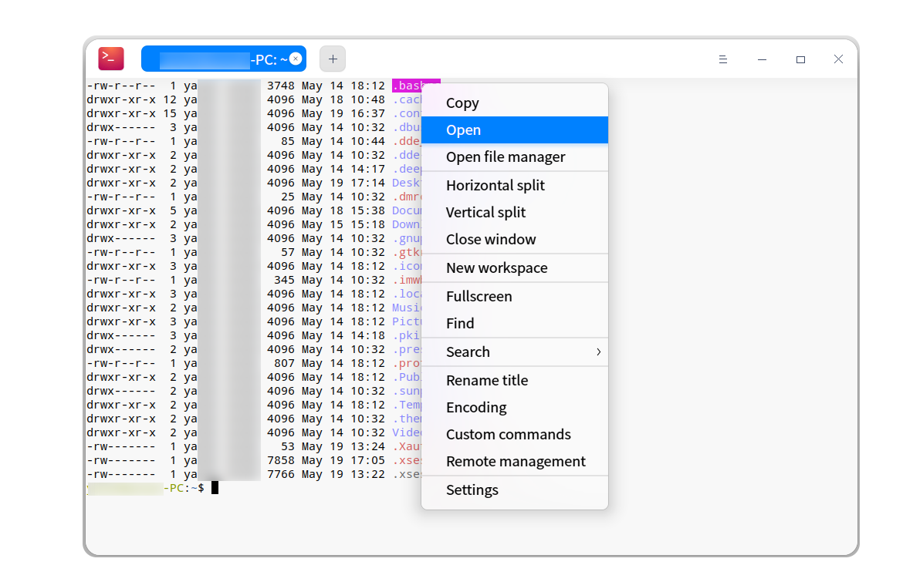

### Adjust Encoding Method ###

When there is messy code or display error, you may switch the encoding to solve it.

1. On Terminal interface, right-click.
2. Select **Encoding**.
3. Select one encoding in the list to see if it is correct.
4. Repeat Step 3 until you get correct contents.

> :Usually, correct encoding methods are matched automatically in Terminal. Once any error appears under some special circumstances, you can adjust encoding methods manually. You can directly choose the correct encoding method if you are sure of it. If you are not sure, you can try many times. 

 

## Window Operations

The window is the base for you to do any operations in terminal. You can create many workspaces and split one into more windows.

### New Window ###

You can create a new window in the following ways:

- Open Terminal and click  to select **New Window**.

- Click  on Dock to select **New Window**.

 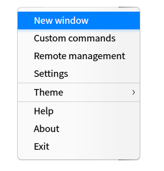

### Split Window ###

1. On Terminal interface, right-click.

  - Click **Vertical split** to split the interface into left and right parts.

  - Click **Horizontal split** to split the interface into top and bottom parts.

2. You can input commands in each terminal window, and view both the execution results of the command.

> : You can also press ++ on keyboard to split vertically, and press ++ to split horizontally.

 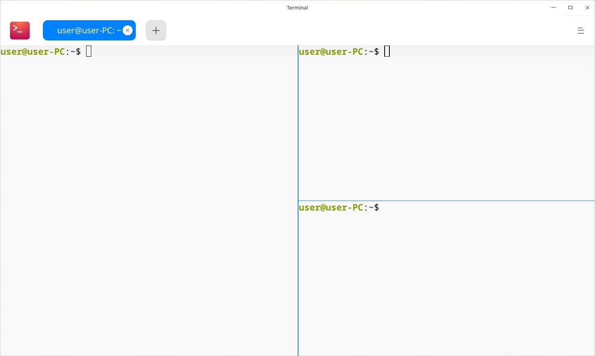

### Rename Window ###

1. On Terminal interface, right-click.

2. Select **Rename title**.

3. Input the name and click **OK**.

> : You can also press   to rename the window title.

 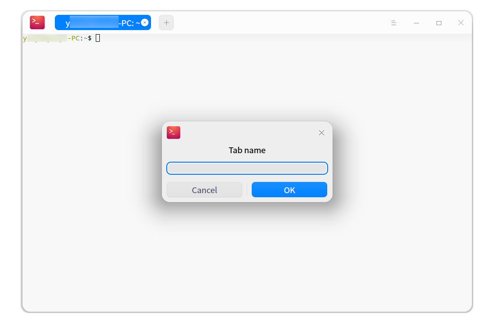

### Display Window in Fullscreen ###

1. Open Terminal in launcher interface.

2. Press  to display Terminal in fullscreen.

3. If you want to restore the normal display, please press .

> : You can also right-click to select **Fullscreen** or **Exit fullscreen** on Terminal interface.

### Close Window ###

For multiple splitting windows, you can execute the following operations to close:

1. On Terminal interface, move the cursor over one of the split windows.

2. Right-click to:

  - Select **Close window** to close this split window.

  - Select **Close other window** to close other split windows other than the current one.

 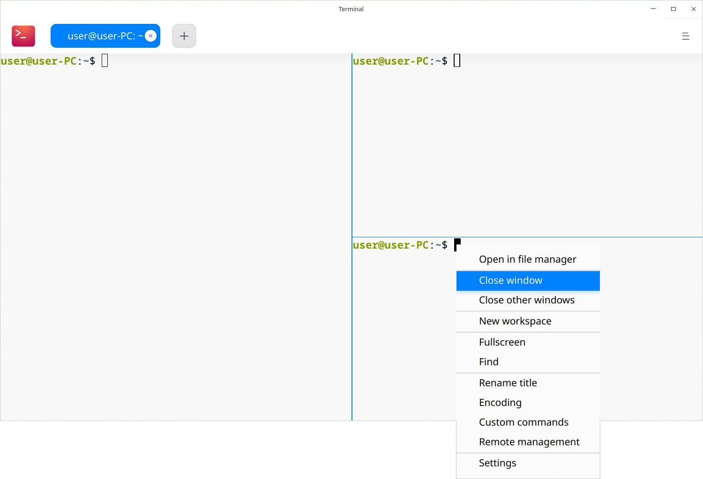

## Workspace Operations

The current workspace status will be displayed in different color from the other workspace tabs.

 

### New Workspace ###

- On Terminal interface, right-click and select **New workspace** to create a new workspace.

- Click  on the top to create a workspace.

### Select Workspace ###

You can freely switch among multiple workspaces by one of the following operations:

- Directly click the workspace tab to select a workspace.
- Press + to switch in sequence.
- Press + 1~9 Number key to select the workspace; when there are more than 9 workspaces, the last workspace will be selected rather the ninth one.

### Close Workspace ###

1. Click one workspace tab, and click  to close it.
2. Right-click any workspace tab to:
 - Select **Close workspace** to close it.
 - Select  **Close other workspace** to close other workspaces other than the current one.

> : When there is only one window in workspace, you can also right-click and select **Close window** to close the workspace.

## Remote Server Management

You can use context menu pops up after right-clicking or click the main menu to open remote management panel to add remote servers. The remote management panel will be automatically hidden when you adjust the window size. Once a remote server is added into the management list, you can automatically login just by one click. 

### Add Server ###

1. On Terminal interface, click .
2. Select **Add server** to fill out:

  - Server name
  - Address
  - Username
  - Password

4. Click **Add**.

   >  :If you need more parameters, please click **Advanced options** to set. Or you can keep the default values and edit them when you need to.

 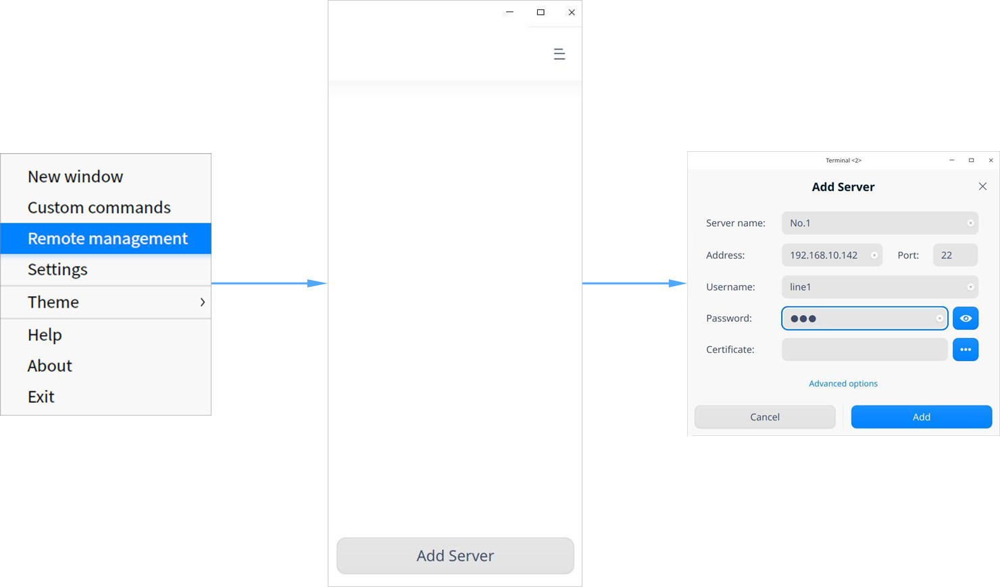

### Edit Server ###

1. On the remote server management interface, click  on the server.
2. Edit as needed.
3. Click **Save**.

> : For better identification and usage, you can also customize the server name.

 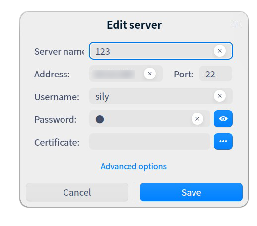

### Group Servers ###

When you set a group for a server, it will be added in the group and displayed in the right remote management panel.

1. Enter "Edit Server" interface.

2. Click **Advanced options**.

3. Fill out the group and click **Save**.

4. Then this server will be grouped.

 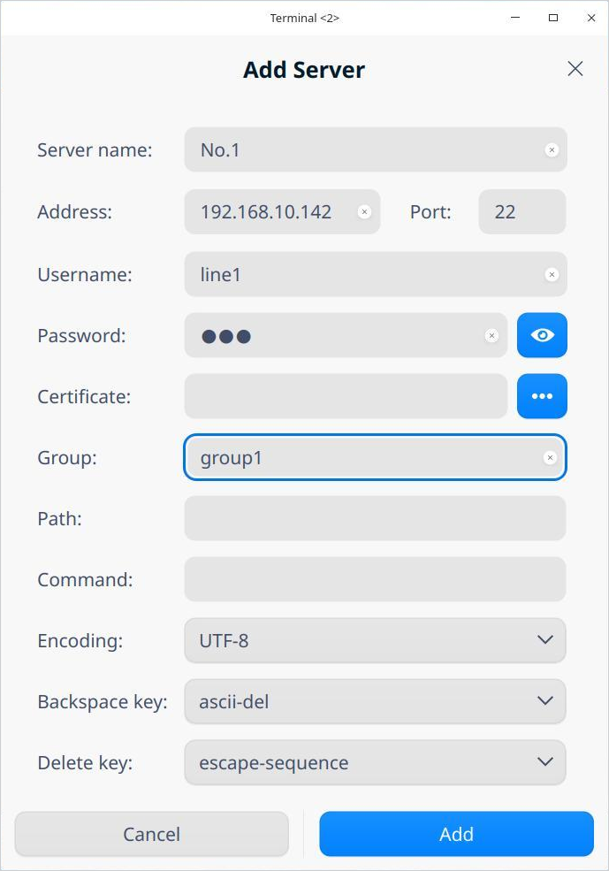

### Search Server ###

When there are many servers or groups, the search box will be displayed on the top, so you can quickly search all servers.

1. On Terminal interface, right-click.
2. Select **Remote management**. 
3. Input the keywords and press .
4. The search results will be displayed.

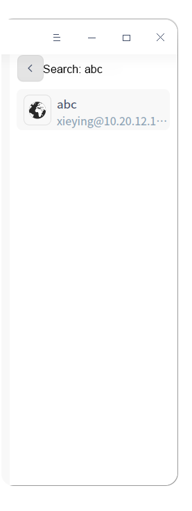

### Upload/Download File ###

You can upload and download files after logged in a remote server.

#### Upload Files ####

1. On the remote management panel, select one server to log in.
2. On Terminal interface, right-click to select **Upload file**.
3. Select file to upload in pup-up window.
4. Click **Upload** and the file will be uploaded to the remote server.

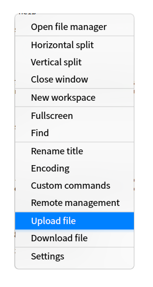

#### Download Files ####

1. On the remote management panel, select one server to log in.
2. On Terminal interface, right-click to select **Download file**.
3. Select the storage location.
4. Input the path of the file to be downloaded. The file will be downloaded to specified location.

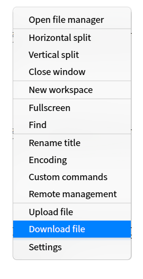

### Delete Server ###

1. Enter "Edit Server" interface.
2. Click **Advanced options**.
3. Select **Delete server**.
4. Click **Delete** on the pop-up window to confirm.

## Main Menu

In Main menu, you can create [new window](#new window), custom command, switch themes, view manual and know more about Terminal. 

### Theme ###

The window theme includes Light Theme, Dark Theme and System Theme (default).

1. Click on the interface.

2. Click **Switch theme** to select one and it takes effect immediately.

### Custom Commands ###

1. Click on the interface.

2. Select **Custom commands**.

3. Select **Add command**.

4. Input **Name**, **Command** and **Shortcuts**.

5. Click **Add**.

### Settings

#### Basic Settings ####

1. Click on the interface.

2. Click **Settings**.

3. In the tab of **Basic**, you can:

  - Set the background transparency.

  - Set the font and font size.

#### Shortcuts Settings ####

1. Click on the interface.

2. Click **Settings**.

3. In the tab of **Shortcuts**, you can:

  - Click the shortcuts to be modified, and input new shortcuts by keyboard.

  - Press  if you want to disable the shortcut.

#### Advanced Settings ####

1. Click on the interface.

2. Click **Settings**.

3. In the tab of **Advanced**, you can:

  - Set cursor style.
  - Enable or disable **Cursor blink**.
  - Enable or disable **Copy on select**.
  - Enable or disable **Scroll on keystroke**.
  - Enable or disable **Scroll on output**.
  - Set window startup mode.
  - Enable or disable **Hide quake window after lost focus**.
  - Enable or disable **Blur background**.

### Help

Click Help to get the manual, which will help you further know and use Terminal.

1. Click on the interface.

2. Click **Help** to view the manual of Terminal.

### About

1. Click on the interface.

2. Click **About** to view the introduction of Terminal.

### Exit

1. Click on the interface.

2. Click **Exit**.
